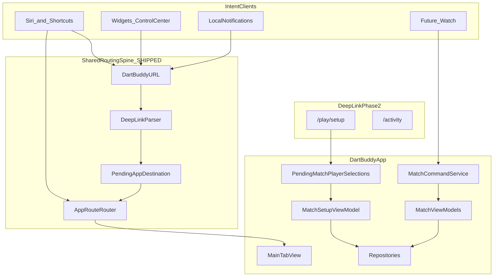
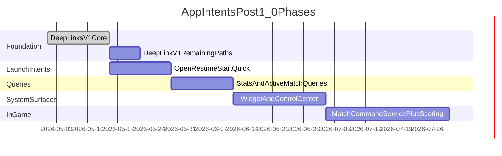

# App Intents Brainstorm for Dart Buddy

## Current state

**Deep linking V1 (routing spine) is shipped.** [`specs/DeepLinkSpec.md`](specs/DeepLinkSpec.md) is the authoritative URL contract; implementation lives in [`Support/DeepLinks/`](Support/DeepLinks/) and [`App/Navigation/AppRouteRouter.swift`](App/Navigation/AppRouteRouter.swift). [`DartBuddyApp`](App/DartBuddyApp.swift) handles `.onOpenURL` → `DeepLinkParser` → `PendingAppDestination`; [`MainTabView`](App/MainTabView.swift) consumes pending links after bootstrap/onboarding. The `dartbuddy` URL scheme is registered in [`project.yml`](project.yml). Unit tests cover parser, router, and deferred delivery ([`DeepLinkParserTests`](Tests/Unit/DeepLinkParserTests.swift), [`AppRouteRouterTests`](Tests/Unit/AppRouteRouterTests.swift), [`PendingAppDestinationTests`](Tests/Unit/PendingAppDestinationTests.swift)).

**Shipped deep-link paths (V1 core):**

| URL | Behavior |
|---|---|
| `dartbuddy://v1/play` (alias `dartbuddy://play`) | Play tab, setup home |
| `dartbuddy://v1/play/resume` | Play tab + resume active match (or log failure) |
| `dartbuddy://v1/tab/{play\|modes\|players\|activity\|settings}` | Switch root tab |

**Not yet routed (Deep Linking plan Phase 2):** `/play/setup` query params, `/activity` segment, `/activity/history/match/{uuid}`, `/players/{uuid}`. Parser types exist in [`AppDestination.swift`](Support/DeepLinks/AppDestination.swift); router returns `.failed(.unknownPath)` for these today.

**App Intents Phase 1 is shipped** (behind `enableAppIntents`). See [`specs/AppIntentsSpec.md`](specs/AppIntentsSpec.md) for the authoritative contract, QA checklist, roadmap, and **Apple Intelligence platform mapping** (§13 — entities, `IndexedEntity`, on-screen awareness, custom vs schema intents, testing ladder).

This brainstorm doc retains the feature catalog, priority matrix, and risks. **Do not duplicate** entity schemas or Apple Intelligence guidance here — update the spec instead.

What *does* exist and maps cleanly to intents:

| Existing mechanism | Intent opportunity |
|---|---|
| **Deep-link spine (shipped)** | Resume/Open Play intents wrap `AppRouteRouter` or `DartBuddyURL.resumeActiveMatch()` / `.play()` |
| [`PendingMatchPlayerSelections`](App/Bootstrap/PendingMatchPlayerSelections.swift) — mode/player prefills for Play setup | Parameterized “Start X01 with Alice” shortcuts (needs `/play/setup` route) |
| [`MatchSetupViewModel.startMatchRoute()`](Features/Play/Setup/MatchSetupViewModel.swift) — creates match, handles active-match conflict | Shared start/resume orchestration for intents |
| [`MainTabView.RootTab`](App/MainTabView.swift) + Activity segment resume callback | Open-tab / resume navigation intents |
| [`GameModeCatalog`](Features/Modes/GameModeCatalog.swift) — 29 modes, 5 shipped | `AppEnum` for mode picker in Shortcuts |
| [`MatchRepository.fetchActiveMatch()`](Data/Repositories/RepositoryProtocols.swift) | “Do I have a game in progress?” query intent |
| [`play-reminders.md`](FutureIdeas/play-reminders.md) — tap opens Play tab | Notification → `DartBuddyURL.play()` (router ready; reminder service not wired) |
| [`AppShellSpec.md` §9](specs/AppShellSpec.md) — “Deep links into active match/history detail” | Partially satisfied; history/player paths pending Phase 2 |



---

## Brainstorm catalog (by surface)

### 1. Shortcuts / Siri — launch and resume (highest ROI)

These mirror flows users already perform manually; low risk, no voice scoring complexity.

| Intent | Example phrase | Behavior | Deep-link dependency |
|---|---|---|---|
| **OpenPlay** | “Open Dart Buddy” | Switch to Play tab; no match mutation | **Ready** — `dartbuddy://v1/play` |
| **ResumeActiveMatch** | “Resume my dart game” | If `fetchActiveMatch()` exists → navigate to active match; else dialog “No game in progress” | **Ready** — `dartbuddy://v1/play/resume` |
| **StartQuickMatch** | “Start a 501 game” | Prefill setup from Settings defaults + last-used roster; optionally auto-start if roster valid | **Partial** — needs `/play/setup` or direct router + `PendingMatchPlayerSelections` |
| **StartModeMatch** | “Start Cricket” / “Play Killer” | Enqueue [`PendingModeSelection`](App/Bootstrap/PendingMatchPlayerSelections.swift) → Play setup | **Partial** — needs `/play/setup?mode=…` |
| **PracticeWithTrainingPartner** | “Practice X01 with my training partner” | Requeue [`enqueuePractice(humanId:trainingBotId:mode:)`](App/Bootstrap/PendingMatchPlayerSelections.swift) | **Partial** — router can call prefills directly; URL optional |
| **OpenActivity** | “Show my dart stats” | Activity tab, Statistics segment | **Blocked** — `/activity?segment=statistics` |
| **OpenHistory** | “Show my last dart games” | Activity tab, History segment | **Blocked** — `/activity?segment=history` |

**Design notes:**
- Shipped modes only for v1 intents: `x01`, `cricket`, `baseball`, `killer`, `shanghai` ([`MatchType`](Domain/Models/RepositoryModels.swift)).
- Catalog `planned` modes should be excluded from `AppEnum` until promoted to `.shipped`.
- Active-match conflict: reuse [`showActiveMatchConflict`](Features/Play/Setup/MatchSetupViewModel.swift) policy — intent should **not** silently abandon; return `.result(dialog:)` or open app to confirmation UI.
- Prefer **open-app + prefill** over headless auto-start for v1 (roster validation, bot resolution, training-bot eligibility are UI-adjacent).
- **First App Intents slice:** `OpenPlay` + `ResumeActiveMatch` only — no Deep Linking Phase 2 required.

### 2. Siri queries — read-only stats

Good for “glanceable” answers without opening the app; aligns with local-first privacy story.

| Intent | Example | Data source |
|---|---|---|
| **GetActiveMatchStatus** | “What’s my dart score?” | Active match snapshot / `ActiveMatchStore` |
| **GetPlayerStats** | “What’s my X01 average?” | Statistics pipeline (reuse [`StatisticsViewModel`](Features/Statistics/StatisticsViewModel.swift) aggregation) |
| **GetRecentMatches** | “How many dart games did I play this week?” | `fetchHistoryWithParticipants` + date filter |
| **HasActiveMatch** | Boolean for Shortcuts automation IF branches | `fetchActiveMatch()` |

**Entities:** `PlayerEntity` (name + UUID), `GameModeEntity` (catalog id), optional `MatchEntity` (recent completed).

**Caveats:**
- Responses must be localized (`de`/`es`/`nl`) via App Intent `LocalizedStringResource` + existing [`L10n`](Support/Localization/L10n.swift) keys where possible.
- Avoid exposing archived/deleted player data; respect `includeArchived: false`.

### 3. System surfaces — widgets, Control Center, Spotlight

| Surface | Dart Buddy use case | Intent tie-in |
|---|---|---|
| **Home Screen widget** | “Resume 501 vs Bot” card with live remaining score | `ResumeActiveMatchIntent` + timeline from active snapshot; tap → `DartBuddyURL.resumeActiveMatch()` |
| **Control Center control** (iOS 18+) | One-tap Resume or Open Play | `ControlWidget` + `ResumeActiveMatchIntent` |
| **Lock Screen widget** | Active match remaining / current thrower | Same snapshot provider as above |
| **Spotlight** | Index player names + “501”, “Cricket” actions | `IndexedEntity` on `PlayerEntity` / mode entities |

**Dependency:** Widget extension target (new in [`project.yml`](project.yml)); share read models via small shared types in `Domain/` or a thin `Shared/` module—**not** SwiftData in the widget process.

### 4. In-game actions — score entry and undo (highest complexity)

Voice/Shortcut scoring is compelling at the oche (“Score 60”, “Undo”) but **must not bypass** domain validation.

Today, ViewModels call `MatchLifecycleService` directly ([`AppleWatchCompanionAssessment.md`](specs/AppleWatchCompanionAssessment.md)). [`MatchCommandService`](specs/RepositorySpec.md) is spec’d but **not implemented**—this is the shared gate for:

- Watch `SubmitTurn` / `UndoLastTurn`
- App Intent `SubmitTurnIntent` / `UndoLastTurnIntent`
- Future Live Activity updates

| Intent | Example | Requirements |
|---|---|---|
| **SubmitTurn** | “Score triple twenty, single twenty, miss” | Natural-language → `[DartInput]` parser; active match only; haptics/audio optional |
| **SubmitTurnTotal** | “Score 60” | Simpler; matches X01 number-pad mental model |
| **UndoLastTurn** | “Undo last dart” | Same as in-app undo |
| **GetCheckoutSuggestion** | “What do I need to finish?” | Read-only; reuse checkout helper if exists |

**Recommendation:** Defer in-game intents to **Phase 4**, bundled with `MatchCommandService` + Watch work—not as a one-off Siri layer.

---

## Recommended architecture (post-1.0)

### Module layout

**Shipped (deep linking):**

```
Support/DeepLinks/
  DartBuddyURL.swift          dartbuddy://v1/play, resume, tab/…
  DeepLinkParser.swift        parse → AppDestination
  AppDestination.swift        typed destinations (full schema; partial routing)
  DeepLinkError.swift
  PendingAppDestination.swift deferred delivery through onboarding
App/Navigation/
  AppRouteRouter.swift        tab + play home/resume (MVP)
```

**To add (App Intents):**

```
Intents/
  Entities/          PlayerEntity, GameModeEntity, MatchEntity
  Enums/             GameModeIntentEnum, X01StartScoreIntentEnum
  Actions/           StartQuickMatchIntent, ResumeActiveMatchIntent, ...
  Queries/           GetPlayerStatsIntent, GetActiveMatchStatusIntent
  Providers/         DartBuddyShortcutsProvider (AppShortcutsProvider)
  Routing/
    IntentDependencyBridge.swift  resolves AppDependencies from app bootstrap
```

### Routing spine (shipped — intents are consumers)

1. **`DartBuddyURL` + `DeepLinkParser`** — versioned `dartbuddy://v1/…` per [`DeepLinkSpec.md`](specs/DeepLinkSpec.md).
2. **`AppRouteRouter`** — single `@MainActor` entry; already called from `MainTabView.consumePendingDeepLink()`. App Intents add a second caller:
   - `AppIntent.perform()` → `AppRouteRouter.handle()` directly (**preferred**)
   - Or `openURL(DartBuddyURL.…)` for Shortcuts that only need URL semantics
3. Reuse **`PendingMatchPlayerSelections`** for setup prefills (Modes tab pattern); extend router for `/play/setup` in Deep Linking Phase 2.
4. **`IntentDependencyBridge`** — lightweight static holder set during bootstrap (pattern: app sets `AppDependencies` once; intents read repositories). Avoid spinning a second SwiftData container in intent extensions.

### Shortcuts discoverability

`DartBuddyShortcutsProvider` with phrases tied to shipped modes:

```swift
// Illustrative — not implemented
AppShortcut(intent: ResumeActiveMatchIntent(), phrases: [
  "Resume my dart game in \(.applicationName)"
])
AppShortcut(intent: OpenPlayIntent(), phrases: [
  "Open \(.applicationName)"
])
// StartQuickMatch / StartModeMatch after /play/setup route ships
```

Pin **3–5 shortcuts** max in v1 to avoid phrase collision and localization burden.

### Feature flag

Add `enableAppIntents` to [`FeatureFlag`](Support/FeatureFlags/FeatureFlag.swift) (default `false` until QA). Gate `AppShortcutsProvider` registration and widget targets. Deep links ship without a flag (analytics already allowlisted: `deep_link_received`, `deep_link_applied`, `deep_link_deferred`, `deep_link_failed`).

### Analytics

Extend allowlisted events (mirror existing `match_started` pattern): `intent_performed`, `intent_failed`, `shortcut_opened_play`, with intent name + mode metadata—no PII in Firebase payloads.

---

## Phased rollout (post-1.0)



| Phase | Deliverable | Effort (rough) | Depends on | Status |
|---|---|---|---|---|
| **0 — Foundation** | URL scheme, parser, `AppRouteRouter`, `PendingAppDestination`, MVP route tests | ~1 week | None | **Done** (Deep Linking V1) |
| **0b — Remaining v1 paths** | `/play/setup`, activity/players/history routes + router actions | ~3–5 days | Phase 0 | Pending ([`specs/DeepLinkSpec.md`](specs/DeepLinkSpec.md) Planned paths) |
| **1 — Launch intents** | Open Play, Resume (now), Start Quick/Mode/Practice (after 0b) | ~1–2 weeks | Phase 0; 0b for parameterized starts | Next |
| **2 — Query intents** | Active match status, player stats, recent match count | ~1–2 weeks | Phase 0 + stats read path | Pending |
| **3 — System surfaces** | Resume widget, Control Center control, Spotlight indexing | ~2–3 weeks | Phase 1–2 snapshot APIs | Pending |
| **4 — In-game** | `MatchCommandService`, SubmitTurn/Undo intents, optional Watch reuse | ~3–4 weeks | [`RepositorySpec.md`](specs/RepositorySpec.md) boundary | Pending |

**Total for balanced v1 (Phases 0–3):** ~4–7 dev weeks remaining (Phase 0 complete). Phase 4 shares cost with Apple Watch companion.

---

## Intent priority matrix

| Intent | User value | Implementation risk | Phase | Routing ready? |
|---|---|---|---|---|
| ResumeActiveMatch | High | Low | 1 | Yes |
| OpenPlay | Medium | Low | 1 | Yes |
| StartQuickMatch (501 defaults) | High | Medium (roster/conflict) | 1 | Needs 0b or direct prefills |
| StartModeMatch | High | Medium | 1 | Needs 0b |
| PracticeWithTrainingPartner | Medium | Medium (eligibility) | 1 | Router prefills OK without URL |
| GetActiveMatchStatus | High | Low–medium | 2 | N/A (query) |
| GetPlayerStats | Medium | Medium (aggregation) | 2 | N/A (query) |
| Resume widget | High | Medium (extension target) | 3 | Yes (tap URL) |
| SubmitTurn via Siri | High at oche | **High** | 4 | N/A |
| UndoLastTurn | Medium | Medium | 4 | N/A |

---

## Risks and mitigations

| Risk | Mitigation |
|---|---|
| Headless match start bypasses validation | Phase 1 opens app with prefilled setup; optional “auto-start when roster ≥ min players” behind flag |
| Second SwiftData container in intents | Single `IntentDependencyBridge` from main app bootstrap |
| 29-mode catalog drift | Generate `AppEnum` cases from [`GameModeCatalog`](Features/Modes/GameModeCatalog.swift) `.shipped` entries only |
| Localization of Siri phrases | Short English phrases in provider + localized `title`/`description`; full phrase localization is optional follow-up |
| Active match abandoned by shortcut | Never auto-abandon; surface conflict in app or dialog result |
| In-game NL parsing errors | Start with `SubmitTurnTotal` (integer) before per-dart NL |
| App Store privacy | Document on-device-only intent data in privacy nutrition labels; no network for intent execution |
| Duplicating routing logic in intents | Always call `AppRouteRouter` or `DartBuddyURL`; never navigate from intent code directly |

---

## Testing strategy

See [`specs/AppIntentsSpec.md`](specs/AppIntentsSpec.md) §10 for the full validation ladder (unit → `AppIntentsTesting` → Shortcuts → Spotlight → Siri).

- **Unit (shipped):** `DeepLinkParserTests`, `AppRouteRouterTests`, `PendingAppDestinationTests`, `IntentRoutingBridgeTests`
- **Unit (to add):** Entity query resolution; intent parameter → `AppDestination` / `PendingModeSelection` mapping; query intents with in-memory repository fakes ([`Tests/Unit/`](Tests/Unit/))
- **`AppIntentsTesting` (Phase 2):** Invoke query intents in isolation without Siri
- **Shortcuts:** Validate intent shape and parameters before Siri
- **Spotlight (Phase 2–3):** Validate `IndexedEntity` discoverability
- **UI (optional):** Launch via `xcrun simctl openurl booted dartbuddy://v1/play/resume` in UI test
- **Manual Siri:** End-to-end NL only after layers above pass
- **Regression:** Ensure intents respect `enableAppIntents` flag and migration recovery state (no intents when bootstrap fails)

---

## Spec / doc outputs

| Document | Status | Owner |
|---|---|---|
| [`specs/DeepLinkSpec.md`](specs/DeepLinkSpec.md) | **Shipped** (MVP paths + schema) | Deep linking plan |
| [`specs/AppIntentsSpec.md`](specs/AppIntentsSpec.md) | **Shipped** — Phase 1 intents + full Apple Intelligence roadmap | App Intents plan |
| [`Intents/README.md`](Intents/README.md) | **Shipped** — dev quick reference | App Intents plan |

`specs/AppIntentsSpec.md` now includes:

1. Intent inventory with parameters and open-app vs background policy (§4)
2. **Reference** [`DeepLinkSpec.md`](specs/DeepLinkSpec.md) for URL registry (§9)
3. Entity schema — `PlayerEntity`, `MatchEntity`, `GameModeEntity` (§4.5)
4. `IndexedEntity`, on-screen annotations, `Transferable` (§4.6–4.8)
5. Custom intents vs App Schema domains (§4.9, §13)
6. Relationship to `MatchCommandService` and Watch (§4.4)
7. Localization keys (§7), feature flag (§6), analytics (§8)
8. Testing ladder including `AppIntentsTesting` (§10)
9. Out of scope (§12)

Update [`NavigationSpec.md`](specs/NavigationSpec.md) §5 cross-refs as intents land.

---

## Deep linking — relationship to this plan

Deep linking is a **separate, shipped foundation** ([`specs/DeepLinkSpec.md`](specs/DeepLinkSpec.md)). App Intents Phase 0 **is complete** via that work—not a duplicate effort.

| Layer | Status | App Intents impact |
|---|---|---|
| V1 core (`/play`, `/play/resume`, `/tab/…`) | Shipped | OpenPlay, ResumeActiveMatch, widget tap targets |
| V1 remaining (`/play/setup`, `/activity`, `/players`, history detail) | Planned (Deep Link Phase 2) | StartModeMatch, OpenActivity, OpenHistory |
| Universal Links (`https://dartbuddy.app/v1/…`) | Future (Deep Link Phase 4) | Shareable campaign/marketing links |
| Play reminder notification `userInfo["url"]` | Not wired | Uses `DartBuddyURL.play()` when reminders ship |

**Do not maintain two routers.** App Intents, widgets, and notifications are callers of `AppRouteRouter` / `DartBuddyURL`.

---

## Suggested next implementation slice

Phase 0 is done. Start App Intents with the smallest vertical slice that does not block on Deep Link Phase 2:

1. Link `AppIntents.framework` in [`project.yml`](project.yml)
2. `IntentDependencyBridge` + `ResumeActiveMatchIntent` + `OpenPlayIntent` → `AppRouteRouter.handle()`
3. `DartBuddyShortcutsProvider` with 2 pinned phrases
4. In parallel or next: Deep Link Phase 2 `/play/setup` → unlock `StartQuickMatchIntent` / `StartModeMatchIntent`
5. Wire play-reminders notification tap to `DartBuddyURL.play()` when reminders ship

This delivers Shortcuts + Siri discoverability for resume/open, reuses the shipped spine, and defers parameterized starts until router paths exist.
