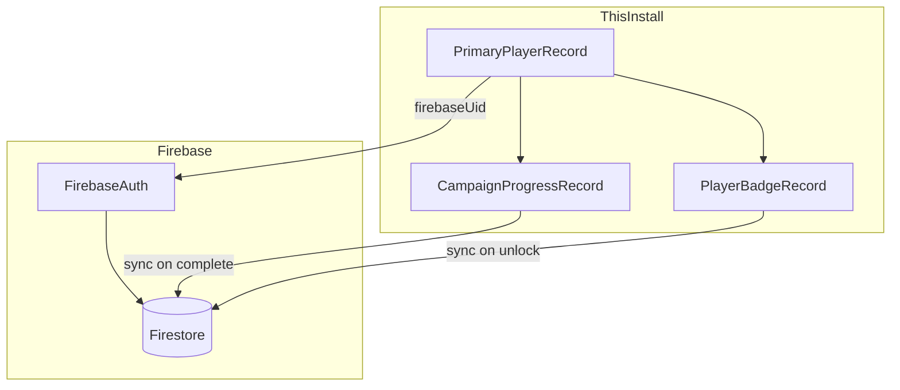
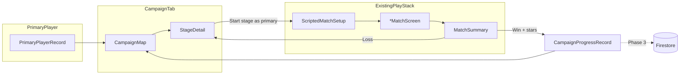
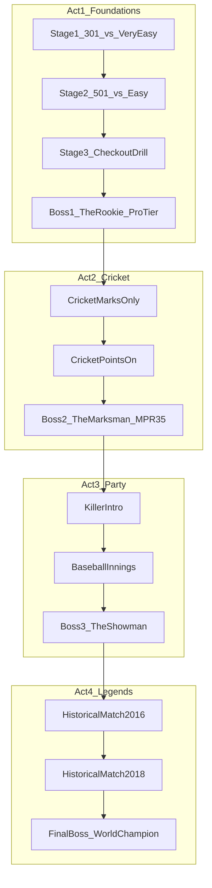
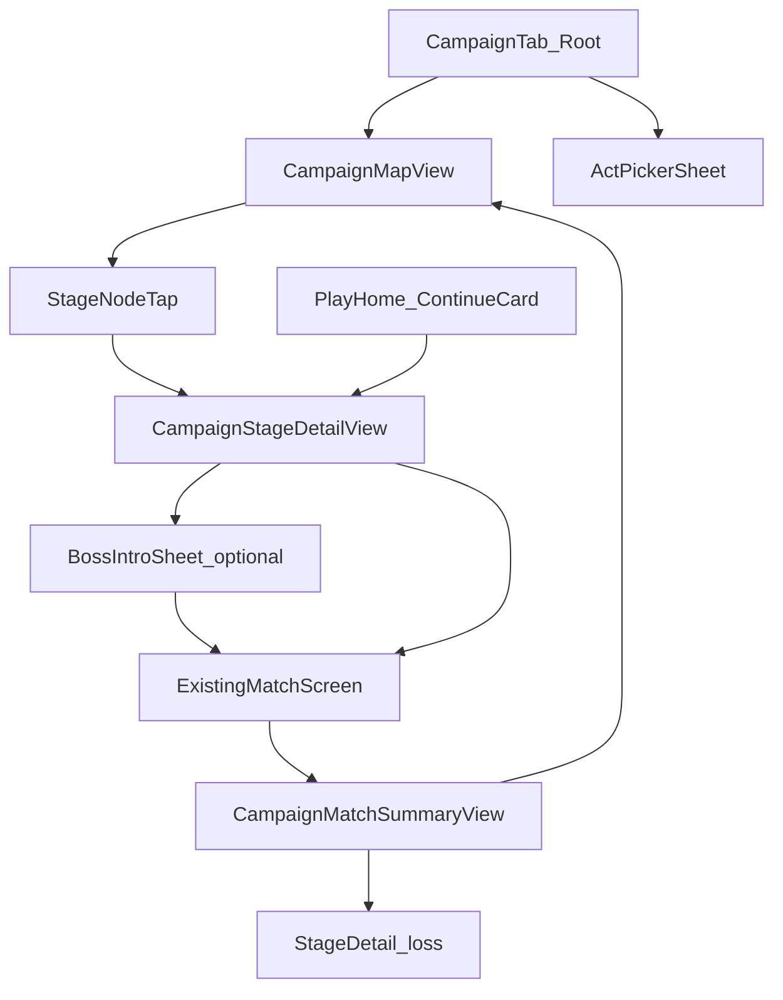
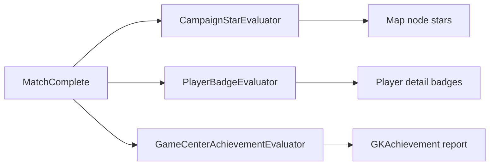

# Campaign Mode — Full Vision Brainstorm

## North star

**Campaign is the primary app owner's personal journey through darts** — not a separate game, but a curated path that teaches modes, escalates difficulty, and delivers memorable boss moments. Every stage plays a **real match** through the existing engines ([`MatchLifecycleService`](Domain/Services/MatchLifecycleService.swift), [`DartBotEngine`](Domain/Engines/DartBotEngine.swift)); Campaign only adds **mission config**, **progression UI**, and **flavor**.

**Guest/friend players** on the local roster exist for pass-and-play free matches only. They do not own Campaign progress on this device — friends are expected to install Dart Buddy on their own phone to run their own Journey (eventually synced via Firebase).

The feel target:
- **Candy Crush:** bite-sized stages, star ratings, visible path, "one more stage" pull
- **Victory Road:** mode variety, escalating opponents, checkpoint bosses, skill gates
- **Dart Buddy twist:** you are throwing real darts (manual scoring today), not abstract puzzles

---

## Player identity — Primary vs Guest

Campaign, badges, and cloud sync attach to **one primary player per app install** — the person who owns the device and account. Everyone else on the roster is a **guest** (friend, league mate, family) for local scoring convenience.

### Roles

| Role | Who | Campaign | Badges | Stats | Firebase (future) |
|------|-----|----------|--------|-------|-------------------|
| **Primary** | App owner; designated at onboarding | Full Journey map + progress | All campaign/skill badges | Full stats + training bot link | `users/{uid}/campaign`, `users/{uid}/badges` |
| **Guest** | Friend added to local roster | **No access** on this device | None (campaign/skill) | Local match stats only | None — they use their own install |
| **Bot** | Preset / training / custom | Opponent only | None | N/A | N/A |

**Product rule:** If Dave brings his friend Mike to league night, Mike can be added as a guest for a Killer match. Mike's Campaign progress does **not** advance on Dave's phone. Mike downloads Dart Buddy, becomes **primary on his own device**, and runs his own Journey.

### Designation flow

1. **First launch onboarding** — after welcome, ask: *"What's your name?"* → creates primary `PlayerRecord` with `playerRoleRaw == .primary`
2. **Exactly one primary** per install — enforced in `PlayerRepository`; transfer-primary is a Settings action (rare)
3. **Add Player** from roster → always creates **guest** unless explicitly "This is me" (primary transfer)
4. **Training Partner** links to **primary player only** ([`TrainingBotSpec`](specs/TrainingBotSpec.md))

### Campaign eligibility

- Campaign tab, map, daily challenge, and boss intros are **primary-only surfaces**
- Starting a stage auto-binds the primary player as the sole human participant — no roster picker
- Guest players are **hidden** from campaign briefing and cannot be selected
- If a guest player's detail is opened: show stats + matches, but replace badge gallery with:

  > *"Campaign journeys are personal. [Name] can start their own on their device."*

  Optional CTA: **Invite to Dart Buddy** (share link / App Store — no deep-link account yet)

### Free Play vs Campaign

| Mode | Roster |
|------|--------|
| **Free Play** (Play tab) | Primary + guests + bots — unchanged |
| **Campaign** | Primary vs bot only — scripted |
| **Activity / History** | All matches; campaign rows tagged; badge unlocks attributed to primary only |

Guest wins in free Play still count toward guest local stats and generic GC achievements on the device (if signed in) — but **not** toward campaign stars, campaign badges, or Firebase campaign docs. *Open question:* whether guest free-play wins should count toward device-level GC at all, or GC is primary-attributed only (recommend **primary-attributed** for campaign-related GC; generic dart GC stays device-level per existing [`achievements.md`](FutureIdeas/achievements.md)).

### Firebase integration (Phase 3+)

Aligns with [`FirebaseBackendAnalyticsSpec.md`](specs/FirebaseBackendAnalyticsSpec.md) Phase 2–3:



**Firestore shape (conceptual):**

```
users/{firebaseUid}/
  profile: { displayName, primaryPlayerId, appVersion }
  campaign: { stageStars: {stageId: 1-3}, unlockedActs, totalStars, dailyStreak }
  badges: { badgeId: { tier, unlockedAt, sourceMatchId } }
```

**Sync rules:**
- Local SwiftData remains **source of truth offline**; Firestore reconciles on connectivity (last-write-wins per field with monotonic `updatedAt`)
- Guest players never written to cloud
- New device / reinstall: Firebase Auth restores campaign + badges; local `PlayerRecord` primary re-linked by `firebaseUid` on first sign-in
- Anonymous auth first → upgrade to Sign in with Apple (same `firebaseUid` chain)

**Analytics:** add allowlisted events per spec: `campaign_stage_started`, `campaign_stage_completed`, `campaign_badge_unlocked` with `primary_player_id` hash only (no guest names).

### Schema changes (SchemaV3)

```swift
enum PlayerRole: String, Codable {
    case primary   // one per install
    case guest     // friends / pass-and-play
}

// PlayerRecord additions
var playerRoleRaw: String?   // .primary | .guest; nil migrates to .guest except oldest human
var firebaseUid: String?     // primary only, set after Auth

// CampaignProgressRecord — tied to install + primary
var primaryPlayerId: UUID    // denormalized for queries
// firebase sync metadata: lastSyncedAt, pendingPush

// PlayerBadgeRecord — primary playerId only; enforce in repository
```

**Migration:** On upgrade, first non-bot human by `createdAt` becomes `.primary`; others → `.guest`.

### UI implications

| Surface | Primary | Guest |
|---------|---------|-------|
| Players list row | **You** pill badge (`Brand.amber`) | No pill |
| Player detail header | Badge gallery + pin flair | Stats only; campaign upsell card |
| Campaign tab | Full map | N/A (tab not gated, but progress is always "yours") |
| Play setup roster | Selectable | Selectable |
| Match summary (campaign) | Stars + badge toast | N/A |
| Settings | "Account & Sync" (Firebase, future) | — |

**`PrimaryPlayerBadge`** — compact capsule on roster row, same prominence pattern as [`BotDifficultyBadge`](Features/Players/PlayerVisualViews.swift):

```
[ You ]  Dave
```

---

## Core loop



1. **Primary player** opens Campaign → sees **world map / ladder** with locked, available, and starred nodes
2. Tap node → **stage briefing** (mode, rules, opponent, win condition, star criteria)
3. Start → **scripted match** (primary human + bot; no roster picker)
4. Win → earn **1–3 stars**, unlock next node(s), badges for primary
5. Loss → retry immediately (no lives/energy in v1 unless you add them later)

**Design principle:** Campaign matches are tagged (`campaignStageId`, `primaryPlayerId`) so history, stats, badges, and Firebase sync can treat them distinctly without a second play engine.

---

## Stage taxonomy

Not every node is "beat the bot in 501." Mix keeps the path fresh.

| Stage type | Example | Engine reuse | Difficulty lever |
|------------|---------|--------------|------------------|
| **Standard match** | 501 D/O, first to 2 legs vs Medium bot | X01 + preset bot | `BotDifficulty` or custom avg |
| **Cricket duel** | Close 20s before scoring, best of 3 legs | Cricket engine | MPR-targeted bot profile |
| **Party gate** | Killer with 3 lives, survive to final 2 | Killer engine | Bot count + tier |
| **Solo challenge** | Bob's 27 — finish above par | Future solo engine | Par score / dart budget |
| **Constraint match** | 301, must finish on D16 | X01 + win condition overlay | Checkout-focused bot |
| **Speed round** | Around the Clock — beat bot race | Sequence engine | Time / segment pressure |
| **Boss fight** | "The Iceman" — 98 avg, 2-set match | X01 + `CustomBotMetrics` | Named opponent + intro cinematic |
| **Historical replay** | 2018 Worlds Final Leg 5 scenario | X01 + scripted state | Score-in-hand, leg format, opponent stats |

**Star criteria (examples):**
- 1★ — Win the match
- 2★ — Win under N darts / within leg limit / with checkout
- 3★ — Beat par score, win 2–0, or complete a side objective (e.g. close all cricket numbers in ≤12 rounds)

---

## World structure (Victory Road model)

Organize content into **regions** (acts), each teaching a skill and culminating in a boss.



**Progression rules:**
- **Linear spine** with optional **side paths** (practice challenges, 3★ replays for rewards)
- **Soft gates:** recommended avg / prior boss clear; hard gates only on act boundaries
- **Mode unlocks:** completing Act 2 unlocks Cricket in free Play (optional — or Campaign is the tutorial only)
- **Checkpoints:** losing a boss doesn't reset the act (no Candy Crush lives in v1)

**Content volume target (full vision):** ~60–80 nodes across 4–5 acts, plus 10–15 historical specials released as seasonal packs.

---

## Boss bots — mimicking real players

### Engineering (already 80% built)

Bosses reuse the **custom bot snapshot** path documented in [`FutureIdeas/campaign-mode.md`](FutureIdeas/campaign-mode.md):

- [`BotSkillProfileInterpolator`](Domain/Engines/BotSkillProfileInterpolator.swift) maps target X01 average + Cricket MPR → `BotSkillProfile`
- [`CustomBotMetrics`](Domain/Models/CustomBotMetrics.swift) + snapshot at match start (same as custom bots in [`MatchSetupViewModel`](Features/Play/Setup/MatchSetupViewModel.swift))
- [`DartBotEngine`](Domain/Engines/DartBotEngine.swift) is profile-driven — no new AI per boss

**Boss config schema (conceptual):**

```json
{
  "id": "boss.iceman",
  "displayName": "The Iceman",
  "avatarAsset": "boss_iceman",
  "flavorQuote": "Cool under pressure.",
  "metrics": { "x01Average": 98.5, "cricketMPR": 3.4 },
  "matchType": "x01",
  "config": { "startScore": 501, "legsToWin": 3, "checkout": "doubleOut" },
  "intro": { "title": "Boss Battle", "subtitle": "Act 1 Finale" }
}
```

### Content strategy (legal-safe tiers)

| Tier | Naming | Stats source | Risk |
|------|--------|--------------|------|
| **A — Archetypes** | "The Finisher", "The Grinder" | Hand-tuned tiers | None |
| **B — Inspired by** | "Ice-Cool Lefty" (no real name) | Public avg/MPR ranges | Low |
| **C — Licensed pros** | Real names + likeness | Contracts / PDC / player rights | High — defer |

**Recommendation:** Ship Acts 1–3 with Tier A/B. Tier C becomes a **premium DLC pack** only after legal clearance. Stats can still be accurate (published tournament averages are often public); **names and likenesses** are the constraint called out in the existing R&D brief.

### Boss fight UX (differentiation from normal stages)

- Pre-fight **briefing card** (opponent stats, specialty, quote)
- In-match **boss banner** on scoreboard (reuse `GameModeBadge` / accent system from [`docs/ux-design-review.md`](docs/ux-design-review.md))
- Post-win **trophy moment** + unlock (badge, avatar frame, or free-play bot unlock)
- Optional: boss "signature" behavior via profile tuning (higher checkout consistency, cricket 20 bias) — all achievable within `BotSkillProfile` weights

---

## Historical tournament recreations (Act 4+)

**Concept:** Scripted scenarios that drop you into a famous leg/match state — "You're down 1–2 in sets, need this leg."

**Two implementation depths:**

1. **Scenario match (MVP for historical):** Normal engine, but **prefilled scores/legs** and opponent bot tuned to published stats. Win condition = win this leg/match from here.
2. **Event replay (future):** Import turn-by-turn from structured data (PDC API, community JSON, manual curation). Playback optional; player takes over at a fork point.

**Data model extension:**

```swift
struct HistoricalScenario {
    let eventId: String          // "pdc.worlds.2018.final"
    let title: String
    let legContext: LegSnapshot? // scores, set/leg index, thrower
    let opponentProfile: BossConfig
    let narrativeBeats: [String]  // pre/post copy
}
```

**Content pipeline:** Start with 5–10 hand-authored scenarios (no live API). Community/seasonal drops add packs. Tie to Activity tab: "You recreated 2018 Worlds Leg 5" history card with special badge.

---

## Where Campaign lives — placement options

| Option | Pros | Cons |
|--------|------|------|
| **6th tab ("Journey")** | Strong identity; daily return habit; room for map UI | Tab bar crowded (5→6); competes with Play for attention |
| **Modes section** | Fits "how to play" discovery; no tab churn | Buried under catalog; harder to feel like a *journey* |
| **Play home hero** | High visibility; pairs with daily challenge / streak hooks in [ux-design-review A3](docs/ux-design-review.md) | Play tab stays setup-focused; map UI may feel cramped |
| **Hybrid (recommended)** | 6th tab for map + **Continue** CTA on Play home | Slightly more wiring; best of both |

**Recommendation for full vision:** **Hybrid** — dedicated **Campaign tab** (dartboard-motif map per D3 in ux review) plus a **"Continue Journey"** card on Play when a stage is in progress or a daily node is available. Defer final decision until a Figma prototype of the map at iPhone SE width.

---

## UI & visual design

Campaign is the app's first **progression surface** — a new UI pattern alongside the catalog cards ([`GameModeCatalogCard`](Features/Modes/GameModeCatalogCard.swift)) and match summary ([`MatchSummaryScreen`](Features/Play/Shared/MatchSummaryScreen.swift)). It should feel like a journey, not a reskinned setup form.

### Visual identity

**Campaign accent (new token layer)**

Add `CampaignAccent` in `DesignSystem/Tokens/` — distinct from `GameModeAccent` (which marks *which game*). Campaign accent marks *where you are in the journey*.

| Token | Value | Use |
|-------|-------|-----|
| `campaignPrimary` | `Brand.amber` (gold path energy) | Active node ring, star fill, Continue CTA |
| `campaignSecondary` | `Brand.proBot` (purple) | Boss nodes, premium/historical packs |
| `campaignLocked` | `Brand.textSecondary` @ 40% | Locked nodes, unreached acts |
| `campaignComplete` | `Brand.green` | Cleared stage checkmark (identity only — not win/loss status) |
| `campaignMapBackground` | `Brand.background` + subtle wedge texture | Map canvas (D3 dartboard motif, very light) |

**Iconography**

- Tab: `map.fill` or custom `dartboard.path` SF Symbol variant — test both; `map.fill` reads "journey" faster at tab-bar size
- Stage nodes: mode glyph inside node (`GameModeBadge` at 20–24pt)
- Boss nodes: larger hex/octagon shape + `crown.fill` or `flame.fill` corner badge
- Stars: filled `star.fill` in `campaignPrimary`; empty `star` outline in `Brand.textSecondary`
- Historical nodes: `clock.arrow.circlepath` or `trophy.fill` sub-badge

**Typography**

Reuse existing scale — no new fonts. Key hierarchy:

- Act title: `.title2.weight(.heavy)` (matches summary winner line)
- Stage number: monospaced `.caption.weight(.bold)` on node (D6 digit stability)
- Boss name: `.title.weight(.heavy)` on intro card
- Star criteria: `.subheadline` + `.caption` for secondary thresholds

### Screen inventory



| Screen | Presentation | Reuses |
|--------|--------------|--------|
| `CampaignRootView` | Tab root, `NavigationStack` | `BrandRootScreenTitle`, `.brandScoreboardChrome` |
| `CampaignMapView` | Scrollable path (primary) | New `CampaignStageNode`, `CampaignActHeader` |
| `CampaignMapListFallback` | Vertical timeline (a11y) | Same data, list rows instead of spatial map |
| `CampaignStageDetailView` | Push or sheet from node | `GameModeBadge`, `PrimaryActionButton`, rules copy pattern from catalog |
| `BossIntroView` | Full-screen cover before match | Trophy/avatar hero, quote, stats chips |
| `CampaignMatchChrome` | Overlay on existing match screens | Thin top banner; no layout fork |
| `CampaignMatchSummaryView` | Extends summary flow | `MatchSummaryScreen` structure + star reveal |
| `CampaignContinueCard` | Play tab hero | Card pattern from `resumeBanner` in [`SetupHomeView`](Features/Play/Setup/SetupHomeView.swift) |
| `DailyChallengeCard` | Optional on Campaign root | Compact row above map |

### 1. Campaign tab root (`CampaignRootView`)

**Layout (top → bottom):**

```
┌─────────────────────────────────────┐
│  Journey                    [Acts▾] │  ← BrandRootScreenTitle + act picker
├─────────────────────────────────────┤
│  ┌─────────────────────────────┐    │
│  │ Continue: Stage 7 · 2★ goal │    │  ← only if act in progress
│  │ [ Resume match ]            │    │     or active campaign match
│  └─────────────────────────────┘    │
│  Act 1 — Foundations    8/11 ★ 24   │  ← act progress chip
├─────────────────────────────────────┤
│         ╭───╮                       │
│         │ 3★│                       │
│         ╰─┬─╯                       │
│           │                         │
│         ╭─▼─╮   ╭───╮               │
│         │ 4 │───│ 5 │  ← side path  │
│         ╰───╯   ╰───╯               │
│           │                         │
│         ╭─▼─╮  BOSS                 │
│         │ 👑│  (pulsing ring)       │
│         ╰───╯                       │
│  [ locked Act 2 preview … ]         │
└─────────────────────────────────────┘
```

- **Act picker** (`Acts▾`): sheet listing acts with lock state, star totals, boss cleared badge
- **Progress chip:** `"8/11 stages · 24★"` — monospaced star count
- **Scroll:** vertical path (Candy Crush style), not horizontal — better for one-handed thumb reach and Dynamic Type
- **Auto-scroll:** on appear, scroll to `currentStageId` with subtle highlight pulse (respect `accessibilityReduceMotion`)

### 2. Stage node component (`CampaignStageNode`)

**Node states:**

| State | Visual | Interaction |
|-------|--------|-------------|
| `locked` | Gray fill, padlock overlay, dashed connector | Tap → toast "Complete Stage 4 first" |
| `available` | White/card fill, amber ring, mode badge | Tap → briefing |
| `inProgress` | Amber ring + dot indicator | Tap → briefing or resume if match active |
| `cleared` | Green check or filled card, 1–3 stars below | Tap → briefing (replay for stars) |
| `boss` | Larger node, purple ring, crown badge | Tap → boss briefing → intro sheet |

**Node anatomy:**

```
      ╭────────╮
      │ [mode] │  ← GameModeBadge
      │   12   │  ← stage number (monospaced)
      ╰────────╯
       ★ ★ ☆    ← star row (hidden when locked)
```

- Connector lines: 2pt `Brand.card` stroke between nodes; active path segment in `campaignPrimary`
- **Side paths:** branch connectors at 30° angle; optional stages show `"Bonus"` caption
- **Boss nodes:** 1.4× size, subtle `Brand.proBot` glow (shadow token per D4 when adopted)

### 3. Stage briefing (`CampaignStageDetailView`)

Structured like a mode catalog card blown up to a full briefing — not a setup form.

**Sections:**

1. **Header** — stage title, act breadcrumb, `GameModeBadge` + mode name
2. **Opponent row** — bot avatar circle (tier color from `BotDifficulty`), name, avg/MPR chips (`StatChip`)
3. **Rules summary** — 3–5 bullets (start score, legs, checkout rule); link to `GameRulesGuideView` sheet
4. **Win condition** — single primary line ("Win the match")
5. **Star goals** — three rows with hollow/filled star + criterion text; show which are already earned on replay
6. **Sticky CTA** — `PrimaryActionButton` "Start Stage" (same safe-area inset pattern as [`SetupHomeView`](Features/Play/Setup/SetupHomeView.swift) start button)

**Boss variant:** replace opponent row with large portrait placeholder, specialty tags ("Checkout hunter", "Cricket specialist"), flavor quote in italics.

**Accessibility:** entire briefing is a scroll view; star goals are a semantic group; CTA min 44pt.

### 4. Boss intro (`BossIntroView`)

Full-screen cover (not a sheet — bosses are events). 2–3 second minimum dwell; skippable after 1s.

```
┌─────────────────────────────────────┐
│                              [Skip] │
│                                     │
│         ╭─────────────╮             │
│         │  Boss avatar │             │
│         ╰─────────────╯             │
│         THE ICEMAN                  │
│    "Cool under pressure."           │
│                                     │
│    Avg 98.5  ·  MPR 3.4             │
│                                     │
│         [ Face Boss ]               │
└─────────────────────────────────────┘
```

- Background: `Brand.background` with subtle radial vignette in `campaignSecondary`
- Haptic: `.warning` on appear (boss tension)
- Transition to match: zoom-fade on avatar → opponent row on scoreboard

### 5. In-match campaign chrome

**Do not fork match screens.** Add a lightweight overlay via environment or optional `campaignContext` on existing `*MatchScreen`s.

**Top banner (32–40pt):**

```
┌─────────────────────────────────────┐
│ ← Stage 12 · 501 DO  │  ★ Win  ★ <20 darts │
└─────────────────────────────────────┘
```

- Back button: confirms "Leave campaign stage?" → abandon match (same as existing abandon flow)
- Star hints: compact icons only; long text in accessibility label
- Boss banner variant: opponent name replaces stage number; purple left rail (4pt)

**Scoreboard:** no change to pad layout — campaign must not steal vertical space from scoring at AXXXL (per binary AX policy in [`GameplayLayout`](DesignSystem/Components/GameplayLayout.swift) and [`specs/AccessibilitySpec.md`](specs/AccessibilitySpec.md)).

### 6. Campaign match summary (`CampaignMatchSummaryView`)

Extends [`MatchSummaryScreen`](Features/Play/Shared/MatchSummaryScreen.swift) — win/loss celebration first, then campaign layer.

**Win flow:**

1. Existing trophy + winner header (reuse animation)
2. **Star reveal** — three stars animate in sequentially (stagger 200ms); unearned stars stay gray
3. **Unlock toast** — if next stage unlocked: `"Stage 13 unlocked"` with chevron
4. **CTAs (replace default actions):**
   - Primary: `Next Stage` (if unlocked)
   - Secondary: `Replay for ★★★`
   - Tertiary: `Back to Map`

**Loss flow:**

1. Existing result header (no trophy animation)
2. Encouragement copy — one line, not punitive ("So close — try a safer checkout")
3. CTAs: `Try Again` (primary), `Back to Map`

**Boss win:** add badge unlock row (trophy silhouette + "Boss defeated") before CTAs.

### 7. Play tab cross-promotion (`CampaignContinueCard`)

Sits below `resumeBanner` in Play home (when A3 dashboard ships) or below mode header today.

```
┌─────────────────────────────────────┐
│  🗺 Journey · Stage 7 of 11          │
│  501 vs Medium · 2★ within reach     │
│  [ Continue ]                         │
└─────────────────────────────────────┘
```

- Uses `Brand.card` + `campaignPrimary` left rail (4pt) — same visual language as `GameModeBadge` rail
- Hidden when no campaign progress or when active match is non-campaign
- Tap → switches to Campaign tab and pushes stage briefing

### 8. Activity / history integration

**History row additions** (extend existing card in Activity):

- Leading badge: small `map.fill` tinted `campaignPrimary` beside `GameModeBadge`
- Subtitle: `"Campaign · Stage 12"` when `campaignStageId` present
- Filter: add `Campaign` option to Activity mode filter menu (alongside X01, Cricket, …)

**Statistics:** optional separate "Campaign" segment later; v1 uses history filter only.

### 9. Accessibility & responsive behavior

| Concern | Approach |
|---------|----------|
| **AXXXL Dynamic Type** | Map collapses to `CampaignMapListFallback` — vertical list of `CampaignStageRow` (same info as nodes, no spatial layout) |
| **VoiceOver** | Node: `"Stage 12, 501, two of three stars, available"`; boss: `"Boss, The Iceman, available"` |
| **Reduce Motion** | No path pulse, no star stagger; instant star state |
| **Color contrast** | Star gold on `Brand.card` must pass WCAG; test light + dark via [`accessibility/dark-light-mode.md`](accessibility/dark-light-mode.md) |
| **iPad regular width** | Map centered in `GameplayLayout.contentMaxWidth`; briefing uses two-column layout (rules left, opponent + CTA right) |
| **Tab bar** | Campaign tab label: `"Journey"` localized; badge dot when daily challenge available |

### 10. New components (DesignSystem)

| Component | File (proposed) | Notes |
|-----------|-----------------|-------|
| `CampaignAccent` | `DesignSystem/Tokens/CampaignAccent.swift` | Colors + icons |
| `CampaignStageNode` | `DesignSystem/Components/CampaignStageNode.swift` | Node states, stars |
| `CampaignStageRow` | same or `Features/Campaign/` | List fallback row |
| `CampaignStarRating` | `DesignSystem/Components/CampaignStarRating.swift` | 1–3 stars, animated + static |
| `CampaignProgressChip` | `DesignSystem/Components/CampaignProgressChip.swift` | Act progress |
| `CampaignContinueCard` | `Features/Campaign/CampaignContinueCard.swift` | Play tab promo |
| `BossIntroView` | `Features/Campaign/BossIntroView.swift` | Full-screen cover |
| `CampaignMatchBanner` | `Features/Campaign/CampaignMatchBanner.swift` | In-match top strip |

Register all in `DesignSystem/README.md` when shipped.

### 11. Motion & haptics

| Moment | Animation | Haptic |
|--------|-----------|--------|
| Node tap | Scale 0.96 → 1.0 spring | `.selection` |
| Stage unlock | Connector line draws + next node ring pulse | `.success` |
| Star earned (summary) | Scale + fade per star, left to right | `.success` on 3rd star |
| Boss appear | Avatar scale up + vignette fade in | `.warning` |
| Map scroll-to-current | Gentle `scrollTo` with 300ms ease | none |

All gated on `accessibilityReduceMotion`.

### 12. Onboarding entry

**App onboarding (primary designation):**
- New step after welcome: *"What's your name?"* → creates `PlayerRole.primary`
- Copy clarifies: *"Friends can be added later for games at the oche — Campaign is your personal journey."*
- Optional branch: beginners routed to Campaign tab from `"Ready"` step

**First-time Campaign visit:**
1. One-time coach mark on map: "Tap a stage to begin your journey"
2. Stage 1 node pulses until first completion

### 13. Phase 0 Figma deliverables (UI)

Prototype must cover these frames at **iPhone SE (3rd gen)** and **iPhone 15 Pro Max @ AXXXL**:

1. Campaign map — Act 1, mixed node states, one side path
2. Campaign map list fallback (same act)
3. Stage briefing — standard + boss variant
4. Boss intro full-screen
5. In-match banner on X01 screen (mock overlay)
6. Win summary with 2/3 stars + unlock
7. Loss summary with retry
8. Play home with Continue card
9. Activity history row with campaign badge
10. Dark mode pass on map + briefing
11. iPad two-column briefing

**Exit criteria:** a new user can trace the full loop (map → briefing → match → summary → map) without written explanation.

---

## Achievements & badges

Campaign needs its own reward layer on top of stage stars. The app already has a rich **Game Center achievement catalog** (~62 IDs) in [`FutureIdeas/achievements.md`](FutureIdeas/achievements.md) but **no in-app badge/trophy UI** yet. Campaign introduces both: Apple achievements for platform cred, and **local profile badges** for show-off and collection inside Dart Buddy.

### Two systems (do not conflate)

| System | Scope | Persistence | Surface |
|--------|-------|-------------|---------|
| **Game Center achievements** | One per device (`GKLocalPlayer`) | Apple + offline queue | Settings → View Achievements; OS banner on unlock |
| **Profile badges** | **Primary player only** | SwiftData `PlayerBadgeRecord` + Firestore | Primary player detail gallery, roster pin, campaign summary toast |
| **Campaign stars** | **Primary player / install** | `CampaignProgressRecord` + Firestore | Map nodes only — not a badge |

**Rules:**
- Campaign stars, campaign badges, and campaign GC achievements apply only when the **primary player** is the human participant
- **Guest players** earn local free-play stats on this device but **no** campaign badges or map progress; they need their own install for Journey
- Game Center reports to the signed-in Apple ID on the device (typically the app owner); generic dart GC (`db.visit.180`, etc.) can still fire for any human-entered darts; **campaign GC** (`db.campaign.*`) requires primary participant



### Profile badge design

**Visual language** — extend existing badge patterns ([`BotDifficultyBadge`](Features/Players/PlayerVisualViews.swift), [`GameModeBadge`](DesignSystem/Tokens/GameModeAccent.swift)):

```
╭────────╮
│  🏆    │  ← SF Symbol or custom asset
│ ────── │  ← rarity rail (bronze/silver/gold/platinum)
╰────────╯
  Act 1
```

| Rarity | Rail color | Examples |
|--------|------------|----------|
| `common` | `Brand.textSecondary` | First campaign win, Stage 1 clear |
| `uncommon` | `Brand.green` | Act clear, 10★ in an act |
| `rare` | `Brand.amber` | Boss defeated, 3★ boss |
| `epic` | `Brand.proBot` | Full act 3★, historical scenario |
| `legendary` | `Brand.gold` / player `.gold` token | Campaign complete, all bosses 3★ |

**Component:** `PlayerBadgeMedal` — square `DS.Radius.sm` tile (not capsule — matches scoreboard shape policy), 48–64pt, tap → detail sheet with unlock date + how to earn.

**Pinned badge:** Player detail shows one **featured** badge (player-selected or auto-highest rarity) beside avatar — like a flair on a roster card.

### Badge categories

#### 1. Campaign journey (progress)

| Badge ID | Name | Unlock | Rarity |
|----------|------|--------|--------|
| `badge.campaign.first_stage` | First Steps | Complete any campaign stage | common |
| `badge.campaign.act1_clear` | Foundations Graduate | Clear Act 1 boss | uncommon |
| `badge.campaign.act2_clear` | Cricket Cadet | Clear Act 2 boss | uncommon |
| `badge.campaign.act3_clear` | Party Crasher | Clear Act 3 boss | uncommon |
| `badge.campaign.act4_clear` | Legend Chaser | Clear Act 4 | rare |
| `badge.campaign.complete` | Journey Complete | Clear final boss | legendary |
| `badge.campaign.stars_50` | Star Collector | 50 total campaign ★ | uncommon |
| `badge.campaign.stars_100` | Constellation | 100 total campaign ★ | rare |
| `badge.campaign.perfect_act` | Perfect Act | 3★ every stage in one act | epic |
| `badge.campaign.perfect_campaign` | Flawless Run | 3★ every stage (all acts) | legendary |

#### 2. Boss defeats (identity)

One badge per boss archetype — earned on first win; **upgraded** border on 3★ (same badge ID, `tier: .gold` variant).

| Badge ID | Name | Unlock |
|----------|------|--------|
| `badge.boss.rookie` | Rookie Slayer | Beat Act 1 boss |
| `badge.boss.marksman` | Marksman Beaten | Beat Act 2 boss |
| `badge.boss.showman` | Showstopper | Beat Act 3 boss |
| `badge.boss.champion` | Champion Dethroned | Beat final boss |
| `badge.boss.all` | Boss Hunter | Beat every shipped boss once | rare |

Future bosses add rows; historical pack bosses use `badge.boss.historical.<eventId>`.

#### 3. Stage mastery (skill gates)

Tied to star criteria — rewards skill, not just completion.

| Badge ID | Name | Unlock |
|----------|------|--------|
| `badge.skill.clean_winner` | Clean Winner | Win 10 campaign stages without busting (X01) | uncommon |
| `badge.skill.checkout_artist` | Checkout Artist | 5 campaign stages with checkout-based 2★+ | uncommon |
| `badge.skill.cricket_closer` | Cricket Closer | 3★ on 5 Cricket campaign stages | rare |
| `badge.skill.speed_demon` | Speed Demon | 3★ on 3 "under N darts" stages | rare |
| `badge.skill.comeback` | Never Counted Out | Win campaign match after trailing 2+ legs | rare |

#### 4. Historical & seasonal (limited)

| Badge ID | Name | Unlock |
|----------|------|--------|
| `badge.historical.first` | Time Traveler | Complete first historical scenario | uncommon |
| `badge.historical.worlds` | Worlds Stage | Beat a Worlds-final-inspired scenario | epic |
| `badge.seasonal.<year>.<event>` | e.g. "World Cup 2027" | Seasonal node during live window | rare (time-limited) |

Seasonal badges stay in gallery after event ends (collection permanence).

#### 5. Meta / exploration

| Badge ID | Name | Unlock |
|----------|------|--------|
| `badge.campaign.journey_opener` | Journey Begins | Open Campaign tab first time | common |
| `badge.campaign.side_path` | Path Less Traveled | Clear 5 optional side stages | uncommon |
| `badge.campaign.daily_7` | Weekly Warrior | Complete 7 daily campaign challenges | uncommon |
| `badge.campaign.rematch_grinder` | Perfectionist | Replay a stage 10× (any outcome) | uncommon |

### Game Center achievements (campaign extension)

Reserve namespace `db.campaign.*` — extends [`achievements.md`](FutureIdeas/achievements.md) without overlapping bot ladder IDs (`db.bot.*`).

| ID | Name | Trigger | Points | Hidden |
|----|------|---------|--------|--------|
| `db.campaign.first_stage` | First Steps | Complete first campaign stage | 10 | no |
| `db.campaign.act1` | Foundations | Clear Act 1 | 25 | no |
| `db.campaign.act2` | Cricket Road | Clear Act 2 | 30 | no |
| `db.campaign.act3` | Party Lane | Clear Act 3 | 30 | no |
| `db.campaign.act4` | Legends | Clear Act 4 | 40 | no |
| `db.campaign.complete` | Journey's End | Beat final boss | 80 | no |
| `db.campaign.boss_first` | Boss Beater | Beat any campaign boss | 20 | no |
| `db.campaign.boss_all` | Boss Hunter | Beat every campaign boss | 50 | no |
| `db.campaign.stars_30` | Rising Star | 30 campaign ★ total | 25 | no (Inc) |
| `db.campaign.stars_75` | Star Hoarder | 75 campaign ★ total | 40 | no (Inc) |
| `db.campaign.perfect_act` | Perfect Act | 3★ all stages in one act | 60 | yes |
| `db.campaign.perfect_all` | Flawless Journey | 3★ entire campaign | 100 | yes |
| `db.campaign.historical` | Time Traveler | Beat a historical scenario | 35 | no |
| `db.campaign.daily` | Daily Throw | Complete daily campaign node | 10 | no |
| `db.campaign.daily_streak_7` | Week of Darts | 7-day daily campaign streak | 30 | no |

**Count budget:** +15 campaign IDs → ~77 total, still under Apple's 100 limit with room for future modes.

**Bot overlap:** `db.bot.beat_all` (free Play ladder) and `db.campaign.boss_all` (campaign bosses) stay separate — different skill checks.

### UI surfaces

#### Player detail — badge gallery (primary only)

On [`PlayerStatsDetailView`](Features/Players/PlayerDetailView.swift), below stats tables — **shown only when `playerRole == .primary`**:

```
Achievements & Badges          12 / 48
┌────┐ ┌────┐ ┌────┐ ┌────┐ ┌────┐
│ 🏆 │ │ ⭐ │ │ 👑 │ │ 🕐 │ │ ?  │  ← locked = gray silhouette
└────┘ └────┘ └────┘ └────┘ └────┘
[ View all ]
```

- Tap badge → `PlayerBadgeDetailSheet` (name, description, unlocked date, match link)
- Tap locked → how to earn + progress bar if incremental
- **View all** → full grid with filters: Campaign / Boss / Skill / Historical / Seasonal
- Empty state: "Play Campaign to earn badges" + CTA to Journey tab

**Guest player detail** — no badge grid; instead `GuestCampaignUpsellCard`:

```
┌─────────────────────────────────────┐
│  🗺 Personal journeys               │
│  Campaign progress is tied to the   │
│  app owner. Mike can play their     │
│  own Journey on their device.       │
│  [ Share Dart Buddy ]               │
└─────────────────────────────────────┘
```

#### Campaign summary — unlock moment

After star reveal on win:

1. If new badge earned: `BadgeUnlockToast` slides up (medal + name + rarity rail)
2. Haptic `.success`; optional confetti for legendary only
3. Tap toast → badge detail sheet
4. Multiple badges queue sequentially (max 3 per match)

#### Campaign map — badge hints

- Boss nodes show **small medal silhouette** if boss badge not yet earned
- Act header shows `12/15★` and `2/4 badges` for act badge set
- 3★ master stages: subtle gold star ring on node (already planned)

#### Roster card — primary label + optional flair

- **Primary** row: `[ You ]` pill + optional pinned badge overlay on [`PlayerRosterAvatar`](Features/Players/PlayerVisualViews.swift)
- **Guest** rows: name + stats only; no campaign flair

#### Activity / share

- History detail: badges earned in that match listed under result
- Share card (future): include top 3 badges + campaign star count

### Data model

```swift
// Persistence — SchemaV3
struct PlayerBadgeRecord {
    let playerId: UUID        // MUST be primary player; repo enforces
    let badgeId: String
    let tier: BadgeTier
    let unlockedAt: Date
    let sourceMatchId: UUID?
}

struct CampaignProgressRecord {
    let primaryPlayerId: UUID   // owner of this journey
    // stageId → stars, unlockedActs, totalStars, dailyStreak
    var firebaseLastSyncedAt: Date?
}
```

**Evaluator:** `PlayerBadgeEvaluator` — runs only when `match.primaryPlayerId == participant human` and `playerRole == .primary`. Unit-test guest/non-primary paths return no unlocks.

### Stars vs badges vs achievements

| Reward | Granularity | Replay value |
|--------|-------------|--------------|
| **Stars (1–3)** | Per stage | Replay for higher stars |
| **Badge** | Per milestone / boss / skill | One-time unlock; tier upgrade on 3★ boss |
| **GC achievement** | Device-level | Apple ecosystem; incremental for star totals |

Avoid triple-counting the same moment: boss **first win** triggers badge + GC `db.campaign.boss_first`; 3★ on same boss upgrades badge tier only (no second GC pop).

### Phasing

| Phase | Deliver |
|-------|---------|
| **0** | Badge catalog + IDs in spec; Figma medal component + gallery grid |
| **1** | 5 journey badges + `PlayerBadgeRecord`; gallery on Player detail; first-stage unlock toast |
| **2** | Boss badges + tier upgrades; GC campaign Tier (8 IDs) |
| **3** | Historical + seasonal badges; daily challenge badges; full GC campaign set |
| **4** | Pinned roster flair; share card; Game Center achievement view polish |

### Open badge questions (resolve in Phase 0)

1. ~~**Per-player vs device badges**~~ — **resolved:** campaign badges on **primary** only; guests have no campaign badges on this device
2. **Can players pin any earned badge** or only highest rarity?
3. **Do campaign badges appear on bot players?** — no
4. **Retroactive unlock** — on Campaign launch, scan primary player's campaign-tagged matches
5. **Training Partner** — separate badge track for "beat your training bot 10×" or fold into `db.bot.*`?
6. **Guest free-play GC** — do guest-entered darts count toward device GC, or primary-only for all GC? (recommend split: generic dart GC = device; campaign GC = primary)

---

## Technical architecture

### New domain layer

| Piece | Location (proposed) | Notes |
|-------|---------------------|-------|
| `CampaignStage` | `Domain/Campaign/` | Static JSON bundle + shipped updates |
| `PlayerRole` + `playerRoleRaw` | `Persistence/Schemas/SchemaV3.swift` | `.primary` (one) vs `.guest`; migration from oldest human |
| `CampaignProgressRecord` | `Persistence/Schemas/SchemaV3.swift` | `primaryPlayerId`, stageId, stars, unlockedRegions, sync metadata |
| `CampaignService` | `Domain/Services/` | unlock logic, star evaluation, scripted setup |
| `CampaignOrchestrator` | `Features/Campaign/` | builds `MatchParticipant`s + `MatchConfigPayload`, calls existing createMatch |
| `CampaignMapView` | `Features/Campaign/` | SwiftUI map/ladder |
| `CampaignStageDetailView` | `Features/Campaign/` | briefing + start CTA |

### Reuse without fork

- **Match play:** existing `*MatchViewModel` / `*MatchScreen` — pass `campaignContext` for summary copy only
- **Bots:** preset tiers early; `CustomBotMetrics` for bosses
- **Stats/history:** completed campaign matches appear in Activity with a **campaign badge**; filter "Campaign only"
- **Achievements:** extend [`FutureIdeas/achievements.md`](FutureIdeas/achievements.md) (`db.campaign.act1_clear`, `db.campaign.boss_iceman`, `db.campaign.three_star_all`)

### Star evaluation

Run after `completeMatch` in summary flow:

```swift
enum CampaignStarCriterion {
    case win
    case winLegsMargin(Int)
    case checkoutWith(Double)
    case finishUnderDarts(Int)
    case cricketMPRAtLeast(Double)
}
```

Evaluate from `MatchLifecycleSession` events (same source as [`StatsService`](Domain/Services/StatsService.swift)).

### Active match constraint

Today only one `inProgress` match exists. Campaign must either:
- **Share** that slot (campaign match = normal active match, resume from Activity) — simplest
- Or block starting a new free Play match while a campaign stage is active — avoid unless necessary

---

## Difficulty curve (progressive hardness)

**Stage index → skill mapping (early acts):**

| Stage range | Bot source | X01 avg (approx) | Cricket MPR |
|-------------|------------|------------------|-------------|
| 1–5 | `veryEasy` → `easy` | 25–45 | 0.8–1.2 |
| 6–12 | `easy` → `medium` | 45–65 | 1.2–2.0 |
| 13–20 | `medium` → `hard` | 65–85 | 2.0–2.8 |
| 21–30 | `hard` → `pro` | 85–95 | 2.8–3.2 |
| Bosses | `CustomBotMetrics` | 92–105 | 3.2–4.0 |
| Final / historical | Hand-tuned | 98–110 | 3.5–4.5 |

**Challenge modifiers** (no new engines): lower start score, master out, cut-throat cricket, multi-bot Killer, dart budgets on solo stages.

---

## Monetization & retention (optional, not required for v1)

- **Free:** full Act 1 + rotating weekly stage
- **Premium:** historical packs, licensed pro boss roster, cosmetic map themes
- **Retention:** daily campaign node (one rerollable challenge), streak counter on Play home — aligns with existing A3 hooks in ux review
- **No energy/lives** initially — friction hurts a practice app; add only if metrics show binge without learning

---

## Phased implementation (full vision, staged delivery)

### Phase 0 — Spec & prototype (no engine work)
- Write `specs/CampaignSpec.md` + UIBlueprint §Campaign screens + §Primary vs Guest (per [`SpecGovernance`](specs/SpecGovernance.md))
- Update [`specs/PlayerSpec.md`](specs/PlayerSpec.md) with `PlayerRole`, primary designation, guest limits
- Figma: full 11-frame UI kit + primary/guest player rows + guest upsell card (see §13 above)
- Add `CampaignAccent` tokens and component inventory to `DesignSystem/README.md` (spec only)
- Decide tab placement via prototype test (hybrid vs 6th tab)
- Author Act 1 stage JSON (10 nodes, X01 only)

### Phase 1 — Ladder shell (prove the loop)
- `CampaignProgressRecord` + bundled stages
- `CampaignRootView` + `CampaignMapView` + `CampaignStageDetailView` + `CampaignMapListFallback`
- `CampaignMatchBanner` + `CampaignMatchSummaryView` (star reveal)
- Scripted X01 matches vs preset bots
- Star system (win + 2 optional criteria)
- `CampaignContinueCard` on Play + campaign badge on Activity history rows

### Phase 2 — Mode mix + bosses
- Acts 2–3: Cricket, Killer, Baseball stages (engines already shipped)
- Boss fights via `CustomBotMetrics` + intro/summary flair
- Boss badges + `BadgeUnlockToast` on summary; 8 Game Center `db.campaign.*` IDs
- Side challenge nodes (replay for 3★)

### Phase 3 — Historical, seasonal & Firebase sync
- `HistoricalScenario` prefilled leg states
- Seasonal map overlays (World Cup week, etc.)
- Activity filter + share card ("I beat the 2018 scenario")
- Firebase Auth (anonymous → Apple) + Firestore sync for primary `CampaignProgressRecord` + badges
- Settings "Account & Sync" section; restore journey on new device

### Phase 4 — Platform depth
- Full Game Center campaign achievement set (15 IDs)
- Daily challenge badges + Play home streak
- Pinned roster badge flair + share cards
- Optional: ghost replay of boss bot throws for learning

**Dependency note:** Solo/practice stages (Bob's 27, Around the Clock) gate on engines marked `.planned` in [`GameModeCatalog.swift`](Features/Modes/GameModeCatalog.swift) — Campaign acts can ship with "coming soon" locked nodes as teasers.

---

## Risks and open questions

| Risk | Mitigation |
|------|------------|
| Pro name/likeness legal | Tier A/B archetypes first; licensed pack later |
| Map UI complexity at AXXXL Dynamic Type | Follow [`GameplayLayout`](DesignSystem/Components/GameplayLayout.swift) AX branches + [`TabRootScrollChrome`](DesignSystem/Components/TabRootScrollChrome.swift); scrollable list fallback |
| Campaign vs free Play cannibalization | Campaign teaches; free Play remains sandbox; optional mode unlocks |
| Boss stats feel wrong | Playtest tuning; expose avg/MPR in briefing so expectations are clear |
| Historical accuracy | Label as "inspired scenario"; avoid claiming broadcast replay |
| One active match limit | Treat campaign as normal match; resume via Activity |
| Guest expects campaign on shared phone | Guest detail upsell card + Share link; no guest campaign progress |
| Firebase sync conflicts | Monotonic `updatedAt`; local wins offline; merge stars max per stage |

**Open product questions to resolve in Phase 0:**
1. Do 3★ replays grant tangible rewards beyond badge tier upgrades (avatars, bot unlocks)?
2. Should campaign losses affect map state (lives) or stay frictionless?
3. Are campaign wins counted in primary player's global stats or a separate campaign-only stats slice?
4. ~~Multiplayer campaign co-op~~ — **resolved:** strictly primary vs bot; guests use their own install for Journey
5. Badge pinning rules — any earned badge vs highest rarity only (see §Achievements & badges)
6. Primary transfer — can user reassign primary to another roster player, and what happens to campaign progress?

---

## Success metrics

- **Activation:** % of users who complete Stage 1 within 7 days of launch
- **Retention:** D7 return among campaign starters vs non-starters
- **Progression:** median stage reached at 30 days; boss retry rate
- **Quality:** 3★ rate per stage (identifies tuning problems)
- **Downstream:** campaign completers play more free Play modes (mode discovery)

---

## Relationship to existing docs

This plan **extends** [`FutureIdeas/campaign-mode.md`](FutureIdeas/campaign-mode.md) with world structure, primary vs guest player identity, Firebase sync path ([`FirebaseBackendAnalyticsSpec`](specs/FirebaseBackendAnalyticsSpec.md)), UI kit, and achievements/badges catalog. Campaign Game Center IDs extend [`FutureIdeas/achievements.md`](FutureIdeas/achievements.md) under `db.campaign.*`. Player role changes will require [`specs/PlayerSpec.md`](specs/PlayerSpec.md) update. It **defers** implementation until Phase 0 spec + prototype. It does **not** block current 1.0 or Modes tab work.

**Immediate next step when you exit plan mode:** Phase 0 — draft `specs/CampaignSpec.md` + low-fi map prototype for Act 1 (10 X01 stages, 1 boss).
