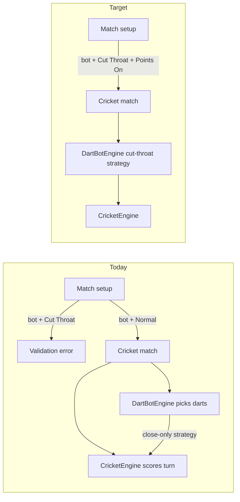

# Cut Throat Cricket Bots

## Problem

Human vs bot Cricket is blocked unless **Normal + Points On**. Setup validation in [`Features/Play/Setup/MatchSetupViewModel.swift`](Features/Play/Setup/MatchSetupViewModel.swift) rejects any bot lineup when `cricketScoringMode != .standard` or points are off:

```217:219:Features/Play/Setup/MatchSetupViewModel.swift
            if hasBot, !cricketPointsEnabled || cricketScoringMode != .standard {
                errors.append("setup.validation.cricketBotUnsupported")
            }
```

Cut Throat rules already work in [`Domain/Engines/CricketEngine.swift`](Domain/Engines/CricketEngine.swift) (overflow credits open opponents; leg winner is lowest score). Bots use [`DartBotEngine.generateCricketTurn`](Domain/Engines/DartBotEngine.swift), which only closes the bot’s own targets and never aims at **punishment** beds—fine for Normal, weak for Cut Throat.



---

## Scope

| In scope | Out of scope (follow-up) |
|----------|---------------------------|
| Cut Throat + **Points On** + bots (preset + training) | **Points Off** bot matches (different leg-end rule; mark-race only) |
| 2–N players (same as human cut throat) | Re-tuning training-bot MPR formula for cut throat |
| Target selection in `DartBotEngine` | New bot difficulty tiers |
| Setup validation + copy + tests | Analytics events (optional later) |

**Training bots:** No schema changes. `TrainingBotSkillResolver` can keep using Cricket MPR; cut-throat is a strategy overlay on the same skill profile.

---

## Step 1 — Spec and docs

Update [`specs/CricketSpec.md`](specs/CricketSpec.md) §2 MVP bullet:

- **Before:** Bot matches: Normal + Points On only until bot strategy supports variants  
- **After:** Bot matches: **Points On** required; scoring modes **Normal** and **Cut Throat** supported  

Update [`FutureIdeas/cut-throat-cricket.md`](FutureIdeas/cut-throat-cricket.md) to remove the bot limitation note.

---

## Step 2 — Setup validation and copy

**Validation** (`MatchSetupViewModel.revalidate`):

- Block bots only when `!cricketPointsEnabled`.
- Remove `cricketScoringMode != .standard` from the bot gate.

**Localization** (`setup.validation.cricketBotUnsupported`):

- EN: e.g. `"Bots require points to be enabled."` (no longer mention Normal only)
- Regenerate DE via [`Scripts/generate_de_localizable.py`](Scripts/generate_de_localizable.py) when touching that key

No UI chip changes—Cut Throat chip is already enabled for humans; it will simply stop erroring when a bot is selected.

---

## Step 3 — Bot strategy (`DartBotEngine`)

`CricketState` already carries `config` ([`CricketEngine.swift`](Domain/Engines/CricketEngine.swift) L112–113). Branch in `intendedCricketDart` on `state.config.scoringMode` (and require `state.config.pointsEnabled` for cut logic—defensive; setup blocks points-off bots).

### Standard (unchanged)

1. Pick first own-unclosed target (`CricketTarget` enum order).
2. Apply existing S/D/T / bull / miss resolution.

### Cut Throat (new)

Two-phase targeting per visit (still 3 darts, same mark snapshot simulation as today):

1. **Close phase** — If any own target has &lt; 3 marks, pick among `ownOpen` preferring **higher point value** (20 → 15 → bull), not merely `ownOpen.first`. Keeps believable closure pace.

2. **Cut phase** — Else, build `punishTargets`: targets where bot marks ≥ 3 **and** at least one opponent has &lt; 3 on that bed. Pick highest `target.points` (ties: stable order). This mirrors human cut-throat: hammer closed numbers while opponents remain open.

3. **Fallback** — If no punish targets (everyone closed on all beds bot has closed), use same fallback as today (`boardGlanceDart` / random cricket bed).

**Multiplier behavior:** Reuse existing `profile.cricket.tripleOnOpenChance` / `doubleOnOpenChance` for both phases. Optional small tweak: in cut phase, cap triple chance slightly for `.veryEasy`/`.easy` so weak bots do not accidentally hand opponents huge 60s—tune only if simulations look wrong.

**3+ players:** Cut phase naturally credits all open opponents on that bed via `CricketEngine.applyOverflowScoring`—no bot changes needed beyond target pick.

**Do not** change `resolveCricketDart`, `generateCricketTurn` signature, or `CricketMatchViewModel.playBotTurnIfNeeded`—only `intendedCricketDart` (+ small private helpers if needed).

---

## Step 4 — Tests

### Unit — `DartBotEngine`

New tests in [`Tests/Unit/DartBotEngineTests.swift`](Tests/Unit/DartBotEngineTests.swift):

| Test | Assert |
|------|--------|
| `cutThroat_prefersClosingHighOpenTarget` | State: bot 0 marks on 20, 19 closed; intended first dart targets 20 |
| `cutThroat_punishesClosedBedWhenOpponentOpen` | Bot 20 closed, opponent 20 open → darts hit 20 (segment 20) |
| `cutThroat_doesNotPunishWhenAllClosedOnBed` | All players closed 20 → bot does not aim 20 for punishment |
| `standard_unchangedBehavior` | Regression: existing close-first behavior still holds |

Use seeded RNG and inspect `intended` path via package-visible test hooks **or** run full `generateCricketTurn` + assert segment targets on constructed states.

### Integration

Extend [`Tests/Unit/DartBotIntegrationTests.swift`](Tests/Unit/DartBotIntegrationTests.swift):

- `lifecycleAcceptsBotGeneratedCricketTurn` variant with `MatchConfigCricket(scoringMode: .cutThroat)` — submit turn succeeds, opponent score can increase on overflow fixture.

### Setup

[`Tests/Unit/MatchSetupViewModelTests.swift`](Tests/Unit/MatchSetupViewModelTests.swift):

- Bot + Cut Throat + points on → `canStart == true`, no `setup.validation.cricketBotUnsupported`
- Bot + points off → still blocked

### Performance (optional)

[`Tests/Performance/BotLongTermSimulationTests.swift`](Tests/Performance/BotLongTermSimulationTests.swift): short bot-vs-bot cut-throat series; expect higher difficulty → more opponent points inflicted and reasonable match completion rate (no infinite legs).

### UI

[`Tests/UI/CricketMatchUITests.swift`](Tests/UI/CricketMatchUITests.swift) or setup helper:

- Select bot + Cut Throat + Points On → Start succeeds
- Wait for bot visit → pad disabled hint, turn advances

---

## Step 5 — Manual QA checklist

- [ ] Play → Cricket → Points On → Cut Throat → add Easy bot → Start
- [ ] Bot closes numbers, then visibly adds points to human on closed beds human still has open
- [ ] Leg ends with lowest score winning; summary/history subtitle shows Cut Throat
- [ ] Training Partner bot in cut throat (if eligible)
- [ ] 3-player cut throat + bot
- [ ] Resume mid-match after kill app
- [ ] Normal + bot regression unchanged

---

## Step 6 — Branch and PR

```bash
git checkout master
git checkout -b feature/cut-throat-cricket-bots
```

Suggested PR title: **Add Cut Throat Cricket bot support**

Risk areas called out in PR description:

- Bot may feel “mean” on hard/pro tiers once punishment phase activates—acceptable for cut throat; tune triple caps if playtest says so.
- Points Off still human-only until a separate mark-race strategy is defined.

---

## File touch list

| File | Change |
|------|--------|
| `Domain/Engines/DartBotEngine.swift` | Cut-throat target selection |
| `Features/Play/Setup/MatchSetupViewModel.swift` | Validation |
| `Resources/en.lproj/Localizable.strings` | Validation message |
| `Scripts/generate_de_localizable.py` + `Resources/de.lproj/...` | DE parity for changed key |
| `specs/CricketSpec.md`, `FutureIdeas/cut-throat-cricket.md` | Docs |
| `Tests/Unit/DartBotEngineTests.swift` | New cases |
| `Tests/Unit/DartBotIntegrationTests.swift` | Cut-throat lifecycle |
| `Tests/Unit/MatchSetupViewModelTests.swift` | Setup gates |
| `Tests/UI/...` | Optional smoke |

**No** persistence migration, `project.yml`, or `CricketEngine` rule changes expected.
