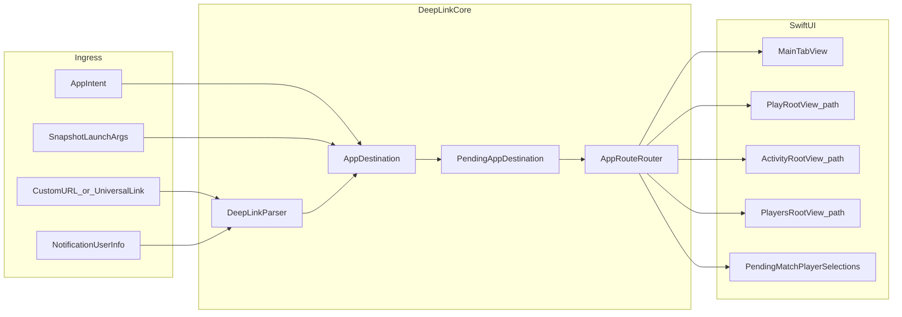

# Deep Linking Setup — Scalable Foundation

## Why this plan exists

Dart Buddy has **typed navigation** ([`App/Navigation/Routes.swift`](App/Navigation/Routes.swift)) and **launch-argument routing** for snapshots (`-snapshot_tab`, `-open_active_match` in [`PlayRootView`](Features/Play/Setup/PlayRootView.swift)), but **no URL handler** in [`DartBuddyApp.swift`](App/DartBuddyApp.swift) and no registered URL scheme in [`project.yml`](project.yml).

Multiple upcoming features need the same spine:

| Consumer | Need |
|---|---|
| [Play reminders](FutureIdeas/play-reminders.md) | Notification tap → Play tab |
| [App Intents plan](.cursor/plans/app_intents_brainstorm_174c8c15.plan.md) | Shortcuts/widgets call same routes |
| [AppShellSpec §9](specs/AppShellSpec.md) | Deep link to active match / history detail |
| Future Universal Links | Shareable `https://` URLs for marketing, campaign mode invites |

**This plan owns the routing spine.** App Intents, reminders, and widgets are consumers—not separate routing systems.

---

## Design principles

1. **Parse once, route typed** — URLs become `AppDestination`, never raw strings in views.
2. **Version paths** — prefix `v1` so v2 can coexist without breaking saved Shortcuts or notification payloads.
3. **Mirror existing routes** — destinations map to [`PlayRoute`](App/Navigation/Routes.swift), [`HistoryRoute`](App/Navigation/Routes.swift), `MainTabView.RootTab`, `ActivitySegment`.
4. **Reuse prefills** — setup parameters enqueue [`PendingMatchPlayerSelections`](App/Bootstrap/PendingMatchPlayerSelections.swift), same as Modes tab and Player Detail practice buttons.
5. **Defer until ready** — hold pending destinations through bootstrap, migration recovery, and onboarding (same pattern as `pendingPlayResume`).
6. **Custom scheme first, Universal Links later** — identical path structure; only the scheme/host layer changes.



---

## Architecture

### Layer 1 — URL registry (`Support/DeepLinks/`)

**`DartBuddyURL`** — constants and builders (single source of truth for all link producers):

```swift
enum DartBuddyURL {
    static let scheme = "dartbuddy"
    static let pathVersion = "v1"

    static func play() -> URL { ... }                          // dartbuddy://v1/play
    static func resumeActiveMatch() -> URL { ... }             // dartbuddy://v1/play/resume
    static func playSetup(mode: String, ...) -> URL { ... }      // query params
    static func historyMatch(id: UUID) -> URL { ... }           // dartbuddy://v1/activity/history/match/{id}
    static func player(id: UUID) -> URL { ... }
}
```

**`DeepLinkParser`** — `parse(_ url: URL) -> Result<AppDestination, DeepLinkError>`

- Accepts `dartbuddy://` URLs today.
- Phase 2: also accepts `https://dartbuddy.app/v1/...` (same path after host).
- Rejects unknown versions with logged `deep_link_unsupported_version` (analytics allowlist).

### Layer 2 — Typed destinations (`AppDestination`)

```swift
enum AppDestination: Equatable {
    case tab(MainTabView.RootTab)
    case play(PlayDeepLink)
    case activity(ActivityDeepLink)
    case players(PlayersDeepLink)
    case settings(SettingsDeepLink)
}

enum PlayDeepLink: Equatable {
    case home                    // setup screen
    case resumeActive            // fetch active match → push gameplay route
    case setup(SetupDeepLinkParams)
    case activeMatch(matchId: UUID)   // explicit id (validate in router)
    case matchSummary(matchId: UUID)
}

enum ActivityDeepLink: Equatable {
    case root(segment: ActivitySegment)
    case historyDetail(matchId: UUID)
}

struct SetupDeepLinkParams: Equatable {
    var catalogModeId: String?     // e.g. "standard.x01" from GameModeCatalog
    var matchType: MatchType?
    var startScore: Int?
    var playerIds: [UUID]?
}
```

Destinations are **navigation intent**, not repository operations. Match creation stays in `MatchSetupViewModel`.

### Layer 3 — Router (`App/Navigation/AppRouteRouter.swift`)

`@MainActor final class AppRouteRouter: ObservableObject` (or static coordinator with callbacks):

```swift
func handle(_ destination: AppDestination, context: RouteContext) async -> RouteOutcome
```

**`RouteContext`** carries: `AppDependencies`, bootstrap state (ready vs migration recovery), onboarding visible flag.

**`RouteOutcome`**: `.applied`, `.deferred`, `.failed(DeepLinkError)` — for analytics and optional user toast.

**Router responsibilities:**

| Destination | Action |
|---|---|
| `.tab(.play)` | `selectedTab = .play` |
| `.play(.home)` | Tab play; clear Play `NavigationPath` |
| `.play(.resumeActive)` | `fetchActiveMatch()` → set `pendingPlayResume` or show dialog if none |
| `.play(.setup(params))` | Tab play + enqueue `PendingModeSelection` / player IDs via existing APIs |
| `.play(.activeMatch(id))` | Tab play + push `match.type.playRoute(matchId:)` after validating match exists |
| `.activity(.historyDetail(id))` | Tab activity + push `HistoryRoute.detail(matchId:)` |
| `.players(.detail(id))` | Tab players + push `PlayersRoute.detail(playerId:)` |

**Do not** duplicate match-start logic from [`MatchSetupViewModel.startMatchRoute()`](Features/Play/Setup/MatchSetupViewModel.swift) in v1. Setup deep links **prefill only**.

### Layer 4 — Pending delivery (`PendingAppDestination`)

```swift
@MainActor
final class PendingAppDestination: ObservableObject {
    func enqueue(_ destination: AppDestination)
    func consumeIfReady(bootstrapReady: Bool, onboardingComplete: Bool) -> AppDestination?
}
```

Wiring in [`MainTabView`](App/MainTabView.swift):

- `.onOpenURL` in `DartBuddyApp` → parse → enqueue
- After bootstrap + onboarding dismiss → router consumes pending
- Migration recovery screen: drop or queue links (log `deep_link_dropped_recovery`)

### Layer 5 — Unify launch arguments (optional refactor in Phase 1)

Migrate snapshot/test launch args to the same parser:

| Current arg | Equivalent URL |
|---|---|
| `-snapshot_tab play` | `dartbuddy://v1/tab/play` |
| `-open_active_match` | `dartbuddy://v1/play/resume` |
| `-snapshot_activity_segment statistics` | `dartbuddy://v1/activity?segment=statistics` |

Keeps one routing code path for UI tests, marketing snapshots, and production links.

---

## URL registry — v1 (ship this)

Base: `dartbuddy://v1/{path}`

| Path | Query params | Maps to | Primary consumer |
|---|---|---|---|
| `/tab/{play\|modes\|players\|activity\|settings}` | — | `.tab(...)` | Shortcuts, tests |
| `/play` | — | `.play(.home)` | Play reminders |
| `/play/resume` | — | `.play(.resumeActive)` | Widget, Shortcuts |
| `/play/setup` | `mode`, `startScore`, `players` (comma UUIDs) | `.play(.setup(...))` | App Intents |
| `/play/match/{uuid}` | — | `.play(.activeMatch)` | Resume by id |
| `/play/summary/{uuid}` | — | `.play(.matchSummary)` | Post-game share (future) |
| `/activity` | `segment=history\|statistics` | `.activity(.root)` | Stats Shortcuts |
| `/activity/history/match/{uuid}` | — | `.activity(.historyDetail)` | History banner, partial-data links |
| `/players/{uuid}` | — | `.players(.detail)` | Player-centric flows |

**Aliases (stable forever once shipped):**

- `dartbuddy://play` → redirect-parse to `dartbuddy://v1/play` (backward compat for first reminders)
- `history` tab deep links from old docs → `/tab/activity?segment=history`

**Mode param values:** use [`GameModeCatalogEntry.id`](Features/Modes/GameModeCatalog.swift) (`standard.x01`, `party.killer`, …). Parser resolves to `PendingModeSelection` via catalog helper (same as Modes tab).

---

## Future scalability (design now, implement later)

### Universal Links (Phase 2)

| Custom scheme | Universal Link |
|---|---|
| `dartbuddy://v1/play/resume` | `https://dartbuddy.app/v1/play/resume` |

- Register associated domain in Xcode + `apple-app-site-association` on web host.
- `DeepLinkParser` checks host: `dartbuddy.app` OR scheme `dartbuddy` → same path parser.
- Enables App Store campaigns, email links, campaign-mode invites without app-installed custom scheme quirks.

### Link signing / attribution (Phase 3+)

Optional query params preserved through parser, ignored by router:

- `?utm_source=…` — analytics only
- `?ref=campaign_chapter_3` — future campaign mode (see [campaign plan](.cursor/plans/campaign_mode_brainstorm_871d477e.plan.md))

### Widget / Live Activity (Phase 2)

Widgets link with `DartBuddyURL.resumeActiveMatch()` or `WidgetURL` → same parser. Read-only widget data stays separate; tap target is always a URL.

---

## Platform registration

Add to [`project.yml`](project.yml) under DartBuddy target `info.properties`:

```yaml
CFBundleURLTypes:
  - CFBundleURLName: com.jacobrozell.DartBuddy.deeplink
    CFBundleURLSchemes:
      - dartbuddy
```

Phase 2 adds `com.apple.developer.associated-domains` entitlement.

---

## Integration checklist

| File | Change |
|---|---|
| [`App/DartBuddyApp.swift`](App/DartBuddyApp.swift) | `.onOpenURL { url in ... }` → parse → pending |
| [`App/MainTabView.swift`](App/MainTabView.swift) | Own `AppRouteRouter`, consume pending after onboarding |
| [`Features/Play/Setup/PlayRootView.swift`](Features/Play/Setup/PlayRootView.swift) | Already handles `pendingResumeMatch`; router sets binding |
| [`Features/Activity/ActivityRootView.swift`](Features/Activity/ActivityRootView.swift) | Expose method/binding to set `segment` + `historyPath` from router |
| [`Features/Players/PlayersRootView.swift`](Features/Players/PlayersRootView.swift) | Expose path push for player detail |
| `Support/Notifications/PlayReminderService.swift` (future) | Set `userInfo["url"] = DartBuddyURL.play().absoluteString` |
| App Intents (future) | Call `AppRouteRouter` directly OR open `DartBuddyURL` |

---

## Error handling and edge cases

| Case | Behavior |
|---|---|
| No active match on `/play/resume` | Log + optional in-app banner; Shortcuts dialog via App Intent wrapper |
| Unknown `matchId` | Push history detail → existing empty/error UI in detail VM |
| Planned catalog mode in setup URL | Parse OK → Play setup with mode disabled / "coming soon" (catalog status) |
| Active match exists + setup URL | Router opens setup; `MatchSetupViewModel` conflict alert on start (unchanged) |
| Bootstrap = migration recovery | Defer or drop with analytics event |
| Onboarding visible | Queue until `onFinished` |
| Invalid URL / bad UUID | Log `deep_link_parse_failed`; no crash |

---

## Feature flag and analytics

- **`enableDeepLinks`** in [`FeatureFlag`](Support/FeatureFlags/FeatureFlag.swift) — default `true` once tested (unlike App Intents); or gate only Universal Links.
- Allowlisted events: `deep_link_received`, `deep_link_applied`, `deep_link_deferred`, `deep_link_failed` with `path`, `version` — no player names or UUIDs in Firebase payloads (use hashed or omitted).

---

## Spec deliverable

Create [`specs/DeepLinkSpec.md`](specs/DeepLinkSpec.md) (authoritative contract):

1. URL registry table (v1 paths + aliases)
2. `AppDestination` schema
3. Router behavior matrix
4. Deferred delivery rules
5. Universal Links migration path
6. Versioning / deprecation policy ("v1 paths stable; new paths additive")
7. Cross-refs: [`NavigationSpec.md`](specs/NavigationSpec.md), App Intents plan, play-reminders

Update [`NavigationSpec.md`](specs/NavigationSpec.md) §5 to reference `DeepLinkParserTests` + `AppRouteRouterTests`.

---

## Phased implementation

| Phase | Scope | Effort | Unblocks |
|---|---|---|---|
| **1 — Core** | `DartBuddyURL`, `DeepLinkParser`, `AppDestination`, `AppRouteRouter`, `PendingAppDestination`, `onOpenURL`, URL scheme in project.yml, unit tests | ~1 week | Play reminders, App Intents Phase 0 |
| **2 — Full v1 paths** | Activity history detail, player detail, setup query params, Activity segment param | ~3–5 days | App Intents parameterized shortcuts |
| **3 — Launch arg unification** | Route snapshot args through parser (optional cleanup) | ~2 days | Single test harness |
| **4 — Universal Links** | Associated domains, AASA file, https parsing | ~1 week | Marketing, campaign invites |
| **5 — Widget tap targets** | Widget extension uses `DartBuddyURL` builders | ~2 days (with widget plan) | Home Screen resume |

**Recommended first slice:** Phase 1 with only `/play`, `/play/resume`, `/tab/play` — wire play-reminders notification tap in the same PR or immediately after.

---

## Testing strategy

**Unit — `Tests/Unit/DeepLinkParserTests.swift`:**

- Parse every v1 path + query combo
- Reject malformed UUIDs, unknown version, unknown mode id
- Alias `dartbuddy://play` → v1

**Unit — `Tests/Unit/AppRouteRouterTests.swift`:**

- Mock `MatchRepository` / pending selections
- Resume with/without active match
- Setup params → correct `PendingModeSelection`

**UI (optional) — extend [`Tests/UI/`](Tests/UI/):**

- Launch with `xcrun simctl openurl booted dartbuddy://v1/play/resume`

**Manual:** Shortcuts app "Open URL" action on device; cold launch vs warm launch; link during onboarding.

---

## Relationship to App Intents plan

| Deep linking plan | App Intents plan |
|---|---|
| Phase 1 here | App Intents Phase 0 (same code) |
| `specs/DeepLinkSpec.md` | `specs/AppIntentsSpec.md` references DeepLinkSpec for URL registry |
| App Intents perform() | Call `AppRouteRouter.handle()` directly (preferred) or open `DartBuddyURL` |

**Do not maintain two routers.** App Intents is a caller of this spine.

---

## Out of scope (v1)

- Headless match creation via deep link (prefill only)
- Universal Links / web fallback
- Online play / account-linked routes
- In-game scoring via URL (`/play/match/{id}/score/60`) — belongs with `MatchCommandService` + Watch
- QR code scanner in-app
