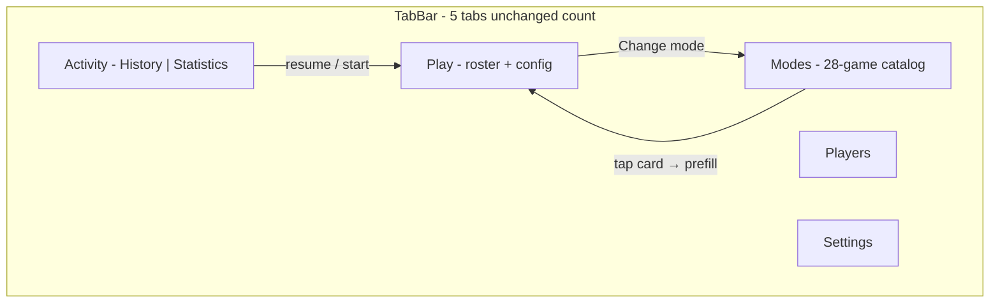

# Full Game Catalog UI Draft

Design target: every mode from [FutureIdeas/additional-game-modes.md](FutureIdeas/additional-game-modes.md) plus what ships today (X01, Cricket, Baseball, Killer, Shanghai). This extends the IA in [docs/ux-scale-tab-restructure-plan.md](docs/ux-scale-tab-restructure-plan.md) with concrete wireframes and gameplay templates at full catalog scale.

---

## 1. Complete mode inventory (28)

| # | Mode | Section | Status | Min players | UI family (see §5) |
|---|------|---------|--------|-------------|-------------------|
| 1 | X01 (301/501/701…) | Standard | **Shipped** | 1+ | A — Checkout score |
| 2 | Cricket | Standard | **Shipped** | 2+ | B — Mark board |
| 3 | Baseball | Party | **Shipped** | 2+ | C — Inning points |
| 4 | Killer | Party | **Shipped** | 3+ | D — Lives elimination |
| 5 | Shanghai | Party | **Shipped** | 2+ | C — Inning points |
| 6 | American Cricket | Standard | Planned | 2+ | B — Mark board |
| 7 | Mickey Mouse | Party | Planned | 2+ | B — Mark board |
| 8 | Mulligan | Party | Planned | 2+ | B — Mark board |
| 9 | English Cricket | Party | Planned | 2+ | A — Checkout score |
| 10 | Blind Killer | Party | Planned | 3+ | D — Lives elimination |
| 11 | Around the Clock | Practice | Planned | 1+ | E — Sequence progress |
| 12 | 180 Around the Clock | Practice | Planned | 1+ | E — Sequence progress |
| 13 | Chase the Dragon | Practice | Planned | 1+ | E — Sequence progress |
| 14 | Nine Lives | Practice | Planned | 2+ | D — Lives elimination |
| 15 | Bob's 27 | Practice | Planned | 1 | F — Solo challenge |
| 16 | Halve-It | Practice | Planned | 1+ | F — Solo challenge |
| 17 | Knockout | Party | Planned | 2+ | A — Checkout score |
| 18 | Sudden Death | Party | Planned | 3+ | A — Checkout score |
| 19 | 51 By 5's | Party | Planned | 2+ | A — Checkout score |
| 20 | Football | Party | Planned | 2+ | G — Phase race |
| 21 | Grand National | Party | Planned | 2+ | E — Sequence progress |
| 22 | Hare and Hounds | Party | Planned | 2 | E — Sequence progress |
| 23 | Follow the Leader | Party | Planned | 2+ | D — Lives elimination |
| 24 | Loop | Party | Planned | 2+ | D — Lives elimination |
| 25 | Prisoner | Party | Planned | 2+ | H — Board state |
| 26 | Scam | Party | Planned | 2 | I — Role split |
| 27 | Snooker | Party | Planned | 2+ | I — Role split |
| 28 | Tic-Tac-Toe | Party | Planned | 2+ | H — Board state |

**Note:** Code already routes five modes via [`PlayRootView.swift`](Features/Play/Setup/PlayRootView.swift) and [`MatchType`](Domain/Models/RepositoryModels.swift). The remaining 23 appear as catalog entries with `isAvailable: false` until promoted.

---

## 2. App shell at full scale



**Tab order:** `Play · Modes · Players · Activity · Settings` (from scale plan).

**Why not more tabs:** Practice / Party / Cricket variants become **sections inside Modes**, not separate tabs. At 28 modes, a flat Play setup or 6-option segmented control breaks down ([`docs/ux-design-review.md`](docs/ux-design-review.md) A2).

---

## 3. Modes tab — full catalog wireframe

Primary discovery surface. Reuses card row pattern from [`PartyGamePickerView.swift`](Features/Play/Setup/PartyGamePickerView.swift) + [`GameModeBadge`](DesignSystem/Tokens/GameModeAccent.swift).

```text
+--------------------------------------------------+
| Modes                              [Search 🔍]   |
|--------------------------------------------------|
| Pinned / Recent (optional, max 3)                |
|  [501] [Killer] [Around the Clock]               |
|--------------------------------------------------|
| STANDARD                              3 modes    |
|  ┌────────────────────────────────────────────┐  |
|  │ [🎯] X01                          1–8 pl   │  |
|  │      301 · 501 · double out                │  |
|  │                              [Learn rules] │  |
|  └────────────────────────────────────────────┘  |
|  ┌────────────────────────────────────────────┐  |
|  │ [⊞] Cricket                       2–8 pl   │  |
|  │      Cut throat · Points on                │  |
|  └────────────────────────────────────────────┘  |
|  ┌────────────────────────────────────────────┐  |
|  │ [⊞] American Cricket    Coming soon  2+ pl  │  |
|  └────────────────────────────────────────────┘  |
|--------------------------------------------------|
| PARTY                                16 modes    |
|  [ Killer ] [ Baseball ] [ Shanghai ]          |
|  [ Blind Killer - soon ] [ Mickey Mouse - soon ] |
|  [ Knockout - soon ] [ Sudden Death - soon ]     |
|  [ Football · Grand National · Hare & Hounds ]   |
|  [ Follow the Leader · Loop · Prisoner ]         |
|  [ Scam · Snooker · Tic-Tac-Toe · Mulligan ]     |
|  [ 51 By 5's ]                                   |
|--------------------------------------------------|
| PRACTICE                              6 modes    |
|  [ Bob's 27 - soon ] [ Around the Clock - soon ]|
|  [ 180 ATC - soon ] [ Chase the Dragon - soon ]  |
|  [ Nine Lives - soon ] [ Halve-It - soon ]       |
|--------------------------------------------------|
| CRICKET VARIANTS (collapsible)         2 modes   |
|  [ English Cricket - soon ]                      |
|  (American Cricket also listed under Standard)   |
+--------------------------------------------------+
```

### Modes tab behaviors

- **Search field** (sticky below title): filters all 28 by name, alias (“501”, “ATC”, “Mickey”), player count, or section. Essential at this scale.
- **Available card tap:** enqueue mode → switch to Play tab ([`PendingMatchPlayerSelections`](App/Bootstrap/PendingMatchPlayerSelections.swift) extension from scale plan).
- **Coming soon card:** non-tappable; `StatusBadge` + optional “Notify me” (future). “Learn rules” still opens [`GameRulesGuideContent`](Features/Play/Rules/GameRulesGuideContent.swift).
- **iPad:** two-column grid of cards within each section (`LazyVGrid`, 2 cols regular width).
- **Accents:** extend [`GameModeAccent`](DesignSystem/Tokens/GameModeAccent.swift) beyond five `MatchType` values — use `GameModeCatalogEntry.id` for unreleased modes (e.g. `practice.atc` → teal + `clock.fill`).

### Section rationale

| Section | Modes | Player mental model |
|---------|-------|---------------------|
| Standard | X01, Cricket, American Cricket | Pub league / serious scoring |
| Party | 16 social/elimination/race games | Group night, 3+ players common |
| Practice | 6 solo/training | 1 player, personal bests |
| Cricket variants | English Cricket (collapsible) | Avoids duplicating American Cricket; signals “same family, different rules” |

---

## 4. Play tab — slim setup wireframe

Mode selection **removed** from Play; only roster + config remain ([`SetupHomeView.swift`](Features/Play/Setup/SetupHomeView.swift) slimmed per scale plan).

```text
+--------------------------------------------------+
| Play                                             |
|--------------------------------------------------|
| [Resume: Killer · 3 players · Resume]  (if any)  |
|--------------------------------------------------|
| SELECTED MODE                                      |
|  [⚡] Killer                    [Change → Modes]  |
|  3 lives · Double to become Killer               |
|  [Edit options ▾]  (collapsed by default)        |
|--------------------------------------------------|
| PLAYERS                                          |
|  [+ Add] [Quick add]                             |
|  ☑ Alice  ☑ Bob  ☑ Carol  ☐ Dave                 |
|  (inline hint if < min players for Killer)       |
|--------------------------------------------------|
|              [ Start Match ]  (primary)            |
+--------------------------------------------------+
```

**Per-mode config chips** (shown when Edit expanded):

| Mode group | Setup chips |
|------------|-------------|
| X01 | Start score, double/b/master out, legs/sets, check-in |
| Cricket | Cut throat, points on/off |
| Killer | Lives, killer rule variant, assignment method |
| Baseball | Innings, 7th-inning catch, tiebreaker |
| Shanghai | Rounds, Shanghai bonus rule |
| Practice (ATC) | Reset rule, bull finish, skip-on-double |
| Halve-It | Starting score, target sequence preset |
| Lives games | Starting lives count |
| Snooker | Simplified vs full rules toggle |

**Cold open default:** Settings → Default game mode (X01 or Cricket) until user picks from Modes.

---

## 5. Gameplay UI — eight screen templates

All match screens share a **fixed chrome contract** from existing screens ([`X01MatchScreen`](Features/Play/X01/X01MatchScreen.swift), [`CricketMatchScreen`](Features/Play/Cricket/CricketMatchScreen.swift)):

```text
+--------------------------------------------------+
| [←]  Mode title · config summary    [⋯ menu]     |
|--------------------------------------------------|
|  SCOREBOARD REGION (template-specific)           |
|  STATUS BANNERS (target, phase, checkout, etc.)  |
|--------------------------------------------------|
|  SCORING INPUT (template-specific)               |
+--------------------------------------------------+
```

Landscape iPad: scoreboard left, input right ([`GameplayLayout`](DesignSystem/Layout/GameplayLayout.swift) side-by-side — already used by X01/Cricket).

### Template A — Checkout score (X01 family)

**Modes:** X01, Knockout, Sudden Death, 51 By 5's, English Cricket (batting)

```text
| Player cards: remaining / running total          |
| Active: Alice  142 → 501                         |
| Banner: "Beat 85" (Knockout) / "÷5 = 12 pts"     |
| [DartNumberPad - full segment grid]                |
```

Reuse: existing X01 player cards + [`DartNumberPad`](DesignSystem/Components/DartNumberPad.swift). Knockout/Sudden Death add a **challenge banner** above the pad.

### Template B — Mark board (Cricket family)

**Modes:** Cricket, American Cricket, Mickey Mouse, Mulligan

```text
| CricketBoardView (15–20 + bull) OR                 |
|   DescendingBoard (20→12) OR                       |
|   RandomCloseList (6 picks + bull)                 |
| Banner: "Close 19 to score" / "3 hits on 20"       |
| [Segment + S/D/T pad]                              |
```

Reuse: [`CricketBoardView`](Features/Play/Cricket/CricketBoardView.swift) with configurable segment sets. Mickey Mouse = descending subset; Mulligan = dynamic 6-segment header row.

### Template C — Inning / round points (Baseball family)

**Modes:** Baseball, Shanghai

```text
| Scoreboard rows: total + this inning/round         |
| Banner: "Round 4 · Hit 16s only"                   |
| [Segment + S/D/T pad, segment locked to round]     |
```

Reuse: [`BaseballScoreboardView`](Features/Play/Baseball/BaseballScoreboardView.swift) / [`ShanghaiScoreboardView`](Features/Play/Shanghai/ShanghaiScoreboardView.swift) — nearly identical layout.

### Template D — Lives elimination (Killer family)

**Modes:** Killer, Blind Killer, Nine Lives, Follow the Leader, Loop

```text
| KillerScoreboardView: name · number · hearts · ⚡   |
| Blind Killer: numbers hidden until reveal phase    |
| Banner: "Hit exact small 12" (Follow Leader)       |
| [Segment + S/D/T OR assignment grid]               |
```

Reuse: [`KillerScoreboardView`](Features/Play/Killer/KillerScoreboardView.swift) + [`KillerNumberGridView`](Features/Play/Killer/KillerNumberGridView.swift). Nine Lives adds lives to ATC progress strip. Loop adds wire-loop overlay hint on target banner (icon only v1).

### Template E — Sequence progress (race)

**Modes:** Around the Clock, 180 ATC, Chase the Dragon, Grand National, Hare and Hounds

```text
| Progress strip: 1 2 3 [4] 5 … 20  (or 10–20 T)   |
|   ● = done  ○ = current  · = upcoming              |
| Dual track (Hare/Hound): two strips stacked        |
| Anti-clockwise variant: reversed strip + "Hurdle 8"|
| Banner: "Hit treble 14" / "+3 pts" (180 mode)      |
| [Segment + S/D/T pad OR treble-only filter]        |
```

New component: **`SequenceProgressStrip`** — horizontal scroll of segment chips; shared across all five modes. 180 ATC shows point tally beside strip.

### Template F — Solo challenge

**Modes:** Bob's 27, Halve-It

```text
| Large score: 847 / 1437 (Bob's) or 301 (Halve-It) |
| Round label: "Double 12" / "Target: Treble 20"     |
| Streak / best badge                                |
| [Double picker OR segment pad]                     |
| Optional: no player roster (single implicit player)  |
```

Can live under Practice with simplified setup (skip roster section when `minPlayers == 1`).

### Template G — Phase race

**Modes:** Football

```text
| Phase banner: "Kickoff — hit bull" | "Score goals"  |
| Score: Alice 3 – 2 Bob  (goals)                  |
| Progress: ●●●○○○○○○○ (10 doubles)                  |
| [Bull-only pad] then [Double-only pad]             |
```

Input pad **filters valid targets by phase** — reuse pad with disabled invalid segments.

### Template H — Board state

**Modes:** Prisoner, Tic-Tac-Toe

```text
Prisoner:
| Mini board diagram: segments 1–20 ring            |
|   pinned dart icons on missed segments             |
| Captured darts counter per player                  |

Tic-Tac-Toe:
| 3×3 grid overlaid on segment labels                |
|   [16][17][18]                                    |
|   [19][BULL][20]   ← bull center                   |
|   [12][13][14]                                     |
| X/O claim animation on hit                         |
```

New components: **`SegmentRingView`**, **`TicTacToeGridView`**. Highest UX cost — defer to late in catalog rollout.

### Template I — Role split

**Modes:** Scam, Snooker

```text
| Role badge: STOPPER | SCORER                       |
| Blocked segments greyed on mini board (Scam)       |
| Snooker: "Red" / "Yellow (16)" phase chip          |
| Colour legend row (Snooker only)                   |
| [Segment pad with phase-filtered valid hits]       |
```

Snooker needs a **phase indicator stack** (red → colour → red …) above the pad; start with simplified rules toggle in setup.

---

## 6. Activity tab at full scale

History + Statistics merged; mode filter must scale to 28 entries.

```text
+--------------------------------------------------+
| Activity                                         |
| [ History | Statistics ]                         |
| All games ▾  |  Last 30 days ▾  |  All players ▾ |
|--------------------------------------------------|
| (segment content — unchanged semantics)          |
+--------------------------------------------------+
```

**Mode filter:** menu picker (not segmented) listing all modes with `GameModeBadge` + name + count. Grouped submenu: Standard / Party / Practice. “All games” default.

Filter state shared via `ActivityFilterState` (scale plan Phase 1).

---

## 7. Match summary & history detail

Each template gets a **summary variant** branch in [`MatchSummaryScreen`](Features/Play/Shared/MatchSummaryScreen.swift) and history detail:

| Template | Summary highlights |
|----------|-------------------|
| A | Averages, checkout %, highest turn |
| B | Marks closed, points scored |
| C | Runs per inning / round breakdown |
| D | Kills dealt, lives remaining graph |
| E | Completion time, perfect segments, final score (180 ATC) |
| F | Final score vs par, round-by-round |
| G | Goals timeline |
| H | Grid / ring replay |
| I | Role scores, phase log |

At full scale, history list rows already use `GameModeBadge` — extend badge mapping for all 28 catalog IDs.

---

## 8. iPad & accessibility

| Context | Layout |
|---------|--------|
| Modes tab (regular) | 2-column card grid; search + sections unchanged |
| Play setup (regular) | Mode header + roster side-by-side when width allows |
| Match (regular landscape) | Existing side-by-side scoreboard + pad |
| AXXXL Dynamic Type | Scrollable stack (existing accessibility path in X01) |
| Lives / progress | Never color-only — icons + labels (hearts, pips, segment numbers) |

---

## 9. Visual identity at 28 modes

Extend [`GameModeAccent`](DesignSystem/Tokens/GameModeAccent.swift):

- **Shipped 5:** keep current colors (green, proBot, orange, red, amber).
- **Practice 6:** cool tones (teal, cyan, mint) + clock/target icons.
- **Party elimination:** warm reds/ambers (share Killer family).
- **Novelty (Tic-Tac-Toe, Football):** distinct icons; reuse section hue families to avoid 28 unique hues.

Cards always show: **badge · title · subtitle · player range · availability badge**.

---

## 10. Implementation mapping (for later)

Central catalog model (from scale plan):

```swift
// Features/Modes/GameModeCatalog.swift
struct GameModeCatalogEntry {
    let id: String
    let section: GameModeSection  // standard | party | practice
    let matchType: MatchType?
    let uiTemplate: GameplayUITemplate  // A…I
    let isAvailable: Bool
    let minimumPlayers: Int
    // titleKey, subtitleKey, accent, icon
}
```

**Do not** build 28 bespoke root views — build **8 templates** + mode-specific scoreboard/banner config. New modes mostly add engine + catalog row + template config JSON.

---

## 11. What stays out of this UI

- Online multiplayer lobby (separate tab when [`OnlinePlaySpec`](specs/OnlinePlaySpec.md) lands)
- Campaign mode ([`FutureIdeas/campaign-mode.md`](FutureIdeas/campaign-mode.md))
- Electronic/soft-tip board integration (Darts Corner blog mention — not in app scope)

---

## 12. Recommended doc home

When approved, persist this draft as **`specs/ModesTabSpec.md`** §Wireframes + **`specs/UIBlueprintSpec.md`** §Gameplay templates, cross-linking [`FutureIdeas/additional-game-modes.md`](FutureIdeas/additional-game-modes.md) for rules source of truth.
