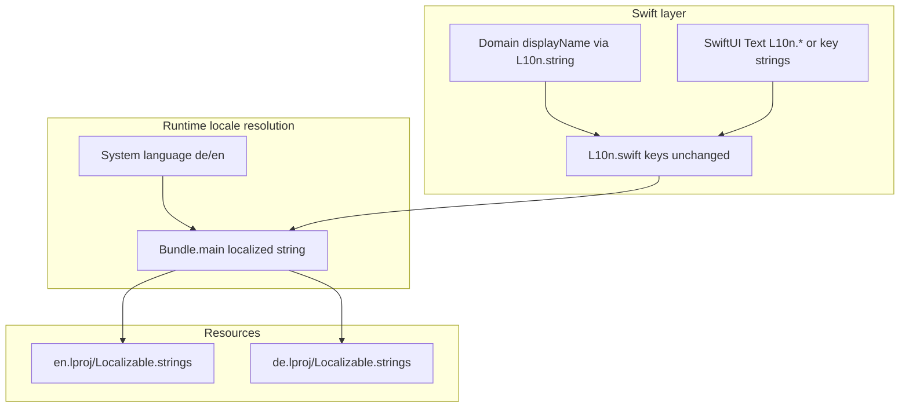

# German Localization (de)

## Current state

The app is **English-first but localization-ready**:

| Artifact | Role |
|----------|------|
| [`Resources/en.lproj/Localizable.strings`](Resources/en.lproj/Localizable.strings) | Source of truth — **459 keys** |
| [`Support/Localization/L10n.swift`](Support/Localization/L10n.swift) | Typed `LocalizedStringKey` accessors + `string()` / `format()` helpers |
| [`Support/Localization/MatchConfigText.swift`](Support/Localization/MatchConfigText.swift) | Composed match/history copy from keys |
| Domain enums ([`MatchLifecycleModels`](Domain/Match/MatchLifecycleModels.swift), [`DartBotEngine`](Domain/Engines/DartBotEngine.swift), [`PlayerVisualStyle`](Domain/Models/PlayerVisualStyle.swift)) | `displayName` already resolves via `L10n` |

**Not yet present:**

- No `de.lproj` folder
- [`project.yml`](project.yml) only bundles `en.lproj`
- Xcode `knownRegions` = `en` only
- No in-app language picker (follows **system locale** — correct for v1)
- No CI key-parity gate ([`specs/LocalizationSpec.md`](specs/LocalizationSpec.md) lists this as future)
- Some tests assume English words (`WCAGAccessibilityLabelTests` checks labels contain `"double"` / `"triple"`)

German is already flagged as the **first priority** in [`FutureIdeas/backlog.md`](FutureIdeas/backlog.md) and [`docs/release/todo.md`](docs/release/todo.md).

---

## Scope

### In scope (v1 German)

- Full UI translation via `Localizable.strings`
- Xcode / xcodegen project registration
- Layout and accessibility QA in German
- Automated key-parity tests
- App Store Connect metadata checklist (manual, outside repo)

### Out of scope (defer)

- In-app language override in Settings
- `stringsdict` plural rules (no `.stringsdict` today; format strings suffice)
- Splitting strings into `Gameplay.strings` / `Settings.strings` tables
- Dutch or other locales
- RTL layout work
- Localizing user-entered data (player names, match history names at start)

---

## Implementation plan

### 1. Pre-flight audit

**Goal:** Ensure English file is complete before copying.

1. Export key list from `en.lproj`:
   ```bash
   grep -oE '^"[^"]+"' Resources/en.lproj/Localizable.strings | sort > /tmp/en-keys.txt
   ```
2. Grep Swift for user-facing hardcoded strings (known acceptable: numeric scores, player names, test fixtures).
3. Confirm every `L10n.*` key and every `Text("dotted.key")` / `LocalizedStringKey("dotted.key")` reference exists in `en.lproj`.
4. Document keys grouped by **translation priority** for review order:
   - P0: Gameplay (X01/Cricket pad, turn flow, summary, errors during match)
   - P1: Setup + Play home
   - P2: History, Statistics, Players, Bots
   - P3: Settings, Migration recovery, About

**No Swift code changes expected** unless audit finds hardcoded copy.

---

### 2. Project wiring

1. Create `Resources/de.lproj/Localizable.strings` (initially copy of English as scaffold).
2. Update [`project.yml`](project.yml):
   ```yaml
   - path: Resources/de.lproj/Localizable.strings
     type: file
     buildPhase: resources
   ```
3. Regenerate Xcode project (`xcodegen generate`).
4. Verify `knownRegions` includes `de` and `developmentRegion` stays `en`.
5. Build — iOS automatically selects `de` when device language is German.

**Optional:** `de.lproj/InfoPlist.strings` only if you want a localized display name (e.g. keep "Dart Buddy" vs "Dart Buddy" — likely unchanged).

---

### 3. Terminology glossary (translate consistently)

Draft a short glossary **before** bulk translation. German darts communities often mix English loanwords with German — pick one style and stick to it.

| English key domain | Recommended DE approach | Notes |
|--------------------|---------------------------|-------|
| Double Out / Master Out | **Doppel-Out**, **Master-Out** | Standard in DE steel-tip context |
| Straight In / Double In | **Straight-In**, **Doppel-In** | Match existing EN hyphen style |
| Leg / Set | **Leg** / **Set** | Commonly kept in German |
| Checkout | **Checkout** or **Auschecken** | Prefer one; checkout suggestions UI uses "Checkout" |
| Bust | **Bust** or **Überworfen** | Bust is widely understood |
| Cricket, X01 | **Cricket**, **X01** | Keep game names |
| Bull / Outer Bull | **Bull**, **Outer Bull** | Often unchanged; accessibility strings should be spoken clearly |
| MPR, 3-dart average | **MPR**, **3-Dart-Durchschnitt** | Stats screen |
| Bot difficulty tiers | **Sehr leicht**, **Leicht**, **Mittel**, **Schwer**, **Pro** | Already keyed in `bot.difficulty.*` |

Share glossary with translator; include **do-not-translate** list (`X01`, `Cricket`, `MPR`, numeric formats).

---

### 4. Translation pass

1. Copy `en.lproj/Localizable.strings` → `de.lproj/Localizable.strings`.
2. Translate all 459 values.
3. **Format string rules:**
   - Preserve count and order of `%@`, `%d`, `%.1f`, etc.
   - Keep `\n` line breaks where present.
   - Short variants (`*.short`, `play.setup.start.disabledHint`) must remain **shorter** than full messages (see [`SetupValidationMessagesTests`](Tests/Unit/SetupValidationMessagesTests.swift)).
4. **High-risk strings** (manual review):
   - Scoring pad accessibility (`scoring.dart.*`, `scoring.segment.*`)
   - Checkout suggester tokens ([`CheckoutSuggester`](Domain/Engines/CheckoutSuggester.swift))
   - Chip accessibility formats (`play.setup.chip.accessibilityFormat`)
   - Bot auto-naming ([`BotNaming`](Domain/Models/BotNaming.swift) — `bot.namePrefixFormat`, `bot.rosterNameFormat`)
   - History/stat compound formats (`history.config.x01Format`, `match.config.*Plural`)

**Translation source options:**

- Native speaker review (preferred for darts terms)
- Professional localization vendor with glossary
- Machine translation + native review for P0/P1 only

---

### 5. Layout and accessibility QA

German copy is typically **20–35% longer**. Test on iPhone SE / mini and iPad.

| Screen | Risk areas |
|--------|------------|
| Match setup | Option chips (Points, Check Out, Legs), validation hints |
| Tab bar | Play, Statistics, History labels |
| X01 match | Turn/leg/set banner, scoring pad Double/Triple row |
| Cricket | Column headers, mark accessibility |
| Statistics | Table column headers (`stats.column.*`) |
| Settings | Section footers, picker labels |

**How to test:**

- Simulator → Settings → Language → Deutsch
- Or launch argument: `-AppleLanguages (de)` / `-AppleLocale de_DE`
- Run Dynamic Type at **Large** and **Accessibility XL** on setup + match screens
- VoiceOver spot-check: scoring pad, player rows, history rows

Update [`accessibility/wcag-2.1-aa/criteria.md`](accessibility/wcag-2.1-aa/criteria.md) U-3.1.1 status once German is verified.

---

### 6. Tests

#### 6a. Key parity (new unit test, tag `.localization`)

```swift
// Pseudocode
let enKeys = parseKeys(from: bundle, locale: "en")
let deKeys = parseKeys(from: bundle, locale: "de")
#expect(enKeys == deKeys)
```

Also verify format-specifier sets match per key (regex extract `%[@df]` etc.).

#### 6b. Fix English-assumptive tests

[`WCAGAccessibilityLabelTests`](Tests/Accessibility/WCAGAccessibilityLabelTests.swift) lines 57–61 assert labels contain `"double"` / `"triple"`. Options:

- Compare against `L10n.format(...)` only (drop substring checks), or
- Gate substring checks on `Locale.current.language.languageCode == "en"`.

#### 6c. UI smoke test (optional but valuable)

Extend [`Tests/UI/Support/DartBuddyUITestCase.swift`](Tests/UI/Support/DartBuddyUITestCase.swift):

```swift
app.launchArguments += ["-AppleLanguages", "(de)", "-AppleLocale", "de_DE"]
```

Smoke: launch → Play tab → open setup → verify localized navigation title key resolves (assert by accessibility identifier, not English copy).

Existing UI tests that assert **English button labels** will fail under German — keep English locale for functional UI tests; add a separate **German smoke** suite or launch helper.

---

### 7. Documentation and release

| Doc | Update |
|-----|--------|
| [`specs/LocalizationSpec.md`](specs/LocalizationSpec.md) | Record `de` as wave 1; note key-parity CI rule |
| [`docs/release/todo.md`](docs/release/todo.md) | Check off DE localization when shipped |
| [`specs/AppStoreConnectSpec.md`](specs/AppStoreConnectSpec.md) | German subtitle, description, keywords, screenshots with DE UI |

**App Store (manual):**

- Localized description + subtitle
- 3–5 screenshots with device set to German
- Privacy labels unchanged; review keyword field in German

---

## Suggested PR breakdown

Keep reviews manageable:

1. **PR 1 — Infrastructure:** `de.lproj` scaffold, `project.yml`, key-parity test (keys still English placeholders or partial DE).
2. **PR 2 — P0/P1 translations:** Gameplay + setup + errors (~200 keys).
3. **PR 3 — P2/P3 translations:** Remaining keys + WCAG test fix.
4. **PR 4 — QA fixes:** Layout tweaks if any truncation found (may need shorter DE copy or `minimumScaleFactor` — last resort).

Alternatively, **single PR** if solo — still use glossary + parity test before merge.

---

## Risks and mitigations

| Risk | Mitigation |
|------|------------|
| Missing keys at runtime (shows key name) | Key-parity unit test in CI |
| Broken format strings crash or garble UI | Specifier parity test; spot-check `L10n.format` in unit tests |
| German overflow in chips/buttons | QA matrix; shorten specific keys; avoid layout code changes unless necessary |
| UI tests break | Keep default EN launch; separate DE smoke |
| Inconsistent darts jargon | Glossary + native review |
| Translator changes `%@` order | Use professional brief; validate with tests |

---

## Effort estimate

| Task | Estimate |
|------|----------|
| Audit + project wiring | 0.5 day |
| Glossary | 0.5 day |
| Translation (459 keys, with review) | 2–4 days |
| QA (layout + VoiceOver + device matrix) | 1–2 days |
| Tests + spec updates | 0.5–1 day |
| App Store metadata | 0.5 day (parallel) |
| **Total** | **~5–8 dev days** |

---

## Acceptance criteria

- [ ] Device language Deutsch → entire app UI in German (no raw key names visible)
- [ ] `de.lproj` key set identical to `en.lproj`
- [ ] All format strings produce grammatically correct output with sample args
- [ ] No regressions in English locale
- [ ] Key-parity test passes in CI
- [ ] Core flows manually verified: setup → X01 match → summary → history → stats → settings
- [ ] VoiceOver reads German scoring labels intelligibly
- [ ] App Store German listing prepared (if shipping to DE simultaneously)

---

## Architecture diagram



No changes to `L10n.swift` key constants are required — only new `de.lproj` values.
