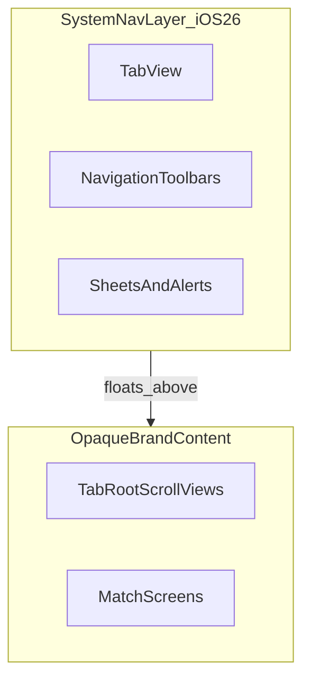
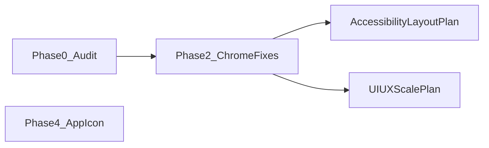

# iOS 26 Liquid Glass (System Layer)

## Goal and constraints

You chose **system-layer adoption only** and **iOS 17+ deployment target**. That means:

- **In scope:** Let SwiftUI system chrome (`TabView`, `NavigationStack` toolbars, sheets, alerts, menus) pick up Liquid Glass when running on iOS 26 with the iOS 26 SDK.
- **Out of scope:** Custom `.glassEffect`, `GlassEffectContainer`, glass button styles on scoreboard CTAs, segmented controls, or scoring pads. No deployment-target bump to iOS 26.

CI is already aligned: [`.github/workflows/ci.yml`](.github/workflows/ci.yml) uses **Xcode 26.2** and **iPhone 17** simulator. The gap is intentional UI policy, not toolchain.

## Current conflicts with Liquid Glass

Dart Buddy’s scoreboard look is **opaque by design** ([`DesignSystem/README.md`](DesignSystem/README.md)) — that is correct for the **content layer**. Apple’s guidance is to stop fighting the **navigation layer** with custom opaque bar backgrounds ([Adopting Liquid Glass](https://developer.apple.com/documentation/TechnologyOverviews/adopting-liquid-glass)).

Known blockers today:

| Location | Issue |
|----------|-------|
| [`DesignSystem/Tokens/BrandChrome.swift`](DesignSystem/Tokens/BrandChrome.swift) | `brandSettingsScreenChrome` sets opaque `.toolbarBackground(screenBackground, for: .navigationBar)` — overrides system glass |
| [`Features/Onboarding/OnboardingFlowView.swift`](Features/Onboarding/OnboardingFlowView.swift) | `.toolbarBackground(.hidden, for: .navigationBar)` — hides system nav material |
| [`App/MainTabView.swift`](App/MainTabView.swift) | No explicit tab-bar customization (good); verify nothing else wraps the tab bar |
| [`Resources/Media.xcassets/AppIcon.appiconset/`](Resources/Media.xcassets/AppIcon.appiconset/Contents.json) | Single flat 1024 PNG — iOS 26 expects **layered** icons via Icon Composer |

**Keep unchanged (by design):**

- `.brandScoreboardChrome` opaque `Brand.background` on Play/Modes/Players/Activity tabs — content sits beneath floating nav ([`App/MainTabView.swift`](App/MainTabView.swift))
- Match screens that hide tab bar / nav bar (gameplay focus)
- `BrandSegmented`, `PrimaryActionButton`, `ScoringPadKey`, card fills — not navigation chrome



## Phase 0 — Baseline audit (read-only)

Run the app on **iOS 26 / iPhone 17** simulator (local + CI destination) and capture a matrix:

- All 5 tabs (light + dark + system appearance)
- Settings (light native Form vs dark brand palette)
- Onboarding full-screen cover
- Pushed detail screens with inline nav titles (`PlayerDetailView`, `MatchHistoryDetailScreen`, rules guide)
- Sheets (player edit, rules, share)

Store screenshots under `marketing-screenshots/ios26-audit/` (or extend existing capture scripts). Note: legibility at scroll edges, tab bar overlap, settings row contrast against glass nav.

**Deliverable:** short audit doc listing pass/fail per screen before code changes.

## Phase 1 — Centralize iOS 26 navigation policy

Add a small policy helper in DesignSystem (e.g. [`DesignSystem/Tokens/SystemNavigationPolicy.swift`](DesignSystem/Tokens/SystemNavigationPolicy.swift)):

```swift
enum SystemNavigationPolicy {
    static var usesSystemLiquidGlassNav: Bool {
        if #available(iOS 26, *) { return true }
        return false
    }
}
```

Use this from chrome modifiers so feature screens never sprinkle `#available` checks.

## Phase 2 — Unblock system Liquid Glass in chrome modifiers

### 2a. Settings chrome ([`BrandChrome.swift`](DesignSystem/Tokens/BrandChrome.swift))

Update `BrandSettingsScreenChrome`:

- **iOS 17–25:** keep current behavior (opaque toolbar + `toolbarColorScheme` for brand palette)
- **iOS 26+:** keep content `background(screenBackground)` but **remove** `.toolbarBackground(...)` and `.toolbarBackground(.visible, ...)` so the nav bar uses system Liquid Glass
- Keep `brandSettingsFormChrome` / `scrollContentBackground(.hidden)` for dark brand rows — that affects Form **content**, not the nav bar

Validate Settings in all three appearance modes; dark brand rows must remain readable when scrolling under a glass nav bar (Apple’s scroll-edge effect should handle this if we don’t override it).

### 2b. Onboarding ([`OnboardingFlowView.swift`](Features/Onboarding/OnboardingFlowView.swift))

- **iOS 26+:** drop `.toolbarBackground(.hidden, for: .navigationBar)`; rely on system bar over onboarding content
- **iOS 17–25:** keep hidden toolbar if it still looks correct on older OS

Onboarding uses `preferredColorScheme` from preferences — retest light/dark.

### 2c. Tab shell ([`MainTabView.swift`](App/MainTabView.swift))

No custom tab-bar background to remove. Optional iOS 26-only enhancement (test after chrome fixes):

```swift
if #available(iOS 26, *) {
    // .tabBarMinimizeBehavior(.onScrollDown)
}
```

**Defer** `.tabViewStyle(.sidebarAdaptable)` unless iPad sidebar behavior is explicitly desired — it changes IA on regular width.

Apply `.tabBarMinimizeBehavior` only on scroll-heavy tabs (Activity, Players) and coordinate with [`TabRootScrollChrome`](DesignSystem/Components/TabRootScrollChrome.swift) / [`GameplayLayout.tabScrollBottomPadding`](DesignSystem/Components/GameplayLayout.swift) so AXXXL content still clears a minimized/restored tab bar.

## Phase 3 — Verify standard presentations

Quick pass on screens that use native navigation (no custom chrome today):

- [`Features/Players/PlayerDetailView.swift`](Features/Players/PlayerDetailView.swift)
- [`Features/History/MatchHistoryDetailScreen.swift`](Features/History/MatchHistoryDetailScreen.swift)
- [`Features/Play/Rules/GameRulesGuideView.swift`](Features/Play/Rules/GameRulesGuideView.swift)
- [`Features/Play/Shared/MatchSummaryScreen.swift`](Features/Play/Shared/MatchSummaryScreen.swift)

Confirm no new `toolbarBackground`, `UINavigationBarAppearance`, or `UITabBarAppearance` overrides are introduced. Sheets/alerts should remain stock SwiftUI.

## Phase 4 — App icon (parallel design workstream)

Current asset is a single [`AppIcon.png`](Resources/Media.xcassets/AppIcon.appiconset/Contents.json). iOS 26 Home Screen icons use **layered** designs (light / dark / clear / tinted variants).

1. Rebuild icon in **Icon Composer** (Xcode 26) with foreground/middle/background layers
2. Export into `AppIcon.appiconset` (or `.icon` asset if project adopts it)
3. Preview on device with clear/tinted Home Screen styles

This is independent of in-app UI but required for a polished iOS 26 store presence.

## Phase 5 — Accessibility and regression testing

Extend existing WCAG harness ([`Tests/UI/WCAGAccessibilityUITests.swift`](Tests/UI/WCAGAccessibilityUITests.swift)) with iOS 26 simulator settings:

| Setting | Why |
|---------|-----|
| **Reduce Transparency** | System replaces glass with opaque fallbacks — gameplay and settings must stay usable |
| **Increase Contrast** | Nav labels/icons on glass must remain readable |
| **Reduce Motion** | Tab minimize / morph animations degrade gracefully |
| **Dynamic Type AXXXL** | Tab bar + scroll padding still clear last rows |

Re-run marketing capture scripts after visual changes; update [`docs/release/release_checklist.md`](docs/release/release_checklist.md) with “verify on iOS 26 simulator + Liquid Glass appearance settings.”

**Explicit non-goals for tests:** No assertions that scoring pads or cards look “glass” — they should remain opaque.

## Phase 6 — Documentation and spec updates

- [`DesignSystem/README.md`](DesignSystem/README.md) — add **Navigation vs content layer** rule: glass is system-only; Brand tokens stay opaque for scoreboard surfaces
- [`specs/AppShellSpec.md`](specs/AppShellSpec.md) (and [`specs/TechStackSpec.md`](specs/TechStackSpec.md) if present) — note iOS 17+ min, iOS 26 system nav behavior, Icon Composer requirement
- Apply chrome policy to [`ActivityRootView`](Features/Activity/ActivityRootView.swift) / [`ModesRootView`](Features/Modes/ModesRootView.swift) per [`docs/ux-scale-tab-restructure-plan.md`](docs/ux-scale-tab-restructure-plan.md) — do **not** reintroduce opaque toolbar backgrounds on iOS 26

## Sequencing with other plans



1. **Do Phase 0–2 first** — small, centralized diff in `BrandChrome` + onboarding
2. **Merge accessibility tab padding** ([`TabRootScrollChrome`](DesignSystem/Components/TabRootScrollChrome.swift)) before enabling `tabBarMinimizeBehavior`
3. **Apply same chrome rules** when Activity/Modes tabs ship — one policy, no per-feature drift
4. **App icon** can proceed in parallel (design/asset work)

## Success criteria

- On iOS 26: tab bar and standard nav bars render with system Liquid Glass; scoreboard tabs and match UI look the same as today (opaque Brand surfaces)
- On iOS 17–25: no visual regression from conditional branches
- Settings + onboarding readable with Reduce Transparency and Increase Contrast
- Layered app icon passes Icon Composer preview for light/dark/clear/tinted
- CI (Xcode 26.2) green; new audit screenshots checked in or captured via script

## Risk notes

- **Settings dark brand mode** is the highest-risk screen — opaque toolbar removal may expose contrast issues on the first row under a glass bar; fix with scroll-edge behavior, not by re-adding opaque toolbar on iOS 26
- **Do not** add custom `.glassEffect` as a workaround — conflicts with system-only scope and Apple’s “avoid overusing Liquid Glass” guidance
- **`preferredColorScheme` on `TabView`** ([`MainTabView.swift`](App/MainTabView.swift)) may tint system glass; keep but verify it doesn’t clash with user’s iOS 26 “clear vs tinted” glass preference
