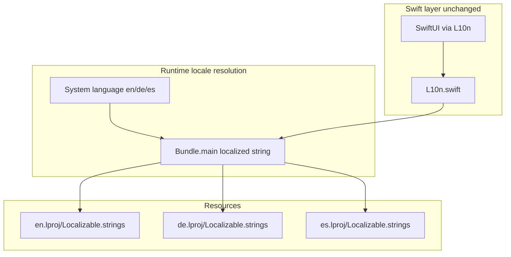

# Spanish Localization (es)

## Baseline (local `master`)

- Current HEAD: `bb3ac89` — English + German at full parity, including Training Partner keys.
- Source of truth: [`Resources/en.lproj/Localizable.strings`](Resources/en.lproj/Localizable.strings) — **494 keys**
- Reference implementation: German wave 1 ([`Resources/de.lproj/Localizable.strings`](Resources/de.lproj/Localizable.strings), [`Scripts/generate_de_localizable.py`](Scripts/generate_de_localizable.py))
- **No Swift changes** — [`Support/Localization/L10n.swift`](Support/Localization/L10n.swift) keys stay the same; iOS resolves `es` from system locale automatically.



---

## Step 1 — Branch from local master

```bash
git checkout master
git checkout -b feature/spanish-localization
```

Work from a clean `master` (stash or commit any in-progress DE generator edits first — working tree currently has unstaged changes to [`Scripts/generate_de_localizable.py`](Scripts/generate_de_localizable.py) and [`Resources/de.lproj/Localizable.strings`](Resources/de.lproj/Localizable.strings)).

---

## Step 2 — Project wiring

1. Add to [`project.yml`](project.yml) after the `de.lproj` entry:

```yaml
- path: Resources/es.lproj/Localizable.strings
  type: file
  buildPhase: resources
```

2. Regenerate Xcode project:

```bash
xcodegen generate
```

3. Verify `DartBuddy.xcodeproj/project.pbxproj` `knownRegions` includes `en`, `de`, `es` and `developmentRegion = en`.

---

## Step 3 — ES terminology glossary (neutral / international Spanish)

Draft a short EN→ES glossary before translating (same discipline as German). Spanish darts communities commonly keep English loanwords — pick one style per term and stay consistent.

| Domain | Recommended ES | Notes |
|--------|----------------|-------|
| Tab / nav | **Jugar**, **Jugadores**, **Estadísticas**, **Historial**, **Ajustes** | Used in smoke UI test; "Ajustes" matches iOS Settings convention |
| Double Out / Master Out | **Double out**, **Master out** | Widely used in steel-tip communities |
| Straight In / Double In | **Straight in**, **Double in** | Match EN hyphen style |
| Leg / Set / Checkout / Bust | **Leg**, **Set**, **Checkout**, **Bust** | Often kept; widely understood |
| Cricket, X01, MPR, Bull | Keep unchanged | Do-not-translate list |
| Bot tiers | Muy fácil, Fácil, Medio, Difícil, Pro | Keys `bot.difficulty.*` |
| Training Partner | **Compañero de entrenamiento** | Mirror DE `Trainingspartner` pattern for `trainingBot.*` |
| App title (`play.home.appTitle`) | **Dart Scoreboard** (unchanged) | DE kept "Dart-Scoreboard"; preserve brand consistency |

**Preserve** all format specifiers (`%@`, `%d`, `%.1f`, `%lld`, etc.) and `\n` line breaks. Short variants (`*.short`, setup hints) must stay shorter than full messages (see [`Tests/Unit/SetupValidationMessagesTests.swift`](Tests/Unit/SetupValidationMessagesTests.swift)).

**Translation priority** (same as German):

- P0: Gameplay (X01/Cricket pad, turn flow, summary, in-match errors)
- P1: Setup + Play home
- P2: History, Statistics, Players, Bots, Training Partner
- P3: Settings, migration recovery, about

---

## Step 4 — Strings + generator script

1. Create [`Scripts/generate_es_localizable.py`](Scripts/generate_es_localizable.py) by copying the structure of [`Scripts/generate_de_localizable.py`](Scripts/generate_de_localizable.py):
   - `EN_PATH` / `ES_PATH`
   - `ES: dict[str, str]` with all **494** values
   - Same `parse_entries`, `escape`, and **missing-key guard** (`raise SystemExit` if any EN key lacks ES)

2. Run generator to produce [`Resources/es.lproj/Localizable.strings`](Resources/es.lproj/Localizable.strings):

```bash
python3 Scripts/generate_es_localizable.py
```

3. Spot-check high-risk strings (same list as German):
   - `scoring.dart.*`, `scoring.segment.*` (VoiceOver)
   - Checkout suggester tokens (`scoring.checkout.*`)
   - `play.setup.chip.accessibilityFormat`
   - `bot.namePrefixFormat`, `bot.rosterNameFormat`, `trainingBot.nameFormat`
   - Compound plurals: `history.config.*`, `match.config.*Plural`

**Future PR rule:** new English keys must update **en + de + es** (and `nl` if Dutch lands separately).

---

## Step 5 — Tests

### Unit: extend [`Tests/Unit/LocalizationParityTests.swift`](Tests/Unit/LocalizationParityTests.swift)

Add parallel tests for `es` (reuse existing `keys(from:)`, `entries(from:)`, specifier regex):

- `@Test("Spanish and English Localizable.strings share the same keys")`
- `@Test("Format specifiers match per key between English and Spanish")`

Optionally refactor to a parameterized loop over `["de", "es"]` to avoid duplication — keep scope minimal.

### UI: add [`Tests/UI/SpanishLocalizationSmokeUITests.swift`](Tests/UI/SpanishLocalizationSmokeUITests.swift)

Mirror [`Tests/UI/GermanLocalizationSmokeUITests.swift`](Tests/UI/GermanLocalizationSmokeUITests.swift):

```swift
private var spanishLaunchArgs: [String] {
    ["-AppleLanguages", "(es)", "-AppleLocale", "es_ES"]
}
```

Assert tab bar labels:

- `Jugar`, `Jugadores`, `Estadísticas`, `Historial`, `Ajustes`
- Play setup: app title static text + `startMatchButton` accessibility id (not English copy)

Functional UI tests keep default English launch via [`Tests/UI/Support/DartBuddyUITestCase.swift`](Tests/UI/Support/DartBuddyUITestCase.swift).

### WCAG tests

[`Tests/Accessibility/WCAGAccessibilityLabelTests.swift`](Tests/Accessibility/WCAGAccessibilityLabelTests.swift) compares against `L10n.format(...)` — **no changes needed** for Spanish.

---

## Step 6 — Documentation

Update [`specs/LocalizationSpec.md`](specs/LocalizationSpec.md):

- Wave 2: Spanish (`es`) shipped; system locale only (no in-app picker)
- Baseline artifacts: add `Resources/es.lproj/Localizable.strings`
- PR rule: new keys must update **en + de + es**
- Testing section: parity tests cover de/es; add `SpanishLocalizationSmokeUITests`
- App Store Connect checklist for ES listing (manual, outside repo)

---

## Step 7 — Manual QA

Simulator → Settings → Language → Español (or launch args above).

| Area | Risk |
|------|------|
| Match setup chips | Longer ES copy in option rows |
| Tab bar | Label length (Estadísticas) |
| X01 / Cricket match | Turn banners, Double/Triple row |
| Statistics table | Column headers |
| Training Partner section | New strings on player detail |

Also test Dynamic Type **Large** and **Accessibility XL** on setup + match screens; VoiceOver spot-check scoring pad.

---

## Suggested commit / PR

Single PR on `feature/spanish-localization`:

1. `project.yml` + `xcodegen` + `es.lproj` + generator script
2. Extended parity tests + Spanish smoke UI tests
3. `LocalizationSpec.md` update

**Merge target:** `master`

---

## Acceptance criteria

- Device language Español → full UI in Spanish (no raw key names)
- `es.lproj` key set identical to `en.lproj` (494 keys)
- Format-specifier parity tests pass for en/de/es
- `SpanishLocalizationSmokeUITests` pass
- English and German locales unchanged
- Core flows manually verified: setup → X01 → summary → history → stats → settings → Training Partner

## Effort estimate

~4–7 dev days (494 keys + QA), reduced if using MT + native review for P0/P1 first.
