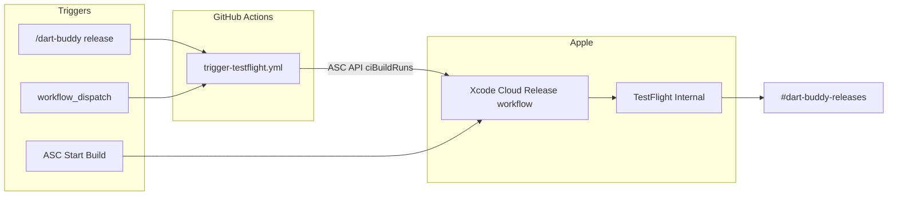

# TestFlight Automation via Xcode Cloud

## Goal

Automate **signed Release archive → TestFlight internal testing** using **Xcode Cloud** (25 free compute hours/month with Apple Developer Program). Keep existing [`.github/workflows/ci.yml`](.github/workflows/ci.yml) and [`.github/workflows/nightly-ui.yml`](.github/workflows/nightly-ui.yml) unchanged for verification.

**Trigger model (per your preference):** no automatic builds on push/tag. Start builds via:
1. **Slack** `/dart-buddy release` (primary)
2. **GitHub Actions** `workflow_dispatch` (fallback / debugging)
3. **App Store Connect / Xcode** Start Build button (escape hatch)

---

## Architecture decisions

| Decision | Choice | Rationale |
|----------|--------|-----------|
| Release platform | Xcode Cloud | Included with $99/yr membership; native signing + TestFlight |
| PR/nightly CI | GitHub Actions | Already working; avoid duplicate compute |
| Xcode Cloud auto-triggers | **Off** | Manual/Slack-only; saves compute hours |
| Archive scheme | `DartBuddy` (Release) | Full app target; not `DartBuddyCI` (tests-only scheme) |
| Firebase plist | Xcode Cloud **secret** env var | [`Resources/GoogleService-Info.plist`](Resources/GoogleService-Info.plist) is gitignored |
| Project generation | `ci_post_clone.sh` | [`DartBuddy.xcodeproj`](DartBuddy.xcodeproj) is gitignored; mirror GHA `xcodegen generate` |
| Build number | Xcode Cloud auto-versioning | Enable in workflow settings; increments from latest TestFlight build |
| Slack release notify | ASC native **Notify** post-action | Zero code per [`.cursor/plans/slack_integration.plan.md`](.cursor/plans/slack_integration.plan.md) Phase 3 |
| Slack trigger | GHA mediator + Cloudflare Worker | Worker holds GitHub PAT, not ASC JWT |

---

## Repo artifacts (implemented)

| File | Status |
|------|--------|
| [`ci_scripts/ci_post_clone.sh`](ci_scripts/ci_post_clone.sh) | Done |
| [`Scripts/ci/trigger-xcode-cloud.sh`](Scripts/ci/trigger-xcode-cloud.sh) | Done |
| [`.github/workflows/trigger-testflight.yml`](.github/workflows/trigger-testflight.yml) | Done |
| [`docs/release/xcode-cloud.md`](docs/release/xcode-cloud.md) | Done |
| [`workers/dart-buddy-slack/`](workers/dart-buddy-slack/) | Done (deploy pending) |

---

## Manual setup remaining

See [`docs/release/xcode-cloud.md`](docs/release/xcode-cloud.md):

1. App Store Connect API key → GitHub secrets
2. Xcode Cloud **Release** workflow (auto-builds off, TestFlight + Notify)
3. `GOOGLE_SERVICE_INFO_PLIST_BASE64` in Xcode Cloud environment
4. Deploy Slack Worker + configure `/dart-buddy` slash command

**GitHub secrets:** `APP_STORE_CONNECT_ISSUER_ID`, `APP_STORE_CONNECT_KEY_ID`, `APP_STORE_CONNECT_PRIVATE_KEY`, `XCODE_CLOUD_WORKFLOW_ID`

---

## Combined with Slack integration

- Phase 3 release notify: ASC **Notify** → `#dart-buddy-releases`
- Phase 4 trigger: [`workers/dart-buddy-slack/`](workers/dart-buddy-slack/) → `trigger-testflight.yml`
- Full Slack plan: [`.cursor/plans/slack_integration.plan.md`](.cursor/plans/slack_integration.plan.md)
