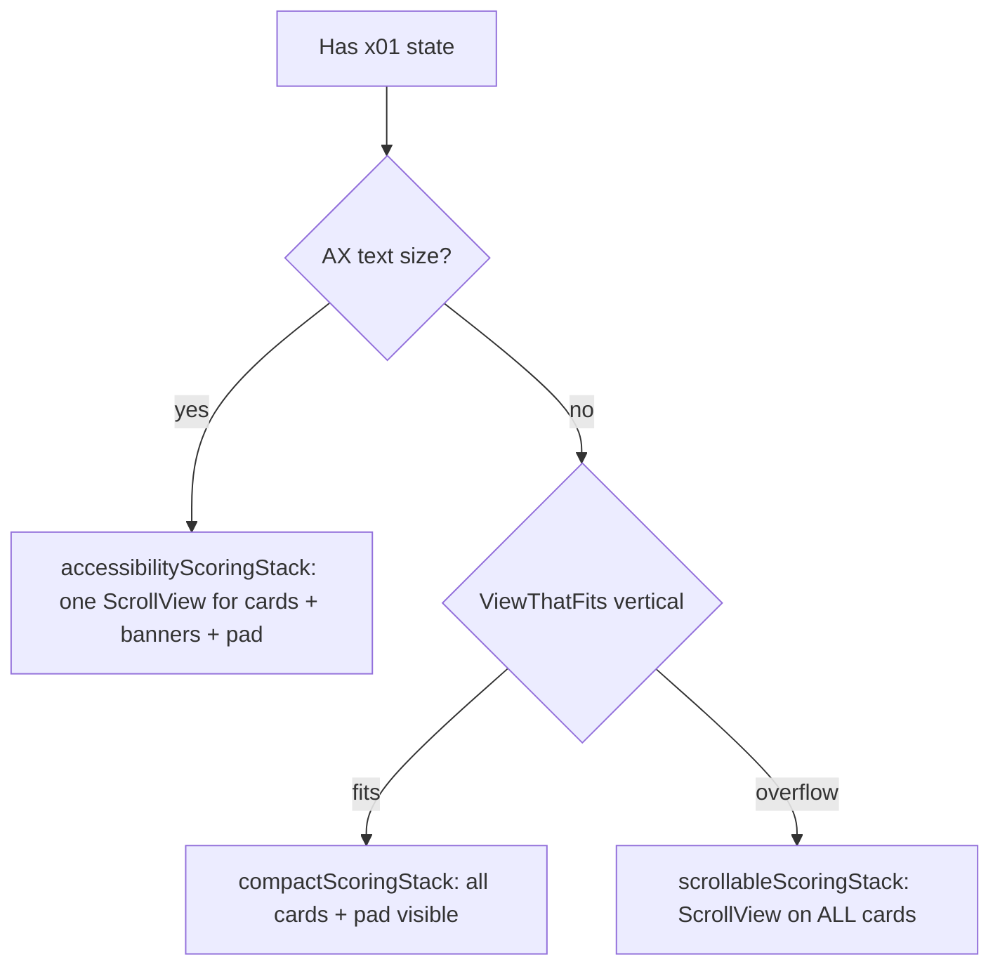
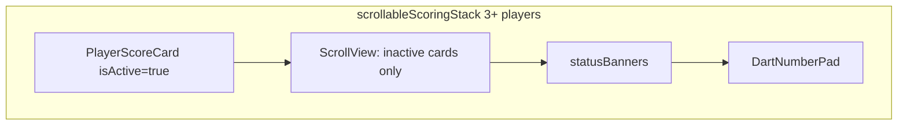

# X01 pinned active player (no animation)

## Problem

[`X01MatchScreen.swift`](Features/Play/X01/X01MatchScreen.swift) chooses layout via `ViewThatFits`:



In **`scrollableScoringStack`**, every `PlayerScoreCard` lives inside one `ScrollView`. With 3+ players in landscape, the active card (often last in turn order) is off-screen above the pad — users scroll to see whose turn it is.

**Out of scope for this slice:** accessibility (`accessibilityScoringStack`) — AX needs cards + pad in one scroll to avoid clipping; pinning only the active card there would still leave the pad scrollable and is a separate layout pass.

## Recommended behavior

| Condition | Layout |
|-----------|--------|
| AX text size | Unchanged (`accessibilityScoringStack`) |
| Non-AX, `ViewThatFits` → compact | Unchanged (all cards fit) |
| Non-AX, `ViewThatFits` → scrollable **and** `playerCards.count >= 3` | **Pinned:** active card fixed above `ScrollView` of inactive cards only |
| Non-AX scrollable, 2 players | Unchanged (pinning adds little; user pain is 3rd+ in order) |

No animation: SwiftUI swaps the pinned card on `currentPlayerIndex` change (same as today).



## Implementation

### 1. Centralize card rendering in `X01MatchScreen`

Add a small private helper (keeps identifiers and padding consistent):

```swift
@ViewBuilder
private func playerScoreCard(_ card: X01MatchViewModel.PlayerCard) -> some View {
    PlayerScoreCard(
        name: card.name,
        score: card.score,
        // ... existing fields from playerCardsStack
    )
}
```

Refactor [`playerCardsStack`](Features/Play/X01/X01MatchScreen.swift) to `ForEach` + `playerScoreCard(card)`.

### 2. Split active vs inactive in scrollable stack only

Replace the scrollable branch body:

- `let cards = viewModel.playerCards`
- If `cards.count >= 3`, `let active = cards.first(where: \.isActive)`:
  - Render `playerScoreCard(active)` **outside** `ScrollView` with same horizontal padding as today
  - `ScrollView` contains only `cards.filter { !$0.isActive }` (or `filter { $0.id != active.id }`)
- Else: keep current single `ScrollView` + full `playerCardsStack` (2-player landscape edge case)

`compactScoringStack` and `accessibilityScoringStack` stay as-is.

### 3. Optional: layout gate in `GameplayLayout`

Add to [`GameplayLayout.swift`](DesignSystem/Components/GameplayLayout.swift):

```swift
static func usesPinnedActiveX01PlayerCard(playerCount: Int, dynamicTypeSize: DynamicTypeSize) -> Bool {
    playerCount >= 3 && !usesAccessibilityMatchScoringLayout(dynamicTypeSize: dynamicTypeSize)
}
```

Use in `scrollableScoringStack` so the rule is documented and testable in one place.

### 4. No ViewModel changes

[`playerCards`](Features/Play/X01/X01MatchViewModel.swift) already exposes `isActive` per engine order. Order of inactive cards in the scroll region can remain turn order (readable context); only the active card moves to the pinned slot.

### 5. Accessibility contract (preserve)

[`PlayerScoreCard`](Features/Play/X01/PlayerScoreCard.swift) already exposes:

- `scoreCard_active` on the active row only
- Combined VO label includes `play.x01.turn.active` when `isActive`

Pinned layout must keep **exactly one** active card with those identifiers — satisfied by rendering active only in the pinned slot, not in the scroll list.

VO reading order becomes: pinned active card → inactive cards (scroll) → banners → pad. Update [`accessibility/wcag-2.1-aa/screens/x01-match.md`](accessibility/wcag-2.1-aa/screens/x01-match.md) P-1.3.2 note (expected order improved for 3+ scroll case).

## Testing

| Layer | Action |
|-------|--------|
| **Regression** | Run existing [`X01MatchUITests`](Tests/UI/X01MatchUITests.swift) and [`WCAGAccessibilityUITests`](Tests/UI/WCAGAccessibilityUITests.swift) X01 pad/score contracts — identifiers unchanged |
| **New UI test** | Add `startThreePlayerX01Match` to [`UITestMatchSetupHelpers.swift`](Tests/UI/Support/UITestMatchSetupHelpers.swift) (mirror cricket helper), then a test that rotates to landscape (XCUIDevice orientation) or relies on scrollable path, asserts `scoreCard_active` exists without scrolling before scoring |
| **Manual** | 3–4 player match, landscape: active card visible while pad usable; advance turn and confirm pinned card updates; 2-player portrait unchanged |

Optional screenshot refresh: [`accessibility/wcag-2.1-aa/evidence/orientation/`](accessibility/wcag-2.1-aa/evidence/orientation/) if you maintain the release matrix.

## Spec touch-up (light)

- [`specs/X01GameSpec.md`](specs/X01GameSpec.md) §11 or UI bullet: scrollable 3+ layout pins active player card
- [`accessibility/wcag-2.1-aa/screens/x01-match.md`](accessibility/wcag-2.1-aa/screens/x01-match.md): P-1.4.10 / P-1.3.4 partial → note pinned behavior

## Follow-up (not in this PR)

- **AX 3+ layout:** pin active card + keep pad in scroll (or sticky pad via `safeAreaInset`) if AX landscape testing shows same scroll pain
- **Animated hero card:** only if pinned static row is insufficient after dogfooding

## Risk summary

| Risk | Mitigation |
|------|------------|
| Duplicate active card in scroll + pin | Filter inactive list explicitly |
| 2-player scrollable landscape unchanged | `count >= 3` gate |
| UI tests assume one scroll region | New 3-player test targets pinned path |
