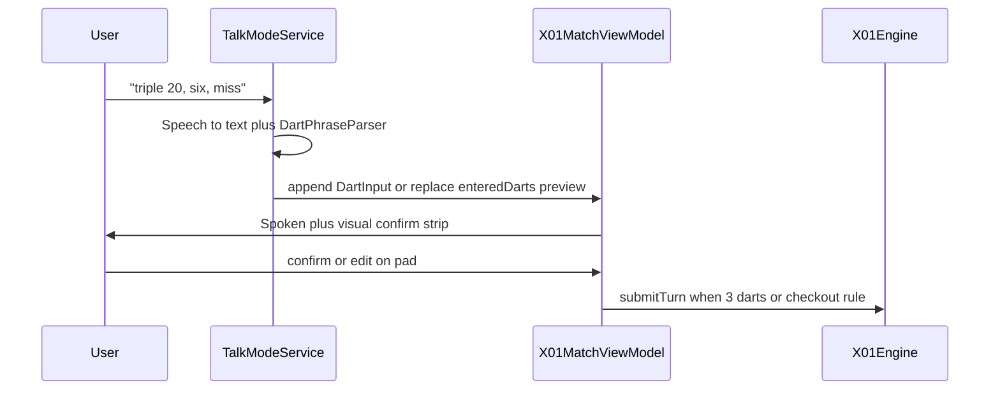

# Talk Mode (Voice Scoring Input) — Assessment

**Status:** R&D / post-1.0  
**Product name:** Talk Mode  
**Not the same as:** Turn total **caller** (output) — [`SpeechTurnTotalCallerService`](Support/Services/FeedbackServices.swift) already speaks visit totals after submit. Talk Mode is **input**: speak darts at the oche without tapping the pad.

---

## Executive summary

| Dimension | Rating | Notes |
|-----------|--------|-------|
| **Overall difficulty** | **Medium–high** | Parser + UX + permissions; engines unchanged if utterances map to `DartInput`. |
| **MVP (X01 only, en-US, confirm-before-submit)** | **1–2 weeks** | On-device `Speech` framework, Settings toggle, live transcript + editable visit strip. |
| **Polished v1 (Cricket, locales, noise, a11y QA)** | **+2–3 weeks** | Segment vocabulary, pub noise, Voice Control overlap testing. |
| **Risk** | **Medium** | Mis-hears near checkout/bust; users must trust but verify. |

**Bottom line:** Talk Mode is a strong **accessibility and ergonomics** bet: eyes and hands stay on the board while the phone listens. It complements (does not replace) the number pad, Dynamic Type layouts, and future vision scoring. Always ship with **visual confirmation** of parsed darts before auto-submit.

---

## Product intent (locked)

While throwing, the player says a visit in natural dart language, for example:

- `triple 20, six, miss` → T20, S6, miss (0)
- `twenty, twenty, twenty` → three singles (or allow `60` as turn-total mode — **defer**; dart-by-dart first)
- `double bull`, `miss`, `zero` → map to existing `DartInput` / miss semantics

After the **third dart** (or checkout/bust rules), behavior matches today: auto-submit when visit complete ([`X01MatchScreen`](Features/Play/X01/X01MatchScreen.swift) `autoSubmitIfNeeded`).

**Out of scope for v1:** free-form turn totals only (`"score 60"`) without dart breakdown — keep one input model aligned with event schema.

---

## Why it fits accessibility

| Benefit | Detail |
|---------|--------|
| **Hands-free at the oche** | No walking to the phone between darts; helps mobility and low vision users who still aim at the board. |
| **Consistent vocabulary** | Reuse [`DartInput.spokenAccessibilityName`](Domain/Scoring/DartInput.swift) phrases (`Triple 20`, `Miss`, …) for **confirmation TTS** so heard output matches VoiceOver labels. |
| **Pad remains fallback** | Required for noisy venues, rejected permissions, and users who prefer touch. |
| **Different from Blind / vision** | Lower hardware bar than camera; useful when board is visible but screen is not. |

**Caveats (design, not blockers):**

- Not a substitute for **VoiceOver** navigation — Talk Mode is an optional scoring channel during an active human turn.
- Pub **ambient noise** → expect errors; confirmation UI and one-tap undo are mandatory.
- **Deaf/HoH players** may not use it — pad + visual board input remain first-class.
- **Privacy:** mic permission copy must state on-device recognition (if using Apple Speech on-device where available).

---

## Architecture sketch

### Components (new)

| Piece | Responsibility |
|-------|----------------|
| `DartPhraseParser` | Map token stream → `[DartInput]`; synonyms: `zero`/`miss`/`outside`, `bull`/`double bull`/`inner bull`, `t`/`triple`, `d`/`double` |
| `TalkModeListeningService` | `SFSpeechRecognizer` lifecycle, partial results, locale from app language |
| `TalkModeCoordinator` | Only active when `canHumanInput`, match in progress, Settings enabled |
| Settings | `talkModeEnabled`, optional `talkModeConfirmBeforeSubmit` (default true for MVP) |

Wire into X01 first via existing `enteredDarts` binding on `DartNumberPad` — no engine fork.

### Cricket v2

Cricket pad uses segment + multiplier marks; parser extends to `twenty` (one mark on 20), `triple nineteen`, etc. Reuse cricket target vocabulary from [`CricketTapPad`](Features/Play/Cricket/CricketBoardView.swift).

---

## Parser rules (recommended v1)

| Spoken | `DartInput` |
|--------|-------------|
| `miss`, `zero`, `outside`, `no score` | miss |
| `20` / `twenty` | S20 |
| `double 20`, `d20` | D20 |
| `triple 20`, `t20`, `treble 20` | T20 |
| `25`, `outer bull`, `single bull` | outer bull single |
| `50`, `bull`, `double bull`, `inner bull` | inner bull (confirm house rule in UI once) |

**Disambiguation:** On low confidence, show chip “Did you mean Triple 20?” rather than silent wrong entry.

**Advance turn:** After third parsed dart, call same submit path as pad; optionally speak back visit total (reuse turn total caller).

---

## Feature flag and spec promotion

- Gate: `enableTalkMode` in [`FeatureFlag`](Support/FeatureFlags/FeatureFlag.swift) (default `false`).
- When scheduled: promote to `specs/TalkModeSpec.md` per [`SpecGovernance.md`](specs/SpecGovernance.md).

---

## Testing

| Layer | Focus |
|-------|--------|
| Unit | `DartPhraseParser` token cases, locale-insensitive number words en-US |
| UI | Mic permission denied → pad only; three-dart auto-submit; undo last dart |
| Manual a11y | VoiceOver on + Talk Mode on; confirm strip readable at AX sizes |
| Field | Pub noise sample (expect failure → pad) |

---

## Suggested delivery order

1. X01 + en-US + confirm strip + Settings toggle  
2. Optional “listen between darts” vs “say full visit” modes  
3. Cricket  
4. Localized phrase packs (`de`/`es`/`nl`)  
5. Campaign / practice hooks if those modes exist  

**Related:** [`AutoScoringVisionSpec.md`](specs/AutoScoringVisionSpec.md) (camera), [`accessibility/accessibility_todo.md`](../accessibility/accessibility_todo.md), [`X01GameSpec.md`](specs/X01GameSpec.md) §11 voice scoring.
