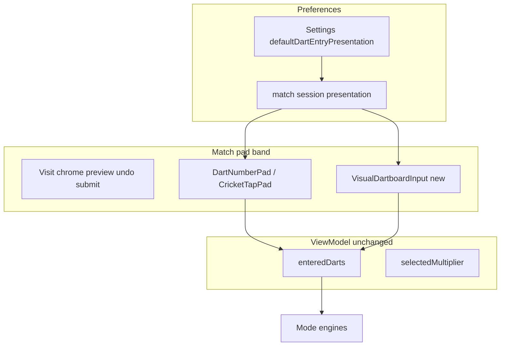

# Visual Dartboard Input — Assessment

**Status:** R&D / post-1.0 (not a completed spec)  
**Product name:** Visual board (working title)  
**Not the same as:**
- **Cricket scoreboard** — [`CricketBoardView`](Features/Play/Cricket/CricketBoardView.swift) is the marks grid (20–15 + bull), not a throw-entry surface.
- **Vision auto-scoring** — camera detection in [`AutoScoringVisionSpec.md`](../specs/AutoScoringVisionSpec.md).
- **Talk Mode** — voice input in [`talk-mode.md`](talk-mode.md).

---

## Executive summary

| Dimension | Rating | Notes |
|-----------|--------|-------|
| **Domain / engines** | **Low** | Map taps → existing [`DartInput`](Domain/Scoring/DartInput.swift); no rule changes if bindings stay the same. |
| **UI / layout** | **High** | Circular control inside [`MatchScoringBody`](../DesignSystem/Components/MatchScoringBody.swift) across phone, iPad, landscape, and Dynamic Type. |
| **Accessibility** | **Medium–high** | Pad must remain first-class; force pad fallback at accessibility text sizes. |
| **MVP (X01 + Cricket, pad toggle, Settings default)** | **~2–3 weeks** | `BoardHitResolver`, `VisualDartboardInput`, in-match presentation switch, persistence. |
| **Full mode matrix (Killer, segment-locked party modes)** | **+2 weeks** | Locked wedges, UI tests, WCAG evidence. |
| **Risk** | **Medium** | Mis-taps near ring boundaries; very small phones (SE). |

**Bottom line:** Strong ergonomics option for players who think in board geography. Treat as a **presentation swap** behind the same ViewModel bindings (`enteredDarts`, `selectedMultiplier`) — not a new scoring pipeline. Promote to `specs/VisualDartboardInputSpec.md` when scope and open questions below are locked.

---

## Product intent (draft)

Optional **circular, touchable dartboard** where the user enters throws by tapping wedge + ring (and bull zones), instead of the number pad ([`DartNumberPad`](Features/Play/X01/DartNumberPad.swift) / [`CricketTapPad`](Features/Play/Cricket/CricketBoardView.swift)).

Example flow (recommended MVP interaction):

1. Tap **T** (sticky modifier, same as pad today).
2. Tap wedge **20** → commits `T20`.
3. Third dart → same auto-submit path as pad.

**Out of scope for v1 (draft):**

- X01 **total entry** (`totalEntry`) on visual board — incompatible with per-dart geometry.
- Camera / vision, voice (Talk Mode), Watch input.
- Replacing Cricket **marks scoreboard** — visual board lives in the **pad band** only.

---

## Terminology (keep distinct in specs)

| Term | Values | Notes |
|------|--------|-------|
| **Dart entry mode** | `totalEntry` \| `dartEntry` | X01 semantic only ([`ScoringInputMode`](../Features/Play/X01/X01MatchViewModel.swift)); 1.0 uses per-dart only. |
| **Dart entry presentation** | `numberPad` \| `visualBoard` | **New** — how the user builds `enteredDarts`. |
| **Input channel** (analytics / future online) | `manualPad` \| `manualBoard` \| `voice` \| `vision` \| `watch` | Align naming with [`AutoScoringVisionSpec.md`](../specs/AutoScoringVisionSpec.md) `inputMethod`. |

UI copy: extend existing **Input mode** / **Scoring input** strings ([`scoring.inputMode`](../Resources/en.lproj/Localizable.strings)); avoid overloading “board” in Cricket (scoreboard vs dartboard).

---

## Settings & in-match control (draft)

### Global default

New `SettingsRecord` field (e.g. `defaultDartEntryPresentation`):

| Value | Meaning |
|-------|---------|
| `numberPad` | **Default** — shipped behavior |
| `visualBoard` | Circular board where supported |

- **Section:** During Play (or future **Scoring** subsection) — see [`SettingsSpec.md`](../specs/SettingsSpec.md).
- Applies to **new** matches; changing in Settings does not mutate an active match mid-flight.

### In-match switch (user-requested)

Players should change presentation **during a game** without leaving the match.

**Draft entry:** match header overflow or “Scoring input…” sheet.

| Control | Behavior |
|---------|----------|
| Segmented picker | Number pad \| Visual board |
| Switch with empty visit | Apply immediately |
| Switch with darts in progress | Confirm → clear `enteredDarts`, reset multiplier to single |
| Bot turn / submitting | Disabled |
| Resume | Restore presentation from match session / snapshot |

Optional v1.1: per-match override at setup (prefill from Settings), same pattern as callout voice in [`CalloutVoicesSpec.md`](../specs/CalloutVoicesSpec.md).

---

## Interaction model (recommended MVP)

Reuse **sticky S / D / T** row from [`ScoringInputSpec.md`](../specs/ScoringInputSpec.md) — modifier selects ring; wedge tap selects segment.

| Action | `DartInput` |
|--------|-------------|
| S + wedge 20 | S20 |
| D + wedge 16 | D16 |
| T + wedge 20 | T20 |
| D + outer bull zone | Outer bull (25) |
| D + inner bull zone | Inner bull (50) — match existing [`DartInput`](Domain/Scoring/DartInput.swift) rules |
| Miss button (explicit, outside circle) | miss |

**Defer:** two-step “tap wedge then tap ring” — higher error rate and harder VoiceOver.

**Shared chrome:** visit preview, undo, submit — same bindings as pad; cap 3 darts per visit.

---

## Layout (draft)

Follow [`docs/gameplay-layout-modes.md`](../docs/gameplay-layout-modes.md) and [`MatchScoringBody`](../DesignSystem/Components/MatchScoringBody.swift):

| Context | Draft behavior |
|---------|----------------|
| iPhone portrait | Board in bottom pad region; scoreboard scrollable above |
| iPhone landscape | Full-width board below active band (Cricket landscape precedent) |
| iPad side-by-side | Board in fixed pad column (~420pt), same as number pad |
| Accessibility text (AX1–AX5) | **Force number pad** via [`GameplayLayout`](../DesignSystem/Components/GameplayLayout.swift) |

### Segment-locked modes (later phase)

Baseball / Shanghai: highlight `lockedSegment` on board; disable other wedges — reuse pad’s `lockedSegment` API on [`DartNumberPad`](Features/Play/X01/DartNumberPad.swift).

### Cricket full 1–20 vs scoring targets

**Open question:** Show full clock with 1–14 dimmed (no marks), or only 15–20 + bull? Full clock matches mental model; partial board saves space.

---

## Architecture sketch

### New components (draft)

| Piece | Responsibility |
|-------|----------------|
| `VisualDartboardInput` | SwiftUI board + modifier row; same bindings as pad |
| `BoardHitResolver` | Pure geometry: point + layout + modifier → `DartInput?` (unit-tested, no SwiftUI) |

Wire X01 and Cricket first; no engine fork.

---

## Accessibility (draft policy)

| Requirement | Draft |
|-------------|-------|
| Pad fallback | Mandatory at AX text sizes; optional user preference always |
| Touch targets | 44×44 pt minimum per control at default Dynamic Type; 52×52 preferred where possible |
| VoiceOver | Per-wedge elements with full names (`Triple 20`, not `T20` only) — see [`AccessibilitySpec.md`](../specs/AccessibilitySpec.md) |
| Color | Selected wedge/modifier: outline + label |
| WCAG evidence | New screen checklist when promoted (e.g. `visual-dartboard-match.md`) |

Visual board is a **sighted-user enhancement**; pad stays first-class (same principle as Talk Mode pad fallback).

---

## UI test identifiers (draft)

When implemented, extend [gameplay-ui-test-identifiers](../.cursor/rules/gameplay-ui-test-identifiers.mdc):

| Element | Identifier |
|---------|------------|
| Board root | `board_input_root` |
| Wedge | `board_seg_{n}_{s\|d\|t}` |
| Bull | `board_bull_outer`, `board_bull_inner` |
| Miss | `board_miss` |
| Presentation picker | `match_scoringPresentationPicker` |

Existing `pad_*` / `cricket_*` identifiers unchanged.

---

## Mode phasing (draft)

| Phase | Modes |
|-------|-------|
| A | X01, Cricket |
| B | Killer |
| C | Baseball, Shanghai (segment-locked) |
| Defer | Guided Practice (audio-first; pad only) |

---

## Open questions (resolve before spec promotion)

1. In-match control: overflow menu vs persistent chip in pad chrome?
2. Cricket: full 1–20 clock vs 15–20-only diagram?
3. iPhone SE: minimum device support or graceful “use number pad” prompt?
4. Visual style: flat schematic vs branded dartboard motif ([`docs/ux-design-review.md`](../docs/ux-design-review.md) D3)?
5. Feature flag: `enableVisualDartboardInput` per [`FeatureFlagConfigSpec.md`](../specs/FeatureFlagConfigSpec.md)?

---

## Spec promotion checklist

When ready to implement, create **`specs/VisualDartboardInputSpec.md`** and add short cross-refs only (no duplication) to:

- [`ScoringInputSpec.md`](../specs/ScoringInputSpec.md) — entry presentation axis
- [`SettingsSpec.md`](../specs/SettingsSpec.md) — default + During Play UI
- [`MatchSpec.md`](../specs/MatchSpec.md) — resume field
- [`DesignSystemSpec.md`](../specs/DesignSystemSpec.md) — component catalog
- [`docs/feature-inventory.md`](../docs/feature-inventory.md) — planned → shipped

Per [`SpecGovernance.md`](../specs/SpecGovernance.md).

---

## Testing (draft)

| Layer | Focus |
|-------|--------|
| Unit | `BoardHitResolver` wedge/ring/bull; locked segment; presentation switch clears visit |
| Integration | X01 checkout/bust; Cricket marks; resume restores `visualBoard` |
| UI | In-match toggle; landscape Pro Max; AXXXL forces pad |
| A11y | VoiceOver on modifier + board or fallback |

---

## Suggested delivery order

1. X01 + Cricket + Settings default + in-match sheet  
2. UI tests + WCAG spot check  
3. Killer  
4. Segment-locked party modes  
5. Per-match setup override (optional)

**Related:** [`ScoringInputSpec.md`](../specs/ScoringInputSpec.md), [`talk-mode.md`](talk-mode.md), [`AutoScoringVisionSpec.md`](../specs/AutoScoringVisionSpec.md), [`docs/gameplay-layout-modes.md`](../docs/gameplay-layout-modes.md).
