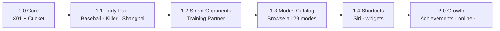

# Dart Buddy


**Dart Buddy** is a local-first iOS scorekeeper for X01 and Cricket darts. The Xcode target and Swift module are named **DartBuddy** (`import DartBuddy`).

Product behavior and UX contracts live under [`specs/`](specs/README.md). A cross-cutting **feature inventory** (shipped vs planned) lives at [`docs/feature-inventory.md`](docs/feature-inventory.md). This file is the repo entry point — not a second spec.

---

## Engineering

Dart Buddy is built as a **spec-driven, test-backed** iOS app: product rules live in `specs/`, domain logic stays pure, and CI enforces documentation parity with code.

### Architecture

| Layer | Role |
|-------|------|
| `Features/` | SwiftUI + MVVM per screen flow (Play, Activity, Players, Settings, Modes) |
| `Domain/` | Pure rules engines (`X01Engine`, `CricketEngine`, party engines), lifecycle, stats math, bot skill models |
| `Data/` | Repository protocols + SwiftData implementations |
| `Persistence/` | `SchemaV2` baseline, versioned migrations, container factory |
| `DesignSystem/` | Tokens, scoreboard chrome, shared scoring pad |
| `Support/` | Localization (`L10n`), logging → Firebase sinks, preferences, haptics/TTS |

Dependency flow is strict: **Features → Domain/Data interfaces → SwiftData**. Domain never imports SwiftUI or persistence frameworks. See [`specs/ArchitectureSpec.md`](specs/ArchitectureSpec.md).

### What we have built

Most of the long-term product surface is **implemented in code**; lean 1.0 intentionally **hides** anything that has not passed the device QA bar.

| Area | Built | In lean 1.0 app |
|------|-------|-----------------|
| **Game engines** | 22 shipped modes (Standard, Party, Co-op, Practice) — see [`docs/feature-inventory.md`](docs/feature-inventory.md) | X01 + Cricket only |
| **App shell** | 5-tab shell (Play · Modes · Players · Activity · Settings) | 4 tabs (Modes hidden) |
| **Bots** | Preset ladder, Training Partner, custom bots (tunable X01 avg / Cricket MPR) | Preset + custom |
| **Players & data** | CRUD, archive guards, DBPE export bundle, bootstrap store recovery | Export hidden |
| **Activity** | History + Statistics with shared filters, per-mode stat kinds (34 declared) | Shipped |
| **Platform hooks** | Deep links (`dartbuddy://v1/...`), App Intents (flagged off), Firebase Analytics + Crashlytics | Deep links internal only |
| **Catalog** | 34 modes in `GameModeCatalog` — 22 playable on `dev`, 12 stubs | Not exposed (lean picker: X01 + Cricket) |
| **Gamification (R&D)** | Achievement evaluator + service + repository (domain layer); Phase 1 catalog spec'd | Flagged off (`enableAchievements`) |

**Documentation coverage:** 27/31 feature checklist areas spec'd (gamification rows planned-only), 29/29 game modes spec'd, 26/26 system specs present — audited on every CI run (`Scripts/ci/documentation-summary.sh` → artifact). See [`documentation-summary.txt`](documentation-summary.txt) for the latest snapshot.

### Testing & CI

| Gate | What runs |
|------|-----------|
| **PR / push** | XcodeGen → `DartBuddyCI` scheme — unit + accessibility unit tests on iPhone 17 simulator |
| **Nightly** | Parallel UI matrix (`DartBuddyUISmoke`, `UIGameplay`, `UIAccessibility`, `UILocalization`, `UILandscape`, `UIChrome`) — `.github/workflows/nightly-ui.yml` |
| **Release branches** | `DartBuddyUILean` — lean `ProductSurface` smoke (`Lean1_0SmokeUITests`) |
| **Release** | Xcode Cloud archive → TestFlight (GHA **Trigger TestFlight**; Slack post-1.0 — [`docs/release/slack-integration.md`](docs/release/slack-integration.md)) |
| **Migrations** | V1→V2.0→V2.1 SwiftData migration tests in CI (`SchemaV2_0_0` → `SchemaV2` lightweight) |

Three Xcode unit/accessibility targets: `Tests/Unit/`, `Tests/Accessibility/`. UI tests split into seven targets under `Tests/UI/` (see [`specs/TestPlanSpec.md`](specs/TestPlanSpec.md) § UI suites). Marketing screenshot capture scripts live under `marketing-screenshots/` and `Scripts/`.

### Recent engineering work

Highlights from the current development arc:

- **Custom bots** — domain models, skill facets, `BotParticipantFactory`, match-setup wiring, advanced stat sliders
- **Lean 1.0 trim** — scope lock, marketing screenshots, gameplay layout polish (iPad landscape, checkout banner)
- **Gamification prep** — achievement domain layer (`AchievementEvaluator`, `DefaultAchievementService`), Phase 1 catalog ([`AchievementCatalogPhase1.md`](specs/AchievementCatalogPhase1.md)), `BotAchievementTierResolver`
- **Co-op Raid + Fleet** — playable on `dev` with full product surface; lean 1.0 still gates party/co-op from resume
- **Spec governance** — feature inventory, delete-all-data policy ([`DeleteAllDataSpec.md`](specs/DeleteAllDataSpec.md)), gamification specs ([`AchievementsSpec.md`](specs/AchievementsSpec.md))
- **Release train** — phased ship plan with test-confidence matrix ([`docs/release/ongoing-release-plan.md`](docs/release/ongoing-release-plan.md))
- **CI docs artifact** — automated spec/code gap report on every build

---

## Status — 1.0 RC (lean core)

**Now:** Finishing device QA evidence and App Store ops for a **small, well-tested** first release.

| | Lean 1.0 ships | Built but hidden until later |
|--|----------------|------------------------------|
| **Modes** | X01 + Cricket (Normal + Cut Throat) | 20 additional shipped engines (party, co-op Raid, practice drills) |
| **Tabs** | Play · Players · Activity · Settings | Modes catalog |
| **Bots** | Preset + custom | Training Partner |
| **Locale** | English only (`de`/`es`/`nl` files stay in repo) | In-app language picker |
| **Other** | Onboarding, rules sheet | Player export, App Intents |

**Telemetry:** Firebase Analytics + Crashlytics in Release builds with a real plist (allowlisted events only; off in Debug/CI unless opted in).

**Remaining for App Store:** Device QA on lean matrix, accessibility evidence, bootstrap store recovery smoke, English listing assets — [`docs/release/todo.md`](docs/release/todo.md) · [`roadmap/release/QA-Signoff-RC1.md`](roadmap/release/QA-Signoff-RC1.md).

---

## Roadmap

Strategy: **ship a narrow core, then widen in versioned slices** — each release has explicit in/out boundaries and a device QA bar. Full rationale: [`docs/release/ongoing-release-plan.md`](docs/release/ongoing-release-plan.md).



| Release | Focus |
|---------|-------|
| **1.0** *(now)* | Ad-free X01 & Cricket scorekeeper · 4 tabs · preset + custom bots |
| **1.1** | Party modes (Baseball, Killer, Shanghai) + device QA matrix |
| **1.2** | Training Partner bots · stats UX polish |
| **1.3** | Restore Modes tab · honest “coming soon” for 24 catalog stubs |
| **1.4** | App Intents on · widgets / Control Center · play reminders |
| **2.0** | Pick one primary growth bet: local achievements + Game Center, online play, next mode batch, talk mode, or Apple Watch |

**Post-1.0 specs (no ship date):** [`CampaignSpec.md`](specs/CampaignSpec.md) (Journey tab), [`OnlinePlaySpec.md`](specs/OnlinePlaySpec.md), [`AutoScoringVisionSpec.md`](specs/AutoScoringVisionSpec.md). Ideas live in [`FutureIdeas/`](FutureIdeas/).

---

## Getting started

Requirements: Xcode 16+, iOS 18+ deployment target, [XcodeGen](https://github.com/yonaskolb/XcodeGen) 2.44+.

```bash
brew install xcodegen   # if needed
xcodegen generate
open DartBuddy.xcodeproj
```

Copy `Resources/GoogleService-Info.plist.example` to `Resources/GoogleService-Info.plist` and replace placeholders with values from the [Firebase Console](https://console.firebase.google.com/) (Project settings → Your apps → iOS). The example uses bundle ID `com.jacobrozell.DartBuddy` — add or update the iOS app in Firebase to match before shipping. Keep the real plist at `Resources/` only (gitignored; run `sh Scripts/install-git-hooks.sh` once to block accidental commits).

> **App Store continuity:** Changing the bundle ID from `com.jacobrozell.DartsScoreboard` means a new App Store listing (not an in-place update). To keep the existing listing, set `PRODUCT_BUNDLE_IDENTIFIER` back to the old value in `project.yml` and regenerate.

**Analytics (1.0):** Release builds with a real `GoogleService-Info.plist` send a small allowlist of product-health events (`app_open`, `match_started`, `match_completed`, `turn_submitted`, `undo_used`, etc.) via the existing `AppLogger` → Firebase Analytics sink. Debug builds stay off unless you add the launch argument `-firebase_analytics_debug`. UI tests pass `-disable_firebase_analytics`.

**Crashlytics (1.0):** Release builds with a real plist also enable Firebase Crashlytics (native crashes + allowlisted non-fatal `error`/`fault` logger events). A **Firebase Crashlytics** run script uploads dSYMs on **Release** archives only (skipped for placeholder plist / CI). Debug stays off unless `-firebase_analytics_debug` (shared switch with analytics). Disable telemetry for local runs with `-disable_firebase_analytics` or UI tests with `-ui_test_reset`. To verify a test crash in Debug: add launch argument `-crashlytics_test_crash` (fatal; sends on next launch).

Run tests: **Product → Test** (`⌘U`), or:

```bash
# Unit + accessibility (matches PR CI)
xcodebuild test -scheme DartBuddyCI \
  -destination 'platform=iOS Simulator,name=iPhone 17'

# UI only (nightly matrix — one suite example)
xcodebuild test -scheme DartBuddyUIGameplay \
  -destination 'platform=iOS Simulator,name=iPhone 17'

# All UI suites except lean (local full UI pass)
xcodebuild test -scheme DartBuddyUI \
  -destination 'platform=iOS Simulator,name=iPhone 17 Pro Max'

# Everything (unit + UI)
xcodebuild test -scheme DartBuddy \
  -destination 'platform=iOS Simulator,name=iPhone 17'
```

> `DartBuddy.xcodeproj` is generated locally and not committed. Regenerate after pulling `project.yml` changes.

### CI

GitHub Actions (`.github/workflows/ci.yml`) runs on every push and pull request to `dev`, `master`, or `main`: Xcode 26.2, XcodeGen, `build-for-testing` then `test-without-building` on the `DartBuddyCI` scheme (unit + accessibility only) on an iPhone 17 simulator (`macos-26` runner). UI runs nightly via parallel matrix in `.github/workflows/nightly-ui.yml` (six suites on iPhone 17; landscape on iPhone 17 Pro Max). Locally: `xcodebuild test -scheme DartBuddyUIGameplay` for one UI suite, or `DartBuddyUI` / `DartBuddy` for broader runs.

**Branch model:** `dev` = full catalog; `release/*` = `ProductSurface` gating — [`docs/release/branch-strategy.md`](docs/release/branch-strategy.md).

**Release builds** use Xcode Cloud (archive → TestFlight internal), triggered on demand via GitHub Actions **Trigger TestFlight** (Slack `/dart-buddy` after post-1.0 Worker deploy) — not on every push. Setup: [`docs/release/xcode-cloud.md`](docs/release/xcode-cloud.md) · Slack plan: [`docs/release/slack-integration.md`](docs/release/slack-integration.md).

---

## What the app does

High-level summary only — authoritative rules are in feature specs:

- **X01** and **Cricket** (Normal + Cut Throat) with guided scoring, undo, **preset difficulty** bots, and **custom bots** (tunable X01 average / Cricket MPR)
- Match setup with roster selection, turn order, and mode-specific options (X01/Cricket chips on Play home)
- Resume in-progress matches; match summary on completion
- Player management (create, edit, archive, delete)
- **Activity** tab: match history + statistics with shared filters
- Settings: appearance, default game options, haptics, sound, bot pacing
- **English UI** in 1.0 (additional locales ship in a later release)

Post-1.0 (implemented but hidden in lean 1.0): Modes catalog tab, party modes, Training Partner bots, player export — see [`docs/feature-inventory.md`](docs/feature-inventory.md).

---

## Project layout

| Path | Role |
|------|------|
| `App/` | Entry point, dependency wiring, tab shell, navigation |
| `Features/` | Play, Activity, Players, Settings screens |
| `Domain/` | Rules engines, entities, business logic |
| `Data/` | Repository protocols and SwiftData implementations |
| `Persistence/` | Schema, migrations, container factory |
| `DesignSystem/` | Tokens, shared components, gameplay layout |
| `Resources/` | Asset catalog, `en.lproj/Localizable.strings` (1.0 bundle); `de`/`es`/`nl` in repo for future releases, Firebase plist template |
| `Scripts/` | CI helpers, locale generator (`generate_localizable.py`) |
| `Support/` | Localization, logging, preferences, utilities |
| `Tests/` | `Unit/`, `Accessibility/`, and `UI/` test sources (three Xcode targets) |
| `docs/release/` | **Ship checklist** (`1.0.0-ship-checklist.md`), backlog (`todo.md`), expanded runbook (`release_checklist.md`) |
| `specs/` | Product and system specifications |
| `roadmap/` | Phase delivery plan and release artifacts |
| `accessibility/` | WCAG 2.1 AA tracker and manual verification |

## App flow

1. `App/DartBuddyApp.swift` bootstraps dependencies.
2. `App/MainTabView.swift` presents Play, Players, Activity, and Settings tabs (lean 1.0).
3. Feature root views own their view models and navigation.

## Documentation map

Each concern has one authoritative doc. Link to it rather than restating its content elsewhere.

**Layers:** `specs/` defines behavior · [`docs/feature-inventory.md`](docs/feature-inventory.md) tracks what is built · [`docs/release/`](docs/release/) tracks active release work · [`accessibility/`](accessibility/) holds WCAG verification evidence · [`roadmap/`](roadmap/) is historical. Run `Scripts/ci/documentation-summary.sh` to audit spec/code gaps (also uploaded as a CI artifact).

| Concern | Start here |
|---------|------------|
| **Agent build checklist (any iOS app, 0 → ship)** | [`docs/agent-build-checklist.md`](docs/agent-build-checklist.md) |
| Branch strategy (`dev` vs `release/*`) | [`docs/release/branch-strategy.md`](docs/release/branch-strategy.md) |
| Store release tags (per spec) | [`docs/release/release-tagging.md`](docs/release/release-tagging.md) · [`estimated-release-registry.md`](docs/release/estimated-release-registry.md) |
| Product & system requirements | [`specs/README.md`](specs/README.md) (governed by [`SpecGovernance.md`](specs/SpecGovernance.md) — coverage checklist §5, PR rules §4.1) |
| Localization | [`specs/LocalizationSpec.md`](specs/LocalizationSpec.md) |
| Feature specs (full index) | [`specs/README.md`](specs/README.md) § Feature Specs |
| Active release work | [`docs/release/todo.md`](docs/release/todo.md) |
| Lean 1.0 scope & tasks | [`docs/release/lean-1.0-implementation-plan.md`](docs/release/lean-1.0-implementation-plan.md) |
| Release train (1.0 → 2.0) | [`docs/release/ongoing-release-plan.md`](docs/release/ongoing-release-plan.md) |
| **1.0.0 ship checklist** | [`docs/release/1.0.0-ship-checklist.md`](docs/release/1.0.0-ship-checklist.md) |
| Device + App Store runbook (expanded) | [`docs/release/release_checklist.md`](docs/release/release_checklist.md) |
| Contributing & code style | [`CONTRIBUTING.md`](CONTRIBUTING.md) |
| iOS code audit | [`docs/ios-code-audit.md`](docs/ios-code-audit.md) |
| Design system tokens | [`DesignSystem/README.md`](DesignSystem/README.md) |
| UI/UX design review | [`docs/ux-design-review.md`](docs/ux-design-review.md) |
| Accessibility (requirements / status / manual) | [`specs/AccessibilitySpec.md`](specs/AccessibilitySpec.md) · [`accessibility/wcag-2.1-aa/SUMMARY.md`](accessibility/wcag-2.1-aa/SUMMARY.md) · [`accessibility/Manual_todo.md`](accessibility/Manual_todo.md) |
| Phase delivery history | [`roadmap/README.md`](roadmap/README.md) |
| Post-1.0 ideas | [`FutureIdeas/`](FutureIdeas/) |
