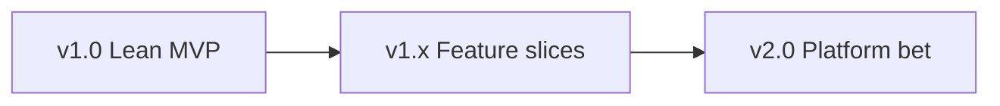

# Agent Build Checklist — iOS App (0 → Ship)

Ordered checklist for building **any** iOS app from a single brainstorm spec. Focuses on engineering concepts, release discipline, and agent tooling — not product-specific features.

**Status:** Living document — check boxes, add dates and commit hashes as phases complete.

**Note:** This checklist is domain-agnostic. If your repo includes a reference app, treat it as an example of folder layout and process — not as product requirements.

---

## Agent query template (paste to start a new session)

```text
You are building an iOS app from a single brainstorm spec. Follow docs/agent-build-checklist.md.

Rules:
1. Spec-first: no user-visible behavior without an authoritative spec. One source of truth per concern.
2. Test-first for domain: pure logic and ViewModels get unit tests before UI polish.
3. Layered architecture: Features → Domain / Data interfaces → Persistence. Domain never imports SwiftUI.
4. XcodeGen (or equivalent codegen) — regenerate the Xcode project; do not commit .xcodeproj if policy says so.
5. Accessibility is a release gate (target WCAG 2.1 AA): VoiceOver, 44pt targets, Dynamic Type, contrast, supported orientations.
6. Use XcodeBuildMCP (or xcodebuild) for build/test; read .cursor/mcp.json for agent tooling.
7. Ship lean: gate unfinished UI via a single **release-surface** module — hide, don't delete.
8. Update this checklist and spec Verification blocks as phases complete.

Brainstorm spec: [PATH OR PASTE]
App name / bundle ID: [NAME]
MVP scope (what v1.0 exposes): [LIST]
Owner decisions: [locales, telemetry, tip/donate link, min iOS version]
```

---

## Agent prompt library (reusable queries)

Copy-paste prompts for common build tasks. Replace `[BRACKETS]` with your app context. Each prompt should produce a **dated artifact** (audit doc, scenario file, test, or plan) — not just chat output.

### How to use

| Phase | Prompts to run |
|-------|----------------|
| After Phase 6 (first vertical slice) | User scenario → integration/UI test |
| Phase 11 (a11y hardening) | Blind-person review, VoiceOver audit, large-text layout, nutrition-label pass |
| Phase 12 (CI) | High-value tests, flaky-test hardening, regression from scenario |
| Phase 13 (lean ship) | Release-surface audit, analytics breadcrumb |
| Phase 16 (pre-ship) | Screenshot/marketing audit, MCP UI pass, verify last commit |
| Ongoing | Architecture review, dead-code audit, spec-before-code |

Store outputs under `accessibility/audits/`, `docs/plans/`, `Tests/`, or `specs/` — link from the progress log.

---

### Accessibility & inclusion

#### Think like a blind VoiceOver user

**When:** Designing or reviewing any screen before merge; Phase 11.

```text
Review [SCREEN OR FLOW] as a blind VoiceOver user who cannot see the screen.

Assume I only hear: labels, hints, focus order, and announcements — no color, layout, or icons.

For each step in the happy path:
1. What do I hear when I land on this screen?
2. Can I complete the primary task without dead ends or silent controls?
3. Is any label redundant, cryptic, or duplicated (less-is-more)?
4. Does state change (errors, success, selection) get announced?

List findings by severity. Propose label/hint/identifier fixes. Do not rely on color-only meaning.
Save to accessibility/audits/YYYY-MM-DD-voiceover-[screen].md
```

#### Near-blind / maximum Dynamic Type layout

**When:** Primary task screens clip or scroll badly at AXXXL; Phase 7 or 11.

```text
Rethink [SCREEN] for a near-blind user at the largest Dynamic Type (accessibility sizes).

Constraints:
- Do not break the default layout for standard text sizes — prefer a separate accessibility layout or extracted views.
- Cover iPhone and iPad, portrait and landscape.
- Key content and primary actions must stay usable without horizontal scrolling.

Propose layout options, pick one, implement behind size-class or accessibility checks, add tests.
```

#### VoiceOver + MCP accessibility audit

**When:** Pre-release or after major UI churn; Phase 11.

```text
Run an accessibility audit on [BRANCH OR BUILD].

Use simulator MCP / XcodeBuildMCP to inspect live UI: AX tree, identifiers, focus order.
Cross-check your accessibility spec and per-screen tracker (e.g. `accessibility/` or `docs/a11y/`).

Deliver:
1. Dated report in accessibility/audits/YYYY-MM-DD-*.md
2. Findings by severity (blocker / high / medium)
3. Per-screen VoiceOver script for manual follow-up
4. List of missing accessibilityIdentifiers for UI tests

Do not claim WCAG compliance — report confidence and open gaps.
```

#### App Store accessibility nutrition-label confidence

**When:** Before claiming accessibility features in App Store Connect; Phase 16.

```text
Compare our public accessibility statement [URL OR docs/accessibility.html]
against what the app actually implements.

For each claimed label (VoiceOver, Larger Text, Contrast, Reduce Motion, etc.):
- Evidence in code or [ ] gap
- Device checklist steps to verify
- Honest ship/no-ship recommendation per label

Update the HTML page if claims are ahead of implementation.
```

---

### User scenarios & testing

#### Write a user scenario, then test it

**When:** After each vertical slice; Phase 6+; before release.

```text
Write a realistic end-to-end user scenario for [PERSONA] trying to [GOAL].

Format:
- Persona: (e.g. first-time user, returning user, accessibility user, low-connectivity)
- Preconditions: (app state, data seeded)
- Steps: numbered, observable
- Expected outcome:
- Failure modes to watch:

Then:
1. Add an integration test OR UI test that automates the happy path (use launch args for seed/reset).
2. Add a manual checklist row to docs/release/release_checklist.md if not automatable.
3. If the scenario came from beta feedback, cite the reporter theme in the test name or comment.
```

#### Beta feedback → triage → fix order

**When:** TestFlight or internal beta; Phase 16.

```text
Triage this beta feedback into engineering tasks:

[PASTE FEEDBACK BULLETS]

For each item:
- Repro scenario (steps)
- Layer (domain / VM / UI / a11y / data)
- Severity
- Suggested fix scope
- Regression test needed? (yes/no)

Propose fix order. Start with data-loss, blockers, then confusion, then polish.
```

#### Regression test from a "what if" concern

**When:** Any time a reviewer worries about edge cases (navigation, state reversal, rotation, offline); Phase 12.

```text
I'm concerned that [USER ACTION] might break [BEHAVIOR] on [SCREEN].

1. Trace the code path and confirm or falsify the concern.
2. If valid: fix minimally.
3. Add a unit or UI regression test named for the scenario.
4. Run the test twice in CI configuration to check flakiness.
```

---

### Architecture & code health

#### Scalability / architecture review

**When:** Before large features or refactors; Phase 18 or when VMs/files exceed ~400 lines.

```text
Review this codebase for long-term scalability and refactor opportunities.

Explore: module boundaries, DI, navigation, persistence, god objects, duplication across features, testability.

Return:
- Current architecture summary
- Risks with file paths
- Top refactors ranked by impact/effort
- What's already done well

Read-only unless I ask to implement. Save plan to docs/plans/ if multi-phase.
```

#### Dead code & duplication audit

**When:** Pre-release cleanup; reducing maintenance burden.

```text
Audit the feature set for duplication and dead code.

Find: orphaned views/types, duplicate flows, unused flags, deprecated paths still linked in UI.
Prioritize by safety (delete-only with tests green > risky merge).

New branch. No behavior change without tests. Report before bulk delete.
```

#### Spec before implementation

**When:** Any new user-visible feature or setting; Phase 1+.

```text
Before writing code for [FEATURE IDEA]:

1. Check for spec conflicts in specs/ and governance doc.
2. Write or update the feature spec (behavior, settings, a11y, analytics, verification block).
3. Link from settings/app inventory docs if user-facing.
4. Wait for approval — then execute in a follow-up session.
```

#### Craft handoff query for a new agent

**When:** Multi-phase work (refactor, release slice); Phase 13+.

```text
Craft a self-contained agent prompt to begin [PHASE NAME].

Include: read-first files, scope in/out, acceptance criteria, test commands, do-not-touch list, and how to report done.
Format so I can paste into a fresh chat with no prior context.
```

---

### Release, gating & analytics

#### Release-surface / feature-gate audit

**When:** Cutting a lean release; Phase 13–16.

```text
Audit that only [MVP SCOPE] is reachable in a Release build without test launch arguments.

Check: tabs, menus, deep links, filters, onboarding, list/detail views, settings links.
Hidden features must not appear in store copy or screenshots.

List leaks with file paths. Fix gates in the central release-surface module — not scattered `#if`.
```

#### Analytics breadcrumb audit

**When:** Telemetry ships; Phase 14.

```text
Audit analytics for a coherent funnel on [CORE JOURNEY].

Verify: event names match spec catalog, parameters are allowlisted, no PII, Debug/CI off by default.
Trace from user action → logger → mapping → analytics backend (e.g. Firebase, TelemetryDeck).

Add missing events or tests. Document the happy-path breadcrumb in the spec.
```

---

### Visual QA & simulator

#### MCP UI pass on current branch

**When:** Pre-merge or pre-release; Phase 7, 11, 16.

```text
On branch [NAME], use XcodeBuildMCP / simulator MCP to find UI issues.

Build, run, navigate [FLOWS]. Capture layout bugs, clipped text, wrong empty states, launch/splash jank.
Compare light/dark and one large-text setting if possible.

Iterate on findings. Commit in small batches with screenshots in PR notes if helpful.
```

#### Screenshot & marketing asset audit

**When:** App Store assets; Phase 16.

```text
Scan all images under [marketing-screenshots/ OR asset folder].

Find: raw localization keys visible, debug overlays, gated features shown, wrong device frame, truncated text.
Produce a fix list mapped to file paths. Regenerate affected captures after fixes.
```

#### Splash → first frame continuity

**When:** Launch polish; Phase 16.

```text
Compare LaunchScreen/storyboard to first SwiftUI frame after bootstrap.

Reproduce with simulator MCP. Eliminate size jump, color flash, or layout shift.
Document expected transition in a one-line comment near launch assets.
```

---

### Verification & ship discipline

#### Verify last commit

**When:** After any agent commit; before push.

```text
Double-check the last commit: read full diff, run targeted tests, confirm spec/docs updated.
Report: what changed, what was verified, anything not run and why.
```

#### High-value tests only

**When:** Coverage push without noise; Phase 12.

```text
What tests add the most confidence per line of test code for [AREA]?

Prefer: domain edge cases, migration, release-surface gates, one UI smoke per journey.
Skip trivial getters. Implement top 3 and run CI scheme.
```

#### Flaky test hardening

**When:** CI intermittently red; Phase 12.

```text
Find flaky tests in [SUITE]. Make them CI-safe and deterministic.

Fix: timing, animation waits, parallel sim issues, shared state, missing launch args.
Run each fixed test 3× locally. Document root cause in commit message.
```

#### What is left before ship?

**When:** Release week; Phase 16.

```text
What remains before [VERSION] ships?

Cross-check: release checklist, feature inventory, open a11y items, store metadata, legal URLs, gated surface.
Use simulator MCP for a final pass. Output a prioritized checklist with owners (agent vs human).
```

---

### Cursor rule hook (optional)

Add `.cursor/rules/agent-prompts.mdc` pointing agents at this section when the user says **accessibility audit**, **user scenario**, **release gate**, or **architecture review**.

---

## Living document rules

| When | Update |
|------|--------|
| Phase completes | Check box + date + commit in **Progress log** |
| New screen ships | Feature spec Verification block + accessibility screen tracker entry |
| Ship status changes | `docs/feature-inventory.md` (or equivalent product register) |
| Release scope changes | Release-surface gate module + release tagging doc |
| New user-visible string | All bundled locale files + parity test |
| New analytics/crash event | Telemetry catalog spec + allowlist + mapping tests |
| Pre-spec idea | `FutureIdeas/` or backlog — promote to `specs/` when rules lock |

**Source-of-truth hierarchy:** governance doc → system specs → feature specs → feature inventory (what ships today) → brainstorm/backlog (not authoritative).

### Progress log

| Phase | Completed | Commit | Notes |
|-------|-----------|--------|-------|
| 0 | | | |
| 1 | | | |
| … | | | |

---

## Phase 0 — Repo & agent infrastructure

Establish tooling before feature work so agents and CI behave consistently.

- [ ] **0.1** Create repo; `README.md` = build/run entry only (link to specs for product detail)
- [ ] **0.2** **Project codegen:** XcodeGen `project.yml` (or Tuist) — single source for targets, schemes, build phases
- [ ] **0.3** **Layered folders** (adjust names to your app):
  - `App/` — entry, DI bootstrap, root navigation
  - `Features/` — SwiftUI + MVVM per flow
  - `Domain/` — pure business logic (no SwiftUI, no persistence frameworks)
  - `Data/` — repository protocols + implementations
  - `Persistence/` — schema, migrations, container factory
  - `DesignSystem/` — tokens, reusable components
  - `Support/` — logging, flags, utilities, deep links
  - `Resources/` — assets, strings, plist templates
  - `Tests/` — `Unit/`, `Accessibility/`, `UI/`
- [ ] **0.4** Pin: deployment target, bundle ID, team ID, Swift version in codegen config
- [ ] **0.5** `.gitignore`: generated `.xcodeproj`, secrets (service plists, API keys), DerivedData
- [ ] **0.6** **Git hooks** to block committing secrets (pre-commit script in `Scripts/`)
- [ ] **0.7** **`.cursor/mcp.json`** — XcodeBuildMCP + ios-simulator (or your build MCP); document `PATH` and tool paths
- [ ] **0.8** **Cursor rules** (`.cursor/rules/`) for recurring agent mistakes:
  - git remote / push policy (if multi-account)
  - accessibility audit pointer (latest manual audit doc)
  - layout rules (phone vs iPad — use idiom, not size class alone)
  - UI test identifier conventions
  - schema migration policy
- [ ] **0.9** **SwiftLint** + CI lint job
- [ ] **0.10** **CONTRIBUTING.md** — architecture, style, test expectations (agents read this)
- [ ] **0.11** Verify: `xcodegen generate && xcodebuild build -scheme <AppCI> -destination 'platform=iOS Simulator,name=<Device>'`

---

## Phase 1 — Spec system from brainstorm

Turn ideas into contracts before code. Prevents drift and gives agents a single truth.

- [ ] **1.1** Brainstorm lives in `FutureIdeas/` or `docs/brainstorm.md` — explicitly **non-authoritative**
- [ ] **1.2** **System specs** (write before implementation):
  - Architecture (layers, dependency rules, module map)
  - Tech stack (frameworks, min OS, third-party SDKs)
  - Design system (tokens, typography, semantic colors)
  - Data schema + persistence/migration policy
  - Accessibility requirements
  - Localization policy
  - Test plan + CI gates
  - Feature flags / environment config
  - Spec governance (who wins on conflict, PR rules)
- [ ] **1.3** **Promotion pipeline:** brainstorm → feature spec when behavior/rules are locked
- [ ] **1.4** Every feature spec ends with a **Verification** block: target release, last verified date, commit, primary code paths
- [ ] **1.5** `specs/README.md` index + `docs/feature-inventory.md` (shipped / partial / planned / stub)
- [ ] **1.6** For multi-variant products (modes, tiers, templates): catalog registry in code + spec per variant; stubs marked `planned` until engine ships

**Concept:** Specs describe *behavior*; inventory describes *reality*; brainstorm describes *maybe*.

---

## Phase 2 — Design system & accessibility foundations

Build accessibility in from the first shared component — retrofitting is expensive.

- [ ] **2.1** **Token layers** — separate concerns (e.g. brand/marketing palette vs native system surfaces)
- [ ] **2.2** Semantic colors for light + dark; track contrast in `accessibility/` (not only in design files)
- [ ] **2.3** **Dynamic Type:** semantic text styles; `@ScaledMetric` for layout that must scale with text
- [ ] **2.4** **Touch targets:** 44×44 pt minimum (larger for primary/high-frequency actions)
- [ ] **2.5** Reusable components ship with `accessibilityLabel`, `accessibilityHint`, `accessibilityIdentifier` by default
- [ ] **2.6** **WCAG tracker:** per-screen status + evidence folder (contrast samples, orientation matrix, VoiceOver notes)
- [ ] **2.7** `Tests/Accessibility/` — automated contrast and label contracts on tokens and key controls
- [ ] **2.8** Document supported orientations in accessibility spec (portrait-only vs portrait + landscape)

**Release gate concepts:** contrast (1.4.3), resize/reflow (1.4.4 / 1.4.10), keyboard/focus order, non-color cues, Reduce Motion.

---

## Phase 3 — Domain layer (test-first)

Pure logic is the contract of your app. Test it without simulators.

- [ ] **3.1** Domain types and **rule engines / use cases** — zero UI imports
- [ ] **3.2** **Typed errors** at domain boundary; ViewModels map to localized user messages
- [ ] **3.3** **State machines** for multi-step flows (onboarding, checkout, session lifecycle)
- [ ] **3.4** Deterministic services (calculations, validation, aggregations)
- [ ] **3.5** Unit tests per branch: happy path, validation failures, edge cases, reversible operations
- [ ] **3.6** Optional: long-run or property-style simulation for regression confidence
- [ ] **3.7** **Command pattern** for user actions (`create`, `update`, `revert`, `cancel`) — keeps logic reusable for widgets, Watch, intents later

**Rule:** If it's hard to unit test, it's probably in the wrong layer.

---

## Phase 4 — Persistence & repositories

Isolate I/O behind protocols so tests use fakes and schema can evolve.

- [ ] **4.1** Versioned schema (`SchemaV1`, `SchemaV2`, …) with explicit migration plan
- [ ] **4.2** **Repository protocols** in `Data/`; SwiftData/Core Data/GRDB implementations behind them
- [ ] **4.3** Single **dependency container** wired at app launch (`AppDependencies`, factory, or composition root)
- [ ] **4.4** Migration tests in CI (upgrade path from N−1 → N)
- [ ] **4.5** Container bootstrap failure policy: telemetry, recovery UI, or fail-fast (document per release)
- [ ] **4.6** Features depend on `any FooRepository`, never concrete persistence types

---

## Phase 5 — App shell & navigation

The skeleton every feature plugs into.

- [ ] **5.1** `@main` app struct + dependency bootstrap
- [ ] **5.2** Root navigation (tabs, sidebar, or single-stack) — IA documented in app-shell spec
- [ ] **5.3** **Router** for deep links, push notifications, and deferred navigation
- [ ] **5.4** First-run **onboarding** (permissions, defaults, optional account)
- [ ] **5.5** Central **feature flags** provider — no scattered compile flags in views
- [ ] **5.6** **Release surface gate** — one module that answers "is feature X reachable in this build?" (see Phase 14)

---

## Phase 6 — First vertical slice (MVP core journey)

Ship one complete user path end-to-end before spreading wide.

Define yours from the brainstorm. Pattern:

```
entry → configure → primary action → confirmation → persisted outcome
```

Examples (pick one for v1):

| App type | Vertical slice |
|----------|----------------|
| Workflow / session | open → configure → perform task → save outcome → review history |
| Tracker | add item → edit → list → detail |
| Reader | browse catalog → open content → bookmark |
| Tool | input → transform → output → share |

Checklist:

- [ ] **6.1** Entry screen + ViewModel (resume/state banner if applicable)
- [ ] **6.2** Configuration step with validation
- [ ] **6.3** Primary interaction UI — accessibility labels on every control
- [ ] **6.4** Domain wired through ViewModel (no business rules in `View.body`)
- [ ] **6.5** Completion / summary screen; write to persistence
- [ ] **6.6** Integration test: full slice + relaunch + state restore
- [ ] **6.7** UI test identifiers on critical controls in this slice

---

## Phase 7 — Shared chrome & adaptive layout

Extract patterns reused across features; nail layout on phone, large phone, and iPad.

- [ ] **7.1** Shared headers, toolbars, empty states, error banners
- [ ] **7.2** **Non-color state indicators** wherever color conveys meaning
- [ ] **7.3** Loading, disabled, and destructive action patterns
- [ ] **7.4** **Orientation support** per spec:
  - Detect landscape via `verticalSizeClass == .compact`
  - Distinguish phone vs pad with **idiom**, not horizontal size class alone (Pro Max landscape ≠ iPad)
- [ ] **7.5** iPad: define when to use side-by-side vs stacked (document predicates; unit test them)
- [ ] **7.6** Secondary feature or variant of core journey (proves architecture isn't one-off)

---

## Phase 8 — Entity management & settings

Users and preferences outlive a single session.

- [ ] **8.1** CRUD for primary entities (create, edit, archive/delete with guards)
- [ ] **8.2** Identity presentation (avatar, icon, color — if applicable)
- [ ] **8.3** **Settings screen:** appearance, defaults, feedback (haptics/sound), privacy toggles
- [ ] **8.4** Settings ViewModel tests (persistence of preferences)
- [ ] **8.5** **AppLinks** (or equivalent) — single registry for external URLs:
  - Privacy policy, support, accessibility statement (GitHub Pages or hosted)
  - App Store / review URL
  - Optional tip or donate link (`URL?` — `nil` hides the row)
- [ ] **8.6** Tip/donate row: `Link` only when URL non-nil; accessibility label + test identifier
- [ ] **8.7** **Delete all local data** / account logout — spec'd, confirmed, tested

```swift
// Pattern: optional external links
enum AppLinks {
    static let privacy = URL(string: "https://…")!
  static let support = URL(string: "https://…")!
  static let tipJar: URL? = URL(string: "https://…") // nil = hidden
}
```

---

## Phase 9 — Lists, history & derived views

Secondary surfaces that read what the core journey writes.

- [ ] **9.1** List + detail for persisted records (pagination or cursor-based loading)
- [ ] **9.2** Filters and search — **scoped to reachable features** (respect release surface gate)
- [ ] **9.3** Aggregations, charts, or summaries (pure domain math, cached in VM)
- [ ] **9.4** Batch fetching for large datasets; avoid N+1 in repositories
- [ ] **9.5** Merge related tabs behind a segment picker if IA demands it (keeps tab count lean)

---

## Phase 10 — Localization & text coverage

No hard-coded user-facing strings in production UI.

- [ ] **10.1** String catalog wrapper (`L10n`, `String(localized:)`, or generated keys)
- [ ] **10.2** `en.lproj` (or base locale) = source of truth
- [ ] **10.3** PR rule: new keys land in **every bundled locale** simultaneously
- [ ] **10.4** Parity test — key count + format specifier alignment across `.lproj` files
- [ ] **10.5** Locale smoke UI tests (one target per language or parameterized suite)
- [ ] **10.6** **Lean ship option:** bundle only MVP locale in release; keep translation files in repo for CI parity until wider release
- [ ] **10.7** Optional: generator/sync scripts for machine-assisted translation workflows

---

## Phase 11 — Accessibility hardening (release gate)

Engineering pass is necessary; manual verification is still required for ship confidence.

- [ ] **11.1** Automated UI accessibility audits (`performAccessibilityAudit`) + identifier contract tests
- [ ] **11.2** Manual **VoiceOver** pass on core journeys — dated audit doc in `accessibility/audits/`
- [ ] **11.3** **Large text (AXXXL+):** critical screens readable without clipping; log gaps
- [ ] **11.4** **Contrast evidence** — light and dark, primary actions and body text
- [ ] **11.5** **Orientation matrix** — portrait/landscape × phone/pad on setup + primary task screens
- [ ] **11.6** **Reduce Motion** — respect `@Environment(\.accessibilityReduceMotion)`; gate decorative animation
- [ ] **11.7** Hide decorative elements from VoiceOver
- [ ] **11.8** Link to accessibility statement from Settings (and onboarding if appropriate)
- [ ] **11.9** Rollup doc with per-screen status — **no launch with open critical failures on core flows**

---

## Phase 12 — Test matrix & CI

Fast feedback on PR; thorough coverage on a schedule.

- [ ] **12.1** **PR CI scheme** (`<App>CI`): unit + accessibility tests only (keeps PRs ~minutes)
- [ ] **12.2** **Split UI tests** into parallel targets by concern (avoid one 2-hour suite):

| Target pattern | Covers |
|----------------|--------|
| `*UISmoke` | Navigation, tabs, launch |
| `*UIFeatures` | Core journey UI |
| `*UIAccessibility` | WCAG audits + a11y identifiers |
| `*UILocalization` | Per-locale smoke |
| `*UILandscape` | Orientation regressions (large phone + pad) |
| `*UIChrome` | Settings, onboarding, entity detail |
| `*UILean` | Release-surface smoke (**release branches only**) |

- [ ] **12.3** Nightly workflow for full UI matrix (parallel simulators if stable)
- [ ] **12.4** **Launch arguments** for tests: enable full surface, disable telemetry, reset state, seed fixtures
- [ ] **12.5** Shared **test doubles** (in-memory repos, fake clock, fake network)
- [ ] **12.6** Optional: documentation/spec drift script as CI artifact
- [ ] **12.7** Block tracked secrets in CI (API plists, keys)

**Concept:** Unit tests prove logic; UI tests prove wiring; manual QA proves feel.

---

## Phase 13 — Release surface & lean ship strategy

**Build wide internally; ship narrow publicly.**

- [ ] **13.1** **Release-surface** module — boolean (or enum) gates per product area
- [ ] **13.2** One place controls: tabs, menu items, deep links, bundled locales, experimental features
- [ ] **13.3** Launch argument (e.g. `-enable_full_product_surface`) for CI and dogfood — **never** in App Store builds
- [ ] **13.4** Written **lean v1 plan** with locked owner decisions (locales, telemetry, scope in/out)
- [ ] **13.5** **Test-confidence matrix** — ship order follows device QA evidence, not code completeness
- [ ] **13.6** Branch model: `dev` (full surface for development) vs `release/*` (gated defaults)
- [ ] **13.7** Per-feature **estimated release tags** in specs and a machine-readable registry



Each slice: flip surface flags → run device matrix → update App Store copy to match reality.

---

## Phase 14 — Telemetry, deep links & platform extensions

Optional but plan hooks early; default risky features **off**.

- [ ] **14.1** Secrets template in repo; real credentials gitignored
- [ ] **14.2** **Allowlisted analytics** — catalog in spec; mapping tests; off in Debug/CI by default
- [ ] **14.3** Crash reporting + dSYM upload (Release archives only)
- [ ] **14.4** Structured logging facade → swappable sinks (console, OSLog, third-party analytics, etc.)
- [ ] **14.5** **Deep links** — parser, router, fallback when target feature is gated
- [ ] **14.6** App Intents / Shortcuts behind flag until QA matrix passes
- [ ] **14.7** Widgets, Live Activities, Watch — stub boundaries in domain (command-based actions)

**Privacy:** disclose collection in policy HTML and App Store privacy labels.

---

## Phase 15 — Legal pages, GitHub Pages & store URLs

Apple requires hosted URLs; don't hard-code scattered strings.

- [ ] **15.1** Static HTML in `docs/`: `privacy.html`, `support.html`, `accessibility.html`, `index.html`
- [ ] **15.2** Enable **GitHub Pages**: deploy from `main`/`master` → `/docs` folder
- [ ] **15.3** Wire canonical URLs in `AppLinks` → `https://<user>.github.io/<repo>/privacy.html`
- [ ] **15.4** App Store Connect: Privacy Policy URL + Support URL (+ Accessibility URL if provided)
- [ ] **15.5** Bump "Last updated" when practices or third-party SDKs change
- [ ] **15.6** App Store metadata spec — honest subtitle/keywords (only claim shipped features); subtitle must not reference price/monetization (`free`, `no ads`, etc. — Guideline 2.3.7; canonical: `X01 & Cricket Scorekeeper`)
- [ ] **15.7** Marketing screenshots + optional automation (`-snapshot_*` launch args)
- [ ] **15.8** Launch screen — storyboard or asset catalog (scales across devices)
- [ ] **15.9** CI/CD for TestFlight (Xcode Cloud, Fastlane, or GHA trigger)

---

## Phase 16 — Release QA & ship

- [ ] **16.1** Device matrix in release checklist — scoped to **what v1.0 actually exposes**
- [ ] **16.2** RC sign-off doc with Go/No-Go and evidence links (screenshots, audit dates)
- [ ] **16.3** Owner decisions closed:
  - [ ] Tip/donate link — show, change URL, or remove
  - [ ] Locales in store listing vs app bundle
  - [ ] Telemetry on/off in Release
  - [ ] Bundle ID — new listing vs update to existing app
- [ ] **16.4** Lean-surface UI smoke green on `release/*`
- [ ] **16.5** Persistence recovery smoke on physical device
- [ ] **16.6** Short pre-tag gate checklist (~10 min)
- [ ] **16.7** Post-submit monitoring plan (crashes, reviews, key metrics)

---

## Phase 17 — Expand surface (post-v1)

For each release slice:

1. Flip release-surface flags
2. Update feature inventory + App Store copy
3. Run **device QA matrix** for newly exposed features
4. Add/update accessibility screen docs
5. Tag and ship

| Slice | Typical pattern |
|-------|-----------------|
| v1.1 | Second core feature family |
| v1.2 | Power-user tools (export, advanced config) |
| v1.3 | Catalog / browse UI for many variants |
| v1.4 | Shortcuts, widgets, system integrations |
| v2.0 | One major bet (social, subscription, ML, second platform) |

**Future ideas** stay in backlog until promoted to specs with locked rules.

---

## Phase 18 — Documentation hygiene (ongoing)

- [ ] **18.1** Behavior PR → matching feature spec + Verification block
- [ ] **18.2** Feature inventory matches shipped reality
- [ ] **18.3** Spec/code drift report in CI (optional)
- [ ] **18.4** Engineering audit after large refactors
- [ ] **18.5** Document architectural extractions *before* splitting god ViewModels
- [ ] **18.6** Release automation docs (chat notifications, webhooks, runbooks) when ops mature

---

## Quick reference for agents

| Question | Where to look |
|----------|----------------|
| What should the product do? | `specs/<Feature>Spec.md` |
| What exists in the build today? | `docs/feature-inventory.md` |
| How is code organized? | Architecture spec + `CONTRIBUTING.md` |
| How do I build and test? | `README.md`, `.cursor/mcp.json` |
| What ships this sprint? | `docs/release/todo.md` |
| Accessibility requirements? | Accessibility spec + `accessibility/` tracker |
| Lean vs full UI? | Release-surface gate module |
| Legal / support URLs? | `docs/` HTML + `AppLinks` |
| Optional tip link? | `AppLinks.tipJar` or equivalent (`nil` = hidden) |
| Ideas not yet spec'd? | `FutureIdeas/` or backlog |
| This checklist | `docs/agent-build-checklist.md` |
| Reusable agent prompts | `docs/agent-build-checklist.md` § Agent prompt library |

---

## Adapting this checklist

Copy to a new repo and customize:

1. Rename folders/targets in Phase 0
2. Replace Phase 6 vertical-slice table with your MVP journey
3. Delete phases that don't apply (e.g. skip Phase 14 if no analytics)
4. Add domain-specific phases as sub-bullets under Phase 6–9, not new global phases
5. Keep **release surface gating**, **accessibility gate**, and **spec-first** — they transfer to every app
