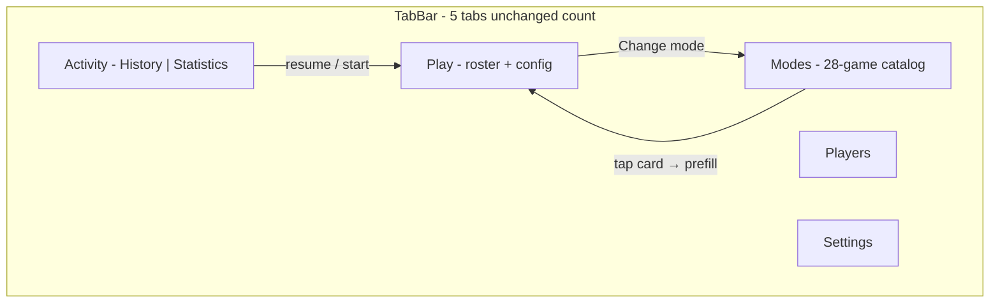
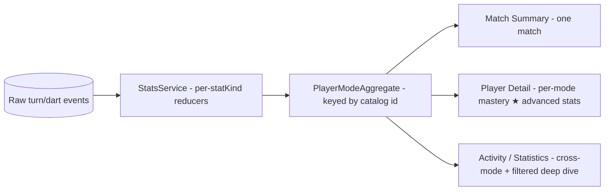

# Full Game Catalog UI Draft

Design target: every mode from [`FutureIdeas/additional-game-modes.md`](../FutureIdeas/additional-game-modes.md) plus what ships today (X01, Cricket, Baseball, Killer, Shanghai). Builds on the shipped tab IA (`Play · Modes · Players · Activity · Settings` in [`App/MainTabView.swift`](../App/MainTabView.swift)) with concrete wireframes and gameplay templates at full catalog scale.

---

## 0. Verdict — does the UI support 28 games? *(reviewer's pass)*

**Yes, the *architecture* scales — but the *current wireframe* does not, and one
whole surface (Statistics) has no plan at all.** The load-bearing ideas are
correct and should proceed: **8–9 reusable gameplay templates instead of 28
bespoke screens**, a **catalog model as single source of truth**, **search +
sections** in Modes, and a **menu-picker filter** in Activity. That is exactly
how you get from 5 modes to 28 without UI sprawl.

Three concrete failure points block the "yes," in priority order:

1. **The catalog becomes a graveyard.** At launch ~23 of 28 cards are
   "Coming soon," and §3 renders the 16-mode Party section as a wall of
   bracketed chips — *the exact anti-pattern this whole restructure exists to
   kill*, relocated to a new tab. A first-time user would open Modes and see
   mostly disabled tombstones. **Fix: the catalog shows available modes (plus a
   single "more coming" teaser per section); it grows as engines ship — it is
   not pre-seeded with 23 dead cards.** (§3 review.)
2. **Statistics has no meaning across heterogeneous modes — and the plan is
   silent on it.** `StatisticsViewModel` today is structurally X01/Cricket
   (`isX01`, `showsTrendChart`, `sectorHits`, 3-dart-average breakdowns,
   `ModeFilter → MatchType?`). You cannot compute a 3-dart average for
   Tic-Tac-Toe or a checkout % for Bob's 27. §6/§7 wave at "summary variants"
   but never define what the **Statistics segment** does for a lives game, a
   sequence race, or a grid game. **This is the biggest unaddressed scaling
   question** — see the new §6a.
3. **The accent system is keyed to the wrong thing, and a few templates are
   overloaded.** `GameModeAccent` switches over the 5-case `MatchType` enum; 23
   of the 28 modes have *no* `MatchType`, so identity must be re-keyed off the
   catalog `id: String` (the plan hints at this — make it a hard requirement).
   And Templates **D** and **E** each absorb 5+ rules-divergent modes; **H/I**
   are genuinely new, custom-drawn, and the real accessibility cost. (§5
   review.)

Everything below is the original draft with inline `> **UX review:**` callouts
and two new sections (**§6a stats schema**, **§5 a11y notes**) added in review.

---

## 1. Complete mode inventory (28)

| # | Mode | Section | Status | Min players | UI family (see §5) |
|---|------|---------|--------|-------------|-------------------|
| 1 | X01 (301/501/701…) | Standard | **Shipped** | 1+ | A — Checkout score |
| 2 | Cricket | Standard | **Shipped** | 2+ | B — Mark board |
| 3 | Baseball | Party | **Shipped** | 2+ | C — Inning points |
| 4 | Killer | Party | **Shipped** | 3+ | D — Lives elimination |
| 5 | Shanghai | Party | **Shipped** | 2+ | C — Inning points |
| 6 | American Cricket | Standard | Planned | 2+ | B — Mark board |
| 7 | Mickey Mouse | Party | Planned | 2+ | B — Mark board |
| 8 | Mulligan | Party | Planned | 2+ | B — Mark board |
| 9 | English Cricket | Party | Planned | 2+ | A — Checkout score |
| 10 | Blind Killer | Party | Planned | 3+ | D — Lives elimination |
| 11 | Around the Clock | Practice | Planned | 1+ | E — Sequence progress |
| 12 | 180 Around the Clock | Practice | Planned | 1+ | E — Sequence progress |
| 13 | Chase the Dragon | Practice | Planned | 1+ | E — Sequence progress |
| 14 | Nine Lives | Practice | Planned | 2+ | D — Lives elimination |
| 15 | Bob's 27 | Practice | Planned | 1 | F — Solo challenge |
| 16 | Halve-It | Practice | Planned | 1+ | F — Solo challenge |
| 17 | Knockout | Party | Planned | 2+ | A — Checkout score |
| 18 | Sudden Death | Party | Planned | 3+ | A — Checkout score |
| 19 | 51 By 5's | Party | Planned | 2+ | A — Checkout score |
| 20 | Football | Party | Planned | 2+ | G — Phase race |
| 21 | Grand National | Party | Planned | 2+ | E — Sequence progress |
| 22 | Hare and Hounds | Party | Planned | 2 | E — Sequence progress |
| 23 | Follow the Leader | Party | Planned | 2+ | D — Lives elimination |
| 24 | Loop | Party | Planned | 2+ | D — Lives elimination |
| 25 | Prisoner | Party | Planned | 2+ | H — Board state |
| 26 | Scam | Party | Planned | 2 | I — Role split |
| 27 | Snooker | Party | Planned | 2+ | I — Role split |
| 28 | Tic-Tac-Toe | Party | Planned | 2+ | H — Board state |

**Note:** Code already routes five modes via [`PlayRootView.swift`](../Features/Play/Setup/PlayRootView.swift) and [`MatchType`](../Domain/Models/RepositoryModels.swift). The remaining 23 appear as catalog entries with `isAvailable: false` until promoted.

> **UX review — the template assignments are optimistic; pressure-test them.**
> "Template D" covers Killer, Blind Killer, Nine Lives, Follow the Leader, and
> Loop — but Blind Killer *hides* the numbers, Follow the Leader is
> exact-match-or-lose-a-life, and Loop adds wire-loop geometry. These aren't
> config flags on one screen; they're different interaction models sharing a
> *scoreboard*. Same for Template E (5 sequence modes, one of which —
> Hare & Hounds — needs two tracks). Before committing, write a one-paragraph
> interaction spec per mode and confirm it's a *config delta*, not a fork. Some
> Template D/E members will likely graduate to their own template; budget for
> ~10–11 templates, not a hard 8.

---

## 2. App shell at full scale



**Tab order:** `Play · Modes · Players · Activity · Settings` (from scale plan).

**Why not more tabs:** Practice / Party / Cricket variants become **sections inside Modes**, not separate tabs. At 28 modes, a flat Play setup or 6-option segmented control breaks down ([`docs/ux-design-review.md`](ux-design-review.md) A2).

> **UX review — at 28 modes the case for a Modes *tab* is much stronger.** My
> earlier reservation (in the scale plan, Open decision D1) was that a Modes tab
> creates two start-a-game paths. With a 28-mode catalog + search, a dedicated
> *discovery* surface now earns its slot — browsing/learning 28 games is a real
> job. **But the `Play → Change mode → Modes` arrow is still the wrong
> interaction:** changing one field of a setup you're mid-way through should not
> eject you to another tab. Keep the Modes tab for browsing; make in-setup
> "Change" a **compact in-place sheet** (a mini-catalog modal), preserving the
> roster you've already built. That resolves D1 without losing the tab.

---

## 3. Modes tab — full catalog wireframe

Primary discovery surface. Reuses card row pattern from [`PartyGamePickerView.swift`](../Features/Play/Setup/PartyGamePickerView.swift) + [`GameModeBadge`](../DesignSystem/Tokens/GameModeAccent.swift).

```text
+--------------------------------------------------+
| Modes                              [Search 🔍]   |
|--------------------------------------------------|
| Pinned / Recent (optional, max 3)                |
|  [501] [Killer] [Around the Clock]               |
|--------------------------------------------------|
| STANDARD                              3 modes    |
|  ┌────────────────────────────────────────────┐  |
|  │ [🎯] X01                          1–8 pl   │  |
|  │      301 · 501 · double out                │  |
|  │                              [Learn rules] │  |
|  └────────────────────────────────────────────┘  |
|  ┌────────────────────────────────────────────┐  |
|  │ [⊞] Cricket                       2–8 pl   │  |
|  │      Cut throat · Points on                │  |
|  └────────────────────────────────────────────┘  |
|  ┌────────────────────────────────────────────┐  |
|  │ [⊞] American Cricket    Coming soon  2+ pl  │  |
|  └────────────────────────────────────────────┘  |
|--------------------------------------------------|
| PARTY                                16 modes    |
|  [ Killer ] [ Baseball ] [ Shanghai ]          |
|  [ Blind Killer - soon ] [ Mickey Mouse - soon ] |
|  [ Knockout - soon ] [ Sudden Death - soon ]     |
|  [ Football · Grand National · Hare & Hounds ]   |
|  [ Follow the Leader · Loop · Prisoner ]         |
|  [ Scam · Snooker · Tic-Tac-Toe · Mulligan ]     |
|  [ 51 By 5's ]                                   |
|--------------------------------------------------|
| PRACTICE                              6 modes    |
|  [ Bob's 27 - soon ] [ Around the Clock - soon ]|
|  [ 180 ATC - soon ] [ Chase the Dragon - soon ]  |
|  [ Nine Lives - soon ] [ Halve-It - soon ]       |
|--------------------------------------------------|
| CRICKET VARIANTS (collapsible)         2 modes   |
|  [ English Cricket - soon ]                      |
|  (American Cricket also listed under Standard)   |
+--------------------------------------------------+
```

> **UX review — this wireframe is the plan's weakest point, and it's load-bearing.**
> Three problems, all from rendering all 28 at once:
>
> - **Graveyard of disabled cards.** 23 "soon" entries dominate every section.
>   New users judge an app by its first screen; a catalog that's 80% greyed-out
>   reads as unfinished. **Recommend:** the catalog lists *available* modes as
>   full cards, then a single low-key **"+19 more modes coming"** teaser row per
>   section that expands to a lightweight roadmap list (learn-rules only). The
>   catalog *fills in* as engines ship — it never ships pre-populated with
>   tombstones.
> - **The Party "wall of chips" is the original sin, relocated.** 16 modes
>   crammed as `[ Football · Grand National · Hare & Hounds ]` multi-per-line is
>   the exact density problem `ux-design-review.md` set out to fix. Within a
>   section, use one consistent card-per-row (or 2-up grid), never bracket-lists.
> - **Double-listing is confusing.** "American Cricket" appears under both
>   Standard *and* "Cricket variants," and a 4th collapsible section adds
>   taxonomy overhead. Drop the separate "Cricket variants" section; group
>   variants *under* their parent (an expandable "Cricket family" card) so a mode
>   never appears twice.
>
> Net: keep **search + sections + cards**; change *what populates them* —
> available-first, teaser for the rest, no duplicates.

### Modes tab behaviors

- **Search field** (sticky below title): filters all 28 by name, alias (“501”, “ATC”, “Mickey”), player count, or section. Essential at this scale.
- **Available card tap:** enqueue mode → switch to Play tab ([`PendingMatchPlayerSelections`](../App/Bootstrap/PendingMatchPlayerSelections.swift) extension from scale plan).
- **Coming soon card:** non-tappable; `StatusBadge` + optional “Notify me” (future). “Learn rules” still opens [`GameRulesGuideContent`](../Features/Play/Rules/GameRulesGuideContent.swift).
- **iPad:** two-column grid of cards within each section (`LazyVGrid`, 2 cols regular width).
- **Accents:** extend [`GameModeAccent`](../DesignSystem/Tokens/GameModeAccent.swift) beyond five `MatchType` values — use `GameModeCatalogEntry.id` for unreleased modes (e.g. `practice.atc` → teal + `clock.fill`).

> **UX review — search must have a payoff, and accent must be re-keyed.**
> (1) Searching a *coming-soon* mode (e.g. "Snooker") must land on a useful state
> — "Coming soon · Learn the rules · Notify me" — not a dead non-tappable card.
> Define the empty/no-results state too ("No mode matches 'foo'").
> (2) `GameModeAccent` today `switch`es over the 5-case `MatchType`; re-key the
> whole token to the catalog `id: String` **before** wiring history badges and
> filters, or you'll retrofit it under 28 modes. This is a small change now and
> a painful one later.

### Section rationale

| Section | Modes | Player mental model |
|---------|-------|---------------------|
| Standard | X01, Cricket, American Cricket | Pub league / serious scoring |
| Party | 16 social/elimination/race games | Group night, 3+ players common |
| Practice | 6 solo/training | 1 player, personal bests |
| Cricket variants | English Cricket (collapsible) | Avoids duplicating American Cricket; signals “same family, different rules” |

---

## 4. Play tab — slim setup wireframe

Mode selection **removed** from Play; only roster + config remain ([`SetupHomeView.swift`](../Features/Play/Setup/SetupHomeView.swift) slimmed per scale plan).

```text
+--------------------------------------------------+
| Play                                             |
|--------------------------------------------------|
| [Resume: Killer · 3 players · Resume]  (if any)  |
|--------------------------------------------------|
| SELECTED MODE                                      |
|  [⚡] Killer                    [Change → Modes]  |
|  3 lives · Double to become Killer               |
|  [Edit options ▾]  (collapsed by default)        |
|--------------------------------------------------|
| PLAYERS                                          |
|  [+ Add] [Quick add]                             |
|  ☑ Alice  ☑ Bob  ☑ Carol  ☐ Dave                 |
|  (inline hint if < min players for Killer)       |
|--------------------------------------------------|
|              [ Start Match ]  (primary)            |
+--------------------------------------------------+
```

**Per-mode config chips** (shown when Edit expanded):

| Mode group | Setup chips |
|------------|-------------|
| X01 | Start score, double/b/master out, legs/sets, check-in |
| Cricket | Cut throat, points on/off |
| Killer | Lives, killer rule variant, assignment method |
| Baseball | Innings, 7th-inning catch, tiebreaker |
| Shanghai | Rounds, Shanghai bonus rule |
| Practice (ATC) | Reset rule, bull finish, skip-on-double |
| Halve-It | Starting score, target sequence preset |
| Lives games | Starting lives count |
| Snooker | Simplified vs full rules toggle |

**Cold open default:** Settings → Default game mode (X01 or Cricket) until user picks from Modes.

> **UX review — "Change → Modes" should be an in-place sheet (see §2).** Also
> spec the **solo fork**: Bob's 27 / Halve-It have `minPlayers == 1`, so the
> PLAYERS section and roster gate must collapse to "playing solo" cleanly
> (no empty roster dead-end, Start enabled). The `< min players` inline hint is
> good — make sure it also blocks Start with an accessible error, not just a
> grey CTA. And confirm the per-mode chip set is data-driven off the catalog
> entry, so adding a mode doesn't mean editing `SetupHomeView`.

### Future: two-step setup (optional follow-up)

If single-scroll is still long after slimming, split into pushed steps: **Configure** → **Roster**.

---

## 5. Gameplay UI — eight (→ ~ten) screen templates

All match screens share a **fixed chrome contract** from existing screens ([`X01MatchScreen`](../Features/Play/X01/X01MatchScreen.swift), [`CricketMatchScreen`](../Features/Play/Cricket/CricketMatchScreen.swift)):

```text
+--------------------------------------------------+
| [←]  Mode title · config summary    [⋯ menu]     |
|--------------------------------------------------|
|  SCOREBOARD REGION (template-specific)           |
|  STATUS BANNERS (target, phase, checkout, etc.)  |
|--------------------------------------------------|
|  SCORING INPUT (template-specific)               |
+--------------------------------------------------+
```

Landscape iPad: scoreboard left, input right ([`GameplayLayout`](../DesignSystem/Components/GameplayLayout.swift) side-by-side — already used by X01/Cricket).

> **UX review — the fixed chrome contract is the single best decision here.** A
> shared header + scoreboard-region + banner + input contract is exactly what
> keeps 28 modes feeling like *one app*. Protect it: every template fills these
> four slots and nothing else invents its own navigation. Two cross-cutting
> requirements the per-template sections below must each honour:
> (a) **never color-only** — lives, phases, roles, progress all carry an icon +
> label, not just a hue (critical once accents share section hue families, §9);
> (b) **an accessible representation for every custom-drawn view** — the
> progress strip, segment ring, and tic-tac-toe grid need VoiceOver equivalents
> ("target 14 of 20, current") and Dynamic Type fallbacks, or they become
> no-go zones for assistive tech. Budget a11y work per *template*, not per app.

### Template A — Checkout score (X01 family)

**Modes:** X01, Knockout, Sudden Death, 51 By 5's, English Cricket (batting)

```text
| Player cards: remaining / running total          |
| Active: Alice  142 → 501                         |
| Banner: "Beat 85" (Knockout) / "÷5 = 12 pts"     |
| [DartNumberPad - full segment grid]                |
```

Reuse: existing X01 player cards + [`DartNumberPad`](../Features/Play/X01/DartNumberPad.swift). Knockout/Sudden Death add a **challenge banner** above the pad.

### Template B — Mark board (Cricket family)

**Modes:** Cricket, American Cricket, Mickey Mouse, Mulligan

```text
| CricketBoardView (15–20 + bull) OR                 |
|   DescendingBoard (20→12) OR                       |
|   RandomCloseList (6 picks + bull)                 |
| Banner: "Close 19 to score" / "3 hits on 20"       |
| [Segment + S/D/T pad]                              |
```

Reuse: [`CricketBoardView`](../Features/Play/Cricket/CricketBoardView.swift) with configurable segment sets. Mickey Mouse = descending subset; Mulligan = dynamic 6-segment header row.

### Template C — Inning / round points (Baseball family)

**Modes:** Baseball, Shanghai

Reuse: [`BaseballScoreboardView`](../Features/Play/Baseball/BaseballScoreboardView.swift) / [`ShanghaiScoreboardView`](../Features/Play/Shanghai/ShanghaiScoreboardView.swift) — nearly identical layout.

### Template D — Lives elimination (Killer family)

**Modes:** Killer, Blind Killer, Nine Lives, Follow the Leader, Loop

Reuse: [`KillerScoreboardView`](../Features/Play/Killer/KillerScoreboardView.swift) + [`KillerNumberGridView`](../Features/Play/Killer/KillerNumberGridView.swift).

> **UX review:** Blind Killer (hidden numbers + reveal phase) and Follow the
> Leader (exact-match-or-lose-a-life) are interaction-model changes, not config
> — likely a sub-template each. Confirm before lumping.

### Template E — Sequence progress (race)

**Modes:** Around the Clock, 180 ATC, Chase the Dragon, Grand National, Hare and Hounds

New component: **`SequenceProgressStrip`** — horizontal scroll of segment chips; shared across all five modes. 180 ATC shows point tally beside strip. Hare & Hounds needs **two stacked tracks**.

> **UX review:** Build this first (it unlocks 5 modes) *and* design its
> VoiceOver model up front — a horizontal chip scroll is invisible to assistive
> tech without an explicit "step N of 20, current target X" accessibility value.

### Template F — Solo challenge

**Modes:** Bob's 27, Halve-It — skip roster section when `minPlayers == 1`.

### Template G — Phase race

**Modes:** Football — input pad **filters valid targets by phase** (reuse pad with disabled invalid segments).

### Template H — Board state

**Modes:** Prisoner, Tic-Tac-Toe. New components: **`SegmentRingView`**, **`TicTacToeGridView`**. Highest UX + a11y cost — defer to late in catalog rollout.

### Template I — Role split

**Modes:** Scam, Snooker. Role badge + phase-filtered pad. Snooker needs a phase indicator stack; start with a simplified-rules toggle.

### Template J — Voice drill

**Modes:** Call & Hit (first); future checkout-callout drills.

```text
| Hero: large target label + segment diagram           |
| Progress: 12 / 50 · streak · "Up to 3 darts"         |
| [ HIT ]  [ MISS ]   (no dart pad)                    |
```

Spec: [`specs/game-modes/planned/VoiceDrillUITemplateSpec.md`](../specs/game-modes/planned/VoiceDrillUITemplateSpec.md).

> **UX review:** Honor-scored — app never validates darts. Voice + visual callout
> are mandatory a11y pair. Hit/Miss must not rely on color alone. Stats use
> `practiceAccuracy` stat kind with config fingerprint — do not compare 1-dart
> and 3-dart presets on one chart.

---

## 6. Activity tab at full scale

History + Statistics merged; mode filter must scale to 28 entries.

**Mode filter:** menu picker (not segmented) listing all modes with `GameModeBadge` + name + count. Grouped submenu: Standard / Party / Practice. “All games” default. Filter state shared via `ActivityFilterState` (scale plan Phase 1).

> **UX review — only show modes the user has actually played in the filter.** A
> 28-item filter menu where 23 entries always return zero results is noise.
> Populate the History/Stats mode filter from *modes present in the data*, not
> the full catalog — it stays short early and grows naturally.

---

## 6a. Where advanced stats live (heterogeneous modes) *(decision)*

This is the gap that most threatens "does the UI support 28 games?" Today's
Statistics is X01/Cricket-shaped: `StatisticsViewModel` exposes `isX01`,
`showsTrendChart`, `sectorHits`, and 3-dart-average breakdowns. You cannot
compute a 3-dart average for Tic-Tac-Toe or a checkout % for Bob's 27 — so a
single tab with one schema can't be the home for "advanced stats" at 28 modes.

### Three altitudes of stats — one engine, three homes

The mistake is treating "stats" as one screen. There are three altitudes, all
driven by the **same `statKind`** (now on every `GameModeCatalogEntry`), each
with a home that already exists in the app:

| Altitude | Question it answers | Home screen (exists today) | What it shows |
|----------|--------------------|----------------------------|---------------|
| **Single match** | "How did *this game* go?" | `MatchSummaryScreen` + History detail | `statKind` highlights for one match (kills, completion time, best score…) |
| **Per player × per mode** | "How good am I at *this mode*?" | **`PlayerDetailView`** | Per-mode mastery: personal bests, win rate, `statKind` metrics, trend — **this is the home for advanced stats** |
| **Aggregate / trends** | "How am I trending overall / vs others?" | Activity → Statistics segment | Cross-match *comparables*; filter to one mode for that mode's deep dive |

**The decision:** *advanced, mode-specific stats live on `PlayerDetailView`*, as
a **per-mode breakdown section** (one expandable block per mode the player has
played). It's already per-player, so it scales to 28 modes without forcing
heterogeneous metrics into one shared table. The Activity → Statistics segment
stays the home for **cross-mode comparables** (matches played, win rate, recent
activity) and becomes a per-mode deep dive only when filtered to a single mode.



### The `statKind` → metrics contract

Each gameplay template declares the metric family it produces; the UI renders
the matching card set and **nothing else** (so Tic-Tac-Toe never shows a
checkout %):

| `statKind` | Modes (template) | Headline metrics |
|-----------|------------------|------------------|
| `checkout` | X01, Knockout, Sudden Death, 51 By 5's, English Cricket (A) | 3-dart avg, checkout %, highest turn, best leg |
| `marks` | Cricket, American Cricket, Mickey Mouse, Mulligan (B) | marks per round (MPR), points, closes |
| `innings` | Baseball, Shanghai (C) | runs/inning, best inning, Shanghai rate |
| `lives` | Killer family, Nine Lives, Follow the Leader, Loop (D) | win rate, kills dealt, avg lives remaining |
| `sequence` | Around the Clock family, Grand National, Hare & Hounds (E) | completion time, perfect-segment %, best score (180 ATC) |
| `soloScore` | Bob's 27, Halve-It (F) | best score, score vs par, current streak |
| `goals` | Football (G) | win rate, goals/game |
| `boardClaim` | Prisoner, Tic-Tac-Toe (H) | win rate, claim efficiency |
| `roleScore` | Scam, Snooker (I) | win rate, per-role/per-phase scoring |

### What this requires (data + UI)

- **Data:** extend the already-anticipated `PlayerModeAggregate`
  ([`specs/StatsSpec.md`](../specs/StatsSpec.md) §5) to be **keyed by catalog
  `id`** (not just `MatchType`, so the 23 future modes fit) and to carry a
  `statKind`-shaped payload. `StatsService` gains one reducer per `statKind`.
  Only *shipped* modes produce data; planned modes contribute nothing until
  their engine lands.
- **Player Detail:** a per-mode section that lists modes the player has played,
  each expanding to its `statKind` card set + a per-mode trend.
- **Graceful "no comparable stat" state:** when a filter (or "All games") spans
  modes with no shared metric, Statistics shows per-mode mini-summaries, not a
  forced single average.
- **Summary parity (§7):** the *same* `statKind` drives Match Summary highlights
  and the Statistics/Player cards, so the three altitudes can't diverge.

Without this, Statistics either breaks conceptually or silently shows wrong
numbers as modes diversify — a correctness issue, not just polish. The full
contract belongs in [`specs/StatsSpec.md`](../specs/StatsSpec.md) (multi-mode
stat model) and [`specs/PlayerSpec.md`](../specs/PlayerSpec.md) (per-mode
section on Player Detail).

---

## 7. Match summary & history detail

Each template gets a **summary variant** branch in [`MatchSummaryScreen`](../Features/Play/Shared/MatchSummaryScreen.swift) and history detail, driven by the per-template `statKind` from §6a:

| Template | Summary highlights |
|----------|-------------------|
| A | Averages, checkout %, highest turn |
| B | Marks closed, points scored |
| C | Runs per inning / round breakdown |
| D | Kills dealt, lives remaining graph |
| E | Completion time, perfect segments, final score (180 ATC) |
| F | Final score vs par, round-by-round |
| G | Goals timeline |
| H | Grid / ring replay |
| I | Role scores, phase log |

History list rows already use `GameModeBadge` — extend the badge mapping (re-keyed off catalog id) for all 28 catalog entries.

---

## 8. iPad & accessibility

| Context | Layout |
|---------|--------|
| Modes tab (regular) | 2-column card grid; search + sections unchanged |
| Play setup (regular) | Mode header + roster side-by-side when width allows |
| Match (regular landscape) | Existing side-by-side scoreboard + pad |
| AXXXL Dynamic Type | Scrollable stack (existing accessibility path in X01) |
| Lives / progress / roles | Never color-only — icons + labels (hearts, pips, segment numbers) |
| Custom views (strip / ring / grid) | Explicit VoiceOver values + Dynamic Type fallback (see §5) |

---

## 9. Visual identity at 28 modes

Extend [`GameModeAccent`](../DesignSystem/Tokens/GameModeAccent.swift) — **re-keyed off catalog `id`, not `MatchType`**:

- **Shipped 5:** keep current colors (green, proBot, orange, red, amber).
- **Practice 6:** cool tones (teal, cyan, mint) + clock/target icons.
- **Party elimination:** warm reds/ambers (share Killer family).
- **Novelty (Tic-Tac-Toe, Football):** distinct icons; reuse section hue families to avoid 28 unique hues.

Cards always show: **badge · title · subtitle · player range · availability badge**.

> **UX review — within a hue family, the icon is the differentiator.** Reusing
> section hues (right call — 28 unique colors would be illegible) means Killer,
> Blind Killer, Nine Lives, Follow the Leader, and Loop all read as "warm red."
> Their SF Symbol must then be distinct and meaningful, and every accent must
> pass contrast against both `surface` and `surface-card` in light and dark.
> Verify the section palettes against WCAG before locking them in tokens.

---

## 10. Implementation mapping (for later)

Central catalog model (from scale plan):

```swift
// Features/Modes/GameModeCatalog.swift
struct GameModeCatalogEntry {
    let id: String                      // stable identity for accent/badge/filter
    let section: GameModeSection        // standard | party | practice
    let matchType: MatchType?           // nil until engine ships
    let uiTemplate: GameplayUITemplate  // A…I (→ ~K)
    let statKind: StatKind              // drives Statistics + Summary (§6a)
    let isAvailable: Bool
    let minimumPlayers: Int
    // titleKey, subtitleKey, accent, icon
}
```

**Do not** build 28 bespoke root views — build **~8–10 templates** + mode-specific scoreboard/banner config. New modes mostly add engine + catalog row + template config.

> **Implemented (stub):** all 28 modes are now stubbed as data in
> [`Features/Modes/GameModeCatalog.swift`](../Features/Modes/GameModeCatalog.swift)
> — 5 `shipped` (routable via `MatchType`) + 23 `planned` (no `MatchType`, shown
> as "coming soon"). Identity is keyed off the catalog `id` (not `MatchType`),
> and each entry carries its `uiTemplate` and `statKind` per the review above.
> Invariants are locked by
> [`Tests/Unit/GameModeCatalogTests.swift`](../Tests/Unit/GameModeCatalogTests.swift).
> Nothing renders it yet — the Modes tab UI is gated on `specs/ModesTabSpec.md`.

> **UX review — the catalog entry is the right seam; add `statKind` and treat
> `id` (not `matchType`) as the identity key.** With those two changes the model
> carries everything the IA needs: routing (template), identity (id → accent /
> badge / filter), analytics (statKind), and gating (isAvailable). That's what
> makes "add a game" mostly a data change instead of a UI change — which is the
> whole point of the question this draft answers.

---

## 11. What stays out of this UI

- Online multiplayer lobby (separate tab when [`OnlinePlaySpec`](../specs/OnlinePlaySpec.md) lands)
- Campaign mode ([`FutureIdeas/campaign-mode.md`](../FutureIdeas/campaign-mode.md))
- Electronic/soft-tip board integration — not in app scope

---

## 12. Recommended doc home

When approved, persist this draft (with the review changes applied) as
**`specs/ModesTabSpec.md`** §Wireframes + **`specs/UIBlueprintSpec.md`**
§Gameplay templates, cross-linking [`FutureIdeas/additional-game-modes.md`](../FutureIdeas/additional-game-modes.md) for rules source of truth, and adding a **`StatKind`** definition to [`specs/StatsSpec.md`](../specs/StatsSpec.md).

---

## 13. Reviewer's bottom line

**Adopt the architecture; rework the catalog wireframe; add a stats schema.**

| Area | Scales as drafted? | Action |
|------|--------------------|--------|
| 8–10 gameplay templates | ✅ Yes — the key enabler | Pressure-test D/E; budget ~10 templates |
| Catalog model (id-keyed) | ✅ Yes | Re-key `GameModeAccent` off `id`; add `statKind` |
| Modes catalog wireframe | ⚠️ No — graveyard + chip-wall | Available-first cards + "more coming" teaser; no double-listing |
| Slim Play setup | ✅ Yes | In-place "Change" sheet; data-driven chips; solo fork |
| Activity filter | ✅ Yes | Menu picker, populated from played modes |
| **Statistics / summary** | ❌ **No plan** | Define per-template `statKind` + graceful fallback (§6a) |
| Visual identity | ✅ Yes | Hue families + distinct icons; WCAG-check palettes |
| Accessibility | ⚠️ Partial | Per-template a11y for custom views (strip/ring/grid) |
