# Gameplay layout modes

Reference for **expected UI behavior** across iPhone, iPad, portrait, landscape, and accessibility text sizes.

**Source of truth:** `DesignSystem/Components/GameplayLayout.swift`  
**Match shell:** `DesignSystem/Components/MatchScoringBody.swift`  
**Cursor rule:** `.cursor/rules/gameplay-layout-size-classes.mdc`  
**Unit tests:** `Tests/Unit/GameplayLayoutTests.swift`

---

## How layout is chosen

SwiftUI size classes alone are **not** enough to distinguish phone from pad. Larger iPhones (Plus / Pro Max) report **regular** horizontal size class in landscape — the same as iPad.

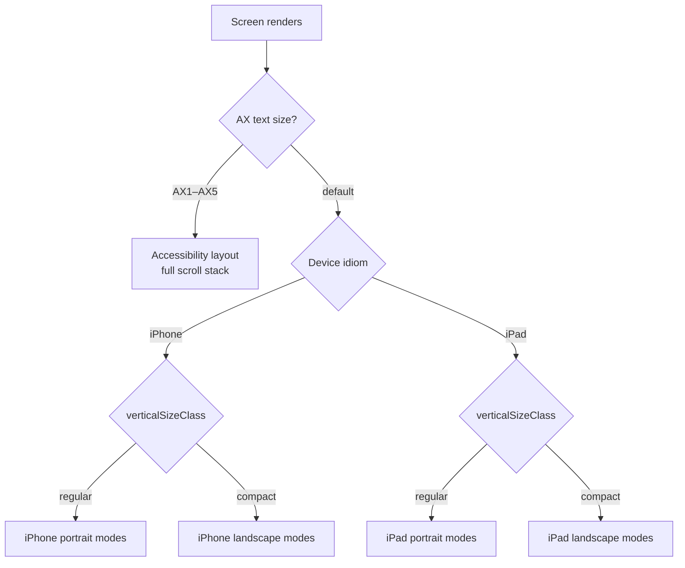
```mermaid
flowchart TD
    A[Screen renders] --> B{AX text size?}
    B -->|AX1–AX5| C[Accessibility layout\nfull scroll stack]
    B -->|default| D{Device idiom}
    D -->|iPhone| E{verticalSizeClass}
    D -->|iPad| F{verticalSizeClass}
    E -->|regular| G[iPhone portrait modes]
    E -->|compact| H[iPhone landscape modes]
    F -->|regular| I[iPad portrait modes]
    F -->|compact| J[iPad landscape modes]
```

### Signals

| Signal | Meaning | Reliable for phone vs pad? |
|--------|---------|---------------------------|
| `verticalSizeClass == .compact` | Landscape (short height) | Yes for orientation |
| `horizontalSizeClass == .regular` | Wide width | **No** — Pro Max landscape matches iPad |
| `UIDevice.current.userInterfaceIdiom == .pad` | iPad | **Yes** — always use for phone vs pad in landscape |

### Primary helpers

| Helper | True when |
|--------|-----------|
| `usesLandscapeIPhoneOnlyMatchScoringLayout` | iPhone landscape |
| `usesLandscapeIPadMatchScoringLayout` | iPad landscape |
| `usesIPadPortraitMatchScoringLayout` | iPad portrait |
| `usesSideBySideBottomScoringRegion` | iPad portrait **or** iPad landscape with **3+ players** (sidebar pad below active band) |
| `sideBySidePlayerCountThreshold` | `3` — sparse matches use the stacked iPhone shell on iPad |
| `usesAccessibilityMatchScoringLayout` | Dynamic Type AX1–AX5 |

---

## Match scoring shell (`MatchScoringBody`)

All live **X01** and **Cricket** matches use the same four-band shell:

| Band | Content |
|------|---------|
| **Header** | `MatchGameplayHeader` — back, title, undo |
| **Active band** | Current player card (X01) or active board column (Cricket iPad split only) |
| **Scoreboard** | Inactive players / opponents |
| **Pad chrome** | Checkout suggestion, bot banner, bust/error banners |
| **Pad** | `DartNumberPad` or `CricketTapPad` |

### Bottom region variants

```
iPhone (portrait + landscape)          iPad (portrait + landscape)
┌─────────────────────────┐            ┌──────────────────────────────┐
│ ACTIVE (full width)     │            │ ACTIVE (full width)          │
├─────────────────────────┤            ├──────────────────┬───────────┤
│ ▲ scroll              │            │ ▲ inactive       │ checkout  │
│ │ inactive scoreboard │            │ │ scoreboard       │ banners   │
│ ▼                       │            │ ▼                  │           │
│ pad chrome              │            │                    │  PAD      │
│ ┌─────────────────────┐ │            │                    │ 420/300pt │
│ │ PAD (full width)    │ │            │                    │ sidebar   │
│ └─────────────────────┘ │            └──────────────────┴───────────┘
└─────────────────────────┘
```

Controlled by `usesSideBySideBottomScoringRegion` → `usesFullWidthPadColumn` in `MatchScoringBody`.

| Platform | Bottom region | Pad width |
|----------|---------------|-----------|
| iPhone portrait | Stacked, full width | 100% |
| iPhone landscape | Stacked, full width | 100% |
| iPad portrait | Inactive scroll + sidebar pad | 420pt |
| iPad landscape | Inactive scroll + sidebar pad | 300pt |

**Solo match** (one player): pad spans full width; no inactive scoreboard column.

---

## X01 match

**Screen:** `Features/Play/X01/X01MatchScreen.swift`  
**Pad:** `Features/Play/X01/DartNumberPad.swift`

### Mode matrix

| Platform | Orientation | Active player | Inactive players | Pad | Pad grid |
|----------|-------------|---------------|------------------|-----|----------|
| iPhone | Portrait | Pinned top (always for 2P: top card is active) | Stacked below in scroll | Full width below | 7-column compact |
| iPhone | Landscape | Pinned top | Scroll below | Full width below | 7-column, shorter keys |
| iPad | Portrait (≤2P) | Stacked full width | Same as iPhone | Full width below | 7-column compact |
| iPad | Portrait (3+P) | Pinned top | Scroll left column | 420pt sidebar | 7-column compact in sidebar |
| iPad | Landscape (≤2P) | Pinned top | Stacked full width | Full width below | 7-column, shorter keys |
| iPad | Landscape (3+P) | Pinned top | Scroll left column | 300pt sidebar | 7-column compact in sidebar |
| Any | AX | No pin special-casing | Full vertical scroll | Full width in scroll | 4-column grid |

### Config summary placement

| Condition | Config line ("301, Double Out…") |
|-----------|-----------------------------------|
| iPhone portrait | Below header |
| iPhone landscape | In header (caption) |
| iPad (any) | In header (caption) |

### UI examples

**iPhone portrait — 2 players**

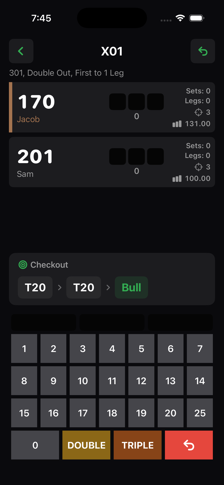

- Jacob (active) full-width card at top  
- Sam scrolls above the pad  
- Checkout banner directly above the 7-wide number pad  

**iPad portrait — 2 players**

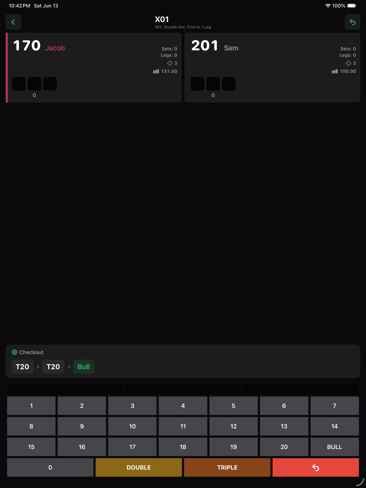

- Active card top; opponent + pad share the bottom row  
- Pad uses the 420pt sidebar with taller tap targets  

**iPad portrait — 8 players**


- Active card pinned; remaining seven scroll in the left column  

**iPhone landscape**

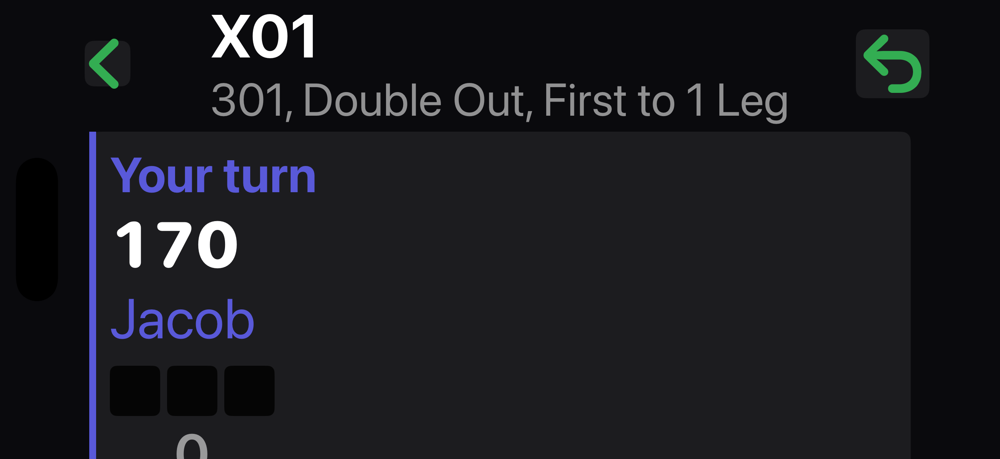

- Same stacked shell as portrait: active top, scroll, full-width pad  
- Config summary moves into the header  

### X01 pad key layout

```
Standard (iPhone + iPad sidebar)     Accessibility (AX)
┌─────────────────────────────┐      ┌──────────────────┐
│ [dart][dart][dart]  visit   │      │ visit preview    │
│  1  2  3  4  5  6  7        │      │ 4-column grid    │
│  8  9 10 11 12 13 14        │      │ 1 … 20, 25       │
│ 15 16 17 18 19 20 25        │      │ 0 DBL TPL UNDO   │
│  0  DBL  TPL  UNDO           │      └──────────────────┘
└─────────────────────────────┘
```

---

## Cricket match

**Screen:** `Features/Play/Cricket/CricketMatchScreen.swift`  
**Board / pad:** `Features/Play/Cricket/CricketBoardView.swift`

Cricket differs from X01: on **iPhone** the board is **not** split into active/inactive columns — the full multi-player board scrolls above the pad.

### Mode matrix

| Platform | Orientation | Board | Pad | Pad layout |
|----------|-------------|-------|-----|------------|
| iPhone | Portrait | Full board (all players), scrolls | Full width | 2×3 segment grid + bull/miss row |
| iPhone | Landscape | **Transposed** active-only board (targets as columns) | Full width, short | Single-row segments + modifiers |
| iPad | Portrait | Full board scrolls | Full width | 2×3 segment grid |
| iPad | Landscape | **Transposed** active-only board (same as iPhone) | Full width, short | Single-row segments + modifiers |
| Any | AX | Full board in scroll | Full width in scroll | Accessibility grid |

### Round / turn label

| Condition | Placement |
|-----------|-----------|
| iPhone portrait | Below header, above board |
| iPhone landscape | Inside scoreboard scroll (top of scroll content) |
| iPad landscape | Inside scoreboard scroll (top of scroll content) |

### UI examples

**iPhone portrait — 2 players**

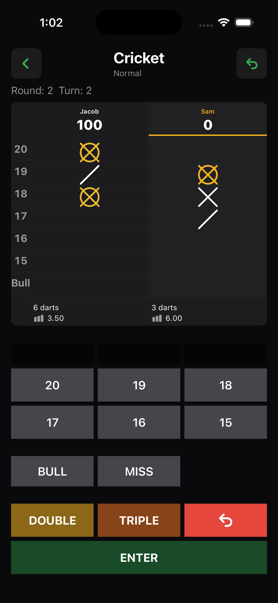

- Sam and Jacob columns in one board  
- Pad pinned at bottom, full width  

**iPad portrait**

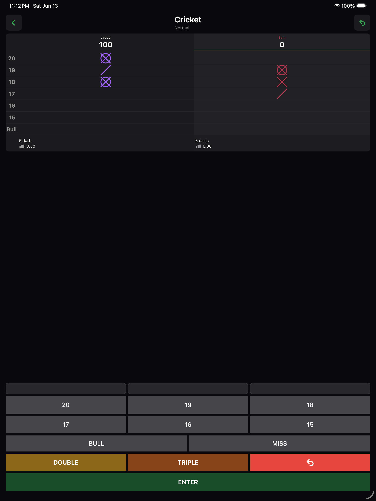

- Full board scrolls above the pad  
- Pad pinned at bottom, full width  

**iPhone landscape (transposed board)**

```
┌──────────────────────────────────────────────────┐
│ Header · Round 2 Turn 2                          │
├──────────────────────────────────────────────────┤
│  20   19   18   17   16   15   BULL              │
│  /    X    ·    ·    ·    ·                    │  ← active player only
│         (marks under each target)                │
├──────────────────────────────────────────────────┤
│ [d][d][d]                                        │
│ 20  19  18  17  16  15  BULL  MISS               │  ← wide shallow pad
│ DBL  TPL  UNDO              ENTER                │
└──────────────────────────────────────────────────┘
```

Regenerate: `Scripts/capture-appearance-matrix.sh` → `accessibility/wcag-2.1-aa/evidence/orientation/`

---

## Play setup (`SetupHomeView`)

**Helper:** `usesWideSetupHomeLayout` (iPad regular width, non-AX)

| Platform | Layout | Max content width |
|----------|--------|-------------------|
| iPhone | Single column: mode/options, then roster, sticky Start | Full width |
| iPad | **Two pane:** mode + options left, roster right | 920pt centered |
| AX (any) | Single column scroll; extra bottom padding | 920pt on iPad |

### UI examples

| | iPhone | iPad |
|---|--------|------|
| Portrait | 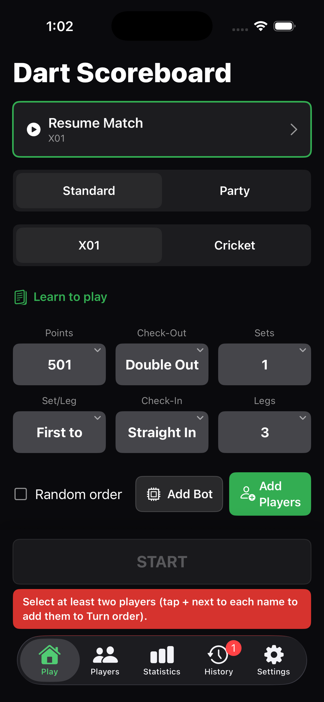 | 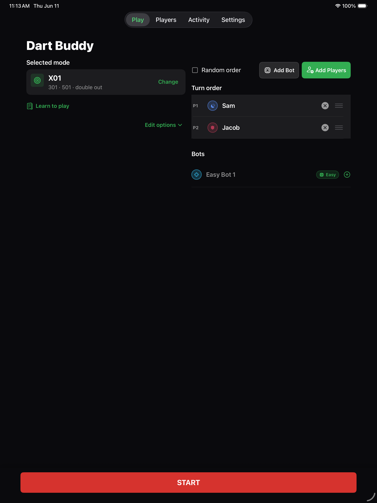 |
| Landscape | 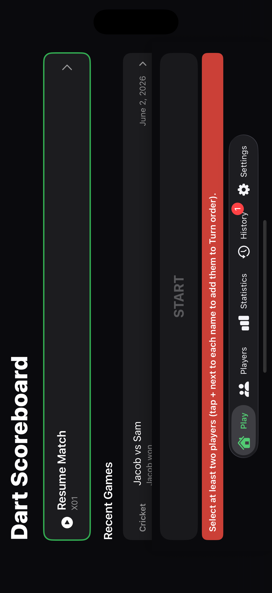 | Same two-pane at 920pt |

---

## Tab & list screens

**Screens:** Activity, Statistics, Players, Settings, Modes  
**Helper:** `contentMaxWidth` → **920pt** when `horizontalSizeClass == .regular`

| Platform | Behavior |
|----------|----------|
| iPhone | Edge-to-edge lists and filters |
| iPad | Centered column, 920pt max — side margins are intentional (master-detail deferred) |
| AX | `tabScrollBottomPadding` adds extra inset so rows clear the tab bar |

### UI examples

| Screen | iPhone | iPad |
|--------|--------|------|
| Activity history | 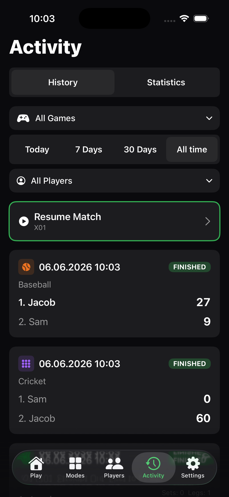 | 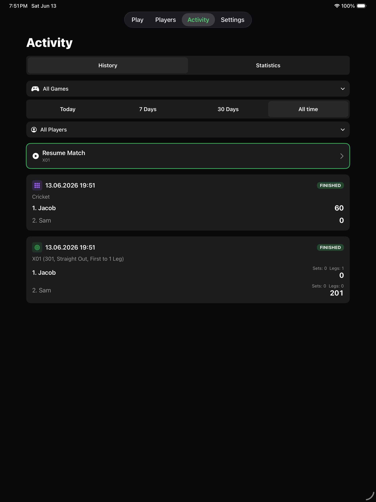 |
| Players | 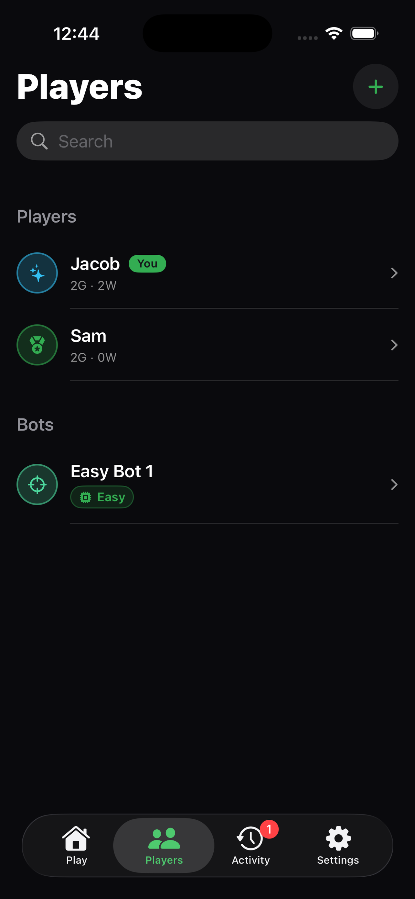 | 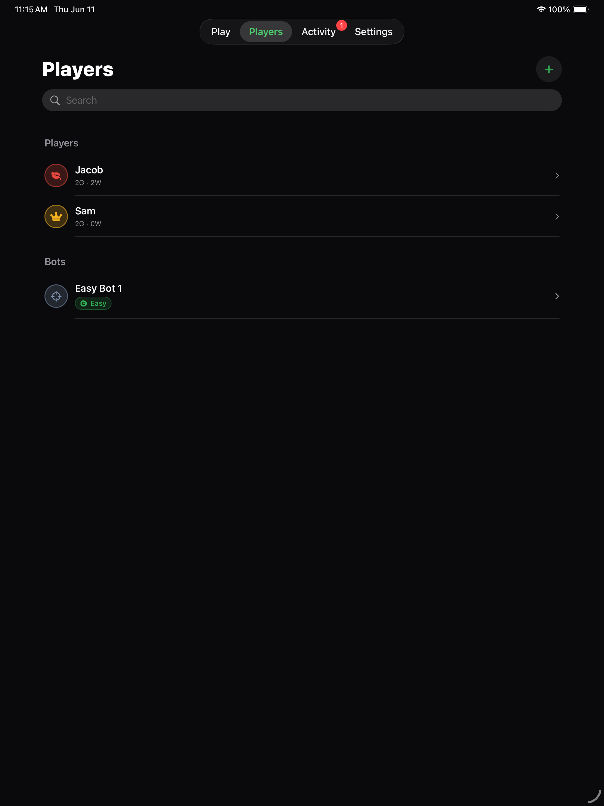 |
| Settings | 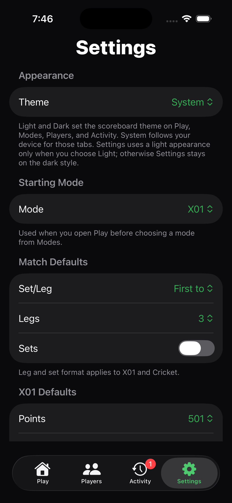 | 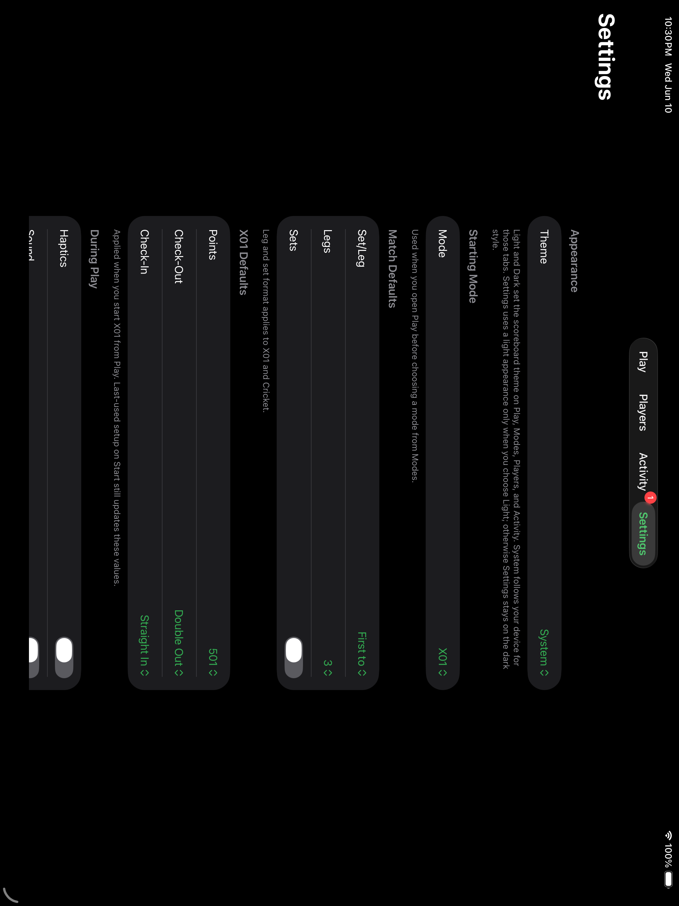 |

---

## Match summary

**Screen:** `Features/Play/Shared/MatchSummaryScreen.swift`

| Platform | Vertical alignment | Max width |
|----------|-------------------|-----------|
| iPhone | Top-aligned content | Full width |
| iPad | Top-aligned (not vertically centered) | 920pt |

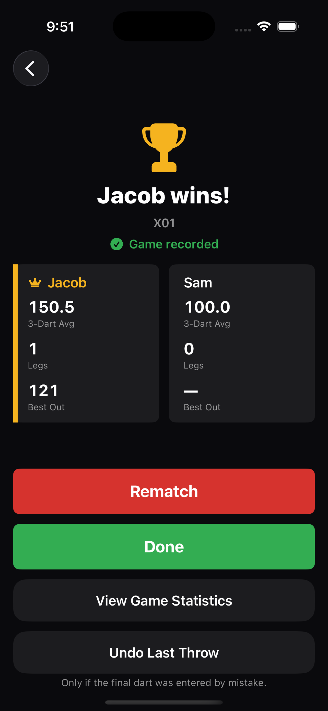  
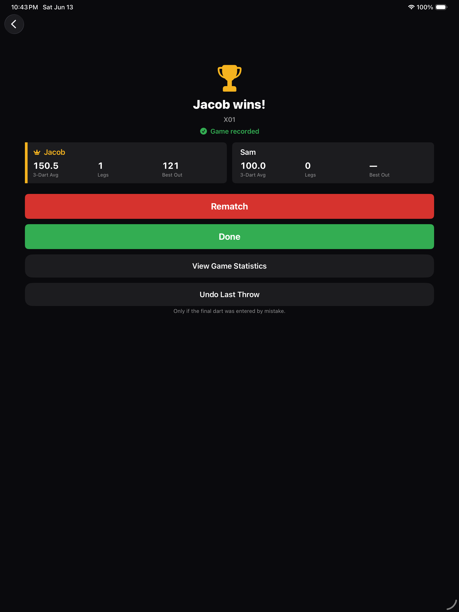

---

## Onboarding

**Chrome:** `Features/Onboarding/OnboardingStepChrome.swift`

| Platform | Hero content |
|----------|--------------|
| iPhone | Top-aligned in scroll |
| iPad | Vertically centered in available space above footer (`minHeight` from `GeometryReader`) |

Max content width on iPad: **560pt** (narrower than tab screens).

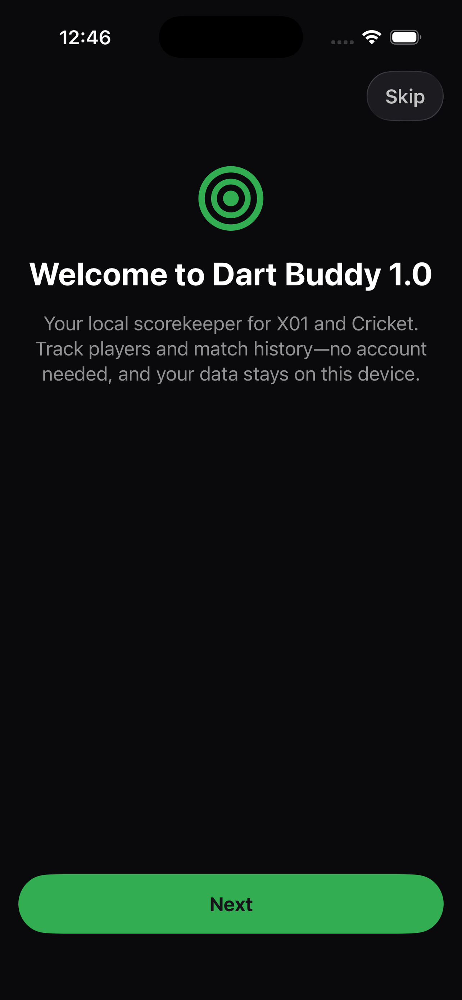  
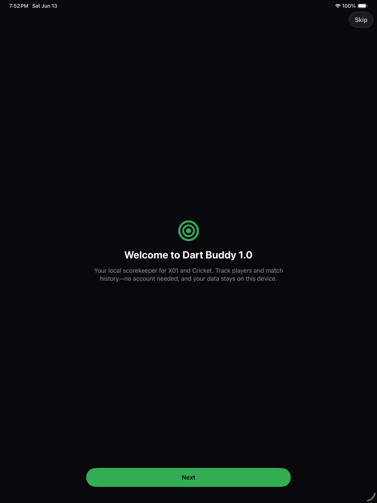

---

## Party modes (Baseball, Killer, Shanghai)

These screens use `SideBySideMatchBody` (wrapping `MatchScoringBody`) with `playerCount` from `scoreboardRows.count`. Sidebar layout follows the same **3+ player** threshold as X01/Cricket.

---

## Accessibility overrides (AX1–AX5)

When `usesAccessibilityMatchScoringLayout` is true:

| Area | Behavior |
|------|----------|
| Match body | Single `ScrollView` — active, scoreboard, banners, pad in one vertical stack |
| X01 pad | 4-column grid, larger keys |
| Cricket pad | Accessibility segment grid |
| Setup | Single column; no two-pane |
| Tab lists | Extra bottom scroll padding |

Evidence: `accessibility/screenshots/*_accessibility-extra-extra-extra-large.png`

---

## Pad width constants

| Constant | Value | Used when |
|----------|-------|-----------|
| `regularWidthScoringPadWidth` | 420pt | iPad portrait sidebar |
| `iPadLandscapeScoringPadWidth` | 300pt | iPad landscape sidebar |
| `landscapeScoringPadWidth` | 252pt | Legacy / tests (iPhone landscape uses full width) |
| `phonePortraitBottomPadMinWidth` | 220pt | Legacy; iPhone no longer uses sidebar pad |

---

## Regenerating UI examples

```bash
# App Store marketing (portrait)
./Scripts/capture-marketing-screenshots.sh
APPEARANCE=light ./Scripts/capture-marketing-screenshots.sh
./Scripts/capture-ipad-marketing-screenshots.sh

# Device frames (website / press)
./Scripts/frame-marketing-screenshots.sh

# Portrait + landscape × light + dark (setup + X01)
./Scripts/capture-appearance-matrix.sh
```

Snapshot launch args are documented in `marketing-screenshots/README.md`.

---

## Verification checklist

When changing layout predicates, confirm:

- [ ] Unit tests in `GameplayLayoutTests` cover `(regular, compact, isPad: false)` **and** `(regular, compact, isPad: true)` for any new helper  
- [ ] iPhone portrait X01: full-width pad, no clipped keys  
- [ ] iPhone portrait Cricket: full board, not active/inactive split  
- [ ] iPhone landscape Cricket: transposed board + wide pad  
- [ ] iPad portrait + landscape: sidebar pad 420pt / 300pt  
- [ ] Pro Max landscape UI (`iPhone 17 Pro Max`, `DartBuddyUILandscape` scheme)
- [ ] AX: single scroll stack, no pinned regions that clip  

---

## Related docs

- [`specs/AccessibilitySpec.md`](../specs/AccessibilitySpec.md) — orientation + Dynamic Type requirements  
- [`accessibility/wcag-2.1-aa/screens/cricket-match.md`](../accessibility/wcag-2.1-aa/screens/cricket-match.md) — Cricket-specific WCAG notes  
- [`docs/ux-design-review.md`](ux-design-review.md) — future iPad master-detail for tabs (D8)
