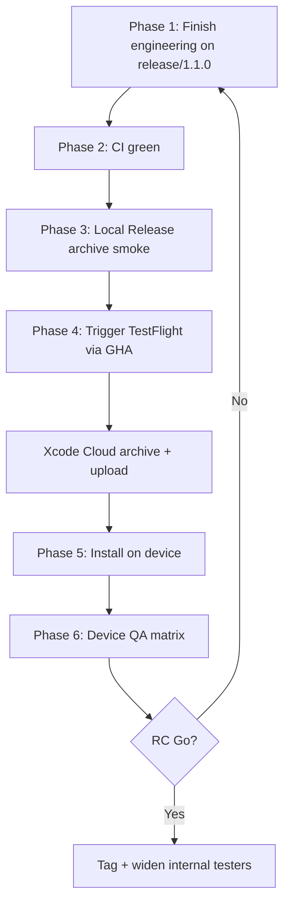

# Dart Buddy 1.1.0 — TestFlight RC Plan

How to take **`release/1.1.0`** from branch work to an **internal TestFlight RC** that matches the agreed 1.1 scope and passes RC gates.

**Companion:** [`1.1.0-ship-checklist.md`](1.1.0-ship-checklist.md) (device QA matrix) · [`branch-strategy.md`](branch-strategy.md) · [`xcode-cloud.md`](xcode-cloud.md)

---

## What “RC” means

A TestFlight build is an **RC** when all of this is true:

1. **Release configuration** — no debug launch args; `ProductSurface.party1_1` allowlist correct
2. **Version** — `MARKETING_VERSION` = `1.1.0`; build number assigned by Xcode Cloud / ASC
3. **CI gates green** — unit + accessibility + release-branch UI lean suite
4. **Archive succeeds** — signing, Firebase plist, Crashlytics dSYM upload
5. **Device QA pass** — physical iPhone, TestFlight install (no launch args)
6. **Metadata honest** — TestFlight notes match the binary

**Out of scope for RC:** App Store submit (step after RC Go).

---

## Locked 1.1.0 product surface

| In | Out |
|----|-----|
| X01, Cricket (Normal + Cut Throat) | Modes tab |
| Baseball, Killer, Shanghai | Other party modes (Golf, Fleet, …) |
| Around the Clock (practice) | Co-op (Raid), other practice modes |
| 4 tabs, preset + custom bots, English bundle | Training Partner, export, achievements UI, bundled de/es/nl/fr/… |

---

## End-to-end flow



**Suggested order:** Phase 0 → 1 → 2 → 3 → 4 → 5 → 6. App Store prep (Phase 7) only after RC Go.

---

## Phase 0 — Branch & record (~30 min)

| Step | Action |
|------|--------|
| 0.1 | Confirm `release/1.1.0` is on `git@github.com:jacobrozell/Dart-Buddy.git` (Xcode Cloud requires standard GitHub host, not SSH aliases) |
| 0.2 | Fill RC record in [`1.1.0-ship-checklist.md`](1.1.0-ship-checklist.md) — commit SHA, tester, iPhone model/iOS, TestFlight build # |
| 0.3 | Lock scope — RC fixes only; no new features on the branch |

**Push (local / agents):**

```bash
git push git@github.com-personal:jacobrozell/Dart-Buddy.git release/1.1.0
```

See [`.cursor/rules/git-push-jacobrozell.mdc`](../../.cursor/rules/git-push-jacobrozell.mdc).

---

## Phase 1 — Engineering completion (P0 blockers)

**Goal:** Branch ships the agreed 1.1 surface — not “party flag on = entire catalog.”

### 1.1 ProductSurface allowlist

Implement explicit reachability for Release builds:

```
standard.x01, standard.cricket
party.baseball, party.killer, party.shanghai
practice.aroundTheClock
```

Wire through:

- `ProductSurface.isMatchTypeReachable(_:)`
- `GameModeCatalog.available` / `playSetupPickerSections()`
- `pendingModeSelection` for practice
- Activity filters (derive from reachability)

**Acceptance:** Release build cannot start Golf, Raid, Mickey Mouse, or 180 ATC.

### 1.2 Play setup mode picker

Picker shows **only** reachable shipped modes — no co-op section, no planned stubs, no “+N more coming” for hidden catalog rows.

### 1.3 Resume & leak paths

Re-verify (unit tests + manual):

- Resume works for in-progress 1.1 modes
- Resume **blocked** for hidden modes (old TestFlight dogfood data)
- Play home badge respects reachability
- App Intents still off in Release

### 1.4 Version bump

In [`project.yml`](../../project.yml):

- `MARKETING_VERSION: 1.1.0`
- Bump `CURRENT_PROJECT_VERSION` when cutting a **new** RC after a failed QA cycle (Xcode Cloud may also auto-increment from TestFlight)

### 1.5 Release UI smoke tests

Update or add **`PartyPack1_1SmokeUITests`** (`Lean1_0SmokeUITests` still asserts 1.0 “no party modes”):

- 4 tabs, no Modes
- Picker lists exactly 6 modes
- Start match: Baseball, Killer (3p), Shanghai, Around the Clock
- Hidden: Golf, Raid, Training Partner, export
- What's New promo sheet dismisses (`testReleaseHighlightsSheetCanBeDismissed`)

Runs under `DartBuddyUILean` with `-enable_lean_product_surface` (on `release/1.1.0` → `party1_1`, not `lean1_0`).

### 1.6 Unit tests

- `ProductSurfaceTests` — Around the Clock reachable; Golf/Raid not
- `PlayHomeViewModelTests` / `AppRouteRouterTests` — party + practice resume

Local CI:

```bash
xcodegen generate
xcodebuild test -scheme DartBuddyCI \
  -destination 'platform=iOS Simulator,name=iPhone 17'
```

### 1.7 Merge hygiene

Before RC trigger: merge latest `master` hotfixes into `release/1.1.0`; re-run acceptance.

**Phase 1 exit:** All above on `release/1.1.0` and pushed.

---

## Phase 2 — CI / automation gates

**Goal:** Automated proof before burning an Xcode Cloud build.

### 2.1 GitHub Actions CI (`DartBuddyCI`)

**Gap:** [`.github/workflows/ci.yml`](../../.github/workflows/ci.yml) runs on `master`, `main`, `dev` pushes only — **not** `release/*`.

**Options:**

| Option | How |
|--------|-----|
| **A (recommended)** | Open PR `release/1.1.0` → `master` — CI runs on PR |
| **B** | Add `release/**` to `ci.yml` `on.push.branches` |
| **C** | Rely on local `xcodebuild test` only (not recommended for RC) |

**Required green:** lint, build-for-testing, `DartBuddyCI` unit + accessibility.

### 2.2 Nightly UI — Lean suite on release branch

[`.github/workflows/nightly-ui.yml`](../../.github/workflows/nightly-ui.yml) job **`ui-lean`** runs on `release/*` pushes, or via Actions → **Nightly UI Tests** → `workflow_dispatch`.

**Required green:** `DartBuddyUILean` after Phase 1.5 test updates.

### 2.3 Optional before RC

- `DartBuddyUIAccessibility` — Baseball/Shanghai WCAG spot check
- `DartBuddyUIGameplay` — X01/Cricket regression via nightly dispatch

**Phase 2 exit:** CI + UILean green on RC commit SHA.

---

## Phase 3 — Local Release archive validation (1–2 hours)

**Goal:** Catch signing / Firebase / Crashlytics issues before Xcode Cloud.

On Mac with Xcode 26.2 + real [`GoogleService-Info.plist`](../../Resources/GoogleService-Info.plist):

```bash
xcodegen generate
```

1. Scheme **`DartBuddy`**, configuration **Release**
2. **Product → Archive**
3. Validate: team `7JT2JB89AV`; Crashlytics script OK (no `REPLACE_WITH`); no debug `print`
4. Optional: install Release on device **without** `-enable_full_product_surface` — confirm 6 modes, no Modes tab

**Phase 3 exit:** Archive succeeds; allowlist spot-check passes.

---

## Phase 4 — Trigger TestFlight RC build

**Goal:** Upload to **Internal Testing** via Xcode Cloud.

### Prerequisites

See [`xcode-cloud.md`](xcode-cloud.md): Release workflow, `GOOGLE_SERVICE_INFO_PLIST_BASE64`, GitHub ASC secrets, `#dart-buddy-releases` Notify.

### Ensure ASC knows the branch

If trigger fails with `no scmGitReference found`: confirm branch on GitHub (`github.com`); re-sync repo in ASC.

### Trigger

**GitHub Actions:** **Trigger TestFlight** → branch **`release/1.1.0`**

```bash
gh workflow run trigger-testflight.yml -f branch=release/1.1.0
```

**Alternate:** ASC → Xcode Cloud → **Release** → Start Build → `release/1.1.0`.

### Monitor (~20–30 min)

- GHA prints `Xcode Cloud build started: <id>`
- Log: `ci_post_clone.sh` → `xcodegen` OK; Firebase plist decoded; TestFlight upload OK
- `#dart-buddy-releases` notification

### TestFlight metadata

**What to Test:** party modes + Around the Clock; 4-tab shell; English only.

**Phase 4 exit:** Build **Ready to Test**; installs on physical iPhone.

---

## Phase 5 — Device QA on TestFlight build (P0)

**Goal:** Prove RC on real hardware. Work [`1.1.0-ship-checklist.md`](1.1.0-ship-checklist.md) §4–§6.

**Phase 5 exit:** No P0 defects; P1s triaged.

---

## Phase 6 — RC Go / No-Go

| Decision | Criteria |
|----------|----------|
| **Go** | Phases 1–5 complete; CI green; device matrix pass; metadata honest |
| **No-Go** | Wrong modes reachable, Killer pick broken, crash on resume, lean CI red |

**On Go:**

1. Tag: `v1.1.0-rc.1` (or `-rc.2`, …)
2. Widen internal TestFlight / optional external beta
3. Start App Store prep (Phase 7)

**On No-Go:** fix on `release/1.1.0` → Phases 2–5 again.

---

## Phase 7 — After RC (post-TestFlight, pre–App Store)

Only after RC Go:

- [ ] App Store screenshots: Baseball, Killer, Shanghai, Around the Clock
- [ ] Listing copy updated (no Modes tab / co-op / Training Partner claims)
- [ ] [`estimated-releases.json`](estimated-releases.json): `practice.aroundTheClock` → `1.1`
- [ ] Submit for review in ASC
- [ ] Merge `release/1.1.0` → `master` after approval

---

## Command reference

| Task | Command / location |
|------|-------------------|
| Generate project | `xcodegen generate` |
| Unit + a11y CI | `xcodebuild test -scheme DartBuddyCI -destination 'platform=iOS Simulator,name=iPhone 17'` |
| Lean UI | `xcodebuild test -scheme DartBuddyUILean -destination 'platform=iOS Simulator,name=iPhone 17'` |
| Push release branch | `git push git@github.com-personal:jacobrozell/Dart-Buddy.git release/1.1.0` |
| Trigger TestFlight | GHA **Trigger TestFlight** → `release/1.1.0` |
| Xcode Cloud | [`xcode-cloud.md`](xcode-cloud.md) |

---

## Known gaps (block RC until done)

| # | Gap | Status |
|---|-----|--------|
| 1 | Explicit `partyPack1_1CatalogIDs` allowlist (not all party modes when `showsPartyModes`) | **Done** — `ProductSurface.swift` |
| 2 | Around the Clock reachable without Modes tab | **Done** — in allowlist |
| 3 | `PartyPack1_1SmokeUITests` for 1.1 picker + highlights | **Done** |
| 4 | CI on `release/*` push | **Done** — `ci.yml` includes `release/**` |
| 5 | `estimated-releases.json` ATC tag | **Done** — `practice.aroundTheClock` → `1.1` |
| 6 | TestFlight RC build + device QA matrix | **Open** — Phases 4–5 |
| 7 | App Store screenshots + listing copy | **Open** — [`1.1.0-app-store-copy.md`](1.1.0-app-store-copy.md) |

---

## Suggested timeline

| Day | Work |
|-----|------|
| 1 | Phase 1 (allowlist, picker, tests) + push |
| 2 | Phase 2 CI + Phase 3 local archive |
| 3 | Phase 4 TestFlight trigger + install |
| 4–5 | Phase 5 device QA (Killer needs 3 players) |
| 6 | RC Go + tag; start store assets |

---

## RC iteration loop

```text
fix on release/1.1.0 → push → CI + UILean green → Trigger TestFlight → device QA → Go / No-Go
```

---

**Last reviewed:** 2026-06-23
