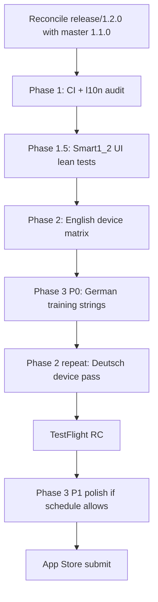

# Dart Buddy 1.2.0 — Training Partner test & polish plan

How to validate and finish **Training Partner** bots for the 1.2.0 store release.

**Scope lock:** [`1.2.0-ship-checklist.md`](1.2.0-ship-checklist.md) · **Spec:** [`TrainingBotSpec.md`](../../specs/TrainingBotSpec.md) · **Bots:** [`BotOpponentSpec.md`](../../specs/BotOpponentSpec.md)

**Last updated:** 2026-06-28

---

## What ships in 1.2.0

| Feature | Store reachability |
|---------|-------------------|
| **Training Partner** | `ProductSurface.showsTrainingBots` on `smart1_2` |
| **Create / link** | One bot per human (`linkedPlayerId`) |
| **Eligibility** | 5 completed games **per mode** (X01 and Cricket counted separately) |
| **Skill calibration** | Snapshot at match start from `PlayerStatBreakdown` |
| **Primary modes** | X01 + Cricket (spec MVP); party/practice use X01-derived profile |
| **Practice Pack + Golf** | Bob's 27, Halve-It, and Golf added to release allowlist (10 modes total) |

---

## Current test coverage (baseline)

### Unit — green today

| Suite | What it proves |
|-------|----------------|
| `TrainingBotServiceTests` | Eligibility threshold, X01/Cricket skill formulas, party-mode fallback, caps |
| `TrainingBotRepositoryTests` | Create, fetch, duplicate rejection, skill resolution |
| `TrainingBotNamingTests` | Default display name |
| `MatchSetupViewModelTests` | Roster lists training bots, add to setup, skill snapshot on start |
| `BotParticipantFactoryTests` | Training kind + snapshot wiring |
| `ProductSurfaceTests` | `showsTrainingBots` on `smart1_2` |

### UI — requires `-enable_full_product_surface` or `smart1_2` release build

| Suite | What it proves |
|-------|----------------|
| `PlayerDetailUITests` | Eligibility progress, create button gating, seeded partner on list |
| `MatchSetupUITests` | Training Partner in Add Bot menu, roster selection |
| `Lean1_0SmokeUITests` | **Negative** — lean hides training (invert for 1.2 lean suite) |

### Gaps to close for 1.2 RC

- [ ] **No dedicated UI lean test** on `release/1.2.0` that asserts Training Partner **visible**
- [ ] **No device matrix** for full create → play → summary loop on physical iPhone
- [ ] **No German UI pass** on Training Partner strings (`de.lproj`)
- [ ] **Party-mode + practice** training bot playback not device-verified (engine uses X01 profile)
- [ ] **Analytics** — confirm `training_bot_created` / `training_bot_match_started` in TestFlight ([`FirebaseBackendAnalyticsSpec.md`](../../specs/FirebaseBackendAnalyticsSpec.md))
- [ ] **Cut Throat Cricket** — confirm eligibility uses correct stat breakdown slice
- [ ] **Zero-game bot averaging UX** — P1 in release todo ([`todo.md`](todo.md))

---

## Phase 1 — Automated gates (engineering)

Run on **`release/1.2.0`**, Release configuration, no launch args.

| Step | Command / target | Pass criteria |
|------|------------------|---------------|
| 1.1 | `xcodegen generate` | Clean |
| 1.2 | `xcodebuild test -scheme DartBuddyCI -destination 'platform=iOS Simulator,name=iPhone 17'` | Green |
| 1.3 | Filter: `TrainingBot`, `ProductSurface`, `MatchSetupViewModel` training tests | All pass |
| 1.4 | `python3 Scripts/l10n.py audit` | No `de` gaps for `trainingBot.*` keys |
| 1.5 | Add **`Smart1_2SmokeUITests`** (or extend lean suite) | See § Phase 1.5 below |

### Phase 1.5 — New UI lean tests (implement on `release/1.2.0`)

| Test | Launch args | Assert |
|------|-------------|--------|
| `testSmart12PlayerDetailShowsTrainingPartner` | `-seed_demo` `-enable_lean_product_surface` | `training_bot_eligibility_progress` exists |
| `testSmart12AddBotListsTrainingPartner` | `-seed_demo` + demo with eligible Alice partner | `training_bot_add_setup` tappable |
| `testSmart12LeanHidesChaseTheDragon` | `-enable_lean_product_surface` | Mode picker has Bob's 27 + Halve-It, **not** Chase the Dragon |
| `testSmart12PracticePackSelectable` | `-enable_lean_product_surface` | Select Bob's 27 from mode picker → setup loads |

Wire into **`DartBuddyUILean`** scheme (same as 1.1 party lean).

---

## Phase 2 — Device QA matrix (P0 before TestFlight)

Physical **iPhone**, Release or TestFlight, **English** first then **Deutsch** repeat for rows marked 🌐.

### 2.1 Eligibility & create

| # | Steps | Expected |
|---|--------|----------|
| E1 | Fresh install → Play 4 X01 games with human → Player detail | Progress shows 4/5, Create **disabled** |
| E2 | Complete 5th X01 → Player detail | Create **enabled** |
| E3 | Tap Create | Bot appears on Players list; linked to human |
| E4 | Try create again | Blocked (one partner per human) |
| E5 | Play 4 Cricket games (X01 already eligible) | Cricket progress independent; X01 partner already exists 🌐 |

### 2.2 Setup & roster

| # | Steps | Expected |
|---|--------|----------|
| S1 | Play setup → Add Bot | Training Partner section lists linked bot |
| S2 | Add partner + human → Start X01 501 | Match starts; bot takes turns |
| S3 | Remove partner from roster → Add Bot again | Same bot re-addable |
| S4 | Start match with partner + 2 humans (Killer) | Validation passes or clear error per min players |

### 2.3 Match play & skill feel

| # | Mode | Expected |
|---|------|----------|
| M1 | X01 501 vs Training Partner | Bot scores plausible for your stats (~4% above avg); checkout behavior sane |
| M2 | Cricket Normal vs partner | MPR-calibrated throws; marks accumulate |
| M3 | Cricket Cut Throat vs partner | Same as M2 (verify no crash / wrong engine path) |
| M4 | Baseball with partner as opponent | Bot uses X01-derived profile; match completes |
| M5 | Bob's 27 solo (no partner) | Solo drill unaffected |
| M6 | Bob's 27 — **defer** partner unless engine supports bots | Document if solo-only |

### 2.4 Summary, history, stats

| # | Steps | Expected |
|---|--------|----------|
| H1 | Complete X01 vs partner → Summary | Winner/loser correct; partner name shown |
| H2 | Activity → filter by mode | Match listed |
| H3 | Player detail → partner stats | Games increment; no “0 games” averaging bug |

### 2.5 Export / import 🌐

| # | Steps | Expected |
|---|--------|----------|
| X1 | Export DBPE with training partner | File includes linked bot |
| X2 | Import on clean install | Partner relinks correctly; eligibility state sane |

---

## Phase 3 — Polish & flesh-out (ship-quality)

Prioritized backlog before App Store submit:

### P0 (block RC if broken)

1. **Mode picker hygiene** — unreachable modes not tappable (`isCatalogEntryReachable` on `pendingModeSelection`) ✅ landed with Practice Pack lock
2. **German copy** — audit `trainingBot.*`, `players.trainingPartner.*`, Add Bot menu in `de`
3. **Lean UI suite** — Phase 1.5 tests in CI on `release/*` pushes

### P1 (fix in 1.2.0 if time; else 1.2.1)

4. **Player detail progress copy** — mode-aware strings when switching X01 vs Cricket tab
5. **Practice shortcuts** — Player detail “Practice X01 with partner” deep-link to setup (spec §5)
6. **Bot skill transparency** — show calibrated avg/MPR on bot detail (mirror preset bot customize UX)
7. **Party mode bot tuning** — validate Baseball/Killer/Shanghai bot turns feel fair; adjust `DartBotEngine+Party` if needed
8. **Bob's 27 skill path** — `TrainingBotSkillResolver` uses easy fallback only; decide if X01-derived is enough for 1.2

### P2 (post-1.2)

9. **Re-calibrate after N games** — spec §10 future
10. **Cut Throat eligibility** — separate from Normal Cricket?
11. **Training Partner in Raid** — co-op + training bot policy (likely humans-only for Raid)

---

## Phase 4 — Analytics & support

| Item | Owner | Done |
|------|-------|------|
| Log `training_bot_created` on create | Engineering | [ ] |
| Log `training_bot_match_started` on first bot turn | Engineering | [ ] |
| GA4 custom dimension for `bot_kind=training` if not already | Analytics ops | [ ] |
| Support FAQ — what is Training Partner, eligibility | Docs / website | [ ] |
| Privacy policy — no change expected (local stats only) | Legal review | [ ] |

---

## Phase 5 — RC sign-off

Checklist owner fills [`1.2.0-ship-checklist.md`](1.2.0-ship-checklist.md) when:

- [ ] Phase 1 automated gates green on RC commit SHA
- [ ] Phase 2 device matrix — all **P0** rows pass (English + German 🌐 rows for 1.2)
- [ ] Phase 3 **P0** items closed
- [ ] No P0/P1 Training Partner bugs in Crashlytics during internal TestFlight week

---

## Suggested execution order

**Parallel track:** Practice Pack (Bob's 27, Halve-It) device QA can run alongside M5/M6 — same mode picker surface.

---

## Related files

| Area | Path |
|------|------|
| Eligibility | `Domain/Services/TrainingBotEligibilityService.swift` |
| Skill resolver | `Domain/Services/TrainingBotSkillResolver.swift` |
| Player UI | `Features/Players/PlayerStatsDetailView.swift` (`TrainingPartnerSection`) |
| Setup roster | `Features/Play/Setup/SetupHomeRosterSection.swift` |
| Demo seed | `App/Bootstrap/DemoSeeder.swift` (Alice + 5 games + partner) |
| UI helpers | `Tests/UI/Support/UITestMatchSetupHelpers.swift` |
