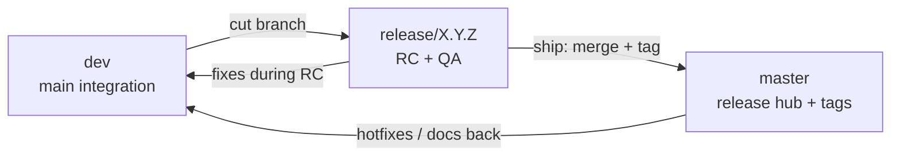

# Branch strategy — dev vs release vs master

How Dart Buddy separates **daily integration** on `dev`, **App Store RC work** on release branches, and **shipped snapshots** on `master`.

---

## Branches

| Branch | Role | Purpose |
|--------|------|---------|
| **`dev`** | **Main development** | All feature work lands here first — full catalog, all locales in repo, internal TestFlight builds |
| **`release/X.Y.Z`** | App Store RC | Trimmed `ProductSurface` + bundle policy for one store version; device QA and Connect ops |
| **`master`** | **Release hub** | Tagged snapshots of what shipped — merge each released `release/X.Y.Z` here; not the day-to-day integration branch |

| Release branch | Product surface | Store version |
|----------------|-----------------|---------------|
| **`release/1.0`** | Lean 1.0 (`ProductSurface.lean1_0`) | 1.0 — X01 + Cricket, English |
| **`release/1.1.0`** | Party Pack + Raid (`ProductSurface.party1_1`) | 1.1 — shipped (tag `1.1.0` on `master`) |
| **`release/1.2.0`** | Smart Opponents (`ProductSurface.smart1_2`) | 1.2 — Training Partner, export, **German**, **Practice Pack** (9 modes) |

**Rule:** Never delete shipped code to “trim” a release. Release branches change **reachability** via `ProductSurface` (and optionally `project.yml` locale lists), not engine removal.

---

## Workflow

1. **Integrate on `dev`** — features, locales, specs, CI green.
2. **Cut `release/X.Y.Z` from `dev`** when the train slice is ready (or refresh an existing release branch with `dev` merges during RC).
3. On the release branch: set `ProductSurface` default, trim `project.yml` locales if needed, run **`DartBuddyUILean`**, device QA.
4. **Submit** from the release branch (TestFlight → App Review).
5. **Ship:** merge `release/X.Y.Z` → **`master`**, tag (e.g. `1.2.0`).
6. **Back-merge** release → `dev` (and any `master` hotfixes) so integration stays current.

Do **not** treat `master` as the branch where ongoing feature work happens — that is **`dev`**.

---

## `ProductSurface` on `dev`

On `dev`, engineers dogfood the full catalog:

- Modes tab visible
- All shipped `MatchType` values reachable from setup and resume
- All locale files in repo; `project.yml` bundles every shipped `.lproj` for internal builds
- Release-branch archives flip `ProductSurface` defaults on that branch only

**Internal TestFlight (`dev`):** Release archives may set `DART_BUDDY_INTERNAL_BUILD` in `project.yml` — full surface, achievements, App Intents. Store **release/** branches omit this flag.

---

## CI implications

| Suite | `dev` / PR | `release/*` |
|-------|------------|-------------|
| `DartBuddyCI` (unit + accessibility) | Every PR | Every PR |
| Nightly UI matrix (smoke, gameplay, a11y, l10n, landscape, chrome) | Yes | Yes |
| `DartBuddyUILean` | Skipped | **Required** |

---

## Launch arguments (reference)

| Argument | Use |
|----------|-----|
| `-enable_full_product_surface` | CI UI tests on lean-default Release builds; dogfood full catalog |
| `-enable_lean_product_surface` | Force lean / store slice on Debug or marketing captures |
| `-enable_achievements` | Debug / UI tests for achievement hooks |
| `-ui_test_reset` | Clean in-memory store for UI tests |

Do **not** ship App Store builds with `-enable_full_product_surface` or `DART_BUDDY_INTERNAL_BUILD`.

---

## Related docs

- [`ongoing-release-plan.md`](ongoing-release-plan.md) — version slices
- [`release-tagging.md`](release-tagging.md) — **Estimated release** tags on specs
- [`estimated-release-registry.md`](estimated-release-registry.md) — per-feature store train
- [`lean-1.0-implementation-plan.md`](lean-1.0-implementation-plan.md) — 1.0 `ProductSurface` fields
- [`1.2.0-ship-checklist.md`](1.2.0-ship-checklist.md) — 1.2 German + Smart Opponents RC
- [`docs/feature-inventory.md`](../feature-inventory.md) — shipped vs planned features
