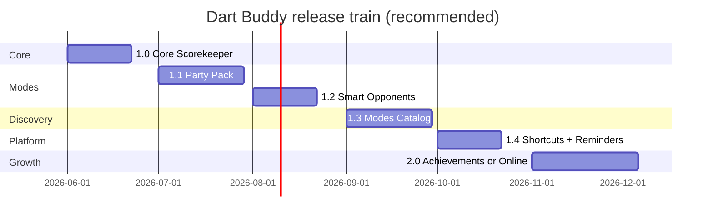

# Dart Buddy — Ongoing Release Plan

Strategy: ship a **small, well-tested core** first, then add surface area in versioned slices. Each release has explicit **in / out / hide** boundaries, a **QA bar**, and **exit criteria** before the next slice ships.

**Companion docs:** [`feature-inventory.md`](../feature-inventory.md) (what exists) · [`branch-strategy.md`](branch-strategy.md) (`dev` vs `release/*`) · [`release-tagging.md`](release-tagging.md) (store release tags) · [`estimated-release-registry.md`](estimated-release-registry.md) (per-feature train) · [`todo.md`](todo.md) (current sprint) · [`release_checklist.md`](release_checklist.md) (device QA — **needs update** for Activity/Modes IA)

**Last reviewed:** 2026-06-22

**1.0 status:** **Shipped** — App Store **1.0.0 (7)**, released 2026-06-22. Git tag `1.0.0` on `7df4358` (2026-06-20). Next slice: **1.1 Party Pack**.

---

## Principles

1. **Test confidence drives ship order** — unit tests alone are not enough for user-facing modes; each release adds features that pass a defined device matrix.
2. **Hide beats delete** — defer features with flags or catalog `status: .planned` rather than ripping out engines mid-RC.
3. **No “coming soon” bloat** — a catalog of 24 unreleased modes is marketing noise until you can ship the next batch; hide or shrink it in 1.0.
4. **One schema bump per major feature wave** — party modes and bot types already landed in `SchemaV2`; avoid shipping half-tested modes that force another migration before users have data.

---

## Test confidence matrix (today)

Derived from commit history + `Tests/` coverage. This is why the plan splits the way it does.

| Feature | Unit / simulation | UI / WCAG | Release checklist | Confidence |
|---------|-------------------|-----------|-------------------|------------|
| X01 | Strong | 8 UI + WCAG | §1–§2 core matrix | **High** |
| Cricket (Normal) | Strong | 9 UI + WCAG | §1–§2 core matrix | **High** |
| Cricket (Cut Throat + MPR board) | Strong | 2 UI (start + bot turn) | Not explicit | **Medium** |
| Baseball | Strong + bot sim | WCAG contract only | Not in checklist | **Medium-low** |
| Killer | Strong + bot sim | Catalog prefill only | Not in checklist | **Low** |
| Shanghai | Strong + bot sim | WCAG contract only | Not in checklist | **Medium-low** |
| Preset bots (X01/Cricket) | Strong | Via mode UI tests | Implicit | **High** |
| Training Partner bots | Strong | PlayerDetail + setup UI | Not in checklist | **Medium** |
| Custom bots | Unit + lean UI smoke | Simple UI in 1.0; Advanced UI phased | Checklist §3 custom bot rows | **Medium** (architecture plan) |
| Play setup / lifecycle | Strong | MatchSetup UI | Partial | **High** |
| History + Statistics | Strong | HistoryDetail UI | §1 (Statistics named) | **High** |
| Activity tab (merged) | Some | 1 UI test | Checklist **stale** (old tab names) | **Medium** |
| Modes tab + catalog | Catalog unit | 1 UI test | Not in checklist | **Low** |
| Onboarding | Unit | 4 UI tests | Not in checklist | **Medium** |
| Player export (DBPE) | Unit | Button exists only | Not in checklist | **Low** |
| Deep links V1 | Parser + bridge unit | None | Not in checklist | **Medium** (low exposure) |
| App Intents | Partial | None | Flag **off** | **N/A for 1.0** |
| Localization de/es/nl | Parity unit | 3 smoke UI each | Optional listing QA | **Medium** (strings) |
| iPad layouts | Layout unit | Screenshot scripts | Optional | **Medium** |
| Turn-total TTS caller | Unit | None | Not in checklist | **Low** |
| Bootstrap store recovery | CI migration test | Corrupt-store relaunch on device | Open todo | **Low** |
| Firebase Analytics/Crashlytics | Config tests | N/A | Privacy checklist | **Medium** (ops) |

**Recent high-churn areas** (commits since ~Baseball merge): Activity/Modes tab restructure, deep links, Liquid Glass nav, party mode polish, Training Partner — all landed **after** the original 1.0 QA matrix was written.

---

## Inventory gaps (found via commit history)

These are implemented but missing or under-specified in [`feature-inventory.md`](../feature-inventory.md):

| Feature | Status | Evidence |
|---------|--------|----------|
| Cricket Cut Throat + Points On/Off | Shipped (under Cricket) | `feature/cricket-cut-throat-mpr-board`, `CricketMatchUITests` |
| Live MPR board (Cricket) | Shipped | Same branch; layout tests |
| Game rules / Learn to play sheet | Shipped | `GameRulesGuideView`, onboarding learn step |
| App Store update prompt | Shipped | `AppStoreUpdateChecker`, `MainTabView` |
| Liquid Glass / system navigation policy | Shipped | `SystemNavigationPolicy`, commit `541784a` |
| Per-mode accent + monospaced score digits | Shipped | `GameModeAccent`, commit `d4700a2` |
| Recent Games removed from Play home | Shipped (simplification) | commit `207aebb` |
| Bot pacing settings | Shipped | Settings + `FeedbackServices` |
| SchemaV2 freeze + V1→V2 migration CI | Shipped | commit `498bf07`, `SwiftData.md` §15 |
| CI test coverage reporting | Shipped (infra) | commit `6436e62` |
| Marketing strategy / launch materials | Shipped (docs) | commit `8af197b` |
| Three-altitude `ModeStatKind` model | Partial | commit `3887455` |
| Release checklist tab IA | **Stale** | Still lists History/Statistics tabs, not Activity/Modes |

---

## Release train

Timelines are indicative — **exit criteria** matter more than calendar dates.

---

## 1.0 — Core Scorekeeper

**Status:** **Shipped** — App Store **1.0.0 (7)** (2026-06-22). Tag `1.0.0` → commit `7df4358`.

**Positioning:** Free, ad-free X01 & Cricket scorekeeper. Local-first. No party modes, no bot complexity, no mode catalog teaser.

> **Approved (2026-06-06):** Lean 1.0 · **English only** · Analytics + Crashlytics on. Implementation tasks: [`lean-1.0-implementation-plan.md`](lean-1.0-implementation-plan.md).

### In scope

| Area | Include |
|------|---------|
| **Game modes** | X01 (301/501, double-out, checkout suggester) · Cricket Normal · Cricket Cut Throat |
| **Tabs** | Play · Players · **Activity** (History + Statistics) · Settings — **4 tabs, no Modes** |
| **Bots** | Preset difficulty (Very Easy → Pro) + custom bots (tunable X01 avg / Cricket MPR) |
| **Players** | CRUD, archive, delete guards, avatars |
| **Core flows** | Setup → match → summary · resume · undo · settings reset |
| **Onboarding** | First launch + replay from Settings |
| **Rules** | In-app rules sheet for X01 + Cricket only |
| **Locale** | **English only** for store listing *or* en+de/es/nl if you complete localized screenshot + smoke pass (CI already covers strings) |
| **Telemetry** | Crashlytics **on** · Analytics **on** (allowlist) or **off** if you want minimal privacy story for v1 |
| **Platform** | iPhone-first; iPad runs but not marketed |

### Out of scope (hide, don’t delete)

| Area | Action | Rationale |
|------|--------|-----------|
| **Modes tab** | Remove from tab bar for 1.0; Play setup uses Standard category only | Tab is weeks old; 1 UI test; 24 “coming soon” cards |
| **Party modes** | Set `PartyGame.isAvailable = false` for baseball/killer/shanghai **or** hide Party category in setup | No gameplay UI smoke; not in release checklist |
| **Training Partner bots** | Hide from Add Bot menu and Player Detail | Medium unit coverage, weak device QA |
| **Player export** | Hide export button | Unit tests only; recovery export still planned separately |
| **Deep links** | Keep code; don’t document in App Store | Low risk if not advertised |
| **App Intents** | Keep flag **off** | Already default |
| **Turn-total TTS** | Default **off** in fresh install | No device QA |
| **App Store update prompt** | Optional keep (low risk) or disable for 1.0 | Minor surface |
| **Tip jar** | External link removed for 1.0 (3.1.1) | StoreKit plan: [`../plans/storekit-tip-jar-plan.md`](../plans/storekit-tip-jar-plan.md) |

### QA bar (must pass before submit)

- [ ] Update [`release_checklist.md`](release_checklist.md) for **Play · Players · Activity · Settings** IA
- [ ] Device matrix: X01 + Cricket Normal + **Cut Throat** full match each; resume; undo; history detail; stats filter
- [ ] Onboarding cold start + replay
- [ ] Bootstrap store recovery smoke (open todo)
- [ ] AXXXL spot check on setup + X01 match (accept or fix — owner decision)
- [ ] App Store assets match **actual** 1.0 surface (no party mode screenshots)

### Exit criteria → 1.1

- `QA-Signoff-RC1.md` **Go** with 1.0 scope only
- App Store approved or TestFlight stable 1 week with no P0 crashes
- Party mode device test plan written (see 1.1)

### Engineering tasks (1.0 scope trim)

1. Hide Modes tab (`MainTabView` — 4-tab shell).
2. Hide Party setup category or mark all `PartyGame` unavailable.
3. Hide Training Partner entry points (custom bots ship in 1.0).
4. Hide player export affordance.
5. Refresh README, release checklist, App Store screenshots, feature inventory statuses.
6. Default TTS caller off in `UserPreferencesStore` seed / first-run.

---

## 1.1 — Party Pack

**Positioning:** “Now with Baseball, Killer, Shanghai — plus solo Around the Clock.”

### In scope

| Area | Include |
|------|---------|
| **Game modes** | Baseball · Killer · Shanghai · **Around the Clock** (solo practice) |
| **Setup** | Party + practice reachable from Play **Change mode** (6 modes total); **no Modes tab** |
| **Bots** | Preset + custom bots where mode allows (Killer remains humans-only per product rule) |
| **History/stats** | Baseball line score; per-mode filters for all six shipped modes |
| **Promo** | In-app What's New sheet on first launch after upgrade |
| **QA** | [`1.1.0-ship-checklist.md`](1.1.0-ship-checklist.md) — one full device match per new mode + undo + summary |

### Out of scope

- Training Partner bots (hidden)
- Full 29-mode catalog / Modes tab
- Other practice modes (180 ATC, Chase the Dragon, …)
- App Intents · bundled de/es/nl/fr

### QA bar

- [ ] **3 new UI smoke tests** (or one parameterized suite): Baseball, Killer, Shanghai happy path
- [ ] Device pass on 3-player Killer pick phase + elimination
- [ ] WCAG spot check on party match screens (extend existing Baseball/Shanghai WCAG tests with gameplay steps)
- [ ] Update marketing screenshots

### Exit criteria → 1.2

- All party modes in checklist green for 2 consecutive RC builds
- No P0 party-mode bugs in Crashlytics for 2 weeks post-release

---

## 1.2 — Smart Opponents + German

**Positioning:** Training Partner + custom skill bots for serious practice; **first localized store release (German)**.

### In scope

| Area | Include |
|------|---------|
| **German UI** | `en` + `de` in App Store bundle; Deutsch App Store listing + screenshots |
| **Practice Pack** | Bob's 27 + Halve-It in store allowlist (Around the Clock from 1.1) |
| **Golf** | Party mode in store allowlist (engine shipped on `dev`) |
| **Training Partner** | Eligibility, create/link, setup roster |
| **Custom bots** | User-defined X01 avg / Cricket MPR |
| **Stats** | Fix bot-with-zero-games averaging UX (P1 in `todo.md`) |
| **QA** | Extend PlayerDetail + MatchSetup UI tests; device: create training partner after 5 games |

### Out of scope

- Modes catalog expansion
- es / nl / fr / zh-Hans / it in **store** bundle (1.2.0 ships **German only**; files stay on `dev`)
- Game Center

### Exit criteria → 1.3

- Training Partner flow in release checklist
- Custom bot X01 + Cricket matches device-tested

---

## 1.3 — Modes Catalog

**Positioning:** Browse all game types; honest “coming soon” for the long tail.

### In scope

| Area | Include |
|------|---------|
| **Modes tab** | Restore 5-tab shell |
| **Catalog** | Show all 29 entries; **only shipped modes** tappable (5 standard + 3 party = 8 total at this point) |
| **Search + quick-start** | Device-tested from Modes → Play setup |
| **Localization** | All catalog strings (already done) |

### Out of scope

- Shipping new engines (American Cricket, Around the Clock, etc.)
- Practice section playable modes

### QA bar

- [ ] Modes tab added to release checklist §1 fast gate
- [ ] iPad 2-column grid device pass
- [ ] Search in de/es/nl smoke

### Exit criteria → 1.4

- Modes → setup prefill works for all 8 shipped modes on device

---

## 1.4 — Shortcuts & Reminders

**Positioning:** Resume from Siri / widget; optional nudge to play.

### In scope (pick one or both)

| Track A | Track B |
|---------|---------|
| Enable `enableAppIntents` default **on** after QA | Local play reminders ([`play-reminders.md`](../../FutureIdeas/play-reminders.md)) |
| Open Play + Resume Match intents | Settings toggle |
| Widget / Control Center (if ready) | |
| Deep link docs in support page | |

### QA bar

- App Intents manual matrix from [`AppIntentsSpec.md`](../../specs/AppIntentsSpec.md)
- Privacy labels updated if reminders use notifications

---

## 2.0 — Growth feature (choose one primary)

Do **not** parallelize — pick based on user demand after 1.3.

| Option | Effort (from docs) | Notes |
|--------|-------------------|-------|
| **Game Center achievements** | ~2–4 days MVP | [`achievements.md`](../../FutureIdeas/achievements.md) |
| **Online play** | Large | Firestore, Auth, conflict resolution |
| **Next game mode batch** | Per mode | e.g. Around the Clock + Bob's 27 (practice) |
| **Talk mode** | Research | [`talk-mode.md`](../../FutureIdeas/talk-mode.md) |
| **Apple Watch** | Medium | [`AppleWatchCompanionSpec.md`](../../specs/AppleWatchCompanionSpec.md) |

---

## What stays out of the app indefinitely (until re-assessed)

Already planned / assessed — no code in binary today:

- 24 catalog stub modes (until engine ships)
- Vision auto-scoring · Online play (flags off)
- macOS / visionOS targets
- Firebase Auth / Firestore (except if Online play chosen)
- Full voice caller (“180!”)
- iPad two-pane master-detail
- Snapshot test suite (tooling only)

---

## Version ↔ feature map (quick reference)

Per-feature tags: [`estimated-release-registry.md`](estimated-release-registry.md). **Code on `dev` may ship earlier than the store tag.**

| Version | Modes (user-facing) | Tabs | Bots | Discovery |
|---------|---------------------|------|------|-----------|
| **1.0** | X01, Cricket | 4 (no Modes) | Preset + custom | Play setup Standard |
| **1.1** | + Baseball, Killer, Shanghai, **Raid**, Around the Clock | 4 (no Modes) | Preset + custom | Play setup (7 modes) |
| **1.2** | Same + Practice Pack + Golf | 4 | + Training Partner | + export · **German** · Bob's 27 · Halve-It · Golf |
| **1.3** | + American Cricket, Knockout, Golf, … (party wave II) | 5 | Same | Modes catalog |
| **1.4** | + Fleet, practice drills wave II | 5 | Same | + Siri/widgets |
| **2.0** | Growth bet | 5+ | Same | Achievements UI, etc. |

---

## Immediate next steps (this week)

1. **Decide 1.0 scope** — confirm lean cut (recommended) vs ship-everything-current-RC.
2. **If lean:** implement hide list (§1.0 engineering tasks) — ~1–2 days.
3. **Rewrite release checklist** tab names and core matrix for chosen scope.
4. **Update feature inventory** with gap items + mark deferred features **Partial (hidden for 1.0)**.
5. **Run Sprint D** from [`todo.md`](todo.md) against **1.0 scope only** — don’t QA party modes you plan to hide.

---

## Decision log (fill as you go)

| Date | Decision | Rationale |
|------|----------|-----------|
| | 1.0 = lean core vs full RC | **Lean core** — see [`lean-1.0-implementation-plan.md`](lean-1.0-implementation-plan.md) |
| | Locales: en-only vs en/de/es/nl | **en-only** (files stay in repo; re-bundle 1.2+) |
| | Analytics on vs off for 1.0 | **On** (Analytics + Crashlytics) |
| | Keep or hide App Store update prompt | |
| | 1.1 date / party modes together | **Lean 1.1** — Baseball, Killer, Shanghai, Around the Clock only; Raid + Training Partner deferred to 1.2/1.4 (2026-06-23) |
