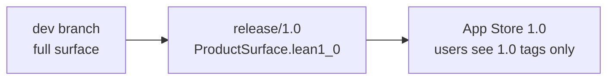

# Release tagging strategy

How Dart Buddy tracks **when users get a feature** separately from **whether the code exists on `dev`**.

**Companion docs:** [`branch-strategy.md`](branch-strategy.md) (branches) · [`ongoing-release-plan.md`](ongoing-release-plan.md) (release train narrative) · [`estimated-release-registry.md`](estimated-release-registry.md) (master table) · [`estimated-releases.json`](estimated-releases.json) (machine-readable source for sync script)

---

## Three layers (do not conflate)

| Layer | Question | Where it lives |
|-------|----------|----------------|
| **Implementation** | Is it built in the binary? | `GameModeCatalog.status`, `docs/feature-inventory.md` **Status** |
| **Store release** | When do App Store users get it? | Spec **`Estimated release`** tag + registry |
| **Branch gating** | What does this RC expose? | `ProductSurface` on `release/*` branches |

On **`dev`**, all shipped engines are playable. On **`release/1.0`**, only features tagged **`1.0`** (or earlier) are reachable. Tags describe **user-facing** intent, not branch state.

---

## `Estimated release` tag format

Every feature spec and game-mode spec carries:

```markdown
| **Estimated release** | `1.1` |
```

Or in the header (game modes):

```markdown
**Estimated release:** `1.1` (Party Pack)
```

### Allowed values

| Tag | Meaning |
|-----|---------|
| `1.0` … `1.4` | Target **App Store** semver slice (see train below) |
| `2.0` | First growth release (achievements, co-op wave, online bet, etc.) |
| `2.0+` | Post-2.0; no calendar commitment |
| `dev-only` | Built on `dev`; store release **not scheduled** — dogfood / QA backlog |
| `TBD` | Spec or stub only; no shipped engine |
| `shipped` | Already live in App Store (fill in after 1.0 submit, e.g. `shipped-1.0`) |

**Do not** use month names or calendar dates in specs — dates slip. Use semver train tags; optional target quarters live only in [`ongoing-release-plan.md`](ongoing-release-plan.md) gantt.

---

## Release train (store-facing)

Aligned with [`ongoing-release-plan.md`](ongoing-release-plan.md); per-feature assignments are in [`estimated-release-registry.md`](estimated-release-registry.md).

| Store release | User-facing theme | Typical contents |
|---------------|-------------------|------------------|
| **1.0** | Core scorekeeper | X01 + Cricket · 4 tabs · preset + custom bots · English · core Activity/Players/Settings |
| **1.1** | Party Pack I | Baseball · Killer · Shanghai · Around the Clock (Play setup, 4 tabs) |
| **1.2** | Smart opponents + i18n | Training Partner · player export · **de/es/nl/fr** store listings |
| **1.3** | Catalog + Party Pack II | Modes tab · expose remaining **shipped** party/standard modes (American Cricket, Knockout, Golf, …) after device QA |
| **1.4** | Platform hooks + practice | App Intents/widgets · Raid/Fleet co-op · practice drills (ATC, Nine Lives, …) |
| **2.0** | Growth bet (pick one) | Local achievements UI · next mode batch · online play · Watch |

**Principle:** A mode can be **`Status: Shipped`** on `dev` and **`Estimated release: 1.3`** — that is normal. Device QA and marketing surface drive the tag, not engine completion.

---

## How tags interact with branches



1. Implement on **`dev`** (no gating).
2. Assign **`Estimated release`** in registry when you know the train car (edit [`estimated-releases.json`](estimated-releases.json)).
3. Run `Scripts/sync_estimated_release_tags.py` to propagate into specs (same PR).
4. At RC time, cut **`release/X.Y`** and set `ProductSurface` to match tags `≤ X.Y`.
5. After App Store approval, bump tags to `shipped-1.Y` for features in that release.

---

## Maintenance rules

1. **Single source of truth:** [`estimated-releases.json`](estimated-releases.json) — edit tags there first.
2. **Sync to specs:** `python3 Scripts/sync_estimated_release_tags.py` (updates Verification blocks + catalog tables).
3. **Same PR:** changing a store release date → update JSON + run sync + [`feature-inventory.md`](../feature-inventory.md) if user-visible status changes.
4. **Do not** duplicate full release narrative in every spec — one line tag + link to registry.
5. **Quarterly:** reconcile registry with [`ongoing-release-plan.md`](ongoing-release-plan.md) decision log.

---

## What not to tag

- System specs (`ArchitectureSpec`, `SwiftData.md`) — use **N/A** or omit; they ship continuously.
- R&D custom modes with no catalog id — default **`TBD`** until promoted to catalog.

---

## CI / audit

`Scripts/ci/documentation-summary.py` reports catalog modes whose spec **`Estimated release`** disagrees with the JSON registry (when sync has been run).

---

## Open decisions (fill in decision log)

| Topic | Options | Current default in registry |
|-------|---------|----------------------------|
| 1.3 party batch | One big drop vs two waves | Single **1.3** wave for remaining party/standard modes |
| Co-op (Raid/Fleet) | 1.4 vs 2.0 | **1.4** |
| Achievements UI | 2.0 vs 1.4 | **2.0** |
| Locales in store | 1.2 vs 1.0 | **1.2** for listings; bundled on `dev` now |

Edit [`estimated-releases.json`](estimated-releases.json) when you decide — specs follow.
