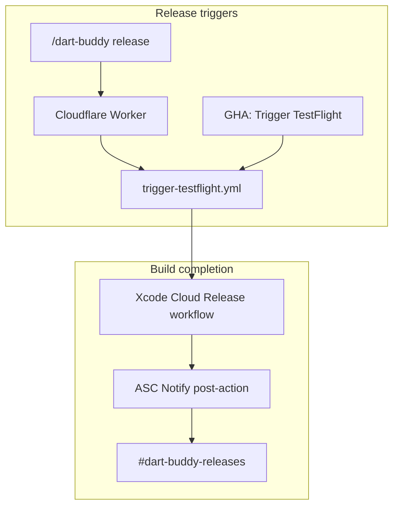

# Slack integration (post-1.0)

Slack support for Dart Buddy release ops is **planned, not required for 1.0**. Source code and runbooks live in-repo; nothing in CI deploys or validates the Worker automatically.

**Today:** trigger TestFlight via GitHub Actions → **Trigger TestFlight** (see [`xcode-cloud.md`](xcode-cloud.md)).

**After 1.0:** wire Slack for release triggers, CI visibility, and build notifications.

---

## Status

| Piece | Status | Notes |
|-------|--------|-------|
| Cloudflare Worker (`/dart-buddy` slash commands) | **Not deployed** | Code in [`workers/dart-buddy-slack/`](../../workers/dart-buddy-slack/); manual `wrangler deploy` |
| Xcode Cloud → `#dart-buddy-releases` (Notify) | **Optional ASC setup** | Apple native Slack integration; no Worker required |
| CI pass/fail → Slack | **Partial** | [`.github/actions/slack-ci-notify/`](../../.github/actions/slack-ci-notify/); needs webhook secret in repo settings |
| GitHub Actions release trigger | **Shipped** | [`.github/workflows/trigger-testflight.yml`](../../.github/workflows/trigger-testflight.yml) |

Tracked in [`feature-inventory.md`](../feature-inventory.md) under **CI, testing & release**.

---

## What `workers/` is

[`workers/`](../../workers/) holds **edge/serverless code outside the iOS app** — not part of the Xcode project or `DartBuddyCI` scheme.

| Path | Role |
|------|------|
| [`workers/dart-buddy-slack/`](../../workers/dart-buddy-slack/) | Cloudflare Worker: Slack slash command → GitHub Actions API |
| [`workers/dart-buddy-slack/tsconfig.json`](../../workers/dart-buddy-slack/tsconfig.json) | TypeScript config for the Worker (`npm run typecheck`; Wrangler bundles at deploy) |

Future Slack bots or webhooks can add sibling folders under `workers/` using the same pattern (TypeScript + Wrangler, documented here).

---

## Two Slack surfaces (independent)

1. **Slash commands (Worker)** — start builds and query CI from Slack. Implemented in [`workers/dart-buddy-slack/src/index.ts`](../../workers/dart-buddy-slack/src/index.ts). Holds a GitHub PAT only (no App Store Connect credentials in Slack).

2. **Release notifications (Xcode Cloud Notify)** — Apple posts to Slack when an archive finishes. Configured in App Store Connect on the **Release** workflow post-action. Does not use the Worker.

---

## Slash commands (when deployed)

| Command | Action |
|---------|--------|
| `/dart-buddy release` | `workflow_dispatch` on `trigger-testflight.yml` (branch input `main`) |
| `/dart-buddy release branch:feature/foo` | Same workflow, custom branch |
| `/dart-buddy status` | Latest `ci.yml` run summary |
| `/dart-buddy coverage` | Link to latest green CI `coverage-summary` artifact |

Operational setup (secrets, deploy, Slack app): [`workers/dart-buddy-slack/README.md`](../../workers/dart-buddy-slack/README.md).

---

## Post-1.0 setup checklist

Complete after App Store 1.0 ships when you want Slack in the loop.

### A. Release notifications (recommended first)

- [ ] Create `#dart-buddy-releases` in Slack
- [ ] In App Store Connect → Xcode Cloud → **Release** workflow → post-action **Notify** → connect Slack channel
- [ ] Run one TestFlight build; confirm message in channel

See [`xcode-cloud.md`](xcode-cloud.md) § Slack release channel.

### B. Slash commands (optional convenience)

- [ ] Create Slack app with `commands` scope; register `/dart-buddy`
- [ ] Create fine-grained GitHub PAT on `jacobrozell/Dart-Buddy`: `actions:read`, `actions:write`
- [ ] Cloudflare account + Wrangler CLI
- [ ] From [`workers/dart-buddy-slack/`](../../workers/dart-buddy-slack/): `npm install`, set secrets, `npm run deploy`
- [ ] Point slash command Request URL at deployed Worker URL
- [ ] Smoke test: `/dart-buddy status`, then `/dart-buddy release` on a non-blocking branch

### C. CI notifications (optional)

- [ ] Add `SLACK_WEBHOOK_URL` (or action-specific secret) for [`.github/actions/slack-ci-notify/`](../../.github/actions/slack-ci-notify/)
- [ ] Confirm pass/fail posts on a test PR

---

## Related docs

| Doc | Topic |
|-----|-------|
| [`xcode-cloud.md`](xcode-cloud.md) | TestFlight automation, ASC Notify, developer release flow |
| [`workers/dart-buddy-slack/README.md`](../../workers/dart-buddy-slack/README.md) | Worker deploy commands and prerequisites |
| [`release_checklist.md`](release_checklist.md) | Device QA after a build lands in TestFlight |
