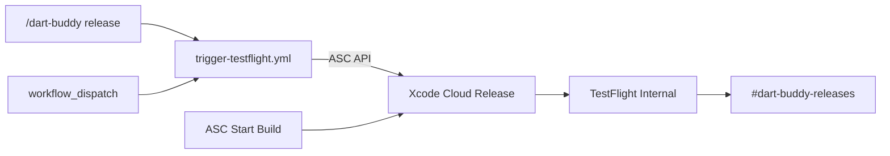

# Xcode Cloud → TestFlight

Automated **Release archive → TestFlight internal testing** via Xcode Cloud. Verification stays on GitHub Actions ([`ci.yml`](../../.github/workflows/ci.yml), [`nightly-ui.yml`](../../.github/workflows/nightly-ui.yml)).

## Trigger model

No automatic builds on push or tag. Start a release build via:

| Trigger | How |
|---------|-----|
| **Slack** (primary) | `/dart-buddy release` — see [Slack worker setup](#slack-dart-buddy-release) |
| **GitHub Actions** | Actions → **Trigger TestFlight** → Run workflow |
| **App Store Connect** | Xcode Cloud → **Release** workflow → Start Build |

Completion notifications post to `#dart-buddy-releases` via Xcode Cloud **Notify** (Apple native Slack integration).



---

## Prerequisites

- Apple Developer Program membership (team `7JT2JB89AV`)
- App Store Connect app record for `com.jacobrozell.DartBuddy`
- Real [`GoogleService-Info.plist`](../../Resources/GoogleService-Info.plist) (gitignored locally)
- App Store Connect API key (Users & Access → Integrations → App Store Connect API)

---

## One-time setup

### 1. App Store Connect API key

1. App Store Connect → Users and Access → Integrations → **App Store Connect API**
2. Generate a key with **Developer** or **App Manager** role
3. Download the `.p8` file once (cannot be re-downloaded)
4. Add GitHub Actions secrets:

| Secret | Value |
|--------|-------|
| `APP_STORE_CONNECT_ISSUER_ID` | Issuer ID from API keys page |
| `APP_STORE_CONNECT_KEY_ID` | Key ID (10 chars) |
| `APP_STORE_CONNECT_PRIVATE_KEY` | Full contents of the `.p8` file |
| `XCODE_CLOUD_WORKFLOW_ID` | Workflow UUID from ASC URL (step 3) |

### 2. Connect repository to Xcode Cloud

1. Xcode → Product → **Xcode Cloud** → Create Workflow
2. Connect the `Dart-Buddy` GitHub repository
3. Grant Xcode Cloud access to the repo

### 3. Create the Release workflow

| Setting | Value |
|---------|-------|
| Name | `Release` |
| Start condition | Branch `main` (or `master`) |
| **Automatic builds** | **Off** — manual / API / Slack only |
| Environment | Xcode **26.2**, latest macOS |
| Action | **Archive** — scheme `DartBuddy`, configuration **Release** |
| Post-action | **TestFlight Internal Testing** (create Internal Testers group if needed) |
| Post-action | **Notify** → Slack → `#dart-buddy-releases` |
| Versioning | Enable automatic build number increment from TestFlight |

Copy the workflow ID from the App Store Connect URL (`.../ciworkflows/{UUID}`) into `XCODE_CLOUD_WORKFLOW_ID`.

**Signing:** Xcode Cloud uses managed signing for team `7JT2JB89AV`. First archive may prompt certificate/profile creation — accept automatic management.

### 4. Xcode Cloud environment secret

In workflow → Environment → Environment Variables:

| Name | Type | Value |
|------|------|-------|
| `GOOGLE_SERVICE_INFO_PLIST_BASE64` | **Secret** | Base64 of real plist |

Generate locally:

```bash
base64 -i Resources/GoogleService-Info.plist | pbcopy
```

[`ci_scripts/ci_post_clone.sh`](../../ci_scripts/ci_post_clone.sh) decodes this before archive. Without it, the example plist is used and Crashlytics upload is skipped.

### 5. Slack release channel

1. Create `#dart-buddy-releases` in Slack
2. Connect Slack in App Store Connect when configuring the **Notify** post-action
3. Optional: add `SLACK_WEBHOOK_RELEASE` in GitHub for custom notifications (not required when using ASC Notify)

See also [`workers/dart-buddy-slack/README.md`](../../workers/dart-buddy-slack/README.md) for the `/dart-buddy release` worker.

---

## Repo artifacts

| File | Role |
|------|------|
| [`ci_scripts/ci_post_clone.sh`](../../ci_scripts/ci_post_clone.sh) | `xcodegen generate` + Firebase plist |
| [`Scripts/ci/trigger-xcode-cloud.sh`](../../Scripts/ci/trigger-xcode-cloud.sh) | ASC API JWT + `ciBuildRuns` |
| [`.github/workflows/trigger-testflight.yml`](../../.github/workflows/trigger-testflight.yml) | `workflow_dispatch` entry point |
| [`workers/dart-buddy-slack/`](../../workers/dart-buddy-slack/) | Cloudflare Worker for `/dart-buddy` commands |

---

## Developer release flow

1. Merge to `main`; wait for GitHub CI green
2. Bump `MARKETING_VERSION` in [`project.yml`](../../project.yml) when shipping a new version (build number handled by Xcode Cloud)
3. Run `/dart-buddy release` in Slack, or **Trigger TestFlight** in GitHub Actions
4. Xcode Cloud archives → uploads to TestFlight internal
5. ASC Notify posts to `#dart-buddy-releases`
6. Install on a physical device from TestFlight; complete device QA in [`release_checklist.md`](release_checklist.md)
7. Submit for App Store review manually in ASC when ready (out of scope for this automation)

---

## Slack `/dart-buddy release`

Implemented in [`workers/dart-buddy-slack/`](../../workers/dart-buddy-slack/). The Worker calls GitHub `workflow_dispatch` on `trigger-testflight.yml` — it holds a GitHub PAT, not ASC credentials.

| Command | Action |
|---------|--------|
| `/dart-buddy release` | Start Release build on `main` |
| `/dart-buddy release branch:feature/foo` | Start build on named branch |

**Interim (before Worker deploy):** GitHub → Actions → **Trigger TestFlight** → Run workflow.

---

## First-build verification

- [ ] `ci_post_clone.sh` log shows `xcodegen generate` success
- [ ] Firebase plist written (no `REPLACE_WITH` in build log)
- [ ] Archive succeeds with team `7JT2JB89AV`
- [ ] Crashlytics run script executes (no "not found" warning)
- [ ] Build appears in TestFlight → Internal Testing
- [ ] `#dart-buddy-releases` receives ASC Notify
- [ ] **Trigger TestFlight** workflow returns success and starts an Xcode Cloud build

---

## Compute budget

~20–30 minutes per archive. Xcode Cloud includes **25 compute hours/month** with Apple Developer Program (~50 release builds/month within free tier).

---

## Troubleshooting

| Symptom | Fix |
|---------|-----|
| `xcodegen: command not found` | Confirm `ci_post_clone.sh` is executable and at repo root `ci_scripts/` |
| Signing errors | Open workflow in ASC; accept managed signing prompts |
| `REPLACE_WITH` in Crashlytics log | Set `GOOGLE_SERVICE_INFO_PLIST_BASE64` secret in workflow environment |
| `no scmGitReference found` | Ensure branch exists on remote; Xcode Cloud has synced the repo |
| `401` from ASC API | Rotate API key; check issuer/key ID; ensure private key newlines are preserved in GitHub secret |
| SPM resolve failures | Re-run; check `project.yml` package pins |
| Setup says **GitHub Enterprise** or `github.com-personal` DNS error | `origin` must use `git@github.com:...`, not an SSH host alias — see below |

### SSH host alias pitfall

If `git remote -v` shows `git@github.com-personal:...`, Xcode Cloud treats that as GitHub Enterprise and setup fails (`RepositoryNotAccessible`, `DNS_PROBE_FINISHED_NXDOMAIN`).

**Expectation:** `origin` stays on `git@github.com:...` for Xcode Cloud, but all pushes (local terminal, Cursor agents) must authenticate as **jacobrozell**, not the default `jrozellOCV` key on `github.com`.

```bash
git remote set-url origin git@github.com:jacobrozell/Dart-Buddy.git
# Option A — repo-local key (then `git push origin` works):
git config core.sshCommand "ssh -i ~/.ssh/id_ed25519_github_jacobrozell -o IdentitiesOnly=yes"
# Option B — one-off push without changing origin:
git push git@github.com-personal:jacobrozell/Dart-Buddy.git master
```

Then quit Xcode, reopen, and restart **Product → Xcode Cloud** setup.

Cursor agents follow `.cursor/rules/git-push-jacobrozell.mdc`.

---

## Out of scope

- Replacing GitHub Actions CI or nightly UI tests
- Automatic builds on every push/tag
- External TestFlight beta review automation
- App Store review submission automation
