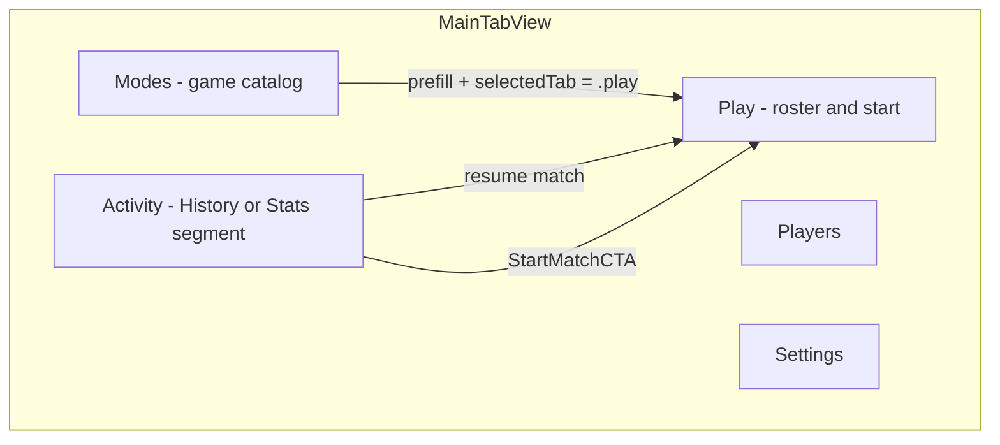
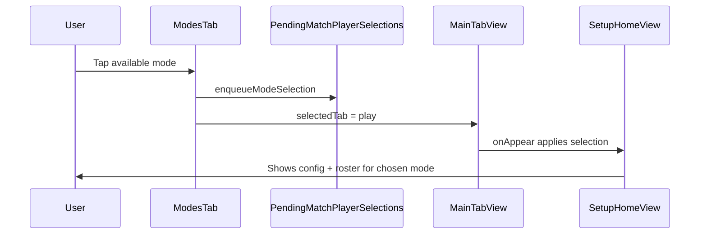
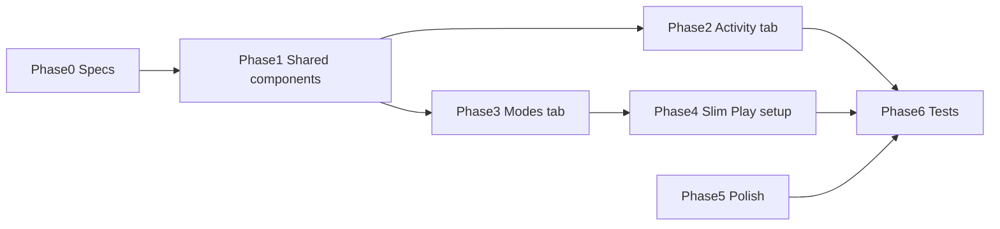

# UI/UX Scale & Tab Restructure Plan

> **Status:** Implementation plan + UI/UX reviewer's pass. Companion to the
> higher-level [`docs/ux-design-review.md`](ux-design-review.md). Per
> [`specs/SpecGovernance.md`](../specs/SpecGovernance.md) nothing ships to UI
> until the relevant spec lands first (Phase 0).

## Reviewer's pass (UI/UX) — read this first

The engineering shape of this plan is strong: spec-first sequencing, a single
`GameModeCatalog` source of truth, shared filter components that delete real
duplication, and lazy segment loading. The merge of History + Statistics into
**Activity** is unambiguously a win and should proceed as written.

Three things to resolve before building, in priority order:

1. **The biggest open question is whether "Modes" should be a top-level tab at
   all.** As specced it creates *two* places to start a game (the **Play** tab,
   which defaults to a mode + roster, and the **Modes** tab, which jumps you
   *to* Play). That makes "Change mode" a cross-tab jump — and tabs are meant
   to be parallel destinations, not steps in a funnel. The
   [`ux-design-review.md`](ux-design-review.md) §A2/§A3 alternative — a mode
   catalog **pushed inside the Play stack** (Play Home → "New Match" → Catalog →
   Config + Roster) — delivers the same scalability without the tab ping-pong.
   See **Open decision D1** below; this choice reshapes Phases 3–4.
2. **Reconcile with the adopted review doc.** `ux-design-review.md` §A1 proposes
   **4 tabs** (`Home · Players · Stats · Settings`); this plan proposes **5**
   (`Play · Modes · Players · Activity · Settings`). Both can't be the source of
   truth. Phase 0 must explicitly update §A1 with the decision + rationale, not
   just mark it "in progress."
3. **The plan has no success metrics and only a thin migration story.** Tab
   changes are the single most muscle-memory-disruptive edit in the app. See the
   new **Success metrics & rollout** section near the end.

Per-phase notes are inlined as `> **UX review:**` callouts below.

---

## Target information architecture

Replace the current tab bar:

`Play · Players · Statistics · History · Settings`

With:

`Play · Modes · Players · Activity · Settings`



**Why this order:** Play stays first (primary intent). Modes is discovery. Players is roster management. Activity consolidates “look back.” Settings unchanged.

This keeps **5 tabs** but reallocates slots: Statistics + History collapse into Activity; the freed conceptual slot becomes **Modes** (your choice over a dedicated Practice tab). Practice modes (Bob's 27, Around the Clock) appear as catalog entries under a **Practice** section in Modes—not a separate tab.

> **UX review — the two-arrows-into-Play smell.** Both `Modes` and `Activity`
> have edges pointing *back into* `Play` in the diagram above. That's the tell
> that these aren't really sibling destinations — they're feeders into one
> primary flow. A tab the user is expected to *leave immediately* (tap a mode →
> get thrown to Play) is acting like a pushed screen wearing a tab costume.
> Weigh this against Open decision **D1**.
>
> **UX review — label collision.** "Play" (start a game) and "Modes" (pick a
> game to play) are semantically overlapping to a non-technical user; both read
> as "where I go to play." If Modes stays a tab, user-test the labels — consider
> **"Games"** for the catalog, or reframe Modes as a *learn/browse* surface
> ("Game Guide") rather than a second start path.
>
> **UX review — Dynamic Type cost is real.** `ux-design-review.md` argued *for*
> 4 tabs partly because 5 labels condense/scroll at AX text sizes. Keeping 5
> (with longer words like "Activity"/"Settings") re-incurs that cost. That can
> be the right trade for the discovery value of Modes — but state the trade
> explicitly in `AppShellSpec` so it's a decision, not an accident. Verify the
> bar at AX5 on the smallest supported device.

---

## Phase 0 — Specs first (SpecGovernance)

Update authoritative docs before code so tests and marketing harness track the new shell.

| Spec | Changes |
|------|---------|
| [`specs/AppShellSpec.md`](../specs/AppShellSpec.md) | New tab order; Activity tab; Modes tab; badge moves to Activity |
| [`specs/NavigationSpec.md`](../specs/NavigationSpec.md) | `ActivityRoute` (list → detail); `ModesRoute` (root only); remove separate Statistics/History root routes |
| [`specs/UIBlueprintSpec.md`](../specs/UIBlueprintSpec.md) | Wireframes for Activity segments, Modes catalog, slim Play setup |
| [`specs/HistorySpec.md`](../specs/HistorySpec.md) | History as Activity segment (not standalone tab) |
| [`specs/StatisticsTabSpec.md`](../specs/StatisticsTabSpec.md) | Statistics as Activity segment; rename/reframe doc |
| [`specs/SetupFlowSpec.md`](../specs/SetupFlowSpec.md) | Mode selection moves to Modes tab; setup = config + roster |
| [`docs/ux-design-review.md`](ux-design-review.md) | **Reconcile §A1** (4-tab vs 5-tab) with the decision + rationale; mark A2 items adopted |

Add a lightweight **`specs/ModesTabSpec.md`** defining catalog sections, quick-start behavior, and coming-soon placeholders for unreleased modes.

> **UX review — close the §A1 contradiction here, not later.** The
> `ux-design-review.md` row above must do more than "mark in progress": §A1
> currently proposes a *different tab bar* than this plan. Leaving two adopted
> docs that disagree on navigation guarantees drift. Phase 0 should rewrite §A1
> to record the chosen end-state and *why* (e.g. "Modes discovery value >
> Dynamic-Type cost of a 5th tab").
>
> **UX review — `ModesTabSpec` must own the empty/first-run state.** Define what
> Modes looks like when the Practice section is entirely "coming soon" (see
> Phase 3 note) and what Activity looks like with zero games — these are the
> first impressions a new user gets, and the plan currently leaves them
> undefined.

---

## Phase 1 — Shared foundation components

These unblock Activity filters, Modes catalog, and setup scaling.

### 1a. `GameModeCatalog` model

New file: `Features/Modes/GameModeCatalog.swift`

```swift
enum GameModeSection: String, CaseIterable { case standard, party, practice }

struct GameModeCatalogEntry: Identifiable {
    let id: String
    let section: GameModeSection
    let matchType: MatchType?          // nil for unreleased practice modes
    let setupCategory: PlaySetupCategory
    let partyGame: PartyGame?        // when applicable
    let isAvailable: Bool
    let titleKey, subtitleKey, playerCountKey: String
}
```

- Reuse [`GameModeAccent`](../DesignSystem/Tokens/GameModeAccent.swift) for icon/color (extend when practice `MatchType`s land).
- Centralize the mode list here so Modes tab, Activity filters, and setup all read one source of truth.

> **UX review — single source of truth is the best idea in the plan.** This is
> exactly right and pays off far beyond this restructure (history rows, stats
> filters, future achievements all key off it). One addition: include a
> stable, ordered `sortIndex` (or rely on `CaseIterable` order) so the catalog,
> the filter menu, and history accents present modes in the *same* order
> everywhere — inconsistent ordering across surfaces is a classic scannability
> leak.

### 1b. Shared filter bar

New: `DesignSystem/Components/ActivityFilterBar.swift`

Extract duplicated filter UI from [`HistoryRootView.swift`](../Features/History/HistoryRootView.swift) and [`StatisticsRootView.swift`](../Features/Statistics/StatisticsRootView.swift):

- **Mode filter:** replace 6-option cramped `BrandSegmented` with a **menu picker** (“All games ▾”) showing `GameModeBadge` rows — scales to 10+ modes without iPhone squeeze.
- **Time filter:** unified enum `ActivityPeriod` = Today / 7d / 30d / All (History currently lacks Today; Statistics has it — unify).
- **Player filter:** single shared menu component.

Shared VM protocol or struct: `ActivityFilterState` consumed by both `HistoryListViewModel` and `StatisticsViewModel` (map to existing repo filter types).

> **UX review — make the menu trigger reflect the active selection.** A common
> menu-picker failure is a trigger that always reads "All games ▾" even when a
> filter is applied, hiding state. The trigger label must show the current
> value ("Cricket ▾") and ideally its `GameModeBadge`, with the
> currently-selected row check-marked in the menu. Give the trigger a clear
> VoiceOver label ("Filter by game, currently Cricket") and the segment proper
> `.isSelected` traits — menu pickers are easy to ship inaccessible.
>
> **UX review — unifying the period enum changes History's behavior.** Adding
> "Today" to History is fine, but persist each user's last-used filter per
> segment (or share it deliberately) so switching History↔Statistics doesn't
> silently reset what they were looking at. Decide and spec whether the three
> filters are *shared* across both segments or *independent* — the plan implies
> shared ("changing filters updates whichever segment is visible"); confirm
> that a Statistics-only period like an all-time view still makes sense for
> History.

### 1c. `BrandSegmented` fix (safety net)

In [`BrandControls.swift`](../DesignSystem/Components/BrandControls.swift), change scrolling threshold:

```swift
private var usesScrollingSegments: Bool {
    options.count > 4  // remove horizontalSizeClass == .regular gate
}
```

Keep segmented controls for 2–3 option cases (Activity segment: History | Statistics). Do **not** use segmented for 6+ mode filters anymore.

> **UX review — this is a global change hiding in a "safety net."** Removing the
> `horizontalSizeClass == .regular` gate alters every >4-option `BrandSegmented`
> app-wide, including iPad/regular-width where the old behavior was intentional.
> Audit all current call sites and add a visual-regression snapshot pass on
> iPad before/after; don't let a one-line "safety net" silently restyle other
> screens.

### 1d. Prefill plumbing

Extend [`PendingMatchPlayerSelections.swift`](../App/Bootstrap/PendingMatchPlayerSelections.swift):

```swift
struct PendingModeSelection: Equatable {
    var setupCategory: PlaySetupCategory
    var mode: SetupMode?           // standard
    var partyGame: PartyGame?      // party
    var matchType: MatchType?      // for accent/routing
}

func enqueueModeSelection(_ selection: PendingModeSelection)
func consumeModeSelection() -> PendingModeSelection?
```

[`MatchSetupViewModel`](../Features/Play/Setup/MatchSetupViewModel.swift) applies consumed selection on `onAppear()`.

[`MainTabView`](../App/MainTabView.swift) gains `@State selectedTab` binding passed to `ModesRootView` so catalog taps can `selectedTab = .play` after enqueue.

> **UX review — guarantee no roster loss on the tab bounce.** If a user has
> already picked players on Play, then taps "Change" → Modes → a new mode, the
> consumed selection must **preserve the in-progress roster** and only swap the
> mode/config. Dropping the roster on a mode change is a silent data-loss
> papercut. Spec this explicitly and cover it in `MatchSetupViewModelTests`
> (Phase 6). Also define: what happens if a mode is enqueued while a *different*
> match is already in progress?

---

## Phase 2 — Activity tab (merge History + Statistics)

### New root view

`Features/Activity/ActivityRootView.swift`:

```text
+----------------------------------+
| Activity                         |
| [ History | Statistics ]         |  <- BrandSegmented (2 options)
| Mode ▾ | Period ▾ | Player ▾    |  <- ActivityFilterBar
| [Resume active match banner]     |  <- History segment only
| segment content...               |
+----------------------------------+
```

**Behavior:**
- Top segment switches between embedded `HistoryListContent` and `StatisticsContent` (extract bodies from existing root views into subviews — avoid duplicating VMs).
- **Shared filter state** at Activity level; changing filters updates whichever segment is visible and pre-warms the other lazily.
- **Lazy load:** only call `HistoryListViewModel.onAppear()` / `StatisticsViewModel.load()` when their segment first shown (avoid double fetch on tab open).
- **Navigation:** History segment keeps `NavigationStack` push to [`MatchHistoryDetailScreen`](../Features/History/MatchHistoryDetailScreen.swift). Statistics segment stays flat (no push).
- **Active match badge:** move from History tab to **Activity tab** in [`MainTabView`](../App/MainTabView.swift) (`selectedTab != .activity`).
- **Resume banner:** History segment only. **Partial-stats banner:** Statistics segment only (unchanged semantics).

> **UX review — default the segment by intent, and persist it.** When Activity
> is opened *from* a just-finished match or the active-match badge, default to
> **History** ("did my game save? what was the result?"). On a cold open from
> the tab bar, restore the user's last-used segment (default History on first
> ever use). Don't force a re-pick every visit.
>
> **UX review — the badge on "Activity" is a mild category error, but
> acceptable.** An in-progress *match* is neither history nor a stat. Putting
> the badge on Activity is defensible only because Activity contains the resume
> banner — so it must always deep-link to the History segment with the banner
> visible, never to Statistics. The *primary* resume affordance should still
> live on Play (per `ux-design-review.md` §A4). Keep one canonical resume
> surface; the Activity badge is a secondary pointer to it.
>
> **UX review — segment + filter bar is a lot of chrome above the fold.** A
> segmented control *and* three filter menus stacked over the content eats
> vertical space on an SE-class screen before any data shows. Consider
> collapsing the filter bar to a single "Filters ▾" affordance (or making it
> scroll away on content scroll) so the first screenful is results, not
> controls.

### Refactor approach (minimal VM churn)

1. Extract `HistoryListContent` from `HistoryRootView` (filters removed — passed in).
2. Extract `StatisticsContent` from `StatisticsRootView`.
3. `ActivityRootView` composes both + owns filter bindings.
4. Deprecate standalone `HistoryRootView` / `StatisticsRootView` as tab roots (keep files as thin wrappers or delete after migration).

### Dedupe filter enums

Consolidate duplicate `ModeFilter` enums in [`HistoryListViewModel`](../Features/History/HistoryListViewModel.swift) and [`StatisticsViewModel`](../Features/Statistics/StatisticsViewModel.swift) into `Features/Activity/ActivityModeFilter.swift`.

---

## Phase 3 — Modes tab (browse + quick start)

### New feature folder

`Features/Modes/`:
- `ModesRootView.swift` — scrollable catalog
- `GameModeCatalogCard.swift` — row/card using `GameModeBadge`, title, subtitle, player count, coming-soon badge (pattern from [`PartyGamePickerView`](../Features/Play/Setup/PartyGamePickerView.swift))
- `GameModeCatalog.swift` — static entries

**Layout:**

```text
Standard
  [ X01 card ]  [ Cricket card ]
Party
  [ Killer ] [ Baseball ] [ Shanghai ]
Practice
  [ Bob's 27 - Coming soon ] [ Around the Clock - Coming soon ]
```

**Quick start flow:**



- Available modes: full prefill + switch to Play.
- Coming-soon modes: non-tappable card with `StatusBadge` (reuse party picker pattern).
- Optional: “Learn rules” link on each card → sheet with [`GameRulesGuideContent`](../Features/Play/Rules/GameRulesGuideContent.swift).

> **UX review — don't advertise absence.** Two greyed "Coming soon" cards under
> a half-empty Practice section makes a brand-new install look unfinished. Until
> at least one Practice mode ships, **hide the Practice section** (or replace it
> with a single low-key "More game modes coming soon" teaser row). Multiple
> dead cards is a known anti-pattern; one teaser communicates roadmap without
> dangling disabled affordances.
>
> **UX review — preserve the fast path / common case.** The most frequent
> intent is "play the same thing again," yet routing every new game through the
> Modes tab adds a step versus today's Play-first flow. Pin the **last-played
> mode** to the top of the catalog (and/or surface a one-tap "rematch last
> setup" on Play, per `ux-design-review.md` §A3) so the 80% case stays fast.
>
> **UX review — "Learn rules" should not be "optional."** For a discovery
> surface, rules access is core, not a nice-to-have. Make the rules link a
> first-class, consistently-placed element on every card (including coming-soon
> ones — you *can* learn a mode before it ships). This also gives the Modes tab
> a real reason to exist beyond "start a game," which strengthens it against
> Open decision D1.
>
> **UX review — card grid at 6 modes risks feeling sparse.** A 2-up grid with
> ~6 entries can read as under-populated. Validate list vs. grid at the current
> mode count; a richer single-column card (badge + title + subtitle + player
> count + rules link) often reads better than a sparse grid until you have
> ~8–10 modes.

### Tab wiring

Update [`MainTabView.swift`](../App/MainTabView.swift):

- Remove `HistoryRootView` and `StatisticsRootView` tab items.
- Add `ModesRootView(onSelectMode: { ... })` and `ActivityRootView(...)`.
- New `RootTab` cases: `.modes`, `.activity`; remove `.history`, `.statistics`.
- Update `-snapshot_tab` launch args: `activity`, `modes` (keep aliases or update [`Scripts/capture-marketing-screenshots.sh`](../Scripts/capture-marketing-screenshots.sh)).

Localization: `tab.modes`, `tab.activity`, `modes.title`, section headers, card copy in all 4 locales + [`L10n.swift`](../Support/Localization/L10n.swift).

> **UX review — choose tab SF Symbols deliberately.** The current Play tab uses
> `house.fill` over a *form*, which `ux-design-review.md` flags as a mismatched
> metaphor. With Modes now owning "browse games," reconsider both: Play →
> `target`/dartboard glyph (it's where you start a match), Modes →
> `square.grid.2x2`/`books.vertical`, Activity → `chart.bar`/`clock` (pick the
> one that matches the default segment). Don't ship `house.fill` over a non-home
> screen.

---

## Phase 4 — Slim Play setup (depends on Modes tab)

Goal: Play tab answers **“who’s playing?”** and **“any tweaks?”** — not **“what game?”**

### Remove from [`SetupHomeView.swift`](../Features/Play/Setup/SetupHomeView.swift)

- `setupCategorySelector` (Standard | Party segmented)
- `modeSelector` (X01 | Cricket segmented)
- `PartyGamePickerView` block

### Add instead

- **Selected mode header** — shows current mode via `GameModeBadge` + title + “Change” button → switches to Modes tab (or presents compact mode sheet as fallback).
- **Config summary line** — e.g. “501 · Double out · First to 3 legs” with **Edit** toggle expanding chip grid (addresses cognitive load + [`docs/release/todo.md`](release/todo.md) P1).
- **Advanced disclosure (quick win)** — in [`SetupHomeView+OptionChips.swift`](../Features/Play/Setup/SetupHomeView+OptionChips.swift), collapse Check-In and Set/Leg chips behind `play.setup.advanced` section by default.

Default mode on cold Play tab open: user’s Settings default (X01/Cricket) until they pick from Modes.

> **UX review — make the in-place mode sheet the PRIMARY, not the fallback.**
> "Change" → jump to the Modes tab is the cross-tab ping-pong called out at the
> top. Changing one field of a setup you're mid-way through should not catapult
> you to another tab and back. Present a **compact mode picker sheet in place**
> as the default "Change" behavior; reserve the full Modes tab for deliberate
> browsing/discovery. This single change neutralizes most of the dual-entry
> confusion regardless of how Open decision D1 lands.
>
> **UX review — the config summary line must be the source of truth.** Tapping
> "Edit" should expand chips *inline* and collapse back to an updated summary —
> not open a modal that loses scroll position. The summary always reflects the
> live config. This is the right pattern; just make sure "Edit" is a disclosure,
> not a navigation.
>
> **UX review — guard the empty-roster first run.** A brand-new user lands on
> Play with a default mode but *no players*. The slim setup must still surface
> the quick-add path prominently (today's `QuickAddPlayerScreen`), or the
> primary CTA will be a dead end. Keep `PlayHomeSpec`'s empty-roster gate intact
> through the refactor.

### Future: two-step setup (optional follow-up)

If single-scroll is still long after slimming, split into pushed steps: **Configure** → **Roster**. Defer unless Phase 4 still feels crowded after mode removal.

---

## Phase 5 — Audit polish (parallel / after core IA)

From [`docs/release/todo.md`](release/todo.md) UI/UX audit — tackle after Activity/Modes land or in parallel where independent:

| Item | File(s) | Fix |
|------|---------|-----|
| Stats bots with 0 games, non-zero averages | `StatisticsViewModel`, stats tables | Hide bot rows with 0 completed games unless partial-match banner applies |
| Tab bar content bleed | Settings scroll / tab safe area | Verify `.safeAreaInset` / list content margins on device |
| SE-class 7-column keypad | `DartNumberPad`, `GameplayLayout` | Validate on iPhone SE; consider 6-col on smallest width |
| AXXXL hardcoded sizes | `MatchSummaryScreen`, `X01MatchScreen` | Replace fixed frames with `@ScaledMetric` |
| Active match affordance (A4) | Resume banner | Single hero card on Play; Activity badge only (remove duplicate if any remains) |

Accessibility evidence (manual VO + AXXXL) on new Activity/Modes tabs per [`accessibility/accessibility_todo.md`](../accessibility/accessibility_todo.md).

> **UX review — fold the new surfaces into this audit, don't bolt a11y on at the
> end.** The two brand-new screens (Activity, Modes) and the new menu-style
> filter are exactly where contrast/VoiceOver/Dynamic-Type regressions creep in.
> Add explicit rows here: (1) mode-accent tokens pass contrast against both
> `surface` and `surface-card` in light **and** dark; (2) accent is never the
> *only* differentiator (always paired with the mode icon + label); (3) the
> filter menus and Activity segment are fully VoiceOver-operable with correct
> selection traits.

---

## Phase 6 — Tests, marketing, accessibility

| Area | Files |
|------|-------|
| Tab navigation | [`Tests/UI/TabNavigationUITests.swift`](../Tests/UI/TabNavigationUITests.swift) — `tab_activity`, `tab_modes` |
| History detail | [`Tests/UI/HistoryDetailUITests.swift`](../Tests/UI/HistoryDetailUITests.swift) — open via Activity → History segment |
| WCAG | [`Tests/UI/WCAGAccessibilityUITests.swift`](../Tests/UI/WCAGAccessibilityUITests.swift) — new screen audits |
| Setup | [`Tests/Unit/MatchSetupViewModelTests.swift`](../Tests/Unit/MatchSetupViewModelTests.swift) — mode prefill, advanced collapse, **roster preserved on mode change** |
| Activity filters | New `ActivityFilterTests` — unified period/mode mapping, **shared-vs-independent filter behavior** |
| Marketing | [`Scripts/capture-marketing-screenshots.sh`](../Scripts/capture-marketing-screenshots.sh) — `modes`, `activity` frames |
| WCAG trackers | `accessibility/wcag-2.1-aa/screens/` — add `activity.md`, `modes.md`; retire standalone statistics.md or redirect |

---

## Recommended implementation order



1. **Specs** — unblocks review and test expectations.
2. **Shared components** — `GameModeCatalog`, `ActivityFilterBar`, prefill plumbing, `BrandSegmented` fix.
3. **Activity tab** — self-contained merge; immediate UX win; removes filter duplication.
4. **Modes tab** — catalog + quick start; must land before stripping mode pickers from Play.
5. **Slim Play setup** — remove redundant pickers; advanced collapse.
6. **Polish + tests** — close audit items; update snapshots.

> **UX review — ship Activity behind, but Modes/Play in lockstep.** The
> dependency graph is right, but call out the *user-visible* sequencing: Activity
> can ship independently and is pure upside. Modes (Phase 3) and slim Play
> (Phase 4) are a **single user-facing change** — never release a build where
> the mode pickers are gone from Play but the Modes path isn't fully wired, or
> users will have *no way* to change game. Gate Phases 3+4 behind one feature
> flag and flip them together.

---

## Success metrics & rollout *(new — added in review)*

The plan changes how every user starts a game and looks back at results, but
defines no way to tell whether it worked. Before building, agree on a few
signals (instrument with the existing logger):

- **Time / taps to first dart** from cold launch — should not regress (watch for
  the Modes detour adding steps to the common case).
- **Share of match starts via Modes vs. Play default** — tells you whether Modes
  earns its tab slot or is bypassed.
- **Activity segment usage** — History vs. Statistics split, and the
  cross-segment bounce rate (the duplication this plan removes should show as
  *fewer* tab/segment switches to answer one question).
- **Setup abandonment** — starts entered vs. matches actually begun, before/after
  the slim-setup change.

**Rollout / migration for existing users:**

- A one-time, dismissible **"what moved" coachmark** on first launch post-update:
  History & Statistics now live under **Activity**; games are browsable under
  **Modes**. Muscle memory for two removed tabs is the top risk and a single
  prose risk-note doesn't mitigate it.
- Keep `-snapshot_tab` **aliases** (`history`, `statistics` → Activity segment)
  for one release so deep links / marketing automation don't break.
- Land the marketing-screenshot regen (Phase 6) *in the same release* — stale
  store shots are already an open finding (`ux-design-review.md` §D9); a tab
  reshuffle must not widen that gap.

---

## Open decisions *(new — added in review)*

These need a human call before Phase 0 locks the specs:

### D1. Modes as a top-level tab, or a pushed catalog inside Play?
- **Option A (this plan):** Modes is its own tab; selecting a mode jumps to Play.
  Pro: discovery is always one tap away; gives party/practice modes a showroom.
  Con: two start-a-game entry points, cross-tab "Change" jump, label overlap
  with Play, costs a tab slot at AX sizes.
- **Option B (`ux-design-review.md` §A2/A3):** Play becomes a light Home; "New
  Match" *pushes* to the same catalog inside the Play stack. Pro: one start
  flow, no tab ping-pong, frees the 5th slot for the planned Social/Online tab.
  Con: discovery is one level deeper (behind a Home tap).
- **Reviewer lean:** Option B for the *start* flow. If the team wants a
  dedicated browse surface, keep a Modes tab but reframe it as **discovery/learn
  ("Game Guide")** — not the primary way to launch a match. Either way, make the
  in-setup "Change mode" an in-place sheet (Phase 4 note), not a tab jump.

### D2. Are Activity's three filters shared across both segments, or independent?
Spec it explicitly (Phase 1b). Shared = simpler mental model but may force odd
states (an all-time stats window applied to a history list); independent =
more predictable per-segment but more state to persist.

### D3. Final tab labels & icons.
"Modes" vs "Games"; resolve the Play/Modes semantic overlap; pick non-`house`
glyphs (Phase 3 note). Worth a quick 5-user label test before locking copy in
`L10n`.

---

## Out of scope (this plan)

- Implementing Bob's 27 / Around the Clock **engines** (catalog shows coming-soon until specs promote from [`FutureIdeas/party-practice-modes.md`](../FutureIdeas/party-practice-modes.md)).
- Play → Home dashboard with quick rematch (A3 in ux-design-review) — good follow-up after setup slimming. *(But see Open decision D1 — if Option B is chosen, this moves in-scope.)*
- Token consolidation (Brand vs DS merge, D1) — separate effort.
- iPad two-pane setup — defer until iPhone IA is stable.

---

## Risk notes

- **Tab muscle memory:** existing users lose dedicated History/Statistics tabs — mitigate with the first-launch coachmark (see Rollout) plus clear Activity segment labels and preserved filter behavior.
- **Dual start paths:** Modes tab + Play default can confuse "where do I start a game?" — mitigate per Open decision D1 / in-place Change sheet.
- **PlayRoute.historyDetail** from match summary still pushes detail in Play stack; consider also offering “View in Activity” later — not required for v1 of this restructure.
- **Double fetch:** Activity tab must lazy-load segments to avoid perf regression.
- **Global segmented restyle:** the `BrandSegmented` threshold change (1c) affects every >4-option control — regression-check iPad/regular width.
- **5 tabs still:** net tab count unchanged, but Modes + Activity is a clearer split for upcoming practice/party modes than Statistics + History + crowded setup — at a Dynamic-Type cost to acknowledge in `AppShellSpec`.
