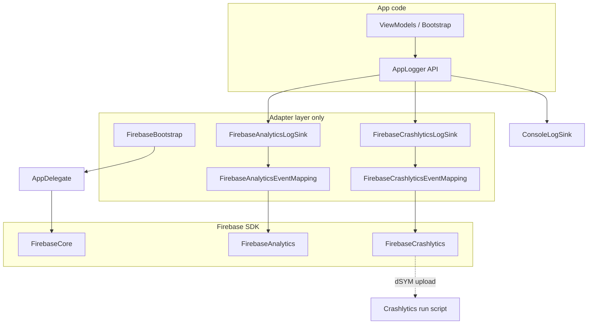

# Firebase Crashlytics — One-Pass Implementation Plan

**Product:** DartBuddy (`DartsScoreboard` target)  
**Scope:** Phase 1 crash diagnostics per [`specs/FirebaseBackendAnalyticsSpec.md`](../../specs/FirebaseBackendAnalyticsSpec.md)  
**Out of scope (this pass):** Auth, Firestore, remote config, user-facing opt-out UI, TestFlight-only debug crash button in production builds

**Estimated effort:** 4–8 hours focused work (one PR, one verification session on TestFlight or Release device)

---

## 1. Goals and success criteria

### Goals

1. **Automatic crash capture** for Release builds that ship a real `GoogleService-Info.plist`.
2. **Symbolicated stack traces** in the Firebase Console via dSYM upload on archive.
3. **Non-fatal error reporting** for a curated set of `AppLogger` `error` / `fault` events (persistence, migration, match lifecycle failures).
4. **No telemetry from CI, Debug, UI tests, or placeholder plist** — same safety model as Firebase Analytics today.
5. **No direct Crashlytics imports** outside the logging/bootstrap adapter layer.

### Success criteria (must all pass before merge)

| # | Criterion |
|---|-----------|
| 1 | `xcodegen generate` + `xcodebuild test` green on CI (placeholder plist → Firebase not configured). |
| 2 | Release archive with real plist: Crashlytics run script succeeds (no sandbox / GOOGLE_APP_ID errors). |
| 3 | Forced test crash on TestFlight or Release device appears in Firebase Console within ~15 minutes. |
| 4 | Uploaded dSYM: crash report shows Swift symbols (not only hex addresses). |
| 5 | UI test launch args produce **zero** Crashlytics/Analytics uploads (verify in Firebase DebugView / Crashlytics dashboard filters). |
| 6 | Unit tests cover flag gating, event allowlist, and sink no-op when disabled. |
| 7 | `release_checklist.md`, `README.md`, and Phase 06 privacy notes updated. |

---

## 2. Current state (baseline)

Already in place:

- SPM: `FirebaseCore`, `FirebaseAnalytics` in [`project.yml`](../../project.yml)
- [`App/Bootstrap/AppDelegate.swift`](../../App/Bootstrap/AppDelegate.swift): `FirebaseApp.configure()` + analytics collection flag
- [`App/Bootstrap/FirebaseBootstrap.swift`](../../App/Bootstrap/FirebaseBootstrap.swift): skip configure when plist contains `REPLACE_WITH`
- [`Support/FeatureFlags/FeatureFlag.swift`](../../Support/FeatureFlags/FeatureFlag.swift): `enableFirebaseCrashlytics` (hardcoded `false`)
- [`Support/Logging/DefaultAppLogger.swift`](../../Support/Logging/DefaultAppLogger.swift): composite sink; analytics branch only
- [`Tests/FoundationTests/FeatureFlagsTests.swift`](../../Tests/FoundationTests/FeatureFlagsTests.swift): `crashlyticsRemainsDisabledByDefault`
- UI tests: `-ui_test_reset`, `-disable_firebase_analytics` in [`UITests/DartsScoreboardUITests.swift`](../../UITests/DartsScoreboardUITests.swift)

Not in place:

- `FirebaseCrashlytics` SPM product
- Crashlytics dSYM **Run Script** build phase
- `FirebaseCrashlyticsLogSink` + mapping
- `FirebaseBootstrap.isCrashlyticsCollectionEnabled`
- App Store privacy copy for crash/diagnostic data

---

## 3. Architecture (target)



**Rules (non-negotiable):**

- ViewModels call `logger.error` / `logger.fault` only — never `Crashlytics.crashlytics()`.
- Crashlytics `import` only in: `AppDelegate`, `FirebaseCrashlyticsLogSink`, optional thin helper in `FirebaseBootstrap` if needed.
- Native crashes need no extra code once SDK is linked and collection is enabled.

---

## 4. Prerequisites (human steps before coding)

### 4.1 Firebase Console

1. Open the existing Firebase project used for Analytics.
2. **Build → Crashlytics** → enable Crashlytics for the iOS app (`com.jacobrozell.DartsScoreboard`).
3. Confirm `GoogleService-Info.plist` in Console matches the app already registered (no second app unless intentional).
4. Note: Crashlytics shares Installation ID plumbing with Analytics; no separate plist keys required beyond existing file.

### 4.2 Local / release plist

1. Ensure developer machine has real `GoogleService-Info.plist` (not committed).
2. CI continues using `GoogleService-Info.plist.example` → `shouldConfigure == false` (unchanged).

### 4.3 Apple / App Store (schedule before submit)

1. Complete Firebase [App Store data collection](https://firebase.google.com/docs/ios/app-store-data-collection) questionnaire for **Crashlytics**.
2. Update App Store Connect **Privacy Nutrition Labels** (diagnostics / crash data — not “tracking”).
3. Add review note: crash reports are diagnostic only; no account required; reset data via Settings.

---

## 5. Implementation sequence (single pass)

Execute in order. Do not merge partial work without dSYM script if you care about symbolicated Release crashes.

### Step 1 — SPM dependency (`project.yml`)

Under `DartsScoreboard` target `dependencies`, add:

```yaml
      - package: Firebase
        product: FirebaseCrashlytics
```

Regenerate: `xcodegen generate`.

**Verify:** Project builds; no duplicate symbol linker errors (unlikely with SPM).

---

### Step 2 — Crashlytics dSYM Run Script (`project.yml`)

Add to `DartsScoreboard` target (XcodeGen `postBuildScripts`). Use Firebase’s SPM path and input file list to satisfy **User Script Sandboxing** on Xcode 15+.

**Recommended script body:**

```bash
if [ "${CONFIGURATION}" != "Release" ]; then
  exit 0
fi
if ! [ -f "${TARGET_BUILD_DIR}/${UNLOCALIZED_RESOURCES_FOLDER_PATH}/GoogleService-Info.plist" ]; then
  exit 0
fi
# Skip when placeholder plist (CI / fresh clone)
if grep -q "REPLACE_WITH" "${TARGET_BUILD_DIR}/${UNLOCALIZED_RESOURCES_FOLDER_PATH}/GoogleService-Info.plist" 2>/dev/null; then
  exit 0
fi
RUN_SCRIPT="${BUILD_DIR%/Build/*}/SourcePackages/checkouts/firebase-ios-sdk/Crashlytics/run"
if [ ! -f "$RUN_SCRIPT" ]; then
  echo "warning: Crashlytics run script not found at $RUN_SCRIPT"
  exit 0
fi
"$RUN_SCRIPT"
```

**Input file lists** (after first `xcodebuild` resolve packages, path exists):

Point `inputFileLists` at:

`${BUILD_DIR%/Build/*}/SourcePackages/checkouts/firebase-ios-sdk/Crashlytics/CrashlyticsInputFiles.xcfilelist`

**XcodeGen shape (illustrative — adjust to your XcodeGen version docs):**

```yaml
    postBuildScripts:
      - name: Firebase Crashlytics
        script: |
          ... script above ...
        inputFileLists:
          - ${BUILD_DIR%/Build/*}/SourcePackages/checkouts/firebase-ios-sdk/Crashlytics/CrashlyticsInputFiles.xcfilelist
        basedOnDependencyAnalysis: false
```

**Verify:**

- Debug build: script exits 0 immediately (no upload noise).
- Release archive with real plist: build log shows Crashlytics upload step without `GOOGLE_APP_ID` error.

**Fallback if sandbox blocks:** Copy `CrashlyticsInputFiles.xcfilelist` into repo `scripts/` and reference stable path; or disable sandbox only for this phase in generated project (last resort).

---

### Step 3 — Extend `FirebaseBootstrap`

File: [`App/Bootstrap/FirebaseBootstrap.swift`](../../App/Bootstrap/FirebaseBootstrap.swift)

Add:

```swift
public static var isCrashlyticsCollectionEnabled: Bool {
    shouldConfigure && featureFlags.isEnabled(.enableFirebaseCrashlytics)
}
```

Use the same `LocalFeatureFlagsProvider()` pattern as analytics (or inject flags in tests via overrides).

**Optional:** `static func crashlyticsCollectionEnabled(featureFlags: FeatureFlagsProvider) -> Bool` for testability without touching global state.

---

### Step 4 — Feature flags (`LocalFeatureFlagsProvider`)

File: [`Support/FeatureFlags/LocalFeatureFlagsProvider.swift`](../../Support/FeatureFlags/LocalFeatureFlagsProvider.swift)

Replace the `enableFirebaseCrashlytics` fall-through `return false` with logic **mirroring analytics**:

| Condition | Crashlytics |
|-----------|-------------|
| `-disable_firebase_analytics` or `-ui_test_reset` | **off** |
| `-firebase_analytics_debug` (optional) | **on** in Debug only (same as analytics — keeps one debug switch) |
| `#if DEBUG` default | **off** |
| `#else` (Release) | **on** |

**Optional new arg:** `-disable_firebase_crashlytics` — only if you want independent test control; otherwise reuse analytics args for simplicity.

Update [`Tests/FoundationTests/FeatureFlagsTests.swift`](../../Tests/FoundationTests/FeatureFlagsTests.swift):

- `crashlyticsDisabledForUITestResetArgument`
- `crashlyticsEnabledInReleaseConfiguration` (use `#if DEBUG` expectation split or argument-only tests)
- `crashlyticsHonorsDisableFirebaseAnalyticsArgument`

---

### Step 5 — `AppDelegate` collection toggle

File: [`App/Bootstrap/AppDelegate.swift`](../../App/Bootstrap/AppDelegate.swift)

```swift
import FirebaseCrashlytics

// Inside didFinishLaunching, after FirebaseApp.configure():
Crashlytics.crashlytics().setCrashlyticsCollectionEnabled(
    FirebaseBootstrap.isCrashlyticsCollectionEnabled
)
```

**Important:** Call `setCrashlyticsCollectionEnabled` **after** `configure()` and **before** returning from launch when possible.

Do **not** add a `#if DEBUG` test crash in AppDelegate — use a dedicated debug-only verification path (Step 12).

---

### Step 6 — `FirebaseCrashlyticsEventMapping`

New file: `Support/Logging/FirebaseCrashlyticsEventMapping.swift`

**Purpose:** Map allowlisted `LogEntry` values to non-fatal `NSError` / `record(error:)` payloads.

**Allowlist** (initial — product-health failures only):

| eventName | Rationale |
|-----------|-----------|
| `app_bootstrap_migration_failure` | fault — ship-stopper |
| `match_start_failed` | error |
| `turn_persist_failed` | error |
| `match_session_load_failed` | error |
| `play_home_load_failed` | error |
| `active_match_lookup_failed` | error |
| `active_match_replace_failed` | error |
| `turn_undo_failed` | error |
| `x01_abandon_failed` | error |
| `cricket_abandon_failed` | error |

**Exclude** (noise / expected flow):

- `turn_submit_rejected`, `match_session_missing`, debug/demo seed failures, `settings_reset_all_data`, performance metrics.

**Mapping rules:**

- `domain`: `com.jacobrozell.DartsScoreboard.logger`
- `code`: stable hash of `eventName` (or small enum raw values) — document in tests
- `userInfo`: only allowlisted metadata keys (reuse analytics key set from [`FirebaseAnalyticsEventMapping.swift`](../../Support/Logging/FirebaseAnalyticsEventMapping.swift)) + `log_category`, `event_name`, `app_version`
- Never put freeform `message` body in userInfo if it could contain user-entered text; use `errorCode` / `layer` metadata only

**API sketch:**

```swift
enum FirebaseCrashlyticsEventMapping {
    static func nonFatalError(for entry: LogEntry, appVersion: String?) -> NSError?
}
```

Only entries with `level >= .error` qualify.

---

### Step 7 — `FirebaseCrashlyticsLogSink`

New file: `Support/Logging/FirebaseCrashlyticsLogSink.swift`

```swift
import FirebaseCrashlytics

public struct FirebaseCrashlyticsLogSink: LogSink {
    // isCollectionEnabled, appVersion in init — mirror FirebaseAnalyticsLogSink

    public func write(_ entry: LogEntry) {
        guard isCollectionEnabled, FirebaseBootstrap.shouldConfigure else { return }

        if entry.level >= .error,
           let error = FirebaseCrashlyticsEventMapping.nonFatalError(for: entry, appVersion: appVersion) {
            Crashlytics.crashlytics().record(error: error)
        }

        // Breadcrumbs: optional, info+ only, capped
        if entry.level >= .info {
            Crashlytics.crashlytics().log("[\(entry.category.rawValue)] \(entry.eventName)")
        }
    }
}
```

**Breadcrumb policy:** Log only `eventName` + category, not full `message`, to avoid accidental PII.

**Protocol:** Reuse `LogSink` (not `RemoteAnalyticsLogSink`) OR extend `RemoteAnalyticsLogSink` rename to `RemoteTelemetryLogSink` — **minimal change:** implement `LogSink` directly.

---

### Step 8 — Wire `DefaultAppLogger`

File: [`Support/Logging/DefaultAppLogger.swift`](../../Support/Logging/DefaultAppLogger.swift)

Change composite sinks from `[console, remoteAnalytics]` to `[console, remoteAnalytics, crashlytics]`:

```swift
let crashlyticsSink: any LogSink =
    if featureFlags.isEnabled(.enableFirebaseCrashlytics) {
        FirebaseCrashlyticsLogSink(isCollectionEnabled: FirebaseBootstrap.isCrashlyticsCollectionEnabled)
    } else {
        NoOpLogSink()
    }
let sink = CompositeLogSink(sinks: [console, remote, crashlyticsSink])
```

Keep analytics filtering via `FilteredLogSink(minimumLevel: .info)`; wrap crashlytics similarly if you want `.error` only (mapping already gates — double filter optional).

---

### Step 9 — Unit tests

New file: `Tests/FoundationTests/FirebaseCrashlyticsEventMappingTests.swift`

- Allowlisted `fault` → non-nil error, expected domain/code
- Non-allowlisted `info` → nil
- Metadata stripping (disallowed keys dropped)
- `play_home_ready` → nil

Extend `LoggingFoundationTests` or add sink test with **protocol-based fake** if needed; prefer testing **mapping only** to avoid Firebase runtime in unit tests.

Update flag tests (Step 4).

**CI:** No real Firebase — tests must not call `FirebaseApp.configure()`.

---

### Step 10 — Documentation updates

| File | Changes |
|------|---------|
| [`README.md`](../../README.md) | New **Crashlytics** subsection: Release-only, dSYM script, verification steps, disable args |
| [`release_checklist.md`](../../release_checklist.md) | §0: Crashlytics + dSYM; §5: privacy labels include crash diagnostics; §8: TestFlight forced-crash smoke |
| [`specs/LoggingSpec.md`](../../specs/LoggingSpec.md) | Mark `FirebaseCrashlyticsSink` implemented; update §2 constraint (“no Firebase” → phased) |
| [`specs/FeatureFlagConfigSpec.md`](../../specs/FeatureFlagConfigSpec.md) | Crashlytics default matrix: Debug off, Release on |
| [`roadmap/reports/Phase06-Security-Privacy-Checklist.md`](../../roadmap/reports/Phase06-Security-Privacy-Checklist.md) | Replace “No Firebase runtime” with “Analytics + Crashlytics in Release only; gated” |
| [`roadmap/release/Launch-Week-Monitoring-Log.md`](../../roadmap/release/Launch-Week-Monitoring-Log.md) | Link Firebase Crashlytics dashboard; hourly crash rate field |
| [`marketing-screenshots/README.md`](../../marketing-screenshots/README.md) | If needed: add `-disable_firebase_analytics` note covers crashlytics |

**Do not** add a user-visible “Send crash reports” toggle in 1.0 unless legal review requires it (Firebase Crashlytics is generally classified as diagnostic; still disclose in App Store).

---

### Step 11 — Optional DEBUG verification helper

**Only for local Release-style testing** — not shipped to App Store without `#if DEBUG` guard:

```swift
#if DEBUG
enum CrashlyticsDebug {
    static func triggerTestCrash() {
        fatalError("Crashlytics test crash")
    }
}
#endif
```

Invoke from a hidden gesture or launch arg `-crashlytics_test_crash` checked only in Debug. **Never** enable via Release flag.

---

### Step 12 — Manual verification playbook

#### A. CI (placeholder plist)

1. Push branch; confirm GitHub Actions green.
2. Confirm Crashlytics script no-ops (grep build log for skip / no upload failure).

#### B. Release archive (real plist)

1. `xcodegen generate`
2. Archive **Release** with distribution signing.
3. Confirm **Run Script** phase succeeded.
4. Install via TestFlight or `xcodebuild -configuration Release` on device.

#### C. Forced crash

1. Temporarily add DEBUG-only fatalError trigger OR use Firebase sample “force crash” pattern once.
2. Relaunch app (Crashlytics sends on next launch).
3. Firebase Console → Crashlytics → verify issue within 15 minutes.

#### D. Non-fatal

1. Trigger `turn_persist_failed` path in dev (inject persistence failure if harness exists) OR unit-test mapping only.
2. Confirm non-fatal issue grouping in console (may take longer than fatal).

#### E. UI test isolation

1. Run `DartsScoreboardUITests` with existing launch args.
2. Confirm no new Crashlytics sessions from test devices (filter by build number / known test pattern).

#### F. Symbolication

1. Open crash report → stack frames show Swift file names.
2. If not: re-check dSYM script, “Missing dSYM” alert in Firebase.

---

## 6. Feature flag matrix (authoritative)

| Build | Plist | Launch args | Analytics | Crashlytics |
|-------|-------|-------------|-----------|-------------|
| Debug | any | (default) | off | off |
| Debug | real | `-firebase_analytics_debug` | on | on |
| Debug | any | `-disable_firebase_analytics` | off | off |
| Release | placeholder | — | off | off |
| Release | real | — | on | on |
| Any | any | `-ui_test_reset` | off | off |

Collection APIs:

- Analytics: `Analytics.setAnalyticsCollectionEnabled(FirebaseBootstrap.isAnalyticsCollectionEnabled)`
- Crashlytics: `Crashlytics.crashlytics().setCrashlyticsCollectionEnabled(FirebaseBootstrap.isCrashlyticsCollectionEnabled)`

---

## 7. Privacy and compliance checklist

- [ ] Firebase data disclosure form completed for Crashlytics
- [ ] App Store Connect privacy labels updated (Crash/Diagnostics data types)
- [ ] No IDFA / ATT required for Crashlytics alone
- [ ] Logger redaction policy unchanged; no player names in Crashlytics keys
- [ ] Review notes mention Firebase crash diagnostics (optional analytics sentence retained)
- [ ] EU/UK: document lawful basis (legitimate interest for stability) in internal notes if needed

**Data sent (typical):** stack traces, device model, OS version, app version, installation UUID (Firebase Installation ID). **Not sent:** match scores, player names (unless accidentally logged — prevented by mapping).

---

## 8. Risks and mitigations

| Risk | Mitigation |
|------|------------|
| dSYM script fails on CI/archive | Early `exit 0` guards; input file list; test Release archive before submit |
| Unsymbolicated crashes | Verify dSYM upload in Firebase; keep script on Release only |
| UI tests pollute crash dashboard | Shared disable args + collection disabled |
| Duplicate Firebase configuration | Single `AppDelegate` configure path |
| Binary size increase | Acceptable for Crashlytics; one product only |
| Spec/doc drift (“no Firebase in 1.0”) | Update Phase06 + LoggingSpec in same PR |
| Non-fatal noise | Strict event allowlist; review after first week |

---

## 9. Rollback plan

1. Set `enableFirebaseCrashlytics` default to `false` in Release (one-line revert).
2. Remove SPM product + run script from `project.yml`.
3. Ship hotfix build — existing installs stop sending new reports; no migration needed.

---

## 10. File change summary (checklist for PR)

| Action | Path |
|--------|------|
| Edit | `project.yml` — dependency + postBuildScripts |
| Edit | `App/Bootstrap/FirebaseBootstrap.swift` |
| Edit | `App/Bootstrap/AppDelegate.swift` |
| Edit | `Support/FeatureFlags/LocalFeatureFlagsProvider.swift` |
| Add | `Support/Logging/FirebaseCrashlyticsEventMapping.swift` |
| Add | `Support/Logging/FirebaseCrashlyticsLogSink.swift` |
| Edit | `Support/Logging/DefaultAppLogger.swift` |
| Edit | `Support/Logging/LogSinks.swift` — comment only if needed |
| Add | `Tests/FoundationTests/FirebaseCrashlyticsEventMappingTests.swift` |
| Edit | `Tests/FoundationTests/FeatureFlagsTests.swift` |
| Edit | `README.md`, `release_checklist.md`, specs, roadmap privacy doc |

**Lines of code estimate:** ~250–400 production + ~150 tests.

---

## 11. Post-launch (week 0–7)

Use [`roadmap/release/Launch-Week-Monitoring-Log.md`](../../roadmap/release/Launch-Week-Monitoring-Log.md):

- Daily: open Crashlytics → Issues → sort by users affected
- Triage: fatal vs non-fatal; correlate with `event_name` custom keys
- P0: crash-free users % drop or >1% sessions on single issue → hotfix branch
- After 7 days: prune allowlist if noisy non-fatals appear

---

## 12. Definition of done

This plan is **complete** when:

1. All Section 1 success criteria are checked.
2. PR merged with documentation and flag matrix aligned.
3. First Release build with Crashlytics uploaded to App Store Connect / TestFlight.
4. At least one verified symbolicated crash report in Firebase Console (test crash acceptable).

---

*Generated for one-pass implementation. Execute as a single PR against `main`.*
