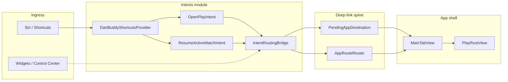
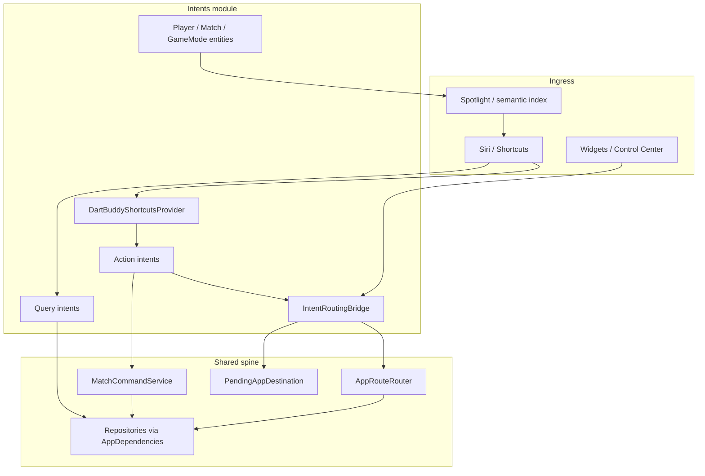

# App Intents Specification

## 1. Purpose

Expose Dart Buddy actions to **Siri**, the **Shortcuts** app, and future system surfaces (widgets, Control Center, Spotlight) without duplicating navigation logic.

App Intents are **consumers** of the deep-link routing spine defined in [`DeepLinkSpec.md`](DeepLinkSpec.md). They call `IntentRoutingBridge` → `AppRouteRouter` (or enqueue `AppDestination` via `PendingAppDestination` during cold launch).

**Shipped scope (Phase 1):** launch/resume shortcuts only — `OpenPlayIntent`, `ResumeActiveMatchIntent`, `DartBuddyShortcutsProvider`. These are **custom `AppIntent`s** that route navigation; Siri does not yet understand Dart Buddy *content* (players, matches, scores).

**Not shipped:** app entities, semantic indexing, query intents, on-screen context, parameterized match start, in-game scoring, widgets. See [§11 Roadmap](#11-roadmap) and [§13 Apple Intelligence & Siri platform model](#13-apple-intelligence--siri-platform-model).

**Platform reference:** Apple’s App Intents + Apple Intelligence guidance (WWDC — *Bring your app to Siri with Apple Intelligence*, Dan Niemeyer, Swift Intelligence Frameworks). Dart Buddy’s phased adoption of entities, indexing, queries, and on-screen awareness is mapped in §13.

---

## 2. Architecture



### Design rules

1. **Never navigate from intent code directly** — always route through `IntentRoutingBridge` → `AppRouteRouter` or `PendingAppDestination`.
2. **Do not duplicate match-start logic** — setup prefills and match creation stay in `MatchSetupViewModel` (same as deep links).
3. **Do not open a second SwiftData container** — intents read repositories only through `AppDependencies` wired by `MainTabView`.
4. **Gate behind `enableAppIntents`** until QA sign-off; shortcuts provider returns `[]` when disabled.
5. **URL registry lives in `DeepLinkSpec.md`** — do not duplicate path tables here.
6. **Model content as `AppEntity` before adding parameterized or query intents** — entities describe existing domain types (`PlayerSummary`, `MatchSummary`); they are not a parallel data model. See [§4.5](#45-app-entities-planned) and [§13](#13-apple-intelligence--siri-platform-model).
7. **Prefer custom `AppIntent`s over App Schema domains** — Apple’s predefined schema domains (messages, mail, photos) do not cover sports scoring. Dart Buddy adopts entities + custom intents; do not force-fit messaging schemas.

### Phase 1 vs Apple Intelligence-ready

| Capability | Phase 1 (shipped) | Apple Intelligence layer (planned) |
|---|---|---|
| Trigger navigation actions | Yes — Open Play, Resume | Start mode, Open Activity (Phase 1b) |
| Siri understands app nouns (player, match, mode) | No | `AppEntity` + optional `AppSchema`-like property sets |
| Semantic search over content | No | `IndexedEntity` on matches / players |
| Answer questions without opening app | No | Query intents (Phase 2) |
| “This game” / on-screen references | No | View annotations + `UserActivity` (Phase 2–3) |
| Cross-app handoff (“share this result”) | No | `Transferable` (low priority) |

---

## 3. Module layout

### Shipped

| Path | Responsibility |
|---|---|
| `Intents/Actions/OpenPlayIntent.swift` | Open Play tab (setup home) |
| `Intents/Actions/ResumeActiveMatchIntent.swift` | Resume in-progress match or dialog |
| `Intents/Routing/IntentRoutingBridge.swift` | Bridge to router, pending queue, analytics |
| `Intents/Providers/DartBuddyShortcutsProvider.swift` | Siri phrase registration |
| `Intents/README.md` | Developer quick reference (points here) |

### Planned (add as phases land)

| Path | Responsibility |
|---|---|
| `Intents/Entities/` | `PlayerEntity`, `MatchEntity`, `GameModeEntity` |
| `Intents/Enums/` | `GameModeIntentEnum`, `X01StartScoreIntentEnum` — generated from `GameModeCatalog.available` (shipped + reachable only) |
| `Intents/Queries/` | Read-only query intents (`GetActiveMatchStatusIntent`, …) |
| `Intents/Actions/` | Additional action intents (start mode, submit turn, …) |

**Platform:** `AppIntents.framework` linked in `project.yml` (DartBuddy target).

**Wiring:**

| File | Role |
|---|---|
| `App/DartBuddyApp.swift` | `IntentRoutingBridge.setPendingDeepLink(_:)` on appear |
| `App/MainTabView.swift` | `configureIntentRouting()` — sets dependencies + `AppRouteRouter.Actions` |

---

## 4. Intent inventory

### 4.1 Shipped (Phase 1)

| Intent | Stable name | `AppDestination` | Opens app? | Siri phrases (en) |
|---|---|---|---|---|
| **Open Play** | `open_play` | `.play(.home)` | Yes | “Open Dart Buddy”, “Open Play in Dart Buddy” |
| **Resume Active Match** | `resume_active_match` | `.play(.resumeActive)` or `.play(.home)` on failure | Yes | “Resume my dart game in Dart Buddy”, “Resume my game in Dart Buddy” |

**Open-app policy:** both intents set `openAppWhenRun = true`. They mutate navigation only; they do not create or abandon matches headlessly.

**Resume behavior matrix:**

| Bootstrap state | Active match? | Reachable on surface? | Action | User feedback |
|---|---|---|---|---|
| Routing ready | Yes | Yes | Route `.play(.resumeActive)` | Dialog: “Resuming your game.” |
| Routing ready | Yes | No | Route `.play(.home)`, log `intent_failed` | Dialog: “No active match” (`play.home.noActiveMatch`) |
| Routing ready | No | — | Route `.play(.home)`, log `intent_failed` | Dialog: “No active match” (`play.home.noActiveMatch`) |
| Cold launch (routing not ready) | Unknown | — | Enqueue `.play(.resumeActive)` via `PendingAppDestination` | Dialog: “Resuming your game.” (router resolves after onboarding) |
| Feature flag off | — | — | Throw `IntentRoutingError.disabled` | System shows localized error |

**Reachability:** `IntentRoutingBridge.fetchResumableActiveMatch()` and `AppRouteRouter` both gate on `ProductSurface.isMatchTypeReachable(_:)`. On lean 1.0, an in-progress party-mode match is treated as **no active match** for resume even though SwiftData still holds it.

#### 4.1.1 Shipped mode coverage (Phase 1)

Phase 1 intents are **mode-agnostic** — no per-mode intent code exists. **Resume Active Match** works for every shipped `MatchType` because routing is generic:

1. `ResumeActiveMatchIntent` → `IntentRoutingBridge.fetchResumableActiveMatch()`
2. `AppRouteRouter` → `.play(.resumeActive)` → `setPendingPlayResume(match)`
3. `PlayRootView` → `match.type.playRoute(matchId:)` → gameplay screen

**Start-by-mode** (e.g. “Start Around the Clock in Dart Buddy”) is **not** Phase 1 — see [§4.2](#42-planned-phase-1b--blocked-on-deep-link-phase-2).

**Shipped catalog (20 modes)** — authoritative list: `GameModeCatalog.all` where `status == .shipped`. Snapshot:

| Section | Catalog id | `MatchType` | UI template |
|---|---|---|---|
| Standard | `standard.x01` | `x01` | checkoutScore |
| Standard | `standard.cricket` | `cricket` | markBoard |
| Standard | `standard.americanCricket` | `americanCricket` | markBoard |
| Party | `party.baseball` | `baseball` | inningPoints |
| Party | `party.killer` | `killer` | livesElimination |
| Party | `party.shanghai` | `shanghai` | inningPoints |
| Party | `party.mickeyMouse` | `mickeyMouse` | markBoard |
| Party | `party.mulligan` | `mulligan` | markBoard |
| Party | `party.englishCricket` | `englishCricket` | checkoutScore |
| Party | `party.knockout` | `knockout` | checkoutScore |
| Party | `party.suddenDeath` | `suddenDeath` | checkoutScore |
| Party | `party.fiftyOneByFives` | `fiftyOneByFives` | checkoutScore |
| Party | `party.golf` | `golf` | inningPoints |
| Party | `party.football` | `football` | phaseRace |
| Party | `party.grandNational` | `grandNational` | sequenceProgress |
| Party | `party.hareAndHounds` | `hareAndHounds` | sequenceProgress |
| Practice | `practice.aroundTheClock` | `aroundTheClock` | sequenceProgress |
| Practice | `practice.aroundTheClock180` | `aroundTheClock180` | sequenceProgress |
| Practice | `practice.chaseTheDragon` | `chaseTheDragon` | sequenceProgress |
| Practice | `practice.nineLives` | `nineLives` | livesElimination |

When the catalog grows, **Phase 1 resume requires no new intent code** — only verify `MatchType.playRoute` and `PlayRootView` destination wiring for the new case. Phase 1b `GameModeEntity` / `GameModeIntentEnum` must **derive from** `GameModeCatalog.available` (respecting `ProductSurface`), not a hardcoded mode list.

### 4.2 Planned (Phase 1b — blocked on Deep Link Phase 2)

| Intent | Depends on | Notes |
|---|---|---|
| **Start Quick Match** | `/play/setup` or direct prefills | Settings defaults + last roster; prefill only, no headless start |
| **Start Mode Match** | `/play/setup?mode={catalogId}` | Enqueues `PendingModeSelection`; `catalogId` matches `GameModeCatalogEntry.id` (e.g. `practice.aroundTheClock`) |
| **Practice With Training Partner** | Router prefills | Reuses `PendingMatchPlayerSelections.enqueuePractice` |
| **Open Activity / Open History** | `/activity?segment=…` | Activity tab segment switch |

### 4.3 Planned (Phase 2 — queries)

| Intent | Data source |
|---|---|
| **Get Active Match Status** | `MatchRepository.fetchActiveMatch()` + snapshot |
| **Get Player Stats** | Statistics aggregation pipeline |
| **Get Recent Matches** | `fetchHistoryWithParticipants` + date filter |
| **Has Active Match** | Boolean for Shortcuts IF branches |

Requires `PlayerEntity`, `GameModeEntity` App Intent entities.

### 4.4 Planned (Phase 4 — in-game)

| Intent | Depends on |
|---|---|
| **Submit Turn Total** | `MatchCommandService` (shared with Watch) |
| **Undo Last Turn** | `MatchCommandService` |

See [`AppleWatchCompanionAssessment.md`](AppleWatchCompanionAssessment.md) and [`RepositorySpec.md`](RepositorySpec.md).

### 4.5 App entities (planned)

`AppEntity` types expose existing domain models to Siri, Shortcuts parameters, and Spotlight. They are **descriptions of content the app already owns**, not a new persistence layer.

| App entity | Source model | Identifying properties | Exposed properties (examples) |
|---|---|---|---|
| **`PlayerEntity`** | `PlayerSummary` | `id` (UUID) | `displayName` |
| **`MatchEntity`** | `MatchSummary` | `id` (UUID) | `type` (`MatchType`), `status`, `startedAt`, participant names (resolved at query time) |
| **`GameModeEntity`** | `GameModeCatalogEntry` / `MatchType` | catalog id (e.g. `practice.chaseTheDragon`) | localized mode name (`GameModeCatalogEntry.localizedName`), section, player-count label |

**Shipped mode set for entities:** all entries in `GameModeCatalog.available` on the current `ProductSurface` — today 20 shipped modes (see [§4.1.1](#411-shipped-mode-coverage-phase-1)). **Do not** hardcode a subset. Planned catalog entries (`status == .planned`) stay out of `GameModeIntentEnum` until promoted to `.shipped` (see [§12](#12-out-of-scope)).

**Entity queries:** each entity gets an `EntityQuery` (or string-query fallback) so Siri can resolve “Alice”, “501”, “Around the Clock”, or “my last Cricket game” into concrete entities. `ResumeActiveMatchIntent` already calls `fetchResumableActiveMatch()`; parameterized resume/start intents will accept `MatchEntity` / `GameModeEntity` / `[PlayerEntity]` parameters.

**Privacy:** entity display strings may include player names in Siri dialogs and Spotlight snippets. Do not log names or UUIDs in analytics (see §8). Respect `includeArchived: false` when resolving players.

### 4.6 Entity resolution & indexing (planned)

Siri resolves spoken references to app entities through:

| Mechanism | When to use in Dart Buddy | Example |
|---|---|---|
| **`IndexedEntity`** | Local match history, player roster — bounded, on-device datasets | “Show my Cricket games this week”, “Find games with Alice” |
| **`EntityStringQuery`** | Fallback when indexing is impractical (large remote datasets — not applicable today) | Custom search over server-backed data if cloud sync ships |

For `IndexedEntity`, set `indexingKey` (and related APIs) so message-like searchable fields — match mode label, player names, date, outcome — enter the system semantic index. This enables **meaning-based** lookup, not exact string match.

**Spotlight:** indexing also validates discoverability before Siri acts on content. Test indexed entities in Spotlight after unit tests pass.

### 4.7 On-screen awareness (planned)

Connect visible UI to the same `AppEntity` types used by intents so Siri understands “this game” without the user naming it.

| Screen | API | Annotated entity | Example phrases |
|---|---|---|---|
| Active gameplay (X01, Cricket, …) | View annotation (multiple rows N/A — single primary match) | `MatchEntity` (active) | “What’s my checkout?”, “Undo last throw” (Phase 4) |
| `MatchSummaryScreen` | `UserActivity` or view annotation | `MatchEntity` (completed) | “Show that game again” |
| Activity history list | View annotation per row | `MatchEntity` | “Open that Cricket game” |
| Play setup (single focus) | `UserActivity` | `GameModeEntity` or setup draft | “Start this game” |

Implementation uses the same entity types as §4.5 — annotations are references, not duplicate models.

### 4.8 Cross-app content transfer (planned, lower priority)

`Transferable` + `IntentValueRepresentation` lets other apps act on Dart Buddy entities (e.g. export a match result summary to Messages or Notes). **Incoming** content uses:

- **`IntentValueQuery`** — resolve incoming values to an existing `PlayerEntity` / `MatchEntity`.
- **`importing` on `Transferable`** — create a new entity when no match exists.

Cross-app workflows are a lower priority than entities, queries, and on-screen context for a local scoring app. Document any export surface in this spec before shipping.

### 4.9 App schemas vs custom intents

Apple’s **App Schema domains** (e.g. `sendMessage` in the messages domain) give Siri predefined natural-language handling. **No domain fits dart scoring today.** Dart Buddy should:

- Use **custom `AppIntent`** types with `@Parameter` entity properties (equivalent to UnicornChat’s custom mapping, without a messages schema).
- **Not** adopt unrelated schemas (mail, messages) for navigation-only shortcuts.
- Watch for future system schemas (sports, fitness, games); adopt only when they map cleanly to shipped features.

Xcode schema fix-its (e.g. requiring `draftMessage` when adopting `sendMessage`) apply only when adopting a domain schema — not to Dart Buddy’s custom intents.

---

## 5. IntentRoutingBridge API

`@MainActor enum IntentRoutingBridge` — single entry for all App Intent navigation.

```swift
// Configuration (app shell)
static func setPendingDeepLink(_ pending: PendingAppDestination)
static func configure(dependencies: AppDependencies, actions: AppRouteRouter.Actions)
static func clearRouteActions()

// Intent perform()
static var isEnabled: Bool                    // reads enableAppIntents flag
static var isRoutingReady: Bool               // dependencies + actions wired
static func fetchActiveMatch() async -> MatchSummary?
static func fetchResumableActiveMatch() async -> MatchSummary?   // active + ProductSurface.isMatchTypeReachable
static func route(_ destination: AppDestination, intentName: String, succeeded: Bool = true) async -> RouteOutcome
```

**Routing priority:**

1. If `enableAppIntents` is false → return `.failed`, log `intent_failed`.
2. If `dependencies` and `routeActions` are set → call `AppRouteRouter.handle` immediately.
3. Else → `pendingDeepLink.enqueue(destination)` for deferred delivery (same as `.onOpenURL`).

**Analytics:** every `route` call logs `intent_performed` or `intent_failed` with metadata `intentName` (no PII).

---

## 6. Feature flag

| Flag | Default | Enable for local QA |
|---|---|---|
| `enableAppIntents` | `false` (all configurations) | Launch argument `-enable_app_intents` |

Implementation: [`Support/FeatureFlags/FeatureFlag.swift`](../Support/FeatureFlags/FeatureFlag.swift), [`LocalFeatureFlagsProvider.swift`](../Support/FeatureFlags/LocalFeatureFlagsProvider.swift).

**Production rollout:** change default to `true` in `LocalFeatureFlagsProvider.defaultValue` after QA. `DartBuddyShortcutsProvider.appShortcuts` and intent `perform()` both honor the flag.

Documented in [`FeatureFlagConfigSpec.md`](FeatureFlagConfigSpec.md).

---

## 7. Localization

All intent titles, descriptions, and dialog strings use `LocalizedStringResource` keys in `Resources/*.lproj/Localizable.strings`.

| Key | en | Usage |
|---|---|---|
| `intent.openPlay.title` | Open Play | Shortcuts tile, intent title |
| `intent.openPlay.description` | Opens the Play tab in Dart Buddy. | Shortcuts detail |
| `intent.resumeActiveMatch.title` | Resume Active Match | Shortcuts tile, intent title |
| `intent.resumeActiveMatch.description` | Resumes your in-progress dart match, if one exists. | Shortcuts detail |
| `intent.resumeActiveMatch.resuming` | Resuming your game. | Siri dialog (success) |
| `intent.error.disabled` | Shortcuts are not enabled in this build. | Flag-off error |
| `play.home.noActiveMatch` | No active match | Resume failure dialog (reused) |

**Locales:** `en`, `de`, `es`, `nl` (Wave 1–3 policy — see [`LocalizationSpec.md`](LocalizationSpec.md)).

**Siri phrases** in `DartBuddyShortcutsProvider` are English-only in Phase 1; intent `title`/`description` localize via string keys. Full phrase localization is optional follow-up.

---

## 8. Analytics and privacy

| Log `eventName` | When | Allowlisted metadata |
|---|---|---|
| `intent_performed` | Route succeeded (or enqueued on cold launch) | `intentName` |
| `intent_failed` | Flag off, route failure, or resume with no active match | `intentName`, optional `path` |

Mapped in [`FirebaseAnalyticsEventMapping.swift`](../Support/Logging/FirebaseAnalyticsEventMapping.swift). Catalog: [`FirebaseBackendAnalyticsSpec.md`](FirebaseBackendAnalyticsSpec.md) §12.

**Privacy:** on-device only; no player names, UUIDs, or scores in intent analytics payloads. App Store privacy nutrition labels should note Shortcuts access when flag ships to production.

---

## 9. Relationship to deep linking

| Concern | Owner spec | App Intents usage |
|---|---|---|
| URL paths (`dartbuddy://v1/…`) | [`DeepLinkSpec.md`](DeepLinkSpec.md) | Intents prefer `AppRouteRouter` over opening URLs |
| `AppDestination` schema | [`DeepLinkSpec.md`](DeepLinkSpec.md) | Intents pass typed destinations to bridge |
| Deferred delivery (onboarding) | [`DeepLinkSpec.md`](DeepLinkSpec.md) §5 | Cold-launch intents enqueue to same `PendingAppDestination` |
| Equivalents | `dartbuddy://v1/play` | `OpenPlayIntent` |
| | `dartbuddy://v1/play/resume` | `ResumeActiveMatchIntent` |

Widgets and notification taps should use `DartBuddyURL` builders; Siri/Shortcuts use App Intents that call the same router.

---

## 10. Testing

Follow Apple’s recommended **validation ladder** for App Intents adoption. Each layer catches different failure modes; do not skip straight to Siri.

| Layer | What it validates | Dart Buddy status |
|---|---|---|
| **1. Unit tests** | Bridge routing, flag gating, analytics allowlist | Shipped — `IntentRoutingBridgeTests`, etc. |
| **2. `AppIntentsTesting`** | Invoke intents in isolation with injected parameters; no Siri | Planned — add when query intents and entities land |
| **3. Shortcuts app** | Intent shape, parameters, dialogs, open-app policy | Manual QA (Phase 1) |
| **4. Spotlight** | `IndexedEntity` discoverability and deep links | Planned — Phase 2–3 |
| **5. Siri (device)** | End-to-end NL, entity resolution, on-screen context | Manual QA after layers 1–4 |

Reference: WWDC session *Validate your App Intents adoption with AppIntentsTesting*.

### Unit tests

| File | Coverage |
|---|---|
| `Tests/Unit/IntentRoutingBridgeTests.swift` | Direct route, enqueue fallback, flag off, `fetchActiveMatch` |
| `Tests/Unit/AppIntentsCoverageTests.swift` | Intent stable names, shortcuts provider flag gating |
| `Tests/Unit/FeatureFlagsTests.swift` | `enableAppIntents` default + launch argument |
| `Tests/Unit/FirebaseAnalyticsEventMappingTests.swift` | `intent_performed` allowlist |
| `Tests/Unit/AppRouteRouterTests.swift` | Underlying navigation (shared with deep links) |
| `Tests/Unit/RoutesTests.swift` | `MatchType.playRoute` mapping (extend to all shipped types) |
| `Tests/Unit/*Entity*Tests.swift` (planned) | Entity query resolution, indexing keys |
| `Tests/Unit/*QueryIntent*Tests.swift` (planned) | `AppIntentsTesting` or direct `perform()` with fakes |

### Manual QA checklist

**Core (every release with intent changes):**

1. Add `-enable_app_intents` to Run scheme arguments.
2. Build and run on device or simulator.
3. Open **Shortcuts** → verify Dart Buddy shortcuts appear (“Open Play”, “Resume Active Match”).
4. Run **Open Play** → app opens to Play setup home.
5. With no active match, run **Resume Active Match** → Siri dialog “No active match”; Play tab shown.
6. Cold launch via Resume shortcut while onboarding not completed → link applies after onboarding dismiss.
7. Remove launch argument → shortcuts disappear from provider; running saved shortcut shows disabled error.
8. Spot-check intent titles in **Settings → Siri & Search → Dart Buddy** with device language `de` / `es` / `nl`.

**Resume spot-check (when new modes ship or before enabling flag in production):**

Run **Resume Active Match** after starting and backgrounding an in-progress match. Spot-check **at least one mode per UI template** on the current product surface (full surface: pass `-enable_full_product_surface` if needed):

| UI template | Representative mode(s) to resume |
|---|---|
| `checkoutScore` | X01 or Knockout |
| `markBoard` | Cricket or Mickey Mouse |
| `inningPoints` | Baseball or Golf |
| `livesElimination` | Killer or Nine Lives |
| `sequenceProgress` | Around the Clock, Chase the Dragon, Grand National, or Hare and Hounds |
| `phaseRace` | Football |
| `soloChallenge` | *(none shipped yet — skip until Bob's 27 / Halve-It ship)* |

For each spot-check: confirm the shortcut returns to the **correct gameplay screen** (not setup home), turn state is preserved, and the active-match badge still appears on Activity.

### UI test (optional)

Launch with URL as smoke alternative: `xcrun simctl openurl booted dartbuddy://v1/play/resume` (see [`DeepLinkSpec.md`](DeepLinkSpec.md) §9).

---

## 11. Roadmap

| Phase | Deliverable | Apple Intelligence layer | Status |
|---|---|---|---|
| **0** | Deep-link spine (`AppRouteRouter`, parser, pending queue) | Routing foundation | Shipped — [`DeepLinkSpec.md`](DeepLinkSpec.md) |
| **1** | Open Play + Resume intents, Shortcuts provider, feature flag | Actions only (no entities) | **Shipped** |
| **1b** | Start Quick / Start Mode / Open Activity intents | Parameterized actions + `GameModeEntity` / `PlayerEntity` | Blocked on Deep Link Phase 2 paths |
| **2** | Query intents + entities + `IndexedEntity` | Siri answers questions; semantic history search | Planned |
| **2b** | On-screen view annotations + `UserActivity` | “This game” context on gameplay / summary / history | Planned (after entities) |
| **3** | Widget / Control Center / Spotlight tap targets | System surfaces consuming same entities + resume intent | Planned |
| **4** | Submit Turn / Undo via `MatchCommandService` | Voice scoring at the oche; annotated active match | Planned |

**Recommended Phase 2 implementation order** (highest ROI first):

1. `PlayerEntity`, `MatchEntity`, `GameModeEntity` + entity queries.
2. `GetActiveMatchStatusIntent` / `HasActiveMatchIntent` — spoken score without opening app.
3. `IndexedEntity` on completed matches (and optionally players).
4. `GetPlayerStatsIntent`, `GetRecentMatchesIntent`.
5. View annotations on active match + history rows.

---

## 12. Out of scope

- Headless match creation from Shortcuts (prefill + open app only)
- Planned catalog modes in `AppEnum` until promoted to `.shipped`
- Online play / account-linked intents
- Mid-match settings changes via Siri
- Per-dart natural-language scoring (defer to Phase 4 + Watch)
- Adopting unrelated App Schema domains (messages, mail, photos) for dart features
- Cloud-synced entity resolution via `EntityStringQuery` until a server-backed dataset exists

---

## 13. Apple Intelligence & Siri platform model

This section maps Apple’s App Intents + Apple Intelligence platform to Dart Buddy. It is the **authoritative product/technical guide** for evolving beyond Phase 1 navigation shortcuts.

### 13.1 Platform capabilities (what Siri gains)

With Apple Intelligence, Siri integrates apps through **App Intents** in three ways:

1. **Find and describe content** — Siri accesses app **entities** (players, matches, modes) and returns properties (score, average, date).
2. **Take action** — Siri invokes **app intents** (resume, start mode, submit turn) with resolved parameters.
3. **Use on-screen context** — Siri resolves “this game” from **annotated views** without explicit names.

Dart Buddy Phase 1 covers only a thin slice of (2): two navigation intents with fixed phrases. Phases 2–4 add (1), richer (2), and (3).

### 13.2 Dart Buddy mapping

| Platform concept | Dart Buddy application | Phase |
|---|---|---|
| `AppEntity` | `PlayerEntity`, `MatchEntity`, `GameModeEntity` | 1b–2 |
| `AppSchema` (predefined) | **Not used** — no fitting domain; custom intents instead | — |
| `IndexedEntity` | Match history + player roster semantic search | 2 |
| `EntityStringQuery` | Defer unless cloud sync adds non-indexable data | Future |
| Custom `AppIntent` + `@Parameter` | Start mode, resume by mode, open activity | 1b |
| Query intent (`ProvidesDialog` / result value) | Active match status, player stats, recent count | 2 |
| View annotation / `UserActivity` | Gameplay screen, match summary, history list | 2b |
| `Transferable` | Export match result (optional) | Future |
| `AppIntentsTesting` | Test query intents and entity resolution in CI | 2 |

### 13.3 Example phrases by maturity

| Maturity | Example | Mechanism |
|---|---|---|
| **Phase 1 (shipped)** | “Resume my dart game in Dart Buddy” | Fixed phrase → `ResumeActiveMatchIntent` → router |
| **Phase 1b** | “Start Cricket in Dart Buddy”, “Start Around the Clock in Dart Buddy” | `StartModeMatchIntent` + `GameModeEntity` parameter (catalog-derived) |
| **Phase 2** | “What’s my dart score?” | `GetActiveMatchStatusIntent` — no `openAppWhenRun` |
| **Phase 2** | “Show my last Cricket game with Alice” | `IndexedEntity` + `MatchEntity` query |
| **Phase 2b** | “What do I need to finish?” (while playing) | View annotation + read-only checkout query |
| **Phase 4** | “Score 60” | `SubmitTurnTotalIntent` via `MatchCommandService` |

### 13.4 Architecture (target state)



### 13.5 Data boundaries (unchanged)

- Intents read through `AppDependencies` / `IntentRoutingBridge` — **no second SwiftData container**.
- Match mutations (start, score, undo) go through existing ViewModels or future `MatchCommandService` — not ad-hoc intent logic.
- Analytics remain PII-free (§8) even when Siri dialogs speak player names aloud.

### 13.6 Related Apple documentation

- App Intents fundamentals (prior WWDC sessions — entities, intents, Shortcuts provider).
- *Bring your app to Siri with Apple Intelligence* — entities, `IndexedEntity`, schemas, on-screen awareness, `Transferable`.
- *Validate your App Intents adoption with AppIntentsTesting* — CI testing for intents.

---

## 14. Cross-references

- [`DeepLinkSpec.md`](DeepLinkSpec.md) — URL registry, parser, deferred delivery
- [`NavigationSpec.md`](NavigationSpec.md) — typed routes, resume flow
- [`FeatureFlagConfigSpec.md`](FeatureFlagConfigSpec.md) — `enableAppIntents`
- [`LocalizationSpec.md`](LocalizationSpec.md) — string key policy
- [`FirebaseBackendAnalyticsSpec.md`](FirebaseBackendAnalyticsSpec.md) — event catalog
- [`AppleWatchCompanionAssessment.md`](AppleWatchCompanionAssessment.md) — shared in-game command boundary
- [`docs/feature-inventory.md`](../docs/feature-inventory.md) — shipped vs planned intent features
- [`Features/Modes/GameModeCatalog.swift`](../Features/Modes/GameModeCatalog.swift) — authoritative shipped-mode list for entity/enum derivation

---

## 15. Verification
| Field | Value |
|-------|--------|
| **Last verified** | 2026-06-12 |
| **Commit** | *(pending — spec-only update)* |
| **Code** | `IntentRoutingBridge.swift`, `Intents/Actions/`, `App/Navigation/Routes.swift` (`MatchType.playRoute`), `GameModeCatalog.swift` |
