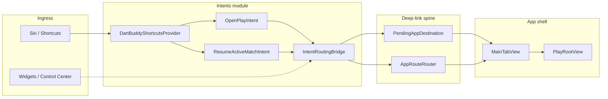

# App Intents Specification

## 1. Purpose

Expose Dart Buddy actions to **Siri**, the **Shortcuts** app, and future system surfaces (widgets, Control Center, Spotlight) without duplicating navigation logic.

App Intents are **consumers** of the deep-link routing spine defined in [`DeepLinkSpec.md`](DeepLinkSpec.md). They call `IntentRoutingBridge` → `AppRouteRouter` (or enqueue `AppDestination` via `PendingAppDestination` during cold launch).

**Shipped scope (Phase 1):** launch/resume shortcuts only — `OpenPlayIntent`, `ResumeActiveMatchIntent`, `DartBuddyShortcutsProvider`.

**Not shipped:** query intents, parameterized match start, in-game scoring, widgets. See [§11 Roadmap](#11-roadmap).

---

## 2. Architecture



### Design rules

1. **Never navigate from intent code directly** — always route through `IntentRoutingBridge` → `AppRouteRouter` or `PendingAppDestination`.
2. **Do not duplicate match-start logic** — setup prefills and match creation stay in `MatchSetupViewModel` (same as deep links).
3. **Do not open a second SwiftData container** — intents read repositories only through `AppDependencies` wired by `MainTabView`.
4. **Gate behind `enableAppIntents`** until QA sign-off; shortcuts provider returns `[]` when disabled.
5. **URL registry lives in `DeepLinkSpec.md`** — do not duplicate path tables here.

---

## 3. Module layout

| Path | Responsibility |
|---|---|
| `Intents/Actions/OpenPlayIntent.swift` | Open Play tab (setup home) |
| `Intents/Actions/ResumeActiveMatchIntent.swift` | Resume in-progress match or dialog |
| `Intents/Routing/IntentRoutingBridge.swift` | Bridge to router, pending queue, analytics |
| `Intents/Providers/DartBuddyShortcutsProvider.swift` | Siri phrase registration |
| `Intents/README.md` | Developer quick reference (points here) |

**Platform:** `AppIntents.framework` linked in `project.yml` (DartBuddy target).

**Wiring:**

| File | Role |
|---|---|
| `App/DartBuddyApp.swift` | `IntentRoutingBridge.setPendingDeepLink(_:)` on appear |
| `App/MainTabView.swift` | `configureIntentRouting()` — sets dependencies + `AppRouteRouter.Actions` |

---

## 4. Intent inventory

### 4.1 Shipped (Phase 1)

| Intent | Stable name | `AppDestination` | Opens app? | Siri phrases (en) |
|---|---|---|---|---|
| **Open Play** | `open_play` | `.play(.home)` | Yes | “Open Dart Buddy”, “Open Play in Dart Buddy” |
| **Resume Active Match** | `resume_active_match` | `.play(.resumeActive)` or `.play(.home)` on failure | Yes | “Resume my dart game in Dart Buddy”, “Resume my game in Dart Buddy” |

**Open-app policy:** both intents set `openAppWhenRun = true`. They mutate navigation only; they do not create or abandon matches headlessly.

**Resume behavior matrix:**

| Bootstrap state | Active match? | Action | User feedback |
|---|---|---|---|
| Routing ready | Yes | Route `.play(.resumeActive)` | Dialog: “Resuming your game.” |
| Routing ready | No | Route `.play(.home)`, log `intent_failed` | Dialog: “No active match” (`play.home.noActiveMatch`) |
| Cold launch (routing not ready) | Unknown | Enqueue `.play(.resumeActive)` via `PendingAppDestination` | Dialog: “Resuming your game.” (router resolves after onboarding) |
| Feature flag off | — | Throw `IntentRoutingError.disabled` | System shows localized error |

### 4.2 Planned (Phase 1b — blocked on Deep Link Phase 2)

| Intent | Depends on | Notes |
|---|---|---|
| **Start Quick Match** | `/play/setup` or direct prefills | Settings defaults + last roster; prefill only, no headless start |
| **Start Mode Match** | `/play/setup?mode=…` | Enqueues `PendingModeSelection` |
| **Practice With Training Partner** | Router prefills | Reuses `PendingMatchPlayerSelections.enqueuePractice` |
| **Open Activity / Open History** | `/activity?segment=…` | Activity tab segment switch |

### 4.3 Planned (Phase 2 — queries)

| Intent | Data source |
|---|---|
| **Get Active Match Status** | `MatchRepository.fetchActiveMatch()` + snapshot |
| **Get Player Stats** | Statistics aggregation pipeline |
| **Get Recent Matches** | `fetchHistoryWithParticipants` + date filter |
| **Has Active Match** | Boolean for Shortcuts IF branches |

Requires `PlayerEntity`, `GameModeEntity` App Intent entities.

### 4.4 Planned (Phase 4 — in-game)

| Intent | Depends on |
|---|---|
| **Submit Turn Total** | `MatchCommandService` (shared with Watch) |
| **Undo Last Turn** | `MatchCommandService` |

See [`AppleWatchCompanionAssessment.md`](AppleWatchCompanionAssessment.md) and [`RepositorySpec.md`](RepositorySpec.md).

---

## 5. IntentRoutingBridge API

`@MainActor enum IntentRoutingBridge` — single entry for all App Intent navigation.

```swift
// Configuration (app shell)
static func setPendingDeepLink(_ pending: PendingAppDestination)
static func configure(dependencies: AppDependencies, actions: AppRouteRouter.Actions)
static func clearRouteActions()

// Intent perform()
static var isEnabled: Bool                    // reads enableAppIntents flag
static var isRoutingReady: Bool               // dependencies + actions wired
static func fetchActiveMatch() async -> MatchSummary?
static func route(_ destination: AppDestination, intentName: String, succeeded: Bool = true) async -> RouteOutcome
```

**Routing priority:**

1. If `enableAppIntents` is false → return `.failed`, log `intent_failed`.
2. If `dependencies` and `routeActions` are set → call `AppRouteRouter.handle` immediately.
3. Else → `pendingDeepLink.enqueue(destination)` for deferred delivery (same as `.onOpenURL`).

**Analytics:** every `route` call logs `intent_performed` or `intent_failed` with metadata `intentName` (no PII).

---

## 6. Feature flag

| Flag | Default | Enable for local QA |
|---|---|---|
| `enableAppIntents` | `false` (all configurations) | Launch argument `-enable_app_intents` |

Implementation: [`Support/FeatureFlags/FeatureFlag.swift`](../Support/FeatureFlags/FeatureFlag.swift), [`LocalFeatureFlagsProvider.swift`](../Support/FeatureFlags/LocalFeatureFlagsProvider.swift).

**Production rollout:** change default to `true` in `LocalFeatureFlagsProvider.defaultValue` after QA. `DartBuddyShortcutsProvider.appShortcuts` and intent `perform()` both honor the flag.

Documented in [`FeatureFlagConfigSpec.md`](FeatureFlagConfigSpec.md).

---

## 7. Localization

All intent titles, descriptions, and dialog strings use `LocalizedStringResource` keys in `Resources/*.lproj/Localizable.strings`.

| Key | en | Usage |
|---|---|---|
| `intent.openPlay.title` | Open Play | Shortcuts tile, intent title |
| `intent.openPlay.description` | Opens the Play tab in Dart Buddy. | Shortcuts detail |
| `intent.resumeActiveMatch.title` | Resume Active Match | Shortcuts tile, intent title |
| `intent.resumeActiveMatch.description` | Resumes your in-progress dart match, if one exists. | Shortcuts detail |
| `intent.resumeActiveMatch.resuming` | Resuming your game. | Siri dialog (success) |
| `intent.error.disabled` | Shortcuts are not enabled in this build. | Flag-off error |
| `play.home.noActiveMatch` | No active match | Resume failure dialog (reused) |

**Locales:** `en`, `de`, `es`, `nl` (Wave 1–3 policy — see [`LocalizationSpec.md`](LocalizationSpec.md)).

**Siri phrases** in `DartBuddyShortcutsProvider` are English-only in Phase 1; intent `title`/`description` localize via string keys. Full phrase localization is optional follow-up.

---

## 8. Analytics and privacy

| Log `eventName` | When | Allowlisted metadata |
|---|---|---|
| `intent_performed` | Route succeeded (or enqueued on cold launch) | `intentName` |
| `intent_failed` | Flag off, route failure, or resume with no active match | `intentName`, optional `path` |

Mapped in [`FirebaseAnalyticsEventMapping.swift`](../Support/Logging/FirebaseAnalyticsEventMapping.swift). Catalog: [`FirebaseBackendAnalyticsSpec.md`](FirebaseBackendAnalyticsSpec.md) §12.

**Privacy:** on-device only; no player names, UUIDs, or scores in intent analytics payloads. App Store privacy nutrition labels should note Shortcuts access when flag ships to production.

---

## 9. Relationship to deep linking

| Concern | Owner spec | App Intents usage |
|---|---|---|
| URL paths (`dartbuddy://v1/…`) | [`DeepLinkSpec.md`](DeepLinkSpec.md) | Intents prefer `AppRouteRouter` over opening URLs |
| `AppDestination` schema | [`DeepLinkSpec.md`](DeepLinkSpec.md) | Intents pass typed destinations to bridge |
| Deferred delivery (onboarding) | [`DeepLinkSpec.md`](DeepLinkSpec.md) §5 | Cold-launch intents enqueue to same `PendingAppDestination` |
| Equivalents | `dartbuddy://v1/play` | `OpenPlayIntent` |
| | `dartbuddy://v1/play/resume` | `ResumeActiveMatchIntent` |

Widgets and notification taps should use `DartBuddyURL` builders; Siri/Shortcuts use App Intents that call the same router.

---

## 10. Testing

### Unit tests

| File | Coverage |
|---|---|
| `Tests/Unit/IntentRoutingBridgeTests.swift` | Direct route, enqueue fallback, flag off, `fetchActiveMatch` |
| `Tests/Unit/FeatureFlagsTests.swift` | `enableAppIntents` default + launch argument |
| `Tests/Unit/FirebaseAnalyticsEventMappingTests.swift` | `intent_performed` allowlist |
| `Tests/Unit/AppRouteRouterTests.swift` | Underlying navigation (shared with deep links) |

### Manual QA checklist

1. Add `-enable_app_intents` to Run scheme arguments.
2. Build and run on device or simulator.
3. Open **Shortcuts** → verify Dart Buddy shortcuts appear (“Open Play”, “Resume Active Match”).
4. Run **Open Play** → app opens to Play setup home.
5. Start a match, background app, run **Resume Active Match** → returns to active gameplay.
6. With no active match, run **Resume Active Match** → Siri dialog “No active match”; Play tab shown.
7. Cold launch via Resume shortcut while onboarding not completed → link applies after onboarding dismiss.
8. Remove launch argument → shortcuts disappear from provider; running saved shortcut shows disabled error.
9. Spot-check intent titles in **Settings → Siri & Search → Dart Buddy** with device language `de` / `es` / `nl`.

### UI test (optional)

Launch with URL as smoke alternative: `xcrun simctl openurl booted dartbuddy://v1/play/resume` (see [`DeepLinkSpec.md`](DeepLinkSpec.md) §9).

---

## 11. Roadmap

| Phase | Deliverable | Status |
|---|---|---|
| **0** | Deep-link spine (`AppRouteRouter`, parser, pending queue) | Shipped — [`DeepLinkSpec.md`](DeepLinkSpec.md) |
| **1** | Open Play + Resume intents, Shortcuts provider, feature flag | **Shipped** (this spec) |
| **1b** | Start Quick / Start Mode / Open Activity intents | Blocked on Deep Link Phase 2 paths |
| **2** | Query intents + entities | Planned |
| **3** | Widget / Control Center tap targets | Planned |
| **4** | Submit Turn / Undo via `MatchCommandService` | Planned |

Planning doc: [`.cursor/plans/app_intents_brainstorm_174c8c15.plan.md`](../.cursor/plans/app_intents_brainstorm_174c8c15.plan.md).

---

## 12. Out of scope

- Headless match creation from Shortcuts (prefill + open app only)
- Planned catalog modes in `AppEnum` until promoted to `.shipped`
- Online play / account-linked intents
- Mid-match settings changes via Siri
- Per-dart natural-language scoring (defer to Phase 4 + Watch)

---

## 13. Cross-references

- [`DeepLinkSpec.md`](DeepLinkSpec.md) — URL registry, parser, deferred delivery
- [`NavigationSpec.md`](NavigationSpec.md) — typed routes, resume flow
- [`FeatureFlagConfigSpec.md`](FeatureFlagConfigSpec.md) — `enableAppIntents`
- [`LocalizationSpec.md`](LocalizationSpec.md) — string key policy
- [`FirebaseBackendAnalyticsSpec.md`](FirebaseBackendAnalyticsSpec.md) — event catalog
- [`AppleWatchCompanionAssessment.md`](AppleWatchCompanionAssessment.md) — shared in-game command boundary
