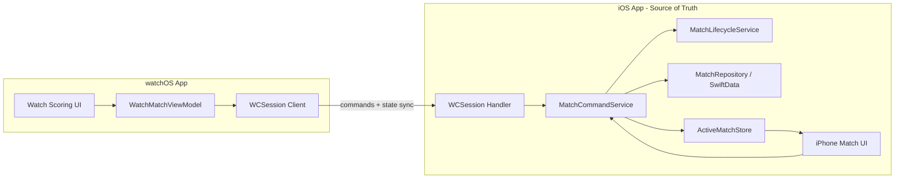

# Apple Watch Companion — Assessment

> Assessment date: June 2026  
> Related: `specs/AppleWatchCompanionSpec.md`, `todo.md` (user feedback), `roadmap/archive/phases/07-rc-launch-and-post-launch.md`

## Executive Summary

**Verdict: Feasible and well-aligned with existing architecture — but intentionally deferred post-1.0.**

A watch companion fits Dart Buddy naturally: players stand at the board, phone is across the room, wrist input is faster than walking back. The domain layer (engines, events, `DartInput`) is already platform-agnostic and `Codable`, which is the hard part. What's missing is the **Xcode target**, a **WatchConnectivity bridge**, a **`MatchCommandService` boundary** (spec'd but not built), and a **watch-specific UI**.

Recommended approach: **iPhone as source of truth** (Phase A in `AppleWatchCompanionSpec.md`). Watch sends commands; iPhone validates, runs engines, persists. No SwiftData on watch.

| Dimension | Rating | Notes |
|-----------|--------|-------|
| Product fit | High | Core use case for live scoring |
| Architecture readiness | Medium–High | Engines/events ready; command boundary missing |
| Implementation effort | Medium | ~2–4 weeks for Phase A MVP |
| Risk | Low–Medium | Connectivity edge cases, bot-turn timing |
| Roadmap fit | Post-1.0 | Matches archived phase 07 launch plan |

---

## What Exists Today

### Project targets

iOS app + unit/UI tests only. No watch extension, no shared Swift package.

Current targets in `DartsScoreboard.xcodeproj`:
- `DartsScoreboard` (iOS)
- `DartsScoreboardTests`
- `DartsScoreboardUITests`

### Scoring flow (iPhone)

ViewModels own UI state, call `MatchLifecycleService` directly, then persist via `MatchRepository`. This works for iPhone but watch needs a **single command entry point** on the phone side.

Key files:
- `Features/Play/X01/X01MatchViewModel.swift` — submit/undo/persist loop
- `Features/Play/Cricket/CricketMatchViewModel.swift` — same pattern
- `Domain/Services/MatchLifecycleService.swift` — deterministic turn submission
- `Support/State/ActiveMatchStore.swift` — in-memory session cache (iPhone only)

### Domain layer

Pure Foundation — no SwiftUI/SwiftData in `Domain/`. `DartInput`, `MatchEventEnvelope`, and engines are `Codable`/`Sendable`. Good for WCSession payloads.

### UI components

- `Features/Play/X01/DartNumberPad.swift` — 7-column X01 grid (~52pt keys)
- `Features/Play/Cricket/CricketBoardView.swift` (`CricketTapPad`) — 3-column layout

Both are iPhone-sized. Watch needs a separate, simplified layout.

### Specs already locked

- `WatchConnectivity`, no third-party SDK (`specs/TechStackSpec.md`)
- iPhone canonical for persistence/history (`specs/AppleWatchCompanionSpec.md`)
- Commands: `SubmitTurn`, `UndoLastTurn`, `RequestMatchState`
- Idempotency keys per command
- Feature flag: `enableAppleWatchCompanion` (default `false`, `specs/FeatureFlagConfigSpec.md`)
- Reserved metadata: `originDeviceType`, `originDeviceSessionId` (`specs/DataSchemaSpec.md`)

---

## Recommended Architecture

### Phase A (first release)

- Watch only works when iPhone app has an **active in-progress match**
- Watch shows: current player, remaining score/marks, compact pad, undo
- Watch sends `SubmitTurnCommand` with `[DartInput]` or total; iPhone applies and replies with updated state or rejection
- Bot turns still run on iPhone; watch gets state updates when it's the human's turn

### Phase B (later)

- Offline command queue on watch when phone unreachable
- Replay with idempotency on reconnect

---

## Gap Analysis

| Area | Current state | Watch needs |
|------|---------------|-------------|
| `MatchCommandService` | Spec'd in `RepositorySpec.md`, **not implemented** | Central handler for submit/undo/state from any client |
| ViewModel coupling | ViewModels call lifecycle + repo directly | iPhone UI and WCSession both route through command service |
| Event metadata | Reserved in spec, **not in payloads yet** | Optional `originDeviceType` on events |
| Shared code packaging | Single iOS target, folders only | Shared framework/target for Domain + DTOs + L10n strings |
| Watch UI | None | New watchOS SwiftUI views |
| Connectivity | None | `WCSession` manager on both sides |
| Feature flag | Spec'd, verify implementation | Gate watch UI + WCSession activation |
| Active match discovery | `ActiveMatchStore` in-memory | Phone pushes "active match snapshot" to watch on session start |
| Bot handling | Automatic in ViewModel after human turn | Command service must trigger bot loop after watch submit |
| Testing | Engine tests exist | Idempotency, duplicate messages, reconnect E2E |

### Minor coupling to address

`Domain/` uses `L10n` in display/accessibility helpers (e.g. `DartInput.spokenAccessibilityName`, checkout mode labels in `MatchLifecycleModels.swift`). Harmless for watch if shared, but keep presentation strings out of command DTOs.

---

## Watch UX Constraints

### Screen real estate

40–49mm watches cannot host the full 7-column X01 pad. Practical options:

1. **Cricket-first MVP** — `CricketTapPad` pattern (3×2 numbers + bull) maps cleanly to watch
2. **X01 per-dart entry** — Scrollable or paginated 1–20 grid, or "common scores" shortcuts + full grid in secondary view
3. **X01 total entry only on watch** — Simplest watch UI (numeric total 0–180); loses per-dart stats on watch-origin turns unless phone infers (it can't today with total-only entry)

### Interaction

- Large tap targets, haptic ack on accept/reject
- Sticky D/T modifiers (same as phone)
- Undo sends command to phone (not local-only)
- Glanceable: "501 → 341", current player name, dart count 1/2/3

### Out of scope for v1 watch

Match setup, history, stats, settings, bot configuration — all stay on iPhone.

---

## Implementation Phases & Effort

### Phase 0 — Prep (before adding watch target) — ~3–5 days

Low risk, improves iPhone code too:

1. Implement `MatchCommandService` wrapping `MatchLifecycleService` + persistence + bot turn scheduling
2. Refactor `X01MatchViewModel` / `CricketMatchViewModel` to call it
3. Add `WatchMatchStateDTO` (compact snapshot for sync)
4. Add command DTOs with idempotency keys
5. Optionally extract **Shared** Swift package: `Domain/`, command DTOs, `DartInput`, minimal L10n

### Phase A — MVP watch companion — ~2–3 weeks

1. Add watchOS app target + Watch App + Watch Extension
2. `WatchConnectivityManager` (iOS) + `WatchSessionClient` (watchOS)
3. Watch UI: active match gate → scoring screen (Cricket + X01 dart entry)
4. iPhone: activate WCSession when match starts; push state on turn change
5. Wire `enableAppleWatchCompanion` feature flag
6. Tests: command idempotency, invalid turn rejection, state sync

### Phase B — Resilience — ~1–2 weeks

- Offline queue on watch
- Duplicate/reconnect handling
- Watch complications (optional): "match in progress" glance

### App Store / ops

- Separate watch screenshots, privacy questionnaire unchanged (no cloud)
- Test on physical watch + phone (simulator pairing is limited)
- watchOS deployment target: **watchOS 10+** (pairs with iOS 17)

---

## Risks & Mitigations

| Risk | Mitigation |
|------|------------|
| Duplicate turn submission | Idempotency key per command; engine rejects out-of-order |
| Phone locked / app backgrounded | `WCSession` background delivery; show "waiting for phone" on watch |
| Bot turn while user scores on watch | Only accept watch input when `currentTurnPlayerId` is human; disable pad during bot |
| State drift between devices | Phone always authoritative; watch refreshes on every accepted command |
| SwiftData on watch temptation | Don't — spec is clear; persistence stays on iPhone |
| Build/maintenance cost | Shared package + command boundary keeps watch thin |

---

## Pre-Work (No Watch Target Required)

These align with `ArchitectureSpec.md` §8 and don't block 1.0:

1. **`MatchCommandService`** — highest leverage
2. **Event `originDeviceType` metadata** — forward-compatible schema bump
3. **`WatchMatchStateDTO`** — define the sync contract early
4. **Feature flag plumbing** — if not already wired

---

## Recommendation

**Don't add the watch target before 1.0** unless it becomes a launch differentiator — the roadmap already defers it correctly.

When building:

1. Start with **Phase 0** on iPhone (command service refactor)
2. Ship **Phase A** as Cricket + X01 per-dart entry, phone-hosted
3. Use `AppleWatchCompanionSpec.md` as the contract — it matches the codebase well

The app is **~70% architecturally ready**; the remaining ~30% is connectivity, watch UI, and extracting a clean command boundary from the ViewModels.

---

## Next Steps (Optional)

1. Draft the `MatchCommandService` API and DTO shapes against current models
2. Sketch the watch screen flow (wireframe-level)
3. Produce a concrete Xcode target checklist (bundle IDs, capabilities, shared framework layout)
