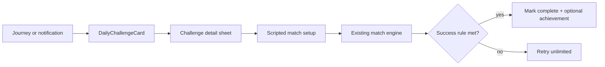

# Daily Challenge Specification

## 1. Purpose

Define a **once-per-day challenge** that gives players a concrete reason to return: a scoped match goal surfaced in-app and optionally nudged via local push — complementary to Journey ([`CampaignSpec.md`](CampaignSpec.md)) and generic play reminders ([`FutureIdeas/play-reminders.md`](../FutureIdeas/play-reminders.md)).

**Related specs:** Notifications infrastructure — [`FutureIdeas/play-reminders.md`](../FutureIdeas/play-reminders.md) (promote scheduling patterns to Settings when built). Achievements — [`AchievementsSpec.md`](AchievementsSpec.md) (optional challenge-completion badge). Analytics — [`FirebaseBackendAnalyticsSpec.md`](FirebaseBackendAnalyticsSpec.md). Feature flags — [`FeatureFlagConfigSpec.md`](FeatureFlagConfigSpec.md).

**Status:** Post-1.0 R&D — ships after or alongside play-reminder plumbing; feature-flagged.
**Estimated release:** `2.0+`

---

## 2. Product Positioning

| Principle | Rule |
|-----------|------|
| **One challenge per calendar day** | Device local timezone; resets at local midnight |
| **Optional push** | Reuse play-reminder notification stack — separate toggle or combined “Engagement” section in Settings |
| **Human play only** | Bots do not complete challenges for the user |
| **Lightweight** | Completable in one short session (~5–15 minutes) |
| **Local definition** | Challenge templates in bundled JSON (same pipeline as campaign content) |
| **No cloud required** | Deterministic daily pick from seed + date (no server) |

---

## 3. Scope

### Phase 1 — In-app daily challenge
- Feature flag `enableDailyChallenge`
- Challenge card on **Journey tab** (primary surface) and optionally Play home (product TBD)
- Template pool in `Resources/DailyChallenges/templates.json`
- `DailyChallengeService` selects today’s challenge, tracks completion per primary player
- Completion persisted in SwiftData (`DailyChallengeCompletionRecord`)

### Phase 2 — Push integration
- Local notification: “Today’s challenge is ready” (time user-configurable or fixed default)
- Tap notification → open Journey or challenge detail
- Shares `PlayReminderService` / `UNUserNotificationCenter` wrapper with [`FutureIdeas/play-reminders.md`](../FutureIdeas/play-reminders.md)
- Settings: enable/disable daily challenge notification (independent of weekly play reminder)

### Phase 3 — Rewards
- Optional achievement: `db.daily.complete` or streak achievements (`db.daily.streak_7`)
- Optional campaign star credit — only if challenge explicitly links to a campaign stage (defer)

### Out of scope (v1)
- Server-driven challenge rotation (FCM)
- Leaderboards / social comparison
- Paid challenge packs

---

## 4. Challenge Types (initial pool)

Templates reference **shipped** modes only at time of ship.

| Type | Example | Mode |
|------|---------|------|
| `win_x01` | Win a 301 match vs Easy bot | X01 |
| `score_visit` | Hit a 100+ visit in any X01 match | X01 |
| `win_cricket` | Win a Cricket match | Cricket |
| `marks_turn` | Score 5+ marks in one Cricket visit | Cricket |
| `party_win` | Win one Killer/Baseball/Shanghai match | Party (when shipped) |

**Not daily:** grinds requiring hours (e.g. “play 10 matches”) — save for achievements.

### Template shape (JSON)

```json
{
  "id": "daily.win_x01_301_easy",
  "matchType": "x01",
  "titleKey": "daily.win_x01_301_easy.title",
  "descriptionKey": "daily.win_x01_301_easy.description",
  "setup": {
    "startScore": 301,
    "legsToWin": 1,
    "opponentDifficulty": "easy"
  },
  "successRule": "win_match"
}
```

### Daily selection algorithm

```
seed = calendarDayOrdinal + bundledSalt
index = seed % templates.count
todayChallenge = templates[index]
```

Same challenge for all users on the same calendar day (acceptable for v1). Optional: incorporate `primaryPlayerId` hash for per-user variety in Phase 2.

---

## 5. User Flow



1. User sees **Today’s challenge** card with title, mode badge, expiry (“Resets in 4h”)
2. Tap → briefing sheet (rules, opponent, success condition)
3. **Start** → same orchestration as campaign scripted match (primary human vs bot)
4. On match complete → evaluate `successRule`; if met, record completion for today
5. Completed state: card shows checkmark; no repeat reward same day

**Unlimited retries** until local midnight or success — same as campaign v1.

---

## 6. Primary Player

- Daily challenge progress attributes to **primary player** only (same as Journey — [`CampaignSpec.md`](CampaignSpec.md) §4)
- If no primary designated yet, first challenge tap triggers primary prompt

---

## 7. UI

### 7.1 `DailyChallengeCard`
- Placement: top of Journey tab root (above map)
- States: `available`, `completed`, `expired` (post-midnight until refresh)
- Uses `CampaignAccent.campaignPrimary` left rail for visual kinship with Journey

### 7.2 Accessibility
- VoiceOver: “Today’s challenge, {title}, not completed”
- Dynamic Type: card expands; no map-only dependency

---

## 8. Data Model (conceptual)

### `DailyChallengeCompletionRecord`
| Field | Type |
|-------|------|
| `id` | UUID |
| `primaryPlayerId` | UUID |
| `challengeTemplateId` | String |
| `calendarDay` | String (ISO date local) |
| `completedAt` | Date |
| `matchId` | UUID? |

Unique constraint: `(primaryPlayerId, calendarDay)`.

**Reset:** Cleared by **Reset all local data** — [`DeleteAllDataSpec.md`](DeleteAllDataSpec.md) §6.6.

---

## 9. Push Notification Integration

Align with play-reminder implementation:

| Setting | Default | Behavior |
|---------|---------|----------|
| `dailyChallengeNotificationsEnabled` | `false` | Opt-in |
| `dailyChallengeNotificationTime` | `10:00` local | Fire once per day if challenge not completed |

**Notification copy (localized):** “Your daily dart challenge is ready.”

**Tap action:** Deep link to Journey + present challenge sheet.

**On reset all data:** Cancel pending daily challenge notifications (same as play reminders — [`DeleteAllDataSpec.md`](DeleteAllDataSpec.md)).

Do **not** require FCM for MVP — local `UNCalendarNotificationTrigger` only.

---

## 10. Feature Flags

| Flag | Default | Launch arg |
|------|---------|------------|
| `enableDailyChallenge` | `false` | `-enable_daily_challenge` |

May require `enableCampaign` for Journey placement in Phase 1, or show on Play home when campaign flag off — product chooses at implementation time.

---

## 11. Analytics

Allowlisted events:
- `daily_challenge_viewed`
- `daily_challenge_started`
- `daily_challenge_completed`
- `daily_challenge_notification_opened`

---

## 12. Relationship to Play Reminders

| Feature | Intent | Schedule |
|---------|--------|----------|
| **Play reminder** | Generic “go throw” nudge | Weekly / biweekly / monthly |
| **Daily challenge** | Specific goal for today | Daily + in-app card |

Settings UI may group under **Notifications** or **Engagement** with separate toggles. Promote shared scheduling code from [`FutureIdeas/play-reminders.md`](../FutureIdeas/play-reminders.md) into a formal `PlayNotificationsSpec` or extend [`SettingsSpec.md`](SettingsSpec.md) when either ships.

---

## 13. Testing

| Case | Expect |
|------|--------|
| Midnight rollover | New challenge id |
| Complete + retry same day | Stays completed |
| Success rule fail | Can retry |
| Bot-only session | Does not complete |
| Reset all | Completion rows cleared |

---

## 14. Verification

| Field | Value |
|-------|--------|
| **Estimated release** | `2.0+` |
| **Last verified** | 2026-06-11 |
| **Commit** | (spec authoring — no implementation yet) |
| **Code** | (planned) `DailyChallengeService`, Journey tab card |