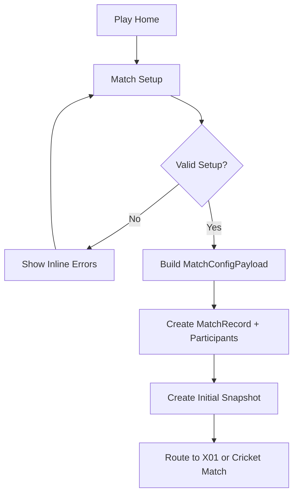
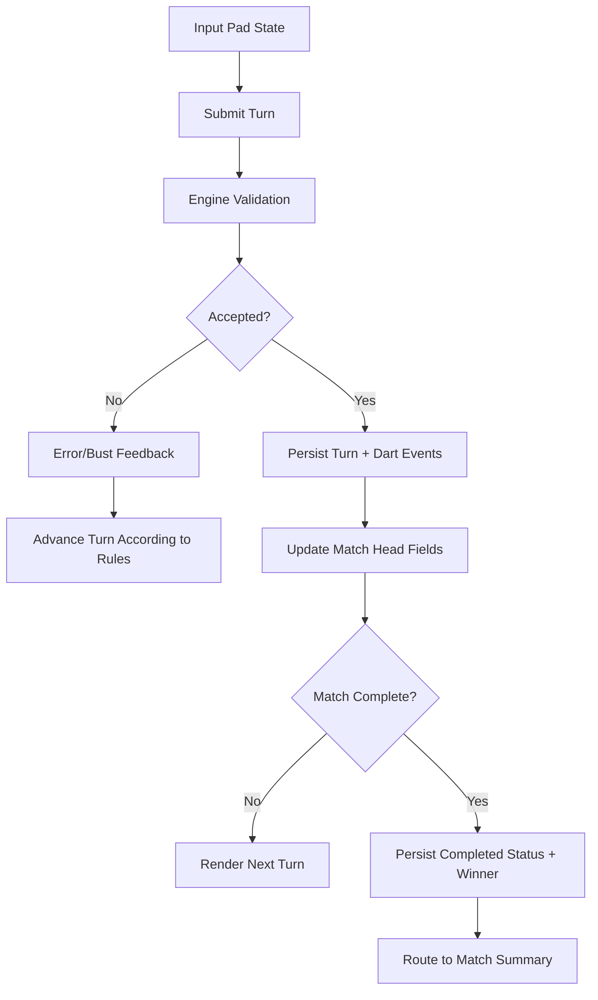
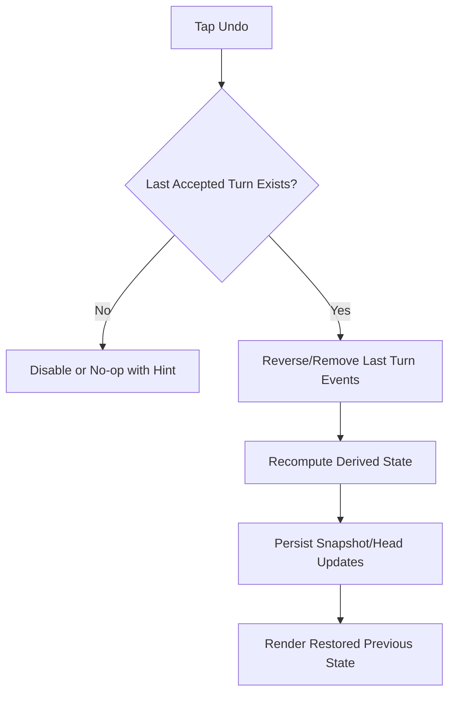
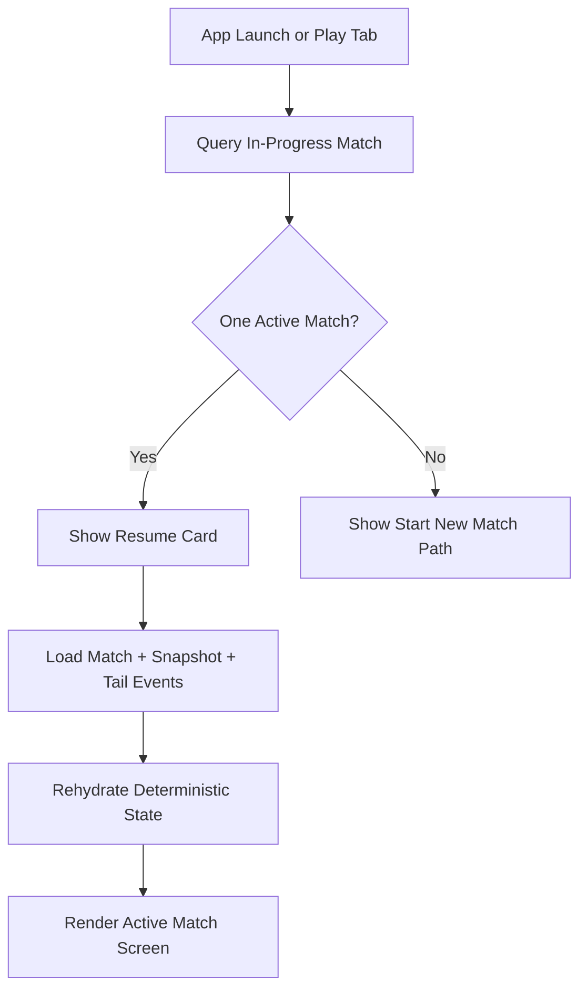
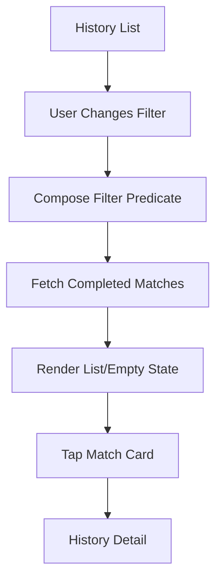
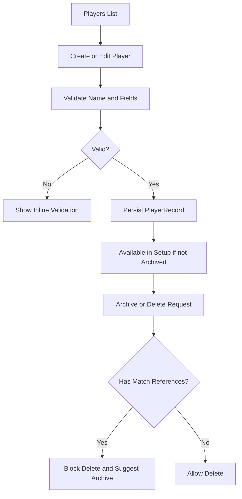
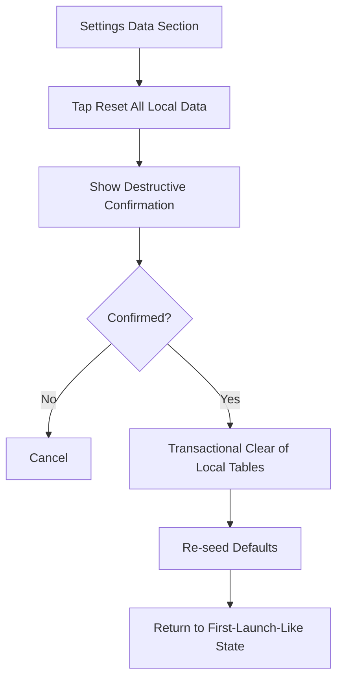

# UI Blueprint Specification

## 1. Purpose
Define expected UI wireframes, interaction behavior, and function-level data flow for every MVP screen.

This is the implementation-facing blueprint for UI/UX quality and consistency.

Primary references:
- `specs/AppShellSpec.md`
- `specs/NavigationSpec.md`
- `specs/MatchSpec.md`
- `specs/SetupFlowSpec.md`
- `specs/X01GameSpec.md`
- `specs/CricketSpec.md`
- `specs/ScoringInputSpec.md`
- `specs/PlayerSpec.md`
- `specs/HistorySpec.md`
- `specs/SettingsSpec.md`
- `specs/DesignSystemSpec.md`

---

## 2. Global UI Architecture

## 2.1 Tab Structure
- `Play`
- `History`
- `Players`
- `Settings`

Each tab maintains its own navigation stack.

## 2.2 Global Interaction Rules
- One primary CTA per screen.
- Core gameplay controls remain visually stable in position.
- All destructive exits from active match require confirmation.
- Any blocked action must show clear, inline reason.

---

## 3. Screen Inventory (MVP)
- `PlayHome`
- `MatchSetup`
- `X01MatchScreen`
- `CricketMatchScreen`
- `MatchSummaryScreen`
- `HistoryListScreen`
- `HistoryDetailScreen`
- `PlayersListScreen`
- `PlayerDetailScreen`
- `PlayerEditSheet` (create/edit)
- `SettingsScreen`
- `MigrationRecoveryScreen` (global error route)

---

## 4. Wireframes and Behavior by Screen

The wireframes are intentionally low fidelity. They define structure, hierarchy, and interaction contracts.

## 4.1 Play Home
Purpose:
- Entry point for creating or resuming matches.

Wireframe:
```text
+--------------------------------------------------+
| Play                                             |
|--------------------------------------------------|
| [Resume Active Match Card] (only if in progress)|
|  - Mode, players, started time, Resume button    |
|--------------------------------------------------|
| [Start New Match] (primary)                      |
|--------------------------------------------------|
| [Recent Completed Match mini list] (optional)    |
+--------------------------------------------------+
```

Behavior:
- If exactly one in-progress match exists, show resume card prominently.
- `Start New Match` routes to setup.
- If no players exist, setup path should surface quick add.

## 4.2 Match Setup
Purpose:
- Configure and validate match before start.

Wireframe:
```text
+--------------------------------------------------+
| New Match                                        |
|--------------------------------------------------|
| Section: Mode                                    |
|  (X01) (Cricket)                                 |
|--------------------------------------------------|
| Section: Players                                 |
|  [Player picker list]                            |
|  [+ Quick Add]                                   |
|  [Inline validation: minimum 2 players]          |
|--------------------------------------------------|
| Section: X01 Options (only when X01 selected)    |
|  Start Score: (301/501)                          |
|  Legs: [ - 3 + ]                                 |
|  Sets: [toggle] [count]                          |
|  Checkout: (Single-Out / Double-Out)             |
|--------------------------------------------------|
| [Sticky Bottom]                                  |
| [Start Match] (primary, disabled if invalid)     |
+--------------------------------------------------+
```

Behavior:
- Inline validation appears near invalid fields.
- CTA remains visible (sticky) while scrolling.
- Start action builds versioned config payload and creates match.

## 4.3 X01 Match Screen
Purpose:
- Real-time X01 scoring and turn progression.

Wireframe:
```text
+--------------------------------------------------+
| P1 301   P2 244   P3 355                         |
| Turn: P2   Leg 1/5   Set 0/1   [Double-Out]      |
|--------------------------------------------------|
| SCOREBOARD / REMAINING SCORES                    |
|  P1 301                                           |
|  P2 244   <- active                               |
|  P3 355                                           |
|--------------------------------------------------|
| INPUT PANEL                                       |
|  [total/dart mode selector]                       |
|  [S][D][T]                                        |
|  [segment grid 1..20 + bull]                      |
|  Preview: T20 D20 S1                              |
|  [Submit Turn]  [Undo Last Turn]                  |
|  [Backspace]   [Clear Turn]                       |
+--------------------------------------------------+
```

Behavior:
- `Submit` disabled until current input is valid.
- Bust feedback is visible, short-lived, and non-color-only.
- Successful commit triggers haptic (if enabled).
- Undo restores exactly one accepted turn.

## 4.4 Cricket Match Screen
Purpose:
- Real-time Cricket mark and points tracking.

Wireframe:
```text
+--------------------------------------------------+
| Turn: P1    Round 6                               |
| Points: P1 80  P2 55  P3 20                       |
|--------------------------------------------------|
| TARGET BOARD (rows 20..15 + Bull)                |
|         P1     P2     P3                          |
| 20      XXO    XXX    OOO                         |
| 19      XXX    XXO    OOO                         |
| ...                                               |
| Bull    XOO    OOO    OOO                         |
|--------------------------------------------------|
| INPUT PANEL                                       |
|  Target: 20/19/.../Bull                           |
|  Multiplier: [S][D][T]                            |
|  Darts: D20, S19, T17                             |
|  [Submit Turn]  [Undo Last Turn]                  |
+--------------------------------------------------+
```

Behavior:
- Closed/open states must use shape/text cues plus color.
- Overflow scoring only when opponents still open target.
- Target/state changes are announced clearly for accessibility.

## 4.5 Match Summary Screen
Purpose:
- Confirm outcome and offer next action.

Wireframe:
```text
+--------------------------------------------------+
| Match Complete                                   |
|--------------------------------------------------|
| [Winner Hero Card]                                |
|  Winner: Player Name                              |
|--------------------------------------------------|
| Metadata: Duration | Mode | Players               |
|--------------------------------------------------|
| Key Metrics Chips                                 |
|  [Avg] [Checkout] [Turns] ...                     |
|--------------------------------------------------|
| [New Match] (primary)                             |
| [View History Detail] (secondary)                 |
+--------------------------------------------------+
```

Behavior:
- Summary must remain readable even if player profile changes later.
- `New Match` routes to setup with defaults.

## 4.6 History List Screen
Purpose:
- Browse completed matches quickly.

Wireframe:
```text
+--------------------------------------------------+
| History                                          |
|--------------------------------------------------|
| Filters: [All/X01/Cricket] [7d/30d/All] [Player]|
|--------------------------------------------------|
| Match Card                                        |
|  X01  | P1 vs P2 vs P3                            |
|  Winner: P2 | Date/Time                           |
|  [Stat chip] [Stat chip]                          |
|--------------------------------------------------|
| ... lazy list of match cards ...                  |
+--------------------------------------------------+
```

Behavior:
- Filter changes update list deterministically.
- Empty state includes actionable guidance.

## 4.7 History Detail Screen
Purpose:
- Inspect one completed match with event timeline.

Wireframe:
```text
+--------------------------------------------------+
| Match Detail                                     |
|--------------------------------------------------|
| Header: Mode | Date | Duration | Winner           |
| Participants: snapshot identities                 |
|--------------------------------------------------|
| Mode-specific summary                             |
|--------------------------------------------------|
| Event timeline (turn-by-turn)                     |
|  Turn 1: P1 +60                                   |
|  Turn 2: P2 +45                                   |
|  ...                                              |
+--------------------------------------------------+
```

Behavior:
- Missing player references fall back to match snapshot identity.
- Long timelines should render lazily.

## 4.8 Players List Screen
Purpose:
- Manage player roster.

Wireframe:
```text
+--------------------------------------------------+
| Players                             [+]          |
|--------------------------------------------------|
| [Search]                                          |
|--------------------------------------------------|
| [Avatar] Name                W/L  Last played  > |
| [Avatar] Name                W/L  Last played  > |
|--------------------------------------------------|
| Swipe actions: Archive, Delete                    |
+--------------------------------------------------+
```

Behavior:
- Default sorted alphabetically.
- Empty state includes `Add Player` CTA.

## 4.9 Player Detail Screen
Purpose:
- View and manage one player.

Wireframe:
```text
+--------------------------------------------------+
| Player Detail                                    |
|--------------------------------------------------|
| Identity card (avatar, name, color token)        |
|--------------------------------------------------|
| Lifetime stats                                   |
| Recent matches                                   |
|--------------------------------------------------|
| [Edit] [Archive/Unarchive] [Delete]              |
+--------------------------------------------------+
```

Behavior:
- Delete is guarded and blocked when references exist.
- Archive preferred over destructive delete.

## 4.10 Player Edit Sheet
Purpose:
- Create or edit player profile fields.

Wireframe:
```text
+--------------------------------------------------+
| Edit Player                                      |
|--------------------------------------------------|
| Name (required)                                  |
| Avatar style picker                              |
| Color token picker                               |
| Notes (optional)                                 |
| Inline validation messages                       |
|--------------------------------------------------|
| [Cancel]                             [Save]       |
+--------------------------------------------------+
```

Behavior:
- Save enabled only when valid and changed.
- Duplicate name errors are immediate and clear.

## 4.11 Settings Screen
Purpose:
- Configure app behavior and defaults.

Wireframe:
```text
+--------------------------------------------------+
| Settings                                         |
|--------------------------------------------------|
| Appearance                                        |
|  Theme: System / Light / Dark                     |
| Gameplay Defaults                                 |
|  Default mode, score, checkout, legs, sets        |
| Feedback                                          |
|  Haptics [toggle]  Sound [toggle]                 |
| Data                                              |
|  [Reset All Local Data] (destructive)             |
| About                                             |
+--------------------------------------------------+
```

Behavior:
- Safe preference changes apply immediately.
- Reset flow requires explicit destructive confirmation.

## 4.12 Migration Recovery Screen
Purpose:
- Protect user trust when persistence migration fails.

Wireframe:
```text
+--------------------------------------------------+
| Data Recovery Required                           |
|--------------------------------------------------|
| We couldn't complete local data migration.        |
|--------------------------------------------------|
| [Retry Migration]                                 |
| [Export Diagnostic Bundle]                        |
| [Reset Local Data] (destructive, last resort)     |
+--------------------------------------------------+
```

Behavior:
- Never silently wipe store.
- Always provide recoverable options and transparent copy.

---

## 5. Function Behavior and Data Flow Charts

## 5.1 New Match Start Flow


## 5.2 Turn Submission Flow (X01 or Cricket)


## 5.3 Undo Flow


## 5.4 Resume Flow


## 5.5 History Filter Flow


## 5.6 Player Lifecycle Flow


## 5.7 Reset All Local Data Flow


---

## 6. Interaction State Matrix (All Screens)
- **Loading:** skeleton or stable placeholder, no layout jump.
- **Empty:** explanation + clear next action.
- **Error:** short plain-language message + recovery action.
- **Offline/local:** all MVP flows still function without network.
- **Accessibility:** labels/hints for all interactive controls.

---

## 7. Accessibility and UX Acceptance Criteria
- Tap targets are at least 44x44pt (52x52pt for scoring controls).
- Critical gameplay text remains legible at accessibility text sizes.
- Focus order follows visual hierarchy.
- No critical state depends on color alone.
- VoiceOver uses domain language users understand.

---

## 8. Cross-Cutting Compliance Matrix (Must Pass)

## 8.1 WCAG 2.1 AA
- Follow `specs/AccessibilitySpec.md` as release-gate criteria.
- All text/background pairings pass contrast in light and dark appearance.
- Color is never the only indicator for turn, status, or cricket closure.

## 8.2 Dark Mode
- Every screen has verified appearance in both light and dark mode.
- Semantic tokens are used; avoid hardcoded visual values in feature views.
- Gameplay contrast remains high for score numerals, active player, and input controls.

## 8.3 Landscape Mode (iPhone)
- MVP supports both portrait and landscape orientations.
- In landscape, no core gameplay control (`Submit`, `Undo`, current turn context) is hidden.
- If vertical space is constrained, secondary metadata may collapse before core controls.

---

## 9. Implementation Checklists by Screen (Phase 2)

Each screen must define:
- required UI states
- ViewModel events/actions
- future UI automation tasks (post-UI-lock)

## 9.1 Play Home Checklist
- **UI states:** default, has-active-match, no-players, loading.
- **ViewModel events:** `onAppear`, `tapStartNewMatch`, `tapResumeMatch`.
- **Future UI automation tasks:** resume card presence logic, start route, no-player guidance.

## 9.2 Match Setup Checklist
- **UI states:** pristine, invalid, valid, submitting.
- **ViewModel events:** `selectMode`, `selectPlayers`, `updateX01Config`, `tapStart`.
- **Future UI automation tasks:** validation matrix, sticky CTA behavior, quick-add transition, start route.

## 9.3 X01 Match Checklist
- **UI states:** normal turn, invalid entry, bust feedback, checkout-complete.
- **ViewModel events:** `enterTotalOrDart`, `backspace`, `clearTurn`, `submitTurn`, `undoLastTurn`.
- **Future UI automation tasks:** submit disabled rules, bust rendering, undo rollback, completion transition.

## 9.4 Cricket Match Checklist
- **UI states:** normal turn, closed/open target transitions, overflow scoring feedback, match-complete.
- **ViewModel events:** `selectTarget`, `selectMultiplier`, `submitTurn`, `undoLastTurn`.
- **Future UI automation tasks:** board state rendering, non-color closure indicators, overflow scoring visibility, undo correctness.

## 9.5 Match Summary Checklist
- **UI states:** standard completion, long-text participant names.
- **ViewModel events:** `tapNewMatch`, `tapViewHistoryDetail`.
- **Future UI automation tasks:** winner card rendering, metrics chips presence, CTA routes.

## 9.6 History List Checklist
- **UI states:** loading, filtered result, empty result, error recovery.
- **ViewModel events:** `setModeFilter`, `setDateFilter`, `setPlayerFilter`, `tapMatch`.
- **Future UI automation tasks:** each filter path, deterministic list updates, empty state messaging.

## 9.7 History Detail Checklist
- **UI states:** normal, long timeline lazy rendering, missing-player fallback.
- **ViewModel events:** `onAppear`, `expandTimelineChunk` (if chunked).
- **Future UI automation tasks:** summary sections present, timeline render, snapshot fallback identity.

## 9.8 Players List Checklist
- **UI states:** empty, populated, search results, no search results.
- **ViewModel events:** `tapAddPlayer`, `searchChanged`, `tapPlayer`, `swipeArchive`, `swipeDelete`.
- **Future UI automation tasks:** add route, search filtering, swipe actions, archive/delete guard behavior.

## 9.9 Player Detail Checklist
- **UI states:** active player, archived player, delete-blocked state.
- **ViewModel events:** `tapEdit`, `tapArchiveToggle`, `tapDelete`.
- **Future UI automation tasks:** stats and recent matches sections, archive/unarchive action, guarded delete messaging.

## 9.10 Player Edit Sheet Checklist
- **UI states:** create empty, edit prefilled, invalid, valid-save-enabled.
- **ViewModel events:** `nameChanged`, `avatarChanged`, `colorChanged`, `notesChanged`, `tapSave`, `tapCancel`.
- **Future UI automation tasks:** inline validation, duplicate-name handling, save enable/disable logic.

## 9.11 Settings Checklist
- **UI states:** default values loaded, edited values, destructive confirmation visible.
- **ViewModel events:** `setAppearance`, `toggleHaptics`, `toggleSound`, `updateDefaults`, `tapResetAllData`.
- **Future UI automation tasks:** immediate preference application, reset confirm/cancel/execute flow.

## 9.12 Migration Recovery Checklist
- **UI states:** migration error details available, retry-in-progress, retry-failed.
- **ViewModel events:** `tapRetry`, `tapExportDiagnostics`, `tapResetLocalData`.
- **Future UI automation tasks:** each recovery action path is reachable and clearly labeled.

---

## 10. Orientation and Appearance Verification Grid

- **Portrait + Light:** baseline layout, readability, CTA discoverability.
- **Portrait + Dark:** contrast and status hierarchy hold.
- **Landscape + Light:** control reachability with reduced height.
- **Landscape + Dark:** most constrained case; verify score and input legibility first.

Hard rule:
- A screen is not "done" until all four combinations pass quick manual QA.
- UI automation remains deferred until UI behavior is locked after MVP test feedback.

---

## 11. Delivery Plan for Full-Fidelity Assets (Recommended)
1. Approve this low-fidelity structure and behavior contract.
2. Build mid-fidelity screen mocks in Figma using `specs/DesignSystemSpec.md`.
3. Validate flows with 3 short usability sessions:
   - setup and start
   - live scoring and undo
   - history lookup and player management
4. Freeze v1 UI contract and enforce via PR checklist.

---

## 12. Definition of Done for UI Documentation
- Every MVP screen has a wireframe and behavior section.
- Every critical function has a data flow chart.
- Navigation paths are unambiguous from root tab to terminal screen.
- Error, empty, and recovery states are documented.
- Accessibility constraints are explicitly included.
