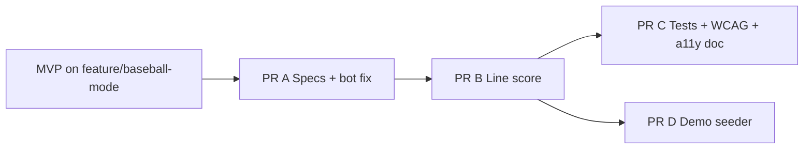

# Baseball Mode — Deferred Work Plan

Follow-up work after the MVP implementation on branch `feature/baseball-mode`. The MVP covers engine, lifecycle, setup, play UI, basic history/stats, localization keys, and core unit tests. This plan closes every item explicitly deferred from the baseball MVP implementation pass.

**Authoritative rules:** [`BaseballGameSpec.md`](BaseballGameSpec.md) and [GLD Baseball rules](https://gldproducts.com/blogs/all/how-to-play-baseball-darts).

**Related:** When promoted, canonical product spec becomes `specs/game-modes/implemented/BaseballGameSpec.md` (created in PR A).

---

## MVP baseline (already landed)

| Area | Status | Notes |
|------|--------|-------|
| `BaseballEngine` + config/state | Done | GLD scoring, extra innings, bull playoff, 7th-inning stretch, replay/undo |
| Lifecycle | Done | `MatchType.baseball`, payloads, `submitBaseballTurn`, rehydrate/undo |
| Setup | Done | Party chips, validation (preset bots only), `performStart` → `.baseballMatch` |
| Play UI | Done | Screen, VM, scoreboard, inning strip, locked pad, preset bot loop |
| History / stats (partial) | Done | Filter, timeline lines, standings; **no line-score grid** |
| Localization | Partial | `play.baseball.*` keys appended in en/de/es/nl (English placeholders in de/es/nl) |
| Tests | Partial | `BaseballEngineTests` (includes lifecycle smoke); setup tests extended |

**Build note:** Run `xcodegen generate` after pull — `.xcodeproj` is gitignored.

---

## Deferred inventory

| ID | Item | MVP gap |
|----|------|---------|
| D1 | Spec promotion | No `specs/game-modes/implemented/BaseballGameSpec.md`; sibling specs not updated |
| D2 | History line score | No `BaseballLineScoreView`; detail shows summary only |
| D3 | `BaseballMatchViewModelTests` | Not created |
| D4 | `MatchLifecycleServiceBaseballTests` | Lifecycle cases live inside `BaseballEngineTests` |
| D5 | WCAG UI smoke | No party → baseball path in `WCAGAccessibilityUITests` |
| D6 | Accessibility screen doc | No `accessibility/wcag-2.1-aa/screens/baseball-match.md` |
| D7 | Demo seeder | No completed baseball sample in `DemoSeeder` |
| D8 | Custom bot menu bug | `SetupHomeView` ~339 calls `addTrainingBot` instead of custom bot (hidden for party baseball only) |
| D9 | Optional polish | Firebase `match_setup_baseball`, stats sector chart, native de/es/nl copy — **done** |

---

## Recommended PR sequence

Split for reviewability on top of `feature/baseball-mode` (or stacked PRs after MVP merges).

### PR A — Specs + setup bug fix (~0.5–1 day)

**Goal:** Lock contracts and fix a setup bug unrelated to baseball but discovered during MVP.

**D1 — Spec promotion** (per [SpecGovernance.md](SpecGovernance.md)):

1. Create **`specs/game-modes/implemented/BaseballGameSpec.md`** — GLD rules, config defaults, engine invariants, undo guarantees, preset-bot-only v1, accessibility requirements (runs as text, inning strip not color-only).
2. Update **`specs/MatchSpec.md`**, **`specs/SetupFlowSpec.md`**, **`specs/PlayHomeSpec.md`**, **`specs/SwiftData.md`** (payload variants only), **`specs/ScoringInputSpec.md`** (segment-locked pad), **`specs/LocalizationSpec.md`** (`play.baseball.*`).
3. Add wireframe section to **`specs/UIBlueprintSpec.md`** (header, scoreboard, inning strip, pad, match end).
4. Add row to **`specs/README.md`** feature table.

**D8 — Custom bot menu:**

- In [SetupHomeView.swift](../../../Features/Play/Setup/SetupHomeView.swift), fix custom-bot menu action to add/select a custom bot, not `addTrainingBot`.
- Add or extend `MatchSetupViewModelTests` if behavior is testable without UI.

**Exit criteria:** Spec index links `BaseballGameSpec.md`; governance docs reference baseball payloads; custom bot path works for non-party setup.

---

### PR B — History line score (~1 day)

**Goal:** Match R&D §6 — players × innings grid on history detail.

**D2 — `BaseballLineScoreView`:**

- New view under `Features/History/` (or `Features/Play/Baseball/` if shared with summary).
- Columns: innings 1–9 (+ extra inning columns when applicable); rows: players; cells: runs that inning; footer: totals.
- Wire into [MatchHistoryDetailScreen.swift](../../../Features/History/MatchHistoryDetailScreen.swift) when `match.type == .baseball`.
- Build data from replayed `BaseballState` or aggregated `.baseballTurn` events in [HistoryViewModels.swift](../../../Features/History/HistoryViewModels.swift).

**Tests:**

- Unit tests for line-score builder (player order, extras, bull playoff omitted or separate row per spec).
- Snapshot or structural test optional; prefer deterministic builder tests.

**Exit criteria:** Completed baseball match in history shows line score; X01/Cricket detail unchanged.

---

### PR C — Tests, WCAG automation, a11y doc (~1 day)

**Goal:** Parity with Cricket/X01 test and accessibility coverage.

**D3 — `Tests/Unit/BaseballMatchViewModelTests.swift`:**

- Mirror patterns from `CricketMatchViewModelTests.swift`: bot turn scheduling, human submit, match completion routing.
- Tag `.baseball` per [SwiftTestingTagsSpec.md](SwiftTestingTagsSpec.md).

**D4 — `Tests/Unit/MatchLifecycleServiceBaseballTests.swift`:**

- Extract lifecycle smoke from `BaseballEngineTests.swift`.
- Cases: create → two turns → snapshot → replay → undo mid-inning and across inning boundary.

**D5 — `WCAGAccessibilityUITests`:**

- Flow: Play → Party → Baseball → configure → start (smoke identifiers on setup chips + match screen).
- Assert stable identifiers: e.g. `baseball_submit`, `baseball_undo`, inning header, scoreboard rows (align with [AccessibilitySpec.md](AccessibilitySpec.md)).

**D6 — Screen doc:**

- Add **`accessibility/wcag-2.1-aa/screens/baseball-match.md`** (template: [cricket-match.md](../../../accessibility/wcag-2.1-aa/screens/cricket-match.md)).
- Link from `BaseballGameSpec.md`, `MatchSpec.md`, and `accessibility/wcag-2.1-aa/README.md` index if present.

**Exit criteria:** New test targets pass in CI; WCAG suite includes baseball smoke; screen doc status `Partial` with engineering checklist filled.

---

### PR D — Demo seeder (~0.5 day)

**Goal:** Screenshot-ready completed baseball match in fresh installs.

**D7 — [DemoSeeder.swift](../App/Bootstrap/DemoSeeder.swift):**

- Append one completed 9-inning sample (2–3 players, varied runs, optional extra inning or stretch toggle off by default).
- Ensure history detail shows line score after PR B.

**Exit criteria:** Demo data includes baseball; no migration bump.

---

## Optional follow-ups (separate PRs or backlog)

| ID | Item | Notes |
|----|------|-------|
| D9a | Firebase | Log `match_setup_baseball` per [FirebaseBackendAnalyticsSpec.md](FirebaseBackendAnalyticsSpec.md) |
| D9b | Statistics sector chart | Map `.baseballTurn` hits to segment at `currentInning` |
| D9c | Localization | Replace English placeholders in de/es/nl; verify `MatchConfigText` resume strings |
| — | Training/custom baseball bots | Proxy from X01 average; out of v1 scope |
| — | Achievements | Perfect inning, 81-run game |
| — | Practice tab | Bob's 27, Around the Clock — separate from party baseball |

Track optional items in [docs/release/todo.md](../../../docs/release/todo.md) or `FutureIdeas/backlog.md` when scheduled; do not block baseball MVP merge on D9.

---

## Implementation order (summary)

1. **PR A** — Specs + custom bot fix  
2. **PR B** — History line score (+ builder tests)  
3. **PR C** — VM/lifecycle tests + WCAG UI + screen doc (can parallel PR D after B)  
4. **PR D** — Demo seeder (after line score)

**Estimated total:** ~3–3.5 dev days after MVP merge.

---

## Verification checklist (all PRs merged)

- [x] `specs/game-modes/implemented/BaseballGameSpec.md` linked from `specs/README.md`
- [x] History detail shows `BaseballLineScoreView` for baseball matches
- [x] `BaseballMatchViewModelTests` + `MatchLifecycleServiceBaseballTests` pass
- [x] `WCAGAccessibilityUITests` includes party baseball smoke
- [x] `accessibility/wcag-2.1-aa/screens/baseball-match.md` exists
- [x] Demo seeder includes completed baseball sample
- [x] Custom bot menu adds custom bot (all setup categories)
- [ ] Manual VoiceOver pass logged in `accessibility/Manual_todo.md` when ready for release

---

## Changelog

| Date | Author | Notes |
|------|--------|-------|
| 2026-06-04 | Agent | Initial plan from MVP deferred-items review |
