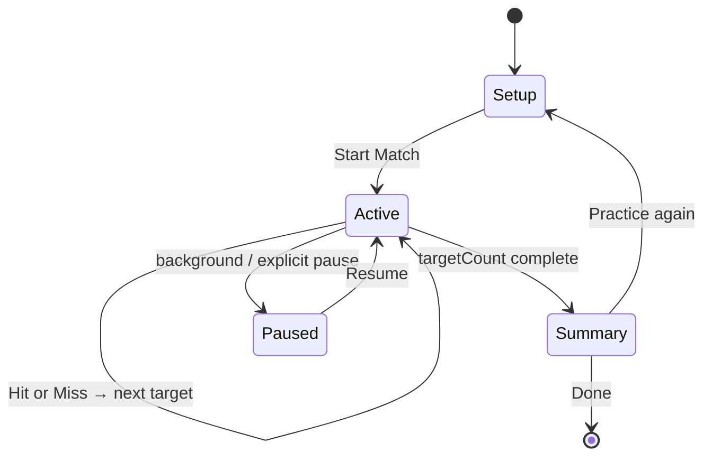

# Call & Hit Game Specification

## 1. Purpose
Define **Call & Hit** — a solo practice drill where the app announces random targets; the player throws up to a configurable number of darts per target and self-reports hit or miss; a summary shows accuracy and per-segment breakdown. Sessions persist as completed matches in Activity history.

**Status:** Planned (`practice.callAndHit`). R&D brief: [`FutureIdeas/party-practice-modes.md`](../../../FutureIdeas/party-practice-modes.md).

**Dependencies:**
- [`CalloutVoicesSpec.md`](../../CalloutVoicesSpec.md) — target announcement voices and phrase policy
- [`VoiceDrillUITemplateSpec.md`](VoiceDrillUITemplateSpec.md) — Template J gameplay shell
- [`CallAndHitStatsSupplement.md`](CallAndHitStatsSupplement.md) — aggregates, charts, fingerprints
- [`CallAndHitDataSchemaSupplement.md`](CallAndHitDataSchemaSupplement.md) — SwiftData entities, migration
- [`MatchSpec.md`](../../MatchSpec.md) — lifecycle, resume, abandon, history
- [`HistorySpec.md`](../../HistorySpec.md) — list cards, detail, filters
- [`MatchSummarySpec.md`](../../MatchSummarySpec.md) — post-session summary shell
- [`SoloPracticeModesSpec.md`](../../SoloPracticeModesSpec.md) — shared solo practice platform
- [`SoloPracticeMatchSummarySupplement.md`](../../SoloPracticeMatchSummarySupplement.md) — summary layout variant

---

## 2. Catalog metadata
| Field | Value |
|-------|-------|
| **Section** | Practice |
| **UI template** | J — Voice drill (new; see [`VoiceDrillUITemplateSpec.md`](VoiceDrillUITemplateSpec.md)) |
| **Stat kind** | `practiceAccuracy` (new `ModeStatKind`; see stats supplement) |
| **Ruleset (v1)** | `call_and_hit_standard` |
| **Catalog id** | `practice.callAndHit` |
| **MatchType** | `callAndHit` (when implemented) |

---

## Player count

| Question | Answer |
|----------|--------|
| **Solo?** | Yes — **only** supported shape |
| **Minimum** | 1 human |
| **Recommended** | 1 exactly |
| **App maximum** | 1 (`maximumPlayers: 1`; `isSolo: true`) |

### Brainstorm
- Honor-scored drill: app calls, player reports — no dart pad entry in v1.
- Setup **skips roster** (`GameModeCatalogEntry.isSolo`) — auto-select single human or prompt pick one profile.
- Not a race or score chase; accuracy % is the primary outcome metric.

---

## 3. MVP Scope

### In scope (v1)
| Item | Default | Configurable |
|------|---------|--------------|
| Session length | **50 targets** | 25 / 50 / 100 |
| Darts per target | **3** (see §3a) | 1 / 2 / 3 · session presets |
| Target kind | **Singles** | Singles · Doubles · Triples |
| Bull in pool | **On** (singles & doubles) | Off for triples preset |
| Target order | Uniform random, no repeat until pool exhausted, then reshuffle | — |
| Input | **Hit** / **Miss** after allotted darts (or early **Hit** on first connect) | — |
| Callout | Spoken + large on-screen label | Voice picker per [`CalloutVoicesSpec.md`](../../CalloutVoicesSpec.md); visual-only toggle |
| Progress | `n / targetCount` + current hit streak | — |
| Undo | Undo last Hit/Miss only | — |
| Pause / resume | Standard in-progress match resume | — |
| History | Full `MatchRecord` parity — Activity list, detail, filters | — |
| Entry | **Modes catalog card only** (when Modes tab is reachable) | Play home shortcut deferred |

### Out of scope (v1)
- Dart-by-dart scoring pad or vision auto-verify
- Multiplayer, bots, weighted weak-spot targeting
- Mixed target kinds in one session (e.g. singles + doubles together)
- Play tab teaser row / Journey integration
- Achievements tied to perfect accuracy

---

## 3a. Darts per target — product decision

Both **1 dart** and **3 darts** are first-class. Ship **configurable** with **3 as default**; surface both through **session presets** so players don't have to understand the tradeoff before their first session.

### 1 dart per target

| Pros | Cons |
|------|------|
| Fastest rhythm — ~7–12 min for 50 targets | Harsher metric; bad day feels brutal |
| Simulates reactive "first dart" pressure | Less forgiving on near-misses |
| Fewer taps per session (Hit/Miss every throw) | Lower headline accuracy % vs 3-dart mode |
| Great warm-up before a match | Doesn't mirror "stick the bed in three" pub habit |
| Clear 1:1 mapping: one call → one outcome | Harder for beginners on doubles/triples |

**Best for:** experienced players, pre-match sharpener, doubles/triples discipline, short sessions.

### 3 darts per target (default)

| Pros | Cons |
|------|------|
| Forgiving — rewards finding the target within a visit | Longer session (~15–25 min at 50 targets) |
| Matches real throwing rhythm (up to 3 before pass) | Accuracy % not comparable to 1-dart sessions |
| Better onboarding; builds confidence | Player may "fish" with dart 3 after two wild throws |
| Early **Hit** tap keeps pace when they connect on dart 1 | More time between callouts at the oche |
| Higher completion rate for casual practice | Slightly more cognitive load ("how many left?") |

**Best for:** default first experience, singles practice, honest segment weakness map.

### 2 darts (middle option)

Kept in the chip row for players who want a compromise — not promoted as a preset name in v1.

### UX: session presets (setup)

Presets set `targetCount` + `dartsPerTarget` + optional `targetKind` in one tap; **Custom** reveals individual chips.

| Preset | Targets | Darts | Kind | Intent |
|--------|---------|-------|------|--------|
| **Standard** (default) | 50 | 3 | Singles | Balanced practice |
| **Sharp** | 50 | 1 | Singles | Reactive accuracy |
| **Blitz** | 25 | 1 | Singles | Quick warm-up |
| **Focus doubles** | 50 | 3 | Doubles | Checkout bed practice |
| **Focus triples** | 50 | 3 | Triples | Scoring zone practice |
| **Endurance** | 100 | 3 | Singles | Long session |

Copy under preset picker: *"Stats compare sessions with the same preset settings."*

### Stats comparability rule

Personal bests and trend charts use the **config fingerprint** in [`CallAndHitStatsSupplement.md`](CallAndHitStatsSupplement.md) — never mix 1-dart and 3-dart series on the same chart line.

### Open product question (defer)

**"50 throws" naming:** marketing may say "50 throws" while the engine counts **50 targets**. If preset = 3 darts, total physical throws ≤ 150. UI always shows **targets** (`12 / 50`) to avoid ambiguity. Optional footer: *"Up to 150 darts this session"* when `dartsPerTarget == 3`.

---

## 4. Setup flow

Reachable from **Modes tab** → Practice → **Call & Hit** card → Play setup (solo).

| Control | Options | Default |
|---------|---------|---------|
| Session preset | Standard · Sharp · Blitz · Focus doubles · Focus triples · Endurance · Custom | Standard |
| Target count | 25 · 50 · 100 (Custom) | 50 |
| Darts per target | 1 · 2 · 3 (Custom) | 3 |
| Target kind | Singles · Doubles · Triples (Custom) | Singles |
| Include bull | On · Off | On (hidden/disabled when kind = Triples) |
| Callout voice | Voice picker (see CalloutVoicesSpec) | App default voice |
| Callouts enabled | On · Off | On |

**Target pools (v1)**

| Kind | Pool | Bull |
|------|------|------|
| Singles | S1–S20 | Optional |
| Doubles | D1–D20 | Optional |
| Triples | T1–T20 | Off (not in pool) |

Copy helper under target kind: *"Throw up to N darts, then tap Hit or Miss."*

---

## 5. Active session flow

### Per-target loop
1. App displays target (large type + segment diagram when available).
2. App speaks target via selected callout voice (if callouts enabled).
3. Player throws up to `dartsPerTarget` darts at the called segment/ring.
4. Player taps **Hit** (connected at least once) or **Miss** (used allotted darts without a connect).
   - **Early Hit:** allowed after first connect — skips remaining darts for that target.
5. Brief haptic; optional short confirmation utterance (configurable — see CalloutVoicesSpec).
6. Advance to next target; repeat until `targetCount` reached.

### Active screen (template J)
- **Hero:** current target label (`16`, `D16`, `T20`, `Bull`)
- **Sub:** progress `12 / 50` · streak `🔥 4` (optional, non-gamified copy)
- **Hint:** `Up to 3 darts` (reflects config)
- **Actions:** large **Hit** · **Miss** (minimum 44pt tap targets)
- **Toolbar:** Pause · End session (confirm abandon) · Callouts on/off (session override)

### Pause / resume
- In-progress session follows [`MatchSpec.md`](../../MatchSpec.md) single active match policy.
- On resume: re-display and re-announce current target (respect callout delay).

---

## 6. Summary

Uses [`MatchSummarySpec.md`](../../MatchSummarySpec.md) shell via **solo practice variant** ([`SoloPracticeMatchSummarySupplement.md`](../../SoloPracticeMatchSummarySupplement.md)).

| Element | Content |
|---------|---------|
| Headline | `34 / 50 — 68%` |
| Streak | Longest hit streak |
| Breakdown | Hits per number 1–20 (+ bull when in pool) — bar or list |
| Config recap | Singles · 3 darts · 50 targets |
| Compare | Personal best accuracy for same config (same player, same target kind + count + darts) |
| Actions | Done · Practice again (prefill setup) |

Winner card: N/A (solo) — show participant + accuracy headline instead.

---

## 7. Rules Engine (`CallAndHitEngine`)

Pure state machine — no dart composition validation.

### Config (`MatchConfigCallAndHit`, payload v1)
| Field | Type | Default |
|-------|------|---------|
| `targetCount` | Int | `50` |
| `dartsPerTarget` | Int | `3` |
| `targetKind` | `single` \| `double` \| `triple` | `single` |
| `includeBull` | Bool | `true` |
| `calloutVoiceId` | String? | nil → app default |
| `calloutsEnabled` | Bool | `true` |

### State
- `targets: [CallAndHitTarget]` — pre-generated sequence, length = `targetCount`
- `currentIndex: Int`
- `results: [CallAndHitResult]` — parallel to targets
- `isComplete: Bool`

### Commands
- `start(config)` — build and shuffle target pool
- `recordHit()` / `recordMiss()`
- `undoLast()` — only if `currentIndex > 0`
- `advanceIfComplete()` — engine sets `isComplete`

### Derived metrics
- `hits`, `misses`, `accuracy`
- `longestHitStreak`
- `hitsBySegment: [Segment: Int]`

### Undo
Replay removes last result and decrements `currentIndex`; restores previous target for re-throw.

---

## 8. Persistence & history

**Full match parity** — not a lightweight session record.

### Match platform
- `MatchType.callAndHit`
- `MatchRecord` + single `MatchParticipantRecord` (human)
- `MatchSnapshotRecord` for resume
- `status`: `inProgress` → `completed` | `abandoned`

### Events
- `CallAndHitTargetEvent` (immutable, append-only):
  - `targetIndex: Int`
  - `target: CallAndHitTarget` (kind + segment)
  - `dartsAllowed: Int`
  - `outcome: hit | miss`
  - `recordedAt: Date`

### History card (`MatchHistoryCardPayload`)
Denormalize at completion via `MatchHistoryCardBuilder`:
- Mode badge: **Call & Hit**
- Primary chip: `68%` (accuracy)
- Secondary chip: `34/50` or target kind label
- Participant: solo human display name at match start

### History detail
- Header: config recap, duration, date
- Summary section: accuracy, streak, segment breakdown
- Timeline: one row per target (`#12 — Double 16 — Hit`)

### Filters
- Activity History mode filter includes **Call & Hit** when `MatchType` is implemented.
- Statistics: [`CallAndHitStatsSupplement.md`](CallAndHitStatsSupplement.md); register `ModeStatKind.practiceAccuracy` in catalog.

### Abandon
- Follows [`MatchSpec.md`](../../MatchSpec.md) — abandoned sessions excluded from History.

Schema registration: bump migration in [`SwiftData.md`](../../SwiftData.md) when shipping.

---

## 9. UI Specification

### Template J — Voice drill
Full wireframe and a11y contract: [`VoiceDrillUITemplateSpec.md`](VoiceDrillUITemplateSpec.md).

### Navigation / discovery
| Surface | v1 |
|---------|-----|
| Modes tab → Practice card | **Yes** — sole entry |
| Play home quick action | No |
| Player detail shortcut | No |
| Deep link | Deferred |

Modes tab availability follows product surface flags (see [`ModesTabSpec.md`](../../ModesTabSpec.md)); catalog entry may show **coming soon** until engine ships.

---

## How to Play

| | |
|---|---|
| **Key prefix** | `play.rules.callAndHit.` |
| **Shipped in app** | Planned |

### Overview
| **Title key** | `play.rules.callAndHit.overview.title` |
| **Body key** | `play.rules.callAndHit.overview.body` |

The app calls random targets. Throw at each one, then honestly tap Hit or Miss. Finish the session to see your accuracy and which numbers need work.

### Targets
| **Title key** | `play.rules.callAndHit.targets.title` |
| **Body key** | `play.rules.callAndHit.targets.body` |

Choose singles, doubles, or triples before you start. Each round names one segment — for example "sixteen" or "double sixteen."

### Reporting
| **Title key** | `play.rules.callAndHit.reporting.title` |
| **Body key** | `play.rules.callAndHit.reporting.body` |

You get up to three darts per target by default. Tap Hit as soon as you connect, or Miss after your darts are done. Training works best when you report honestly.

### Summary
| **Title key** | `play.rules.callAndHit.summary.title` |
| **Body key** | `play.rules.callAndHit.summary.body` |

Your session saves to Activity like any other match. Compare accuracy over time and spot weak segments in the breakdown.

---

## 10. Localization

| **Exists** | — |

### New keys

**Catalog:** `modes.catalog.practice.callAndHit.name`, `.blurb`

**Setup:** `play.callAndHit.title`, `play.callAndHit.setup.preset.standard|sharp|blitz|focusDoubles|focusTriples|endurance|custom`, `.targetCount`, `.dartsPerTarget`, `.targetKind`, `.targetKind.singles|doubles|triples`, `.includeBull`, `.calloutVoice`, `.calloutsEnabled`, `.presetCompareHint`

**Gameplay:** `play.callAndHit.navTitle`, `play.callAndHit.target.singleFormat|doubleFormat|tripleFormat|bull`, `play.callAndHit.progressFormat`, `play.callAndHit.streakFormat`, `play.callAndHit.dartsRemainingHint`, `play.callAndHit.hit`, `play.callAndHit.miss`, `play.callAndHit.endSessionConfirm`

**Summary:** `play.callAndHit.summary.accuracyFormat`, `.streakFormat`, `.segmentBreakdownTitle`, `.personalBestFormat`

**History:** `history.timeline.callAndHitTargetFormat`, `history.detail.callAndHitSummaryFormat`, `history.filter.callAndHit`

**How to play:** `play.rules.callAndHit.overview|targets|reporting|summary`

**Errors:** `error.match.callAndHit.alreadyComplete`

Callout spoken phrases: see [`CalloutVoicesSpec.md`](../../CalloutVoicesSpec.md) § Phrase catalog.

---

## 11. Analytics

Add to [`FirebaseBackendAnalyticsSpec.md`](../../FirebaseBackendAnalyticsSpec.md) allowlist when enabling:
- `call_and_hit_match_started` — `target_kind`, `target_count`, `darts_per_target`
- `call_and_hit_match_completed` — `accuracy_bucket`, `target_count`
- `call_and_hit_match_abandoned` — `targets_completed`

No per-target analytics payloads (volume).

---

## 12. Testing

### Unit
- Target pool generation per kind; bull inclusion rules
- Random sequence without repeat until exhaustion
- Hit/Miss/undo/streak math
- Early complete at 25/50/100
- History card payload builder

### UI
- Setup defaults and chip persistence into match config
- Hit/Miss flow through summary
- Callout fires on target advance (mock voice service)
- Resume re-announces current target
- History list + detail render for completed session

### Accessibility
- VoiceOver labels on Hit/Miss
- Target visible when callouts disabled
- Manual screen doc: [`accessibility/wcag-2.1-aa/screens/call-and-hit-match.md`](../../../accessibility/wcag-2.1-aa/screens/call-and-hit-match.md)

---

## 13. Future improvements
- Mixed pools (e.g. singles + doubles weighted)
- Weak-spot weighting from `PlayerStatBreakdown`
- Vision-suggested Hit/Miss with player confirm ([`AutoScoringVisionSpec.md`](../../AutoScoringVisionSpec.md))
- Play home / Player detail shortcuts
- Checkout callouts (`Double 16 to finish 32`) as separate preset

---

## 14. Verification
| Field | Value |
|-------|--------|
| **Status** | Planned |
