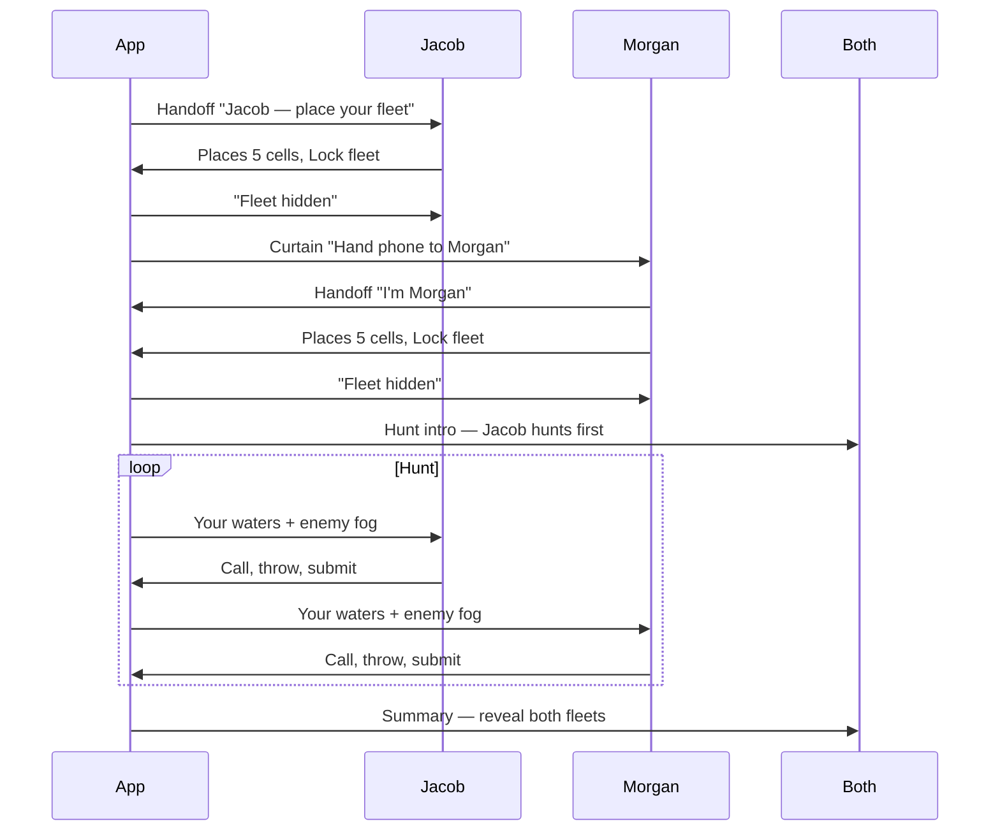

# Fleet Game Specification

## 1. Purpose

Define **Fleet** (Battleship on the dartboard) — a two-player hidden-information duel where each player secretly stations ships on the board, then alternates visits **calling coordinates and throwing** until one fleet is fully sunk. Damage depends on **ring** (single / double / triple); ships may require **one or three hits** to sink.

**Status:** Planned (`party.fleet`).  
**Brainstorm origin:** [`FutureIdeas/custom-games-brainstorm.md`](../../../FutureIdeas/custom-games-brainstorm.md) §23.

**Related specs:**
- [`TicTacToeGameSpec.md`](TicTacToeGameSpec.md) — shared `boardState` template patterns
- [`PrisonerGameSpec.md`](PrisonerGameSpec.md) — spatial board state (different rules)
- [`BotOpponentSpec.md`](../../BotOpponentSpec.md) — bot fleet placement + hunt heuristics
- [`MatchSpec.md`](../../MatchSpec.md) — lifecycle, resume, abandon
- [`MatchForfeitSpec.md`](../../MatchForfeitSpec.md) — standings by ships sunk
- [`MatchSummarySpec.md`](../../MatchSummarySpec.md) — winner ceremony
- [`HistorySpec.md`](../../HistorySpec.md) — list cards, detail, filters
- [`ScoringInputSpec.md`](../../ScoringInputSpec.md) — per-dart pad entry
- [`AccessibilitySpec.md`](../../AccessibilitySpec.md) — VoiceOver must not leak hidden fleets (§6)

---

## 2. Catalog metadata

| Field | Value |
|-------|-------|
| **Section** | Party |
| **UI template** | H — Board state (`boardState`) + fog-of-war |
| **Stat kind** | `boardClaim` (ships sunk / hunt accuracy supplements §12) |
| **Ruleset (v1)** | `fleet_standard` (config-driven; see §5.1) |
| **Catalog id** | `party.fleet` |
| **MatchType** | `fleet` (when implemented) |

**Display name:** Fleet  
**Marketing blurb:** "Hide your fleet — call, throw, sink theirs."

---

## Player count

| Question | Answer |
|----------|--------|
| **Solo?** | No — hidden duel requires an opponent |
| **Minimum** | 2 participants (≥1 human) |
| **Recommended** | 2 exactly |
| **App maximum** | 2 (`maximumPlayers: 2` in catalog) |

### Brainstorm
- Classic Battleship is **1v1**; third player has no admiral role without team fleet (out of scope).
- **1 human + 1 bot** is a primary digital shape — bot places fleet and hunts via `DartBotEngine` adjunct (`FleetBotPolicy`).
- Pass-and-play on one device: placement uses privacy interstitial ("hand phone to opponent").

---

## 3. MVP Scope

### In scope (v1)

| Item | Default | Configurable |
|------|---------|--------------|
| Fleet size | **5** ships | **3** (Quick) / **5** (Standard) / **7** (Siege) |
| Ship health | **3 hits** to sink | **1 hit** (fragile) / **3 hits** (armored) |
| Bull in pool | **Off** | **On** / **Off** |
| Damage by ring | Single **1**, double **2**, triple **auto-sink** | Fixed in v1 (§5.5) |
| Call mode | **Strict** — dart must land on called segment | Strict / Call-only (honor) |
| Visit length | **3 darts** per turn | Fixed in v1 |
| Sonar | **1 per player** per match | On/off (default on) |
| Phases | Placement → Hunt | — |
| Input | Call picker + standard dart pad per dart | — |
| Undo | Undo last completed dart in hunt phase | — |
| Pause / resume | Full snapshot incl. hidden fleets | — |
| History | Full `MatchRecord` parity | — |
| Bots | Preset difficulty bots | Training/custom deferred |

### Setup presets (quick picks)

| Preset | Ships | Ship health | Bull | Typical length |
|--------|-------|-------------|------|----------------|
| **Quick** | 3 | 1 | Off | ~8 min |
| **Standard** | 5 | 3 | Off | ~15 min |
| **Siege** | 7 | 3 | Off | ~25 min |
| **Bullseye** | 5 | 3 | On | ~15 min |

Custom chips may override any field after selecting a preset.

### Out of scope (v1)
- 3+ players / team fleets
- Multi-segment ships (destroyer = 2 adjacent cells, etc.)
- Online hidden placement across devices
- Configurable damage table (single/double/triple values are fixed)
- Vision auto-verify of called segment
- Achievements for perfect games

---

## 4. Product goals

| Goal | How Fleet delivers |
|------|-------------------|
| **Deduction** | Fog grid fills with misses; sonar breaks stalemates |
| **Skill** | Strict mode ties calls to real throws |
| **Exclusive to app** | Hidden fleet state per player — impossible on shared chalkboard |
| **Pub pacing** | Quick (3×1-hit) through Siege (7×3-hit); presets tune length |
| **Spectator fun** | Triple on a armored ship is a table moment; partial damage builds tension |

---

## 5. Rules Engine (`FleetEngine`)

Pure domain engine — no SwiftUI.

### 5.1 Config (`MatchConfigFleet`, payload v1)

| Field | Type | Default | Notes |
|-------|------|---------|-------|
| `shipCount` | `3` \| `5` \| `7` | `5` | Distinct placement cells per fleet |
| `shipHealth` | `1` \| `3` | `3` | Hits required to sink (before triple override) |
| `bullAllowed` | Bool | `false` | When true, **bull** is a valid placement and call cell |
| `callMode` | `strict` \| `callOnly` | `strict` | §5.5 |
| `sonarEnabled` | Bool | `true` | |
| `sonarUsesPerPlayer` | Int | `1` | |

**Placement pool:** segments `1…20`, plus `bull` when `bullAllowed`. Maximum distinct cells = 21.

**Recommended pairings:** `shipHealth: 3` pairs with ring damage (singles chip away, doubles chunk, triples finish). `shipHealth: 1` pairs with **Quick** (3 ships) for fast skirmishes; triples still instant-sink but overkill on 1 HP.

### 5.2 Phases

| Phase | Entry | Exit |
|-------|-------|------|
| `placement` | Match start | Both players submitted valid fleet |
| `hunt` | Both fleets locked | One player's fleet fully sunk |

### 5.2a Placement UI state (`FleetPlacementUIStep`)

Pass-and-play on **one device** drives a UI state machine persisted in the match snapshot. The engine stores fleets; the UI layer gates **who may see** placement and **what** may render.

```text
FleetPlacementUIStep:
  | handoff(PlayerId)           // privacy gate — no fleet grid
  | placing(PlayerId)           // solo placement grid for that player only
  | passDevice(to: PlayerId)    // curtain after prior player locked
  | placementComplete           // both locked → animate into hunt

placementLocks: [PlayerId: Bool]
placementAudience: PlayerId?    // who may view placing/handoff for self
```

**Turn order for placement:** `turnOrder[0]` places first, then `turnOrder[1]` — e.g. Jacob (seat 0) then Morgan (seat 1).

**Lock is final in v1:** once `placementLocks[playerId] == true`, that player cannot edit without forfeiting the match (prevents peek-and-repick exploits).

### 5.3 State

```text
phase: placement | hunt
currentPlayerId: UUID
shipCount: 3 | 5 | 7
shipHealth: 1 | 3
bullAllowed: Bool
callMode: strict | callOnly

fleets: [PlayerId: FleetState]
probeMaps: [PlayerId: ProbeMap]   // hunter intel on opponent waters

FleetState:
  ships: Set<BoardCell>           // secret positions; |ships| == shipCount
  damage: [BoardCell: Int]        // 0 until hit; sinks when >= shipHealth or triple sink
  sunk: Set<BoardCell>            // revealed to both
  sonarRemaining: Int

BoardCell: segment 1…20 | bull

ProbeMap:
  [BoardCell: ProbeResult]        // miss | hit | sunk (only probed cells)

PendingDart:
  callCell: BoardCell?
  dartIndex: Int                  // 0..2
```

**Privacy rule:** `fleets[opponent].ships` and `damage` on unsunk cells are hidden from the hunter. Hunter sees `hit` (damaged, not sunk) or `sunk` on probed cells only. Owner sees full damage pips on their fleet (`2/3` when `shipHealth == 3`).

### 5.3a Ring damage table

When a valid probe lands on an opponent **ship** at `C`, apply **damage** from the dart's ring (after strict call match, or call-only probe):

| Ring on called cell | Damage | Effect |
|---------------------|--------|--------|
| **Triple** | Auto-sink | Ship sinks immediately regardless of `shipHealth` or prior damage |
| **Double** | `2` | Add 2 to `damage[C]`; sink if `damage[C] >= shipHealth` |
| **Single** | `1` | Add 1 to `damage[C]`; sink if `damage[C] >= shipHealth` |

**Bull cell** (`bullAllowed`): map bull rings to damage tier — **inner bull** = triple tier (auto-sink), **outer bull** = double tier (2 damage). Missed bull (off-cell) = wild miss in strict mode.

**Clear probe:** Valid probe on `C` where opponent has **no** unsunk ship → `ProbeResult.miss` (clear); no damage.

**Call-only mode:** Probe resolves on call without segment match; damage is always **single (1)** — no ring entry. Triple auto-sink disabled in call-only (honor pace).

### 5.4 Placement

1. Each player selects exactly `shipCount` **distinct** cells from the placement pool (§5.1).
2. Submit locks fleet; editable until both lock (re-open own fleet if opponent has not locked).
3. When both locked → `phase = hunt`; lowest `turnOrder` hunts first (setup order).
4. All ships start at `damage[cell] = 0`.

**Bot placement:** Uniform random `shipCount` distinct cells from pool; seed from match RNG for replay. Hard/Pro may weight bull when `bullAllowed`.

### 5.5 Hunt turn flow

Active player **visit** = up to 3 darts:

For each dart:

1. **Optional — Sonar** (before call, if `sonarRemaining > 0`):
   - Pick cell `S`; engine answers **in fleet / not in fleet** (unsunk ship at `S`, including damaged ships).
   - Does **not** sink; does not consume a dart.
   - Decrement `sonarRemaining`; log `FleetSonarEvent`.
   - One sonar per dart maximum (player may skip).

2. **Call** — pick cell `C` from placement pool. UI highlights call.

3. **Throw** — player enters **actual** landing via dart pad → `actualCell` + ring. When `bullAllowed` is false, bull pad keys disabled.

4. **Resolve:**

| `callMode` | Condition | Result |
|------------|-----------|--------|
| `strict` | `actualCell ≠ C` (ring-aware for bull) | **Wild miss** — no probe on `C`; no intel |
| `strict` | `actualCell == C` | Probe `C` with ring damage (§5.3a) |
| `callOnly` | — | Probe `C` with **1 damage** (single tier only) |

**Probe `C` on ship:**
- Apply damage per §5.3a.
- **Sink:** add `C` to `sunk`; hunter `probeMaps[hunter][C] = sunk`.
- **Not sunk:** hunter `probeMaps[hunter][C] = hit` (damaged); owner sees damage pips.

**Probe `C` clear:** `probeMaps[hunter][C] = miss`.

5. If `|opponent.fleet.sunk| == shipCount` → hunter **wins** match.

6. After 3 darts (or early submit if UI allows), pass turn.

### 5.6 Win / loss

| Outcome | Condition |
|---------|-----------|
| **Win** | Sink all `shipCount` opponent segments |
| **Loss** | Opponent sinks all your segments |

There is no draw in v1.

### 5.7 Undo

- **Placement:** Reset own fleet selection until locked; if both locked, placement undo disabled.
- **Hunt:** Replay removes last dart's call, actual, damage dealt, probe result (`hit`/`miss`/`sunk`), sink flag, and sonar use if that dart used sonar before it.

### 5.8 Bot hunt (`FleetBotPolicy`)

Not full `DartBotEngine` — policy layer on `FleetEngine`:

| Tier | Behavior |
|------|----------|
| Very Easy / Easy | Random unprobed segment calls; random placement |
| Medium | Prefer unprobed; sonar on center-mass segment when stuck |
| Hard / Pro | Weight calls toward high segments (18–20) after 50% probes exhausted; sonar before guess on narrow remaining pool |

Bot **strict mode:** intended dart = called segment with tier hit tables from `BotSkillProfile.cricket` segment accuracy.

---

## 6. UI Specification

### 6.1 Design principle — secrecy by audience

Fleet on one phone is **pass-and-play**. The app must behave as if Jacob and Morgan are in the same pub with one scorekeeper device:

| Rule | Requirement |
|------|-------------|
| **R1** | Only the **active placer** ever sees their in-progress or locked ship positions during placement. |
| **R2** | After Jacob locks, **no screen** shows Jacob's ships until hunt (own board) or match summary (reveal). |
| **R3** | Morgan never sees Jacob's grid during Morgan's placement — only the privacy curtain between them. |
| **R4** | During hunt, each player sees **full detail on own fleet**, **fog only on enemy fleet** until cells are probed/sunk. |
| **R5** | Opponent **unsunk** ship coordinates are **never** rendered, spoken by VoiceOver, or present in accessibility trees. |
| **R6** | Post-game summary is the **first** moment both starting fleets are shown together. |

Implementation: `FleetMatchViewModel.visibleFleet(for: audiencePlayerId)` — views must not bind opponent `ships` / `damage` except via `probeMap` + `sunk`.

---

### 6.2 Pass-and-play journey (two humans, one device)

**Example roster:** Jacob (seat 0) vs Morgan (seat 1). Quick rules recap, then placement.



#### Step A — Match opens (`handoff(Jacob)`)

Full-screen **`FleetHandoffGate`** — **no board**, no ship data, no opponent name beyond the invited placer.

| Element | Content |
|---------|---------|
| Avatar + color | Jacob's roster identity |
| Title | `play.fleet.handoff.titleFormat` → **"Jacob — place your fleet"** |
| Body | Only you should see the next screen. Pick **N** hiding spots on the board. |
| Primary | **"I'm Jacob — continue"** (`play.fleet.handoff.confirmIdentity`) |
| Secondary | **"Hand device to Jacob"** (`play.fleet.handoff.waitingForOther`) — for when wrong person has phone |

Tapping primary sets `placementAudience = Jacob` → `placing(Jacob)`.

**Wrong-player guard:** If Morgan taps "I'm Jacob", show alert: *"You'll place ships for Jacob's account. Only continue if you are Jacob."* — honor system; no PIN in v1.

#### Step B — Jacob places (`placing(Jacob)`)

Screen **`FleetPlacementScreen`** — **single grid only** (no enemy panel).

| Region | Content |
|--------|---------|
| Header | **"Jacob — ships placed 3 / 5"** |
| Hint | Tap cells to hide ships. Tap again to remove. |
| Grid | 1–20 wedge map (+ bull cell when enabled); selected cells show **ship token** in Jacob's color |
| Footer actions | **Clear all** · **Lock fleet** (enabled when count == `shipCount`) |

**Not shown:** Morgan's name as opponent, enemy fog grid, hunt pad, any prior player fleet.

**Lock fleet flow:**
1. Jacob taps **Lock fleet**.
2. Confirmation sheet: *"Lock in your fleet? You can't change it after Morgan places."*
3. On confirm: engine records `FleetPlacementEvent`, `placementLocks[Jacob] = true`.
4. Transition → **`passDevice(to: Morgan)`** (not hunt).

#### Step C — Privacy curtain (`passDevice(to: Morgan)`)

Full-screen **`FleetPassDeviceCurtain`** — **no coordinates**, no grid.

| Element | Content |
|---------|---------|
| Icon | Hidden / eye-slash |
| Title | **"Jacob's fleet is hidden."** |
| Body | Hand the phone to **Morgan**. They won't see your ships. |
| Primary | **"I'm Morgan — place my fleet"** (only enabled when `placementAudience` switches after tap) |
| Note | Jacob should look away / step back from the oche |

Optional: **3-second hold** on primary button to prevent accidental advance (product toggle; default off).

#### Step D — Morgan places (`placing(Morgan)`)

Identical layout to Step B with Morgan's identity. Grid starts empty; **Jacob's ships are not drawn** on this screen (not even faded).

Lock → `placementLocks[Morgan] = true` → `placementComplete`.

#### Step E — Hunt intro (brief)

Interstitial **≤2s** or dismissible:

- *"Hunt begins. Jacob throws first."*
- No fleet reveal.
- Navigate to **`FleetHuntScreen`**.

---

### 6.3 Hunt screen (`FleetHuntScreen`) — Template H+

Shown only after `placementComplete`. Both players use the **same device**; UI rotates by `currentPlayerId`.

| Region | Content |
|--------|---------|
| **Header** | **"Jacob's turn"** + darts remaining (●●○) |
| **Your waters** | Active player's ships: positions + damage pips + sunk markers |
| **Enemy waters** | Fog only — unprobed / clear / hit / sunk |
| **Call strip** | Selected call + damage legend (S=1, D=2, T=sink) |
| **Pad** | Dart pad after call; bull per config |
| **Sonar** | Before each dart when uses remain |
| **Actions** | Submit dart · Undo |

#### Hunt visibility matrix

| Data | Active thrower sees | Non-thrower (phone handed over) |
|------|---------------------|----------------------------------|
| Own unsunk ships | Yes — full grid | Yes — when they receive phone on their turn |
| Own damage pips | Yes | Yes |
| Enemy unsunk positions | **Never** | **Never** |
| Enemy probed clear | Yes on fog | Yes |
| Enemy hit / sunk | Yes on fog | Yes |

**Pass-and-play hunt:** When Jacob finishes a visit, show compact curtain: *"Hand phone to Morgan"* (skippable after 1s if same players trust — default **show** curtain between every visit in strict pass-and-play mode chip **On**; default **Off** between visits, only at placement). 

**v1 default:** Curtain **only at placement**; hunt turns hand off without curtain (table can see fog grid — it reveals no secrets). Setup chip: **"Handoff each turn"** (off / on).

#### Between-visit handoff (optional chip)

When **Handoff each turn** = on, `FleetTurnHandoffCurtain` mirrors placement curtain but hunt-safe: enemy fog may be visible; own fleet visible only to owner when they confirm identity.

---

### 6.4 Human vs bot (one device)

| Step | Behavior |
|------|----------|
| Bot places first | Auto `FleetPlacementEvent` off-screen; human sees `handoff(human)` only |
| Human places first | Normal pass-and-play placement; bot places during **"Opponent deploying…"** spinner (no grid) |
| Hunt | Bot turns use existing bot playback chrome; human never sees bot unsunk ships |

Bot fleet positions exist in engine/snapshot but **never** mount in SwiftUI except `sunk` cells on fog grid.

---

### 6.5 Resume & Save-and-exit

Snapshot stores `FleetPlacementUIStep` + `placementLocks`.

| Resume point | Screen restored |
|--------------|-----------------|
| `handoff(Jacob)` | Handoff gate for Jacob |
| `placing(Jacob)` | Jacob placement grid (selections restored) |
| `passDevice(Morgan)` | Curtain — no fleet visible |
| `placing(Morgan)` | Morgan placement grid |
| `hunt` | Hunt screen at current turn |

**Save-and-exit** during placement: persist step exactly; on resume, show handoff/curtain as needed — **never** flash opponent fleet in transition animations.

**App backgrounding:** When `scenePhase != .active` during `placing` or `passDevice`, overlay **`FleetPrivacyShield`** (opaque brand gradient + lock icon) until foreground. Prevents shoulder-surfing in app switcher thumbnails where OS allows.

---

### 6.6 Anti-leak implementation checklist

| # | Check |
|---|--------|
| 1 | `FleetPlacementScreen` not in view hierarchy unless `placementAudience == viewer`. |
| 2 | Hunt enemy grid binds to `probeMap` only — not `opponent.fleet.ships`. |
| 3 | VoiceOver: enemy unprobed cells = "Unknown"; never "ship hidden here". |
| 4 | Sonar yes/no does not reveal count of ships on segment. |
| 5 | History timeline during match: N/A (in-match). Post-game reveal only in detail. |
| 6 | Unit test: view model `enemyCellsForDisplay` never contains unsunk opponent coordinates. |
| 7 | UI test: after Jacob locks, query enemy grid has **zero** ship accessibility identifiers until sunk in hunt. |

---

### 6.7 Setup (`SetupHomeView` party → Fleet)

- Preset chip: Quick / Standard / Siege / Bullseye (§3)
- Fleet size chip: 3 / 5 / 7
- Ship health chip: 1 hit / 3 hits
- Bull chip: On / Off
- Call mode: Strict / Call-only
- Sonar toggle
- Handoff each turn: Off / On (§6.3)
- Validation: exactly 2 players; `setup.validation.fleetExactTwoPlayers`

### 6.8 Match end

- Standard winner summary; **Reveal both fleets** section with side-by-side starting grids.
- First moment Jacob sees Morgan's original ships and vice versa.
- History timeline: calls and sinks only; starting positions in detail **reveal** footer.

### 6.9 Accessibility

- Handoff/curtain screens readable by VoiceOver without speaking hidden coordinates.
- Fog cells: `play.fleet.cell.unprobed` / `.miss` / `.hit` / `.sunk`
- Own fleet: damage pips + `play.fleet.damageAccessibilityFormat`
- Sonar: result announced; no ship count leakage
- Color + iconography for all cell states (not color-only)
- Privacy shield when backgrounded during placement

Manual docs (when implemented):
- `accessibility/wcag-2.1-aa/screens/fleet-placement.md`
- `accessibility/wcag-2.1-aa/screens/fleet-match.md`

### 6.10 View structure (implementation)

```text
FleetMatchScreen
├── phase == placement
│   ├── FleetHandoffGate          // step handoff(player)
│   ├── FleetPlacementScreen      // step placing(player) — ONE grid
│   └── FleetPassDeviceCurtain    // step passDevice(to:)
├── phase == hunt
│   └── FleetHuntScreen           // dual grid + pad
└── shared: FleetPrivacyShield    // scenePhase background overlay
```

`FleetMatchViewModel` exposes:
- `placementStep: FleetPlacementUIStep`
- `canViewPlacement: Bool` — true only for `placementAudience`
- `ownBoardModel` / `enemyFogModel` — hunt only; fog model filters unsunk opponent cells

---

## How to Play

| | |
|---|---|
| **Key prefix** | `play.rules.fleet.` |
| **Shipped in app** | Planned |

### Overview

| **Title key** | `play.rules.fleet.overview.title` |
| **Body key** | `play.rules.fleet.overview.body` |

Hide your fleet on the board. Take turns calling a cell, throwing, and sinking enemy ships before yours are gone. Ring matters: singles chip, doubles slam, triples sink.

### Place your fleet

| **Title key** | `play.rules.fleet.placement.title` |
| **Body key** | `play.rules.fleet.placement.body` |

Pick exactly three, five, or seven different cells (numbers one through twenty, plus bull when enabled). On one phone, each player takes a private turn: confirm your name, place ships where only you can see the screen, then lock and hand the device to your opponent. Your ships stay hidden until they are sunk or the game ends.

### Ship health

| **Title key** | `play.rules.fleet.shipHealth.title` |
| **Body key** | `play.rules.fleet.shipHealth.body` |

**Fragile (1 hit):** any damaging hit sinks the ship. **Armored (3 hits):** singles count as one hit, doubles as two, and a **triple sinks immediately**. Damage adds up until the ship goes under.

### Calling and throwing

| **Title key** | `play.rules.fleet.hunt.title` |
| **Body key** | `play.rules.fleet.hunt.body` |

On your turn you have three darts. For each dart, **call** a segment, then throw at the board. In **strict** mode your dart must land on the called segment for the call to count.

### Hits and misses

| **Title key** | `play.rules.fleet.hits.title` |
| **Body key** | `play.rules.fleet.hits.body` |

On a valid call, if your opponent has a ship there, apply ring damage: **single = 1 hit**, **double = 2 hits**, **triple = instant sink**. Armored ships need three total hits unless a triple ends them early. A **hit** marker shows on your fog grid when damage is dealt but the ship still floats; **sunk** when it is gone. No ship there → **clear**.

### Sonar

| **Title key** | `play.rules.fleet.sonar.title` |
| **Body key** | `play.rules.fleet.sonar.body` |

Once per match you may use **sonar** before a dart: pick a segment and the app tells you whether your opponent has any unsunk ship there — yes or no. It does not sink a ship.

### Winning

| **Title key** | `play.rules.fleet.winning.title` |
| **Body key** | `play.rules.fleet.winning.body` |

Sink all of your opponent's ships first to win.

---

## 7. Localization

| Status | Meaning |
|--------|---------|
| **New** | All keys below — add at implementation |

### Catalog & setup

| Key | Notes |
|-----|-------|
| `modes.catalog.party.fleet.name` | "Fleet" |
| `modes.catalog.party.fleet.blurb` | e.g. "Battleship — hide, call, throw, sink" |
| `play.party.fleet.title` / `.subtitle` | |
| `play.fleet.setup.preset.quick` / `.standard` / `.siege` / `.bullseye` | |
| `play.fleet.setup.shipCount` | 3 / 5 / 7 |
| `play.fleet.setup.shipHealth.fragile` / `.armored` | 1 / 3 hits |
| `play.fleet.setup.bullAllowed` | On / Off |
| `play.fleet.setup.callMode.strict` / `.callOnly` | |
| `play.fleet.setup.sonarEnabled` | |
| `setup.validation.fleetExactTwoPlayers` | |

### Gameplay (`play.fleet.*`)

| Key | Notes |
|-----|-------|
| `play.fleet.navTitle` | |
| `play.fleet.phase.placement` / `.hunt` | |
| `play.fleet.handoff.titleFormat` | "%@ — place your fleet" |
| `play.fleet.handoff.body` | Privacy instruction |
| `play.fleet.handoff.confirmIdentity` | "I'm %@ — continue" |
| `play.fleet.handoff.waitingForOther` | "Hand device to %@" |
| `play.fleet.handoff.wrongPlayerWarning` | Alert when wrong identity |
| `play.fleet.placement.shipsPlacedFormat` | "%d / %d" |
| `play.fleet.placement.hint` | Tap to place/remove |
| `play.fleet.placement.clearAll` | |
| `play.fleet.placement.lock` | |
| `play.fleet.placement.lockConfirmTitle` / `.lockConfirmBody` | |
| `play.fleet.placement.lockedHidden` | Toast after lock |
| `play.fleet.passDevice.title` | "Jacob's fleet is hidden" |
| `play.fleet.passDevice.bodyFormat` | Hand to Morgan |
| `play.fleet.passDevice.confirmIdentity` | |
| `play.fleet.hunt.introFormat` | Hunt begins, first thrower |
| `play.fleet.hunt.turnHandoffFormat` | Optional per-turn curtain |
| `play.fleet.privacyShield.label` | Background overlay a11y |
| `play.fleet.bot.deploying` | Bot placing spinner |
| `play.fleet.setup.handoffEachTurn` | Setup chip |
| `play.fleet.callFormat` | "Calling %@" |
| `play.fleet.wildMiss` | Strict mode off-call |
| `play.fleet.hitFormat` | Damaged but afloat |
| `play.fleet.damageFormat` | "%d / %d hits" on own ship |
| `play.fleet.sunkFormat` | "Sunk %@!" |
| `play.fleet.tripleSinkFormat` | Triple instant sink callout |
| `play.fleet.clearFormat` | "Clear — %@" |
| `play.fleet.damageLegend` | S=1, D=2, T=sink |
| `play.fleet.sonar.prompt` / `.resultYes` / `.resultNo` | |
| `play.fleet.sonar.depleted` | |
| `play.fleet.shipsRemainingFormat` | |
| `play.fleet.pad.bullDisabledHint` | When `bullAllowed == false` |
| `play.fleet.pad.bullInnerTier` / `.bullOuterTier` | Inner = triple tier, outer = double |

### How to play (`play.rules.fleet.*`)

`overview`, `placement`, `shipHealth`, `hunt`, `hits`, `sonar`, `winning` — see §How to Play.

### History

| Key | Notes |
|-----|-------|
| `history.timeline.fleetDartFormat` | Call + result |
| `history.timeline.fleetSonarFormat` | |
| `history.timeline.fleetSinkFormat` | |
| `history.detail.fleetSummaryFormat` | Ships sunk, sonar used |
| `history.detail.fleetRevealFleet` | Post-game full grid |

### Errors (`error.match.fleet.*`)

| Key | When |
|-----|------|
| `invalidShipCount` | Placement |
| `duplicateSegment` | Placement |
| `notPlacementPhase` | |
| `notHuntPhase` | |
| `invalidCall` | |
| `sonarDepleted` | |

Register `GameRulesCatalog.fleet` when shipping.

---

## 8. Persistence & history

### Match platform

- `MatchType.fleet`
- `MatchRecord` + 2 `MatchParticipantRecord`
- `MatchSnapshotRecord` — includes encrypted/obfuscated fleet payloads per player for resume
- `status`: `inProgress` → `completed` | `forfeited` | `abandoned`

### Events (append-only)

| Event | Payload highlights |
|-------|-------------------|
| `FleetPlacementEvent` | `playerId`, `ships[]`, `lockedAt` |
| `FleetPlacementUIEvent` | `step: FleetPlacementUIStep` (resume) |
| `FleetSonarEvent` | `playerId`, `segment`, `result: inFleet` |
| `FleetDartEvent` | `playerId`, `callCell`, `actualCell?`, `ring`, `damageDealt`, `outcome: wildMiss \| clear \| hit \| sink` |
| `FleetSinkEvent` | `hunterId`, `cell`, `cause: damage \| triple` |

### History card (`MatchHistoryCardPayload`)

- Mode badge: **Fleet**
- Primary chip: `W` / `L` + ships sunk count (e.g. `5/5`)
- Secondary chip: call accuracy % (strict mode)
- Participants: both names

### History detail

- Hunt timeline: calls, sinks, sonar
- **Reveal section** at bottom: both starting fleets (post-game only)

Schema registration: bump [`SwiftData.md`](../../SwiftData.md) when implementing.

---

## 9. Forfeit & standings

Per [`MatchForfeitSpec.md`](../../MatchForfeitSpec.md) §6.7 when `fleet` ships:

| Metric | Rule |
|--------|------|
| Standings leader | Player with **more opponent ships sunk** |
| Tie-break | Fewer darts thrown (faster hunt) |

Register `MatchForfeitStandingsRegistry.fleet`.

---

## 10. Statistics

Uses `ModeStatKind.boardClaim` with Fleet-specific aggregates in `StatsService`:

| Metric | Description |
|--------|-------------|
| `fleetWins` | Matches won |
| `shipsSunkTotal` | Opponent ships sunk (lifetime) |
| `callAccuracy` | Strict mode: valid probes / darts |
| `sonarEfficiency` | Sinks within 3 probes after sonar yes |

Player detail: show when ≥1 Fleet match completed.

---

## 11. Testing

### Unit (`FleetEngineTests`)

- Placement validation: count 3/5/7, duplicates, bull pool, lock gate
- Damage: single +1, double +2, triple auto-sink on armored (3 HP) and fragile (1 HP)
- Partial damage: `hit` probe state; sink at threshold
- Strict vs call-only (call-only = 1 damage only)
- Wild miss does not probe
- Bull inner/outer tier mapping when `bullAllowed`
- Sonar decrements; does not sink
- Win when all sunk; turn alternation
- Undo hunt dart and sonar
- Bot policy produces legal calls

### Setup

- Exactly 2 players; reject 1 or 3+
- Ship count chips persist

### UI (`FleetPlacementUITests`)

- Jacob handoff → place 5 → lock → curtain shows **no** ship cells for Morgan's view
- Morgan placement screen: accessibility query finds **zero** `fleet-ship-opponent` elements
- After hunt sink on 20, **both** boards show sunk marker at 20 only
- Resume from `passDevice(Morgan)` restores curtain, not Jacob grid
- Background placement triggers privacy shield snapshot test (manual WCAG)

### UI (hunt)

- Fog grid never shows unsunk opponent ships
- Post-game reveal on summary only

### Forfeit

- `everyShippedMatchTypeHasForfeitStandingsRegistered` includes `fleet`

---

## 12. Implementation order (suggested)

1. `FleetEngine` + unit tests
2. `MatchType.fleet`, config payload, events, snapshot codec (`FleetPlacementUIStep`)
3. **Pass-and-play placement stack** — `FleetHandoffGate`, `FleetPlacementScreen`, `FleetPassDeviceCurtain`, `FleetPrivacyShield`
4. Hunt UI — dual grid, audience-filtered view models, call flow, strict pad validation
5. `FleetBotPolicy` + preset bot wiring
6. Summary reveal + history card builder
7. Forfeit registration

---

## 13. Open questions

1. **Call-only default** — keep off; strict is the skill identity.
2. **Show opponent damage pips to hunter?** — v1: hunter sees `hit` only, not 1/3 vs 2/3 (more deduction).
3. **Sonar after yes** — UI nudge to call that cell? Product-only.
4. **Cross-device hidden play** — requires online; out of v1.
5. **7 ships + bull on** — 8 cells max if bull used; still valid on 21-cell pool.
6. **Handoff each turn** — default off; enable if playtest shows peeking at own fleet on shared hunt screen.

---

## 14. Verification

| Field | Value |
|-------|-------|
| **Status** | Planned |
| **Spec author** | 2026-06-11 brainstorm promotion |
| **Code** | Not started |
| **Catalog id** | `party.fleet` |
